# Class: Document


URI: [alzrd:Document](http://w3id.org/ontogpt/alzrdDocument)

```mermaid
erDiagram
Document {
    string summary  
    string article_type  
    string modeling_approach  
    string modeling_summary  
    string id  
    string label  
}
ExperimentalMetricToChemicalRelationship {
    string direct_or_indirect  
    string association  
}
NamedEntity {
    string id  
    string label  
}
Chemical {
    string id  
    string label  
}
MetricOrIndicator {
    string id  
    string label  
}
ExperimentalMetricToEnvironmentRelationship {
    string direct_or_indirect  
    string association  
}
EnvironmentalExposure {
    string id  
    string label  
}
ExperimentalMetricToDiseaseRelationship {
    string direct_or_indirect  
    string association  
}
Disease {
    string id  
    string label  
}
ExperimentalMetricToTaxonRelationship {
    string direct_or_indirect  
}
Taxon {
    string id  
    string label  
}
Diagnostic {
    string id  
    string label  
}

Document ||--}o Taxon : "taxa"
Document ||--}o Diagnostic : "diagnostics"
Document ||--}o Disease : "diseases"
Document ||--}o Chemical : "chemical"
Document ||--}o EnvironmentalExposure : "environmental_exposures"
Document ||--}o MetricOrIndicator : "experimental_metrics_and_indicators"
Document ||--}o ExperimentalMetricToTaxonRelationship : "experimental_metrics_to_taxon_relationships"
Document ||--}o ExperimentalMetricToDiseaseRelationship : "experimental_metric_to_disease_relationships"
Document ||--}o ExperimentalMetricToEnvironmentRelationship : "experimental_metric_to_environment_relationships"
Document ||--}o ExperimentalMetricToChemicalRelationship : "experimental_metric_to_chemical_relationships"
ExperimentalMetricToChemicalRelationship ||--|o MetricOrIndicator : "metric"
ExperimentalMetricToChemicalRelationship ||--|o Chemical : "chemical"
ExperimentalMetricToChemicalRelationship ||--|o NamedEntity : "predicate"
ExperimentalMetricToChemicalRelationship ||--|o NamedEntity : "metric_qualifier"
ExperimentalMetricToChemicalRelationship ||--|o NamedEntity : "chemical_qualifier"
ExperimentalMetricToEnvironmentRelationship ||--|o MetricOrIndicator : "metric"
ExperimentalMetricToEnvironmentRelationship ||--|o EnvironmentalExposure : "environment"
ExperimentalMetricToEnvironmentRelationship ||--|o NamedEntity : "predicate"
ExperimentalMetricToEnvironmentRelationship ||--|o NamedEntity : "metric_qualifier"
ExperimentalMetricToEnvironmentRelationship ||--|o NamedEntity : "environment_qualifier"
ExperimentalMetricToDiseaseRelationship ||--|o MetricOrIndicator : "metric"
ExperimentalMetricToDiseaseRelationship ||--|o Disease : "disease"
ExperimentalMetricToDiseaseRelationship ||--|o NamedEntity : "predicate"
ExperimentalMetricToDiseaseRelationship ||--|o NamedEntity : "metric_qualifier"
ExperimentalMetricToDiseaseRelationship ||--|o NamedEntity : "disease_qualifier"
ExperimentalMetricToTaxonRelationship ||--|o MetricOrIndicator : "metric"
ExperimentalMetricToTaxonRelationship ||--|o Taxon : "taxon"
ExperimentalMetricToTaxonRelationship ||--|o NamedEntity : "predicate"
ExperimentalMetricToTaxonRelationship ||--|o NamedEntity : "metric_qualifier"
ExperimentalMetricToTaxonRelationship ||--|o NamedEntity : "taxon_qualifier"

```





## Inheritance
* [NamedEntity](NamedEntity.md)
    * **Document**


## Slots

| Name | Cardinality and Range | Description | Inheritance |
| ---  | --- | --- | --- |
| [summary](summary.md) | 0..1 <br/> [String](String.md) | A brief summary of the input text, suitable for display in a table of content... | direct |
| [article_type](article_type.md) | 0..1 <br/> [String](String.md) | The type of article, e | direct |
| [modeling_approach](modeling_approach.md) | 0..1 <br/> [String](String.md) | A brief description of the modeling approach used in the input text, e | direct |
| [modeling_summary](modeling_summary.md) | 0..1 <br/> [String](String.md) | A brief summary of the modeling approach used in the input text, suitable for... | direct |
| [taxa](taxa.md) | * <br/> [Taxon](Taxon.md) | A semicolon-separated list of taxa or species of organisms mentioned in the i... | direct |
| [diagnostics](diagnostics.md) | * <br/> [Diagnostic](Diagnostic.md) | A semicolon-separated list of diagnostic procedures mentioned in the input te... | direct |
| [diseases](diseases.md) | * <br/> [Disease](Disease.md) | A semicolon-separated list of diseases or conditions mentioned in the input t... | direct |
| [chemical](chemical.md) | * <br/> [Chemical](Chemical.md) | A semicolon-separated list of chemicals, drugs, or other substances mentioned... | direct |
| [environmental_exposures](environmental_exposures.md) | * <br/> [EnvironmentalExposure](EnvironmentalExposure.md) | A semicolon-separated list of environmental exposures mentioned in the input ... | direct |
| [experimental_metrics_and_indicators](experimental_metrics_and_indicators.md) | * <br/> [MetricOrIndicator](MetricOrIndicator.md) | A semicolon-separated list of of experimental metrics, signs, symptoms, or ou... | direct |
| [experimental_metrics_to_taxon_relationships](experimental_metrics_to_taxon_relationships.md) | * <br/> [ExperimentalMetricToTaxonRelationship](ExperimentalMetricToTaxonRelationship.md) | Semicolon-separated list of relationships between a specific experimental met... | direct |
| [experimental_metric_to_disease_relationships](experimental_metric_to_disease_relationships.md) | * <br/> [ExperimentalMetricToDiseaseRelationship](ExperimentalMetricToDiseaseRelationship.md) | Semicolon-separated list of relationships between a specific experimental met... | direct |
| [experimental_metric_to_environment_relationships](experimental_metric_to_environment_relationships.md) | * <br/> [ExperimentalMetricToEnvironmentRelationship](ExperimentalMetricToEnvironmentRelationship.md) | Semicolon-separated list of relationships between a specific experimental met... | direct |
| [experimental_metric_to_chemical_relationships](experimental_metric_to_chemical_relationships.md) | * <br/> [ExperimentalMetricToChemicalRelationship](ExperimentalMetricToChemicalRelationship.md) | Semicolon-separated list of relationships between a specific experimental met... | direct |
| [id](id.md) | 1 <br/> [String](String.md) | A unique identifier for the named entity | [NamedEntity](NamedEntity.md) |
| [label](label.md) | 0..1 <br/> [String](String.md) | The label (name) of the named thing | [NamedEntity](NamedEntity.md) |


## Identifier and Mapping Information


### Schema Source


* from schema: http://w3id.org/ontogpt/alzrd


## Mappings

| Mapping Type | Mapped Value |
| ---  | ---  |
| self | alzrd:Document |
| native | alzrd:Document |


## LinkML Source

<!-- TODO: investigate https://stackoverflow.com/questions/37606292/how-to-create-tabbed-code-blocks-in-mkdocs-or-sphinx -->

### Direct

<details>
```yaml
name: Document
from_schema: http://w3id.org/ontogpt/alzrd
is_a: NamedEntity
attributes:
  summary:
    name: summary
    description: A brief summary of the input text, suitable for display in a table
      of contents or search results. This should be no more than three sentences.
      Do not format in Markdown.
    from_schema: http://w3id.org/ontogpt/alzrd
    rank: 1000
    domain_of:
    - Document
    range: string
  article_type:
    name: article_type
    description: The type of article, e.g., "research article", "review", "case report".
    from_schema: http://w3id.org/ontogpt/alzrd
    rank: 1000
    domain_of:
    - Document
    range: string
  modeling_approach:
    name: modeling_approach
    description: A brief description of the modeling approach used in the input text,
      e.g., "experimental", "observational", "computational", "review".
    from_schema: http://w3id.org/ontogpt/alzrd
    rank: 1000
    domain_of:
    - Document
    range: string
  modeling_summary:
    name: modeling_summary
    description: A brief summary of the modeling approach used in the input text,
      suitable for display in a table of contents or search results. Include any details
      about how a model of disease is defined, including the use of model organisms,
      cell lines, or in silico models, as well as the experimental metrics used to
      model human disease. If this is a study of human subjects, include details about
      the study design and the human subjects involved. This should be no more than
      three sentences. Do not format in Markdown.
    from_schema: http://w3id.org/ontogpt/alzrd
    rank: 1000
    domain_of:
    - Document
    range: string
  taxa:
    name: taxa
    description: A semicolon-separated list of taxa or species of organisms mentioned
      in the input text. Where possible, translate to the binomial species name (e.g.,
      change "mouse" to "Mus musculus"), unless a different species name is provided
      in the text. If no taxon is mentioned, return NOT FOUND.
    from_schema: http://w3id.org/ontogpt/alzrd
    rank: 1000
    domain_of:
    - Document
    range: Taxon
    multivalued: true
  diagnostics:
    name: diagnostics
    description: A semicolon-separated list of diagnostic procedures mentioned in
      the input text. If no diagnostic procedures are mentioned, return NOT FOUND.
    from_schema: http://w3id.org/ontogpt/alzrd
    rank: 1000
    domain_of:
    - Document
    range: Diagnostic
    multivalued: true
  diseases:
    name: diseases
    description: A semicolon-separated list of diseases or conditions mentioned in
      the input text. If no diseases are mentioned, return NOT FOUND.
    from_schema: http://w3id.org/ontogpt/alzrd
    rank: 1000
    domain_of:
    - Document
    range: Disease
    multivalued: true
  chemical:
    name: chemical
    description: A semicolon-separated list of chemicals, drugs, or other substances
      mentioned in the input text. If no chemicals are mentioned, return NOT FOUND.
    from_schema: http://w3id.org/ontogpt/alzrd
    rank: 1000
    domain_of:
    - Document
    - ExperimentalMetricToChemicalRelationship
    range: Chemical
    multivalued: true
  environmental_exposures:
    name: environmental_exposures
    description: A semicolon-separated list of environmental exposures mentioned in
      the input text. These may include exposure to general classes of materials,
      e.g., "exposure to pesticides", or other phenomena, e.g., "chronic stress".
      If no environmental exposures are mentioned, return NOT FOUND.
    from_schema: http://w3id.org/ontogpt/alzrd
    rank: 1000
    domain_of:
    - Document
    range: EnvironmentalExposure
    multivalued: true
  experimental_metrics_and_indicators:
    name: experimental_metrics_and_indicators
    description: A semicolon-separated list of of experimental metrics, signs, symptoms,
      or outcomes used to measure the progression of Alzheimer's disease and related
      dementias, mentioned in the input text. These may be quantitative or qualitative
      measures, including biomolecular assays. In experimental animal models these
      are analogues of cognitive impairment or indicators of disease progression modeling
      those observed in humans. Examples are Amyloid beta (Aβ) levels, Morris water
      maze test, tau phosphorylation, neurofibrillary tangles, and cognitive decline.
      If no experimental metrics are mentioned, return NOT FOUND.
    from_schema: http://w3id.org/ontogpt/alzrd
    rank: 1000
    domain_of:
    - Document
    range: MetricOrIndicator
    multivalued: true
  experimental_metrics_to_taxon_relationships:
    name: experimental_metrics_to_taxon_relationships
    description: Semicolon-separated list of relationships between a specific experimental
      metric, sign, symptom, or outcome and a taxon, as described in the input text.
      These are cases in which the relationship is used to measure progression of
      Alzheimer's disease and related dementias, or an experimental analogue, in the
      taxon. For example, "Amyloid beta (Aβ) levels are measured in Mus musculus"
      or "Morris water maze test is measured with Rattus norvegicus".  Include all
      qualifiers and whether the relationship is direct or indirect.
    from_schema: http://w3id.org/ontogpt/alzrd
    rank: 1000
    domain_of:
    - Document
    range: ExperimentalMetricToTaxonRelationship
    multivalued: true
  experimental_metric_to_disease_relationships:
    name: experimental_metric_to_disease_relationships
    description: Semicolon-separated list of relationships between a specific experimental
      metric, sign, symptom, or outcome and a disease or condition, as described in
      the input text. These are cases in which the relationship is used as an experimental
      model of progression or presence of a disease. For example, "Amyloid beta (Aβ)
      levels are used to model Alzheimer's disease" or "Morris water maze test is
      used to model Parkinson's disease".  Include all qualifiers, whether the relationship
      was direct or indirect, and any observed associations, including whether the
      association was positive, negative, or inconclusive.
    from_schema: http://w3id.org/ontogpt/alzrd
    rank: 1000
    domain_of:
    - Document
    range: ExperimentalMetricToDiseaseRelationship
    multivalued: true
  experimental_metric_to_environment_relationships:
    name: experimental_metric_to_environment_relationships
    description: Semicolon-separated list of relationships between a specific experimental
      metric, sign, symptom, or outcome and an environmental exposure or condition,
      as described in the input text. These are cases in which the relationship is
      used to measure the effects of an environmental exposure on the progression
      of Alzheimer's disease and related dementias, or an experimental analogue. For
      example, "Amyloid beta (Aβ) levels are measured in response to chronic stress"
      or "Morris water maze test is measured in response to air pollution". Include
      all qualifiers, whether the relationship was direct or indirect, and any observed
      associations, including whether the association was positive, negative, or inconclusive.
    from_schema: http://w3id.org/ontogpt/alzrd
    rank: 1000
    domain_of:
    - Document
    range: ExperimentalMetricToEnvironmentRelationship
    multivalued: true
  experimental_metric_to_chemical_relationships:
    name: experimental_metric_to_chemical_relationships
    description: Semicolon-separated list of relationships between a specific experimental
      metric, sign, symptom, or outcome and a chemical, drug, or other substance,
      as described in the input text. These are cases in which the relationship is
      used to measure the effects of a chemical on the progression of Alzheimer's
      disease and related dementias, or an experimental analogue. For example, "Amyloid
      beta (Aβ) levels are measured in response to donepezil" or "Morris water maze
      test is measured in response to caffeine". Include all qualifiers, whether the
      relationship was direct or indirect, and any observed associations, including
      whether the association was positive, negative, or inconclusive.
    from_schema: http://w3id.org/ontogpt/alzrd
    rank: 1000
    domain_of:
    - Document
    range: ExperimentalMetricToChemicalRelationship
    multivalued: true
tree_root: true

```
</details>

### Induced

<details>
```yaml
name: Document
from_schema: http://w3id.org/ontogpt/alzrd
is_a: NamedEntity
attributes:
  summary:
    name: summary
    description: A brief summary of the input text, suitable for display in a table
      of contents or search results. This should be no more than three sentences.
      Do not format in Markdown.
    from_schema: http://w3id.org/ontogpt/alzrd
    rank: 1000
    alias: summary
    owner: Document
    domain_of:
    - Document
    range: string
  article_type:
    name: article_type
    description: The type of article, e.g., "research article", "review", "case report".
    from_schema: http://w3id.org/ontogpt/alzrd
    rank: 1000
    alias: article_type
    owner: Document
    domain_of:
    - Document
    range: string
  modeling_approach:
    name: modeling_approach
    description: A brief description of the modeling approach used in the input text,
      e.g., "experimental", "observational", "computational", "review".
    from_schema: http://w3id.org/ontogpt/alzrd
    rank: 1000
    alias: modeling_approach
    owner: Document
    domain_of:
    - Document
    range: string
  modeling_summary:
    name: modeling_summary
    description: A brief summary of the modeling approach used in the input text,
      suitable for display in a table of contents or search results. Include any details
      about how a model of disease is defined, including the use of model organisms,
      cell lines, or in silico models, as well as the experimental metrics used to
      model human disease. If this is a study of human subjects, include details about
      the study design and the human subjects involved. This should be no more than
      three sentences. Do not format in Markdown.
    from_schema: http://w3id.org/ontogpt/alzrd
    rank: 1000
    alias: modeling_summary
    owner: Document
    domain_of:
    - Document
    range: string
  taxa:
    name: taxa
    description: A semicolon-separated list of taxa or species of organisms mentioned
      in the input text. Where possible, translate to the binomial species name (e.g.,
      change "mouse" to "Mus musculus"), unless a different species name is provided
      in the text. If no taxon is mentioned, return NOT FOUND.
    from_schema: http://w3id.org/ontogpt/alzrd
    rank: 1000
    alias: taxa
    owner: Document
    domain_of:
    - Document
    range: Taxon
    multivalued: true
  diagnostics:
    name: diagnostics
    description: A semicolon-separated list of diagnostic procedures mentioned in
      the input text. If no diagnostic procedures are mentioned, return NOT FOUND.
    from_schema: http://w3id.org/ontogpt/alzrd
    rank: 1000
    alias: diagnostics
    owner: Document
    domain_of:
    - Document
    range: Diagnostic
    multivalued: true
  diseases:
    name: diseases
    description: A semicolon-separated list of diseases or conditions mentioned in
      the input text. If no diseases are mentioned, return NOT FOUND.
    from_schema: http://w3id.org/ontogpt/alzrd
    rank: 1000
    alias: diseases
    owner: Document
    domain_of:
    - Document
    range: Disease
    multivalued: true
  chemical:
    name: chemical
    description: A semicolon-separated list of chemicals, drugs, or other substances
      mentioned in the input text. If no chemicals are mentioned, return NOT FOUND.
    from_schema: http://w3id.org/ontogpt/alzrd
    rank: 1000
    alias: chemical
    owner: Document
    domain_of:
    - Document
    - ExperimentalMetricToChemicalRelationship
    range: Chemical
    multivalued: true
  environmental_exposures:
    name: environmental_exposures
    description: A semicolon-separated list of environmental exposures mentioned in
      the input text. These may include exposure to general classes of materials,
      e.g., "exposure to pesticides", or other phenomena, e.g., "chronic stress".
      If no environmental exposures are mentioned, return NOT FOUND.
    from_schema: http://w3id.org/ontogpt/alzrd
    rank: 1000
    alias: environmental_exposures
    owner: Document
    domain_of:
    - Document
    range: EnvironmentalExposure
    multivalued: true
  experimental_metrics_and_indicators:
    name: experimental_metrics_and_indicators
    description: A semicolon-separated list of of experimental metrics, signs, symptoms,
      or outcomes used to measure the progression of Alzheimer's disease and related
      dementias, mentioned in the input text. These may be quantitative or qualitative
      measures, including biomolecular assays. In experimental animal models these
      are analogues of cognitive impairment or indicators of disease progression modeling
      those observed in humans. Examples are Amyloid beta (Aβ) levels, Morris water
      maze test, tau phosphorylation, neurofibrillary tangles, and cognitive decline.
      If no experimental metrics are mentioned, return NOT FOUND.
    from_schema: http://w3id.org/ontogpt/alzrd
    rank: 1000
    alias: experimental_metrics_and_indicators
    owner: Document
    domain_of:
    - Document
    range: MetricOrIndicator
    multivalued: true
  experimental_metrics_to_taxon_relationships:
    name: experimental_metrics_to_taxon_relationships
    description: Semicolon-separated list of relationships between a specific experimental
      metric, sign, symptom, or outcome and a taxon, as described in the input text.
      These are cases in which the relationship is used to measure progression of
      Alzheimer's disease and related dementias, or an experimental analogue, in the
      taxon. For example, "Amyloid beta (Aβ) levels are measured in Mus musculus"
      or "Morris water maze test is measured with Rattus norvegicus".  Include all
      qualifiers and whether the relationship is direct or indirect.
    from_schema: http://w3id.org/ontogpt/alzrd
    rank: 1000
    alias: experimental_metrics_to_taxon_relationships
    owner: Document
    domain_of:
    - Document
    range: ExperimentalMetricToTaxonRelationship
    multivalued: true
  experimental_metric_to_disease_relationships:
    name: experimental_metric_to_disease_relationships
    description: Semicolon-separated list of relationships between a specific experimental
      metric, sign, symptom, or outcome and a disease or condition, as described in
      the input text. These are cases in which the relationship is used as an experimental
      model of progression or presence of a disease. For example, "Amyloid beta (Aβ)
      levels are used to model Alzheimer's disease" or "Morris water maze test is
      used to model Parkinson's disease".  Include all qualifiers, whether the relationship
      was direct or indirect, and any observed associations, including whether the
      association was positive, negative, or inconclusive.
    from_schema: http://w3id.org/ontogpt/alzrd
    rank: 1000
    alias: experimental_metric_to_disease_relationships
    owner: Document
    domain_of:
    - Document
    range: ExperimentalMetricToDiseaseRelationship
    multivalued: true
  experimental_metric_to_environment_relationships:
    name: experimental_metric_to_environment_relationships
    description: Semicolon-separated list of relationships between a specific experimental
      metric, sign, symptom, or outcome and an environmental exposure or condition,
      as described in the input text. These are cases in which the relationship is
      used to measure the effects of an environmental exposure on the progression
      of Alzheimer's disease and related dementias, or an experimental analogue. For
      example, "Amyloid beta (Aβ) levels are measured in response to chronic stress"
      or "Morris water maze test is measured in response to air pollution". Include
      all qualifiers, whether the relationship was direct or indirect, and any observed
      associations, including whether the association was positive, negative, or inconclusive.
    from_schema: http://w3id.org/ontogpt/alzrd
    rank: 1000
    alias: experimental_metric_to_environment_relationships
    owner: Document
    domain_of:
    - Document
    range: ExperimentalMetricToEnvironmentRelationship
    multivalued: true
  experimental_metric_to_chemical_relationships:
    name: experimental_metric_to_chemical_relationships
    description: Semicolon-separated list of relationships between a specific experimental
      metric, sign, symptom, or outcome and a chemical, drug, or other substance,
      as described in the input text. These are cases in which the relationship is
      used to measure the effects of a chemical on the progression of Alzheimer's
      disease and related dementias, or an experimental analogue. For example, "Amyloid
      beta (Aβ) levels are measured in response to donepezil" or "Morris water maze
      test is measured in response to caffeine". Include all qualifiers, whether the
      relationship was direct or indirect, and any observed associations, including
      whether the association was positive, negative, or inconclusive.
    from_schema: http://w3id.org/ontogpt/alzrd
    rank: 1000
    alias: experimental_metric_to_chemical_relationships
    owner: Document
    domain_of:
    - Document
    range: ExperimentalMetricToChemicalRelationship
    multivalued: true
  id:
    name: id
    annotations:
      prompt.skip:
        tag: prompt.skip
        value: 'true'
    description: A unique identifier for the named entity
    comments:
    - this is populated during the grounding and normalization step
    from_schema: http://w3id.org/ontogpt/alzrd
    rank: 1000
    identifier: true
    alias: id
    owner: Document
    domain_of:
    - NamedEntity
    - Publication
    range: string
    required: true
  label:
    name: label
    annotations:
      owl:
        tag: owl
        value: AnnotationProperty, AnnotationAssertion
    description: The label (name) of the named thing
    from_schema: http://w3id.org/ontogpt/alzrd
    aliases:
    - name
    rank: 1000
    slot_uri: rdfs:label
    alias: label
    owner: Document
    domain_of:
    - NamedEntity
    range: string
tree_root: true

```
</details>