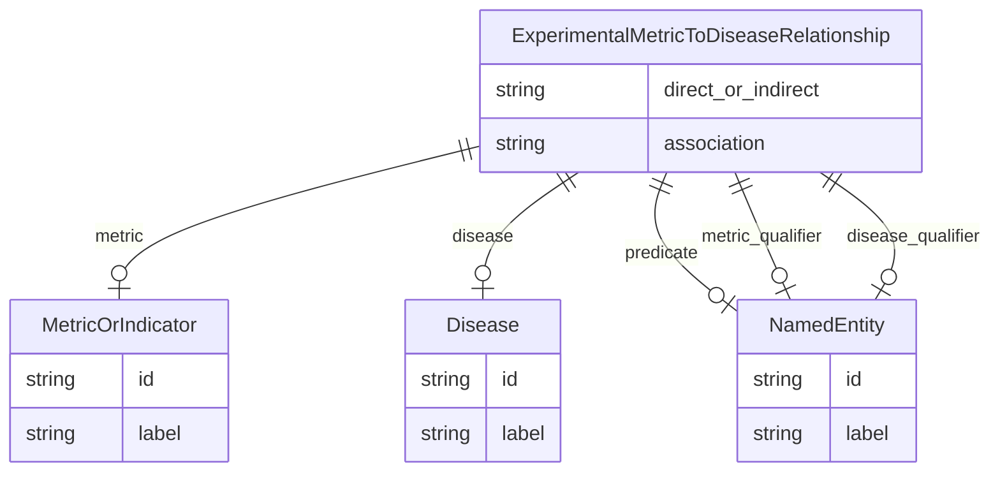

# Class: ExperimentalMetricToDiseaseRelationship


_A triple where the subject is an experimental metric, the object is a disease or condition, and the predicate describes the relationship between the metric and the disease, usually USED_TO_MODEL._


URI: [alzrd:ExperimentalMetricToDiseaseRelationship](http://w3id.org/ontogpt/alzrdExperimentalMetricToDiseaseRelationship)





## Inheritance
* [CompoundExpression](CompoundExpression.md)
    * **ExperimentalMetricToDiseaseRelationship**


## Slots

| Name | Cardinality and Range | Description | Inheritance |
| ---  | --- | --- | --- |
| [metric](metric.md) | 0..1 <br/> [MetricOrIndicator](MetricOrIndicator.md) | The name of an experimental metric, sign, symptom, or outcome used to measure... | direct |
| [disease](disease.md) | 0..1 <br/> [Disease](Disease.md) | The name of a disease or condition | direct |
| [predicate](predicate.md) | 0..1 <br/> [NamedEntity](NamedEntity.md) | The relationship type, generally USED_TO_MODEL to indicate a metric is used t... | direct |
| [metric_qualifier](metric_qualifier.md) | 0..1 <br/> [NamedEntity](NamedEntity.md) | An optional qualifier or modifier for the experimental metric, as described i... | direct |
| [disease_qualifier](disease_qualifier.md) | 0..1 <br/> [NamedEntity](NamedEntity.md) | An optional qualifier or modifier for the disease or condition, as described ... | direct |
| [direct_or_indirect](direct_or_indirect.md) | 0..1 <br/> [String](String.md) | Whether the relationship between the metric and the disease is direct or indi... | direct |
| [association](association.md) | 0..1 <br/> [String](String.md) | The type of any observed association between the value of the metric and the ... | direct |


## Usages

| used by | used in | type | used |
| ---  | --- | --- | --- |
| [Document](Document.md) | [experimental_metric_to_disease_relationships](experimental_metric_to_disease_relationships.md) | range | [ExperimentalMetricToDiseaseRelationship](ExperimentalMetricToDiseaseRelationship.md) |


## Identifier and Mapping Information


### Schema Source


* from schema: http://w3id.org/ontogpt/alzrd


## Mappings

| Mapping Type | Mapped Value |
| ---  | ---  |
| self | alzrd:ExperimentalMetricToDiseaseRelationship |
| native | alzrd:ExperimentalMetricToDiseaseRelationship |


## LinkML Source

<!-- TODO: investigate https://stackoverflow.com/questions/37606292/how-to-create-tabbed-code-blocks-in-mkdocs-or-sphinx -->

### Direct

<details>
```yaml
name: ExperimentalMetricToDiseaseRelationship
description: A triple where the subject is an experimental metric, the object is a
  disease or condition, and the predicate describes the relationship between the metric
  and the disease, usually USED_TO_MODEL.
from_schema: http://w3id.org/ontogpt/alzrd
is_a: CompoundExpression
attributes:
  metric:
    name: metric
    description: The name of an experimental metric, sign, symptom, or outcome used
      to measure the effects of treatments on symptoms or diagnostics, or of the progression
      of Alzheimer's disease and related dementias. In experimental animal models
      these are analogues of cognitive impairment or indicators of disease progression
      modeling those observed in humans. Examples are Amyloid beta (Aβ) levels, Morris
      water maze test, tau phosphorylation, neurofibrillary tangles, and cognitive
      decline.
    from_schema: http://w3id.org/ontogpt/alzrd
    domain_of:
    - ExperimentalMetricToTaxonRelationship
    - ExperimentalMetricToDiseaseRelationship
    - ExperimentalMetricToEnvironmentRelationship
    - ExperimentalMetricToChemicalRelationship
    range: MetricOrIndicator
  disease:
    name: disease
    description: The name of a disease or condition. Examples are Alzheimer's disease,
      Parkinson's disease, Huntington's disease.
    from_schema: http://w3id.org/ontogpt/alzrd
    rank: 1000
    domain_of:
    - ExperimentalMetricToDiseaseRelationship
    range: Disease
  predicate:
    name: predicate
    description: The relationship type, generally USED_TO_MODEL to indicate a metric
      is used to model a disease or condition.
    from_schema: http://w3id.org/ontogpt/alzrd
    domain_of:
    - ExperimentalMetricToTaxonRelationship
    - ExperimentalMetricToDiseaseRelationship
    - ExperimentalMetricToEnvironmentRelationship
    - ExperimentalMetricToChemicalRelationship
    - Triple
    range: NamedEntity
  metric_qualifier:
    name: metric_qualifier
    description: An optional qualifier or modifier for the experimental metric, as
      described in the input text. This may include the method of measurement or the
      specific assay used.
    from_schema: http://w3id.org/ontogpt/alzrd
    domain_of:
    - ExperimentalMetricToTaxonRelationship
    - ExperimentalMetricToDiseaseRelationship
    - ExperimentalMetricToEnvironmentRelationship
    - ExperimentalMetricToChemicalRelationship
    range: NamedEntity
  disease_qualifier:
    name: disease_qualifier
    description: An optional qualifier or modifier for the disease or condition, as
      described in the input text. This may include the stage or subtype of the disease.
    from_schema: http://w3id.org/ontogpt/alzrd
    rank: 1000
    domain_of:
    - ExperimentalMetricToDiseaseRelationship
    range: NamedEntity
  direct_or_indirect:
    name: direct_or_indirect
    description: Whether the relationship between the metric and the disease is direct
      or indirect. UNKNOWN if this is not specified in the text or is unclear.
    from_schema: http://w3id.org/ontogpt/alzrd
    domain_of:
    - ExperimentalMetricToTaxonRelationship
    - ExperimentalMetricToDiseaseRelationship
    - ExperimentalMetricToEnvironmentRelationship
    - ExperimentalMetricToChemicalRelationship
    range: string
  association:
    name: association
    description: The type of any observed association between the value of the metric
      and the disease. May be "positive", "negative", "inconclusive", or UNKNOWN if
      this is not specified in the text or is unclear.
    from_schema: http://w3id.org/ontogpt/alzrd
    rank: 1000
    domain_of:
    - ExperimentalMetricToDiseaseRelationship
    - ExperimentalMetricToEnvironmentRelationship
    - ExperimentalMetricToChemicalRelationship
    range: string

```
</details>

### Induced

<details>
```yaml
name: ExperimentalMetricToDiseaseRelationship
description: A triple where the subject is an experimental metric, the object is a
  disease or condition, and the predicate describes the relationship between the metric
  and the disease, usually USED_TO_MODEL.
from_schema: http://w3id.org/ontogpt/alzrd
is_a: CompoundExpression
attributes:
  metric:
    name: metric
    description: The name of an experimental metric, sign, symptom, or outcome used
      to measure the effects of treatments on symptoms or diagnostics, or of the progression
      of Alzheimer's disease and related dementias. In experimental animal models
      these are analogues of cognitive impairment or indicators of disease progression
      modeling those observed in humans. Examples are Amyloid beta (Aβ) levels, Morris
      water maze test, tau phosphorylation, neurofibrillary tangles, and cognitive
      decline.
    from_schema: http://w3id.org/ontogpt/alzrd
    alias: metric
    owner: ExperimentalMetricToDiseaseRelationship
    domain_of:
    - ExperimentalMetricToTaxonRelationship
    - ExperimentalMetricToDiseaseRelationship
    - ExperimentalMetricToEnvironmentRelationship
    - ExperimentalMetricToChemicalRelationship
    range: MetricOrIndicator
  disease:
    name: disease
    description: The name of a disease or condition. Examples are Alzheimer's disease,
      Parkinson's disease, Huntington's disease.
    from_schema: http://w3id.org/ontogpt/alzrd
    rank: 1000
    alias: disease
    owner: ExperimentalMetricToDiseaseRelationship
    domain_of:
    - ExperimentalMetricToDiseaseRelationship
    range: Disease
  predicate:
    name: predicate
    description: The relationship type, generally USED_TO_MODEL to indicate a metric
      is used to model a disease or condition.
    from_schema: http://w3id.org/ontogpt/alzrd
    alias: predicate
    owner: ExperimentalMetricToDiseaseRelationship
    domain_of:
    - ExperimentalMetricToTaxonRelationship
    - ExperimentalMetricToDiseaseRelationship
    - ExperimentalMetricToEnvironmentRelationship
    - ExperimentalMetricToChemicalRelationship
    - Triple
    range: NamedEntity
  metric_qualifier:
    name: metric_qualifier
    description: An optional qualifier or modifier for the experimental metric, as
      described in the input text. This may include the method of measurement or the
      specific assay used.
    from_schema: http://w3id.org/ontogpt/alzrd
    alias: metric_qualifier
    owner: ExperimentalMetricToDiseaseRelationship
    domain_of:
    - ExperimentalMetricToTaxonRelationship
    - ExperimentalMetricToDiseaseRelationship
    - ExperimentalMetricToEnvironmentRelationship
    - ExperimentalMetricToChemicalRelationship
    range: NamedEntity
  disease_qualifier:
    name: disease_qualifier
    description: An optional qualifier or modifier for the disease or condition, as
      described in the input text. This may include the stage or subtype of the disease.
    from_schema: http://w3id.org/ontogpt/alzrd
    rank: 1000
    alias: disease_qualifier
    owner: ExperimentalMetricToDiseaseRelationship
    domain_of:
    - ExperimentalMetricToDiseaseRelationship
    range: NamedEntity
  direct_or_indirect:
    name: direct_or_indirect
    description: Whether the relationship between the metric and the disease is direct
      or indirect. UNKNOWN if this is not specified in the text or is unclear.
    from_schema: http://w3id.org/ontogpt/alzrd
    alias: direct_or_indirect
    owner: ExperimentalMetricToDiseaseRelationship
    domain_of:
    - ExperimentalMetricToTaxonRelationship
    - ExperimentalMetricToDiseaseRelationship
    - ExperimentalMetricToEnvironmentRelationship
    - ExperimentalMetricToChemicalRelationship
    range: string
  association:
    name: association
    description: The type of any observed association between the value of the metric
      and the disease. May be "positive", "negative", "inconclusive", or UNKNOWN if
      this is not specified in the text or is unclear.
    from_schema: http://w3id.org/ontogpt/alzrd
    rank: 1000
    alias: association
    owner: ExperimentalMetricToDiseaseRelationship
    domain_of:
    - ExperimentalMetricToDiseaseRelationship
    - ExperimentalMetricToEnvironmentRelationship
    - ExperimentalMetricToChemicalRelationship
    range: string

```
</details>