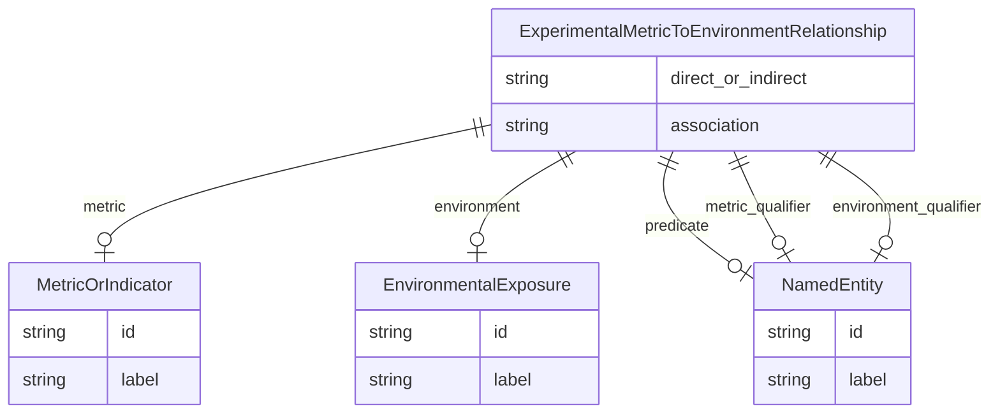

# Class: ExperimentalMetricToEnvironmentRelationship


_A triple where the subject is an experimental metric, the object is an environmental exposure or condition, and the predicate describes the relationship between the metric and the environmental exposure, usually MEASURED_IN_RESPONSE_TO._


URI: [alzrd:ExperimentalMetricToEnvironmentRelationship](http://w3id.org/ontogpt/alzrdExperimentalMetricToEnvironmentRelationship)





## Inheritance
* [CompoundExpression](CompoundExpression.md)
    * **ExperimentalMetricToEnvironmentRelationship**


## Slots

| Name | Cardinality and Range | Description | Inheritance |
| ---  | --- | --- | --- |
| [metric](metric.md) | 0..1 <br/> [MetricOrIndicator](MetricOrIndicator.md) | The name of an experimental metric, sign, symptom, or outcome used to measure... | direct |
| [environment](environment.md) | 0..1 <br/> [EnvironmentalExposure](EnvironmentalExposure.md) | The name of an environmental exposure or condition | direct |
| [predicate](predicate.md) | 0..1 <br/> [NamedEntity](NamedEntity.md) | The relationship type, generally MEASURED_IN_RESPONSE_TO to indicate a metric... | direct |
| [metric_qualifier](metric_qualifier.md) | 0..1 <br/> [NamedEntity](NamedEntity.md) | An optional qualifier or modifier for the experimental metric, as described i... | direct |
| [environment_qualifier](environment_qualifier.md) | 0..1 <br/> [NamedEntity](NamedEntity.md) | An optional qualifier or modifier for the environmental exposure, as describe... | direct |
| [direct_or_indirect](direct_or_indirect.md) | 0..1 <br/> [String](String.md) | Whether the relationship between the metric and the environmental exposure is... | direct |
| [association](association.md) | 0..1 <br/> [String](String.md) | The type of any observed association between the value of the metric and the ... | direct |


## Usages

| used by | used in | type | used |
| ---  | --- | --- | --- |
| [Document](Document.md) | [experimental_metric_to_environment_relationships](experimental_metric_to_environment_relationships.md) | range | [ExperimentalMetricToEnvironmentRelationship](ExperimentalMetricToEnvironmentRelationship.md) |


## Identifier and Mapping Information


### Schema Source


* from schema: http://w3id.org/ontogpt/alzrd


## Mappings

| Mapping Type | Mapped Value |
| ---  | ---  |
| self | alzrd:ExperimentalMetricToEnvironmentRelationship |
| native | alzrd:ExperimentalMetricToEnvironmentRelationship |


## LinkML Source

<!-- TODO: investigate https://stackoverflow.com/questions/37606292/how-to-create-tabbed-code-blocks-in-mkdocs-or-sphinx -->

### Direct

<details>
```yaml
name: ExperimentalMetricToEnvironmentRelationship
description: A triple where the subject is an experimental metric, the object is an
  environmental exposure or condition, and the predicate describes the relationship
  between the metric and the environmental exposure, usually MEASURED_IN_RESPONSE_TO.
from_schema: http://w3id.org/ontogpt/alzrd
is_a: CompoundExpression
attributes:
  metric:
    name: metric
    description: The name of an experimental metric, sign, symptom, or outcome used
      to measure the effects of treatments on symptoms or diagnostics, or of the progression
      of Alzheimer's disease and related dementias. In experimental animal models
      these are analogues of cognitive impairment or indicators of disease progression
      modeling those observed in humans. Examples are Amyloid beta (Aβ) levels, Morris
      water maze test, tau phosphorylation, neurofibrillary tangles, and cognitive
      decline.
    from_schema: http://w3id.org/ontogpt/alzrd
    domain_of:
    - ExperimentalMetricToTaxonRelationship
    - ExperimentalMetricToDiseaseRelationship
    - ExperimentalMetricToEnvironmentRelationship
    - ExperimentalMetricToChemicalRelationship
    range: MetricOrIndicator
  environment:
    name: environment
    description: The name of an environmental exposure or condition. Examples are
      "pesticides", "chronic stress", "air pollution", "heavy metals", "radiation",
      "heat stress".
    from_schema: http://w3id.org/ontogpt/alzrd
    rank: 1000
    domain_of:
    - ExperimentalMetricToEnvironmentRelationship
    range: EnvironmentalExposure
  predicate:
    name: predicate
    description: The relationship type, generally MEASURED_IN_RESPONSE_TO to indicate
      a metric is measured in response to an environmental exposure.
    from_schema: http://w3id.org/ontogpt/alzrd
    domain_of:
    - ExperimentalMetricToTaxonRelationship
    - ExperimentalMetricToDiseaseRelationship
    - ExperimentalMetricToEnvironmentRelationship
    - ExperimentalMetricToChemicalRelationship
    - Triple
    range: NamedEntity
  metric_qualifier:
    name: metric_qualifier
    description: An optional qualifier or modifier for the experimental metric, as
      described in the input text. This may include the method of measurement or the
      specific assay used.
    from_schema: http://w3id.org/ontogpt/alzrd
    domain_of:
    - ExperimentalMetricToTaxonRelationship
    - ExperimentalMetricToDiseaseRelationship
    - ExperimentalMetricToEnvironmentRelationship
    - ExperimentalMetricToChemicalRelationship
    range: NamedEntity
  environment_qualifier:
    name: environment_qualifier
    description: An optional qualifier or modifier for the environmental exposure,
      as described in the input text. This may include the duration or intensity of
      the exposure.
    from_schema: http://w3id.org/ontogpt/alzrd
    rank: 1000
    domain_of:
    - ExperimentalMetricToEnvironmentRelationship
    range: NamedEntity
  direct_or_indirect:
    name: direct_or_indirect
    description: Whether the relationship between the metric and the environmental
      exposure is direct or indirect. UNKNOWN if this is not specified in the text
      or is unclear.
    from_schema: http://w3id.org/ontogpt/alzrd
    domain_of:
    - ExperimentalMetricToTaxonRelationship
    - ExperimentalMetricToDiseaseRelationship
    - ExperimentalMetricToEnvironmentRelationship
    - ExperimentalMetricToChemicalRelationship
    range: string
  association:
    name: association
    description: The type of any observed association between the value of the metric
      and the environmental exposure. May be "positive", "negative", "inconclusive",
      or UNKNOWN if this is not specified in the text or is unclear.
    from_schema: http://w3id.org/ontogpt/alzrd
    domain_of:
    - ExperimentalMetricToDiseaseRelationship
    - ExperimentalMetricToEnvironmentRelationship
    - ExperimentalMetricToChemicalRelationship
    range: string

```
</details>

### Induced

<details>
```yaml
name: ExperimentalMetricToEnvironmentRelationship
description: A triple where the subject is an experimental metric, the object is an
  environmental exposure or condition, and the predicate describes the relationship
  between the metric and the environmental exposure, usually MEASURED_IN_RESPONSE_TO.
from_schema: http://w3id.org/ontogpt/alzrd
is_a: CompoundExpression
attributes:
  metric:
    name: metric
    description: The name of an experimental metric, sign, symptom, or outcome used
      to measure the effects of treatments on symptoms or diagnostics, or of the progression
      of Alzheimer's disease and related dementias. In experimental animal models
      these are analogues of cognitive impairment or indicators of disease progression
      modeling those observed in humans. Examples are Amyloid beta (Aβ) levels, Morris
      water maze test, tau phosphorylation, neurofibrillary tangles, and cognitive
      decline.
    from_schema: http://w3id.org/ontogpt/alzrd
    alias: metric
    owner: ExperimentalMetricToEnvironmentRelationship
    domain_of:
    - ExperimentalMetricToTaxonRelationship
    - ExperimentalMetricToDiseaseRelationship
    - ExperimentalMetricToEnvironmentRelationship
    - ExperimentalMetricToChemicalRelationship
    range: MetricOrIndicator
  environment:
    name: environment
    description: The name of an environmental exposure or condition. Examples are
      "pesticides", "chronic stress", "air pollution", "heavy metals", "radiation",
      "heat stress".
    from_schema: http://w3id.org/ontogpt/alzrd
    rank: 1000
    alias: environment
    owner: ExperimentalMetricToEnvironmentRelationship
    domain_of:
    - ExperimentalMetricToEnvironmentRelationship
    range: EnvironmentalExposure
  predicate:
    name: predicate
    description: The relationship type, generally MEASURED_IN_RESPONSE_TO to indicate
      a metric is measured in response to an environmental exposure.
    from_schema: http://w3id.org/ontogpt/alzrd
    alias: predicate
    owner: ExperimentalMetricToEnvironmentRelationship
    domain_of:
    - ExperimentalMetricToTaxonRelationship
    - ExperimentalMetricToDiseaseRelationship
    - ExperimentalMetricToEnvironmentRelationship
    - ExperimentalMetricToChemicalRelationship
    - Triple
    range: NamedEntity
  metric_qualifier:
    name: metric_qualifier
    description: An optional qualifier or modifier for the experimental metric, as
      described in the input text. This may include the method of measurement or the
      specific assay used.
    from_schema: http://w3id.org/ontogpt/alzrd
    alias: metric_qualifier
    owner: ExperimentalMetricToEnvironmentRelationship
    domain_of:
    - ExperimentalMetricToTaxonRelationship
    - ExperimentalMetricToDiseaseRelationship
    - ExperimentalMetricToEnvironmentRelationship
    - ExperimentalMetricToChemicalRelationship
    range: NamedEntity
  environment_qualifier:
    name: environment_qualifier
    description: An optional qualifier or modifier for the environmental exposure,
      as described in the input text. This may include the duration or intensity of
      the exposure.
    from_schema: http://w3id.org/ontogpt/alzrd
    rank: 1000
    alias: environment_qualifier
    owner: ExperimentalMetricToEnvironmentRelationship
    domain_of:
    - ExperimentalMetricToEnvironmentRelationship
    range: NamedEntity
  direct_or_indirect:
    name: direct_or_indirect
    description: Whether the relationship between the metric and the environmental
      exposure is direct or indirect. UNKNOWN if this is not specified in the text
      or is unclear.
    from_schema: http://w3id.org/ontogpt/alzrd
    alias: direct_or_indirect
    owner: ExperimentalMetricToEnvironmentRelationship
    domain_of:
    - ExperimentalMetricToTaxonRelationship
    - ExperimentalMetricToDiseaseRelationship
    - ExperimentalMetricToEnvironmentRelationship
    - ExperimentalMetricToChemicalRelationship
    range: string
  association:
    name: association
    description: The type of any observed association between the value of the metric
      and the environmental exposure. May be "positive", "negative", "inconclusive",
      or UNKNOWN if this is not specified in the text or is unclear.
    from_schema: http://w3id.org/ontogpt/alzrd
    alias: association
    owner: ExperimentalMetricToEnvironmentRelationship
    domain_of:
    - ExperimentalMetricToDiseaseRelationship
    - ExperimentalMetricToEnvironmentRelationship
    - ExperimentalMetricToChemicalRelationship
    range: string

```
</details>