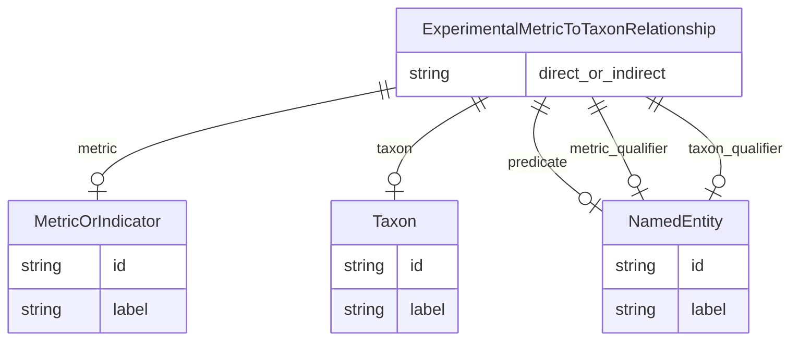

# Class: ExperimentalMetricToTaxonRelationship


_A triple where the subject is an experimental metric, the object is an taxon, metric, and the predicate describes the relationship between the metric and the taxon, usually MEASURED_IN._


URI: [alzrd:ExperimentalMetricToTaxonRelationship](http://w3id.org/ontogpt/alzrdExperimentalMetricToTaxonRelationship)





## Inheritance
* [CompoundExpression](CompoundExpression.md)
    * **ExperimentalMetricToTaxonRelationship**


## Slots

| Name | Cardinality and Range | Description | Inheritance |
| ---  | --- | --- | --- |
| [metric](metric.md) | 0..1 <br/> [MetricOrIndicator](MetricOrIndicator.md) | The name of an experimental metric, sign, symptom, or outcome used to measure... | direct |
| [taxon](taxon.md) | 0..1 <br/> [Taxon](Taxon.md) | The taxon or species of the model organism in which the experimental metric i... | direct |
| [predicate](predicate.md) | 0..1 <br/> [NamedEntity](NamedEntity.md) | The relationship type, generally MEASURED_IN to indicate a metric is measured... | direct |
| [metric_qualifier](metric_qualifier.md) | 0..1 <br/> [NamedEntity](NamedEntity.md) | An optional qualifier or modifier for the experimental metric, as described i... | direct |
| [taxon_qualifier](taxon_qualifier.md) | 0..1 <br/> [NamedEntity](NamedEntity.md) | An optional qualifier or modifier for the taxon, as described | direct |
| [direct_or_indirect](direct_or_indirect.md) | 0..1 <br/> [String](String.md) | Whether the relationship between the metric and the taxon is direct or indire... | direct |


## Usages

| used by | used in | type | used |
| ---  | --- | --- | --- |
| [Document](Document.md) | [experimental_metrics_to_taxon_relationships](experimental_metrics_to_taxon_relationships.md) | range | [ExperimentalMetricToTaxonRelationship](ExperimentalMetricToTaxonRelationship.md) |


## Identifier and Mapping Information


### Schema Source


* from schema: http://w3id.org/ontogpt/alzrd


## Mappings

| Mapping Type | Mapped Value |
| ---  | ---  |
| self | alzrd:ExperimentalMetricToTaxonRelationship |
| native | alzrd:ExperimentalMetricToTaxonRelationship |


## LinkML Source

<!-- TODO: investigate https://stackoverflow.com/questions/37606292/how-to-create-tabbed-code-blocks-in-mkdocs-or-sphinx -->

### Direct

<details>
```yaml
name: ExperimentalMetricToTaxonRelationship
description: A triple where the subject is an experimental metric, the object is an
  taxon, metric, and the predicate describes the relationship between the metric and
  the taxon, usually MEASURED_IN.
from_schema: http://w3id.org/ontogpt/alzrd
is_a: CompoundExpression
attributes:
  metric:
    name: metric
    description: The name of an experimental metric, sign, symptom, or outcome used
      to measure the effects of treatments on symptoms or diagnostics, or of the progression
      of Alzheimer's disease and related dementias. In experimental animal models
      these are analogues of cognitive impairment or indicators of disease progression
      modeling those observed in humans. Examples are Amyloid beta (Aβ) levels, Morris
      water maze test, tau phosphorylation, neurofibrillary tangles, and cognitive
      decline.
    from_schema: http://w3id.org/ontogpt/alzrd
    rank: 1000
    domain_of:
    - ExperimentalMetricToTaxonRelationship
    - ExperimentalMetricToDiseaseRelationship
    - ExperimentalMetricToEnvironmentRelationship
    - ExperimentalMetricToChemicalRelationship
    range: MetricOrIndicator
  taxon:
    name: taxon
    description: The taxon or species of the model organism in which the experimental
      metric is measured. For example, Mus musculus, Rattus norvegicus.
    from_schema: http://w3id.org/ontogpt/alzrd
    rank: 1000
    domain_of:
    - ExperimentalMetricToTaxonRelationship
    range: Taxon
  predicate:
    name: predicate
    description: The relationship type, generally MEASURED_IN to indicate a metric
      is measured in a taxon.
    from_schema: http://w3id.org/ontogpt/alzrd
    rank: 1000
    domain_of:
    - ExperimentalMetricToTaxonRelationship
    - ExperimentalMetricToDiseaseRelationship
    - ExperimentalMetricToEnvironmentRelationship
    - ExperimentalMetricToChemicalRelationship
    - Triple
    range: NamedEntity
  metric_qualifier:
    name: metric_qualifier
    description: An optional qualifier or modifier for the experimental metric, as
      described in the input text. This may include the method of measurement or the
      specific assay used.
    from_schema: http://w3id.org/ontogpt/alzrd
    rank: 1000
    domain_of:
    - ExperimentalMetricToTaxonRelationship
    - ExperimentalMetricToDiseaseRelationship
    - ExperimentalMetricToEnvironmentRelationship
    - ExperimentalMetricToChemicalRelationship
    range: NamedEntity
  taxon_qualifier:
    name: taxon_qualifier
    description: "An optional qualifier or modifier for the taxon, as described\n\
      \ in the input text.\n This may include a strain or genetic background of the\
      \ model organism."
    from_schema: http://w3id.org/ontogpt/alzrd
    rank: 1000
    domain_of:
    - ExperimentalMetricToTaxonRelationship
    range: NamedEntity
  direct_or_indirect:
    name: direct_or_indirect
    description: Whether the relationship between the metric and the taxon is direct
      or indirect. UNKNOWN if this is not specified in the text or is unclear.
    from_schema: http://w3id.org/ontogpt/alzrd
    rank: 1000
    domain_of:
    - ExperimentalMetricToTaxonRelationship
    - ExperimentalMetricToDiseaseRelationship
    - ExperimentalMetricToEnvironmentRelationship
    - ExperimentalMetricToChemicalRelationship
    range: string

```
</details>

### Induced

<details>
```yaml
name: ExperimentalMetricToTaxonRelationship
description: A triple where the subject is an experimental metric, the object is an
  taxon, metric, and the predicate describes the relationship between the metric and
  the taxon, usually MEASURED_IN.
from_schema: http://w3id.org/ontogpt/alzrd
is_a: CompoundExpression
attributes:
  metric:
    name: metric
    description: The name of an experimental metric, sign, symptom, or outcome used
      to measure the effects of treatments on symptoms or diagnostics, or of the progression
      of Alzheimer's disease and related dementias. In experimental animal models
      these are analogues of cognitive impairment or indicators of disease progression
      modeling those observed in humans. Examples are Amyloid beta (Aβ) levels, Morris
      water maze test, tau phosphorylation, neurofibrillary tangles, and cognitive
      decline.
    from_schema: http://w3id.org/ontogpt/alzrd
    rank: 1000
    alias: metric
    owner: ExperimentalMetricToTaxonRelationship
    domain_of:
    - ExperimentalMetricToTaxonRelationship
    - ExperimentalMetricToDiseaseRelationship
    - ExperimentalMetricToEnvironmentRelationship
    - ExperimentalMetricToChemicalRelationship
    range: MetricOrIndicator
  taxon:
    name: taxon
    description: The taxon or species of the model organism in which the experimental
      metric is measured. For example, Mus musculus, Rattus norvegicus.
    from_schema: http://w3id.org/ontogpt/alzrd
    rank: 1000
    alias: taxon
    owner: ExperimentalMetricToTaxonRelationship
    domain_of:
    - ExperimentalMetricToTaxonRelationship
    range: Taxon
  predicate:
    name: predicate
    description: The relationship type, generally MEASURED_IN to indicate a metric
      is measured in a taxon.
    from_schema: http://w3id.org/ontogpt/alzrd
    rank: 1000
    alias: predicate
    owner: ExperimentalMetricToTaxonRelationship
    domain_of:
    - ExperimentalMetricToTaxonRelationship
    - ExperimentalMetricToDiseaseRelationship
    - ExperimentalMetricToEnvironmentRelationship
    - ExperimentalMetricToChemicalRelationship
    - Triple
    range: NamedEntity
  metric_qualifier:
    name: metric_qualifier
    description: An optional qualifier or modifier for the experimental metric, as
      described in the input text. This may include the method of measurement or the
      specific assay used.
    from_schema: http://w3id.org/ontogpt/alzrd
    rank: 1000
    alias: metric_qualifier
    owner: ExperimentalMetricToTaxonRelationship
    domain_of:
    - ExperimentalMetricToTaxonRelationship
    - ExperimentalMetricToDiseaseRelationship
    - ExperimentalMetricToEnvironmentRelationship
    - ExperimentalMetricToChemicalRelationship
    range: NamedEntity
  taxon_qualifier:
    name: taxon_qualifier
    description: "An optional qualifier or modifier for the taxon, as described\n\
      \ in the input text.\n This may include a strain or genetic background of the\
      \ model organism."
    from_schema: http://w3id.org/ontogpt/alzrd
    rank: 1000
    alias: taxon_qualifier
    owner: ExperimentalMetricToTaxonRelationship
    domain_of:
    - ExperimentalMetricToTaxonRelationship
    range: NamedEntity
  direct_or_indirect:
    name: direct_or_indirect
    description: Whether the relationship between the metric and the taxon is direct
      or indirect. UNKNOWN if this is not specified in the text or is unclear.
    from_schema: http://w3id.org/ontogpt/alzrd
    rank: 1000
    alias: direct_or_indirect
    owner: ExperimentalMetricToTaxonRelationship
    domain_of:
    - ExperimentalMetricToTaxonRelationship
    - ExperimentalMetricToDiseaseRelationship
    - ExperimentalMetricToEnvironmentRelationship
    - ExperimentalMetricToChemicalRelationship
    range: string

```
</details>