# Template for extracting Alzheimer's Disease Phenotypes

Template for extracting phenotypes of Alzheimer's disease and related dementias along with experimental metrics and model organisms. Assumes a large input text, on the order of a full scientific article or review. Focus is on extracting the methods and metrics used with different model organisms. This version of the template attempts to process the entirety of the input text at once.

URI: http://w3id.org/ontogpt/alzrd

Name: alzrd

## Schema Diagram

```mermaid
erDiagram
Document {
    string summary  
    string article_type  
    string modeling_approach  
    string modeling_summary  
    string id  
    string label  
}
ExperimentalMetricToChemicalRelationship {
    string direct_or_indirect  
    string association  
}
NamedEntity {
    string id  
    string label  
}
Chemical {
    string id  
    string label  
}
MetricOrIndicator {
    string id  
    string label  
}
ExperimentalMetricToEnvironmentRelationship {
    string direct_or_indirect  
    string association  
}
EnvironmentalExposure {
    string id  
    string label  
}
ExperimentalMetricToDiseaseRelationship {
    string direct_or_indirect  
    string association  
}
Disease {
    string id  
    string label  
}
ExperimentalMetricToTaxonRelationship {
    string direct_or_indirect  
}
Taxon {
    string id  
    string label  
}
Diagnostic {
    string id  
    string label  
}

Document ||--}o Taxon : "taxa"
Document ||--}o Diagnostic : "diagnostics"
Document ||--}o Disease : "diseases"
Document ||--}o Chemical : "chemical"
Document ||--}o EnvironmentalExposure : "environmental_exposures"
Document ||--}o MetricOrIndicator : "experimental_metrics_and_indicators"
Document ||--}o ExperimentalMetricToTaxonRelationship : "experimental_metrics_to_taxon_relationships"
Document ||--}o ExperimentalMetricToDiseaseRelationship : "experimental_metric_to_disease_relationships"
Document ||--}o ExperimentalMetricToEnvironmentRelationship : "experimental_metric_to_environment_relationships"
Document ||--}o ExperimentalMetricToChemicalRelationship : "experimental_metric_to_chemical_relationships"
ExperimentalMetricToChemicalRelationship ||--|o MetricOrIndicator : "metric"
ExperimentalMetricToChemicalRelationship ||--|o Chemical : "chemical"
ExperimentalMetricToChemicalRelationship ||--|o NamedEntity : "predicate"
ExperimentalMetricToChemicalRelationship ||--|o NamedEntity : "metric_qualifier"
ExperimentalMetricToChemicalRelationship ||--|o NamedEntity : "chemical_qualifier"
ExperimentalMetricToEnvironmentRelationship ||--|o MetricOrIndicator : "metric"
ExperimentalMetricToEnvironmentRelationship ||--|o EnvironmentalExposure : "environment"
ExperimentalMetricToEnvironmentRelationship ||--|o NamedEntity : "predicate"
ExperimentalMetricToEnvironmentRelationship ||--|o NamedEntity : "metric_qualifier"
ExperimentalMetricToEnvironmentRelationship ||--|o NamedEntity : "environment_qualifier"
ExperimentalMetricToDiseaseRelationship ||--|o MetricOrIndicator : "metric"
ExperimentalMetricToDiseaseRelationship ||--|o Disease : "disease"
ExperimentalMetricToDiseaseRelationship ||--|o NamedEntity : "predicate"
ExperimentalMetricToDiseaseRelationship ||--|o NamedEntity : "metric_qualifier"
ExperimentalMetricToDiseaseRelationship ||--|o NamedEntity : "disease_qualifier"
ExperimentalMetricToTaxonRelationship ||--|o MetricOrIndicator : "metric"
ExperimentalMetricToTaxonRelationship ||--|o Taxon : "taxon"
ExperimentalMetricToTaxonRelationship ||--|o NamedEntity : "predicate"
ExperimentalMetricToTaxonRelationship ||--|o NamedEntity : "metric_qualifier"
ExperimentalMetricToTaxonRelationship ||--|o NamedEntity : "taxon_qualifier"

```

## Classes

| Class | Description |
| --- | --- |
| [AnnotatorResult](AnnotatorResult.md) | None |
| [Any](Any.md) | None |
| [CompoundExpression](CompoundExpression.md) | None |
| &nbsp;&nbsp;&nbsp;&nbsp;&nbsp;&nbsp;&nbsp;&nbsp;[ExperimentalMetricToChemicalRelationship](ExperimentalMetricToChemicalRelationship.md) | A triple where the subject is an experimental metric, the object is a chemical, drug, or other substance, and the predicate describes the relationship between the metric and the chemical, usually MEASURED_IN_RESPONSE_TO. |
| &nbsp;&nbsp;&nbsp;&nbsp;&nbsp;&nbsp;&nbsp;&nbsp;[ExperimentalMetricToDiseaseRelationship](ExperimentalMetricToDiseaseRelationship.md) | A triple where the subject is an experimental metric, the object is a disease or condition, and the predicate describes the relationship between the metric and the disease, usually USED_TO_MODEL. |
| &nbsp;&nbsp;&nbsp;&nbsp;&nbsp;&nbsp;&nbsp;&nbsp;[ExperimentalMetricToEnvironmentRelationship](ExperimentalMetricToEnvironmentRelationship.md) | A triple where the subject is an experimental metric, the object is an environmental exposure or condition, and the predicate describes the relationship between the metric and the environmental exposure, usually MEASURED_IN_RESPONSE_TO. |
| &nbsp;&nbsp;&nbsp;&nbsp;&nbsp;&nbsp;&nbsp;&nbsp;[ExperimentalMetricToTaxonRelationship](ExperimentalMetricToTaxonRelationship.md) | A triple where the subject is an experimental metric, the object is an taxon, metric, and the predicate describes the relationship between the metric and the taxon, usually MEASURED_IN. |
| &nbsp;&nbsp;&nbsp;&nbsp;&nbsp;&nbsp;&nbsp;&nbsp;[Triple](Triple.md) | Abstract parent for Relation Extraction tasks |
| [ExtractionResult](ExtractionResult.md) | A result of extracting knowledge on text |
| [NamedEntity](NamedEntity.md) | None |
| &nbsp;&nbsp;&nbsp;&nbsp;&nbsp;&nbsp;&nbsp;&nbsp;[Chemical](Chemical.md) | None |
| &nbsp;&nbsp;&nbsp;&nbsp;&nbsp;&nbsp;&nbsp;&nbsp;[Diagnostic](Diagnostic.md) | None |
| &nbsp;&nbsp;&nbsp;&nbsp;&nbsp;&nbsp;&nbsp;&nbsp;[Disease](Disease.md) | None |
| &nbsp;&nbsp;&nbsp;&nbsp;&nbsp;&nbsp;&nbsp;&nbsp;[Document](Document.md) | None |
| &nbsp;&nbsp;&nbsp;&nbsp;&nbsp;&nbsp;&nbsp;&nbsp;[EnvironmentalExposure](EnvironmentalExposure.md) | None |
| &nbsp;&nbsp;&nbsp;&nbsp;&nbsp;&nbsp;&nbsp;&nbsp;[MetricOrIndicator](MetricOrIndicator.md) | None |
| &nbsp;&nbsp;&nbsp;&nbsp;&nbsp;&nbsp;&nbsp;&nbsp;[RelationshipType](RelationshipType.md) | None |
| &nbsp;&nbsp;&nbsp;&nbsp;&nbsp;&nbsp;&nbsp;&nbsp;[Taxon](Taxon.md) | None |
| [Publication](Publication.md) | None |
| [TextWithEntity](TextWithEntity.md) | A text containing one or more instances of a single type of entity. |
| [TextWithTriples](TextWithTriples.md) | A text containing one or more relations of the Triple type. |

## Slots

| Slot | Description |
| --- | --- |
| [abstract](abstract.md) | The abstract of the publication |
| [article_type](article_type.md) | The type of article, e |
| [association](association.md) | The type of any observed association between the value of the metric and the ... |
| [chemical](chemical.md) | A semicolon-separated list of chemicals, drugs, or other substances mentioned... |
| [chemical_qualifier](chemical_qualifier.md) | An optional qualifier or modifier for the chemical, drug, or other substance,... |
| [combined_text](combined_text.md) |  |
| [diagnostics](diagnostics.md) | A semicolon-separated list of diagnostic procedures mentioned in the input te... |
| [direct_or_indirect](direct_or_indirect.md) | Whether the relationship between the metric and the taxon is direct or indire... |
| [disease](disease.md) | The name of a disease or condition |
| [disease_qualifier](disease_qualifier.md) | An optional qualifier or modifier for the disease or condition, as described ... |
| [diseases](diseases.md) | A semicolon-separated list of diseases or conditions mentioned in the input t... |
| [entities](entities.md) |  |
| [environment](environment.md) | The name of an environmental exposure or condition |
| [environment_qualifier](environment_qualifier.md) | An optional qualifier or modifier for the environmental exposure, as describe... |
| [environmental_exposures](environmental_exposures.md) | A semicolon-separated list of environmental exposures mentioned in the input ... |
| [experimental_metric_to_chemical_relationships](experimental_metric_to_chemical_relationships.md) | Semicolon-separated list of relationships between a specific experimental met... |
| [experimental_metric_to_disease_relationships](experimental_metric_to_disease_relationships.md) | Semicolon-separated list of relationships between a specific experimental met... |
| [experimental_metric_to_environment_relationships](experimental_metric_to_environment_relationships.md) | Semicolon-separated list of relationships between a specific experimental met... |
| [experimental_metrics_and_indicators](experimental_metrics_and_indicators.md) | A semicolon-separated list of of experimental metrics, signs, symptoms, or ou... |
| [experimental_metrics_to_taxon_relationships](experimental_metrics_to_taxon_relationships.md) | Semicolon-separated list of relationships between a specific experimental met... |
| [extracted_object](extracted_object.md) | The complex objects extracted from the text |
| [full_text](full_text.md) | The full text of the publication |
| [id](id.md) | A unique identifier for the named entity |
| [input_id](input_id.md) |  |
| [input_text](input_text.md) |  |
| [input_title](input_title.md) |  |
| [label](label.md) | The label (name) of the named thing |
| [metric](metric.md) | The name of an experimental metric, sign, symptom, or outcome used to measure... |
| [metric_qualifier](metric_qualifier.md) | An optional qualifier or modifier for the experimental metric, as described i... |
| [modeling_approach](modeling_approach.md) | A brief description of the modeling approach used in the input text, e |
| [modeling_summary](modeling_summary.md) | A brief summary of the modeling approach used in the input text, suitable for... |
| [named_entities](named_entities.md) | Named entities extracted from the text |
| [object](object.md) |  |
| [object_id](object_id.md) |  |
| [object_qualifier](object_qualifier.md) | An optional qualifier or modifier for the object of the statement, e |
| [object_text](object_text.md) |  |
| [predicate](predicate.md) | The relationship type, generally MEASURED_IN to indicate a metric is measured... |
| [prompt](prompt.md) |  |
| [publication](publication.md) |  |
| [qualifier](qualifier.md) | A qualifier for the statements, e |
| [raw_completion_output](raw_completion_output.md) |  |
| [subject](subject.md) |  |
| [subject_qualifier](subject_qualifier.md) | An optional qualifier or modifier for the subject of the statement, e |
| [subject_text](subject_text.md) |  |
| [summary](summary.md) | A brief summary of the input text, suitable for display in a table of content... |
| [taxa](taxa.md) | A semicolon-separated list of taxa or species of organisms mentioned in the i... |
| [taxon](taxon.md) | The taxon or species of the model organism in which the experimental metric i... |
| [taxon_qualifier](taxon_qualifier.md) | An optional qualifier or modifier for the taxon, as described |
| [title](title.md) | The title of the publication |
| [triples](triples.md) |  |

## Enumerations

| Enumeration | Description |
| --- | --- |
| [NullDataOptions](NullDataOptions.md) |  |

## Types

| Type | Description |
| --- | --- |
| [Boolean](Boolean.md) | A binary (true or false) value |
| [Curie](Curie.md) | a compact URI |
| [Date](Date.md) | a date (year, month and day) in an idealized calendar |
| [DateOrDatetime](DateOrDatetime.md) | Either a date or a datetime |
| [Datetime](Datetime.md) | The combination of a date and time |
| [Decimal](Decimal.md) | A real number with arbitrary precision that conforms to the xsd:decimal speci... |
| [Double](Double.md) | A real number that conforms to the xsd:double specification |
| [Float](Float.md) | A real number that conforms to the xsd:float specification |
| [Integer](Integer.md) | An integer |
| [Jsonpath](Jsonpath.md) | A string encoding a JSON Path |
| [Jsonpointer](Jsonpointer.md) | A string encoding a JSON Pointer |
| [Ncname](Ncname.md) | Prefix part of CURIE |
| [Nodeidentifier](Nodeidentifier.md) | A URI, CURIE or BNODE that represents a node in a model |
| [Objectidentifier](Objectidentifier.md) | A URI or CURIE that represents an object in the model |
| [Sparqlpath](Sparqlpath.md) | A string encoding a SPARQL Property Path |
| [String](String.md) | A character string |
| [Time](Time.md) | A time object represents a (local) time of day, independent of any particular... |
| [Uri](Uri.md) | a complete URI |
| [Uriorcurie](Uriorcurie.md) | a URI or a CURIE |

## Subsets

| Subset | Description |
| --- | --- |
