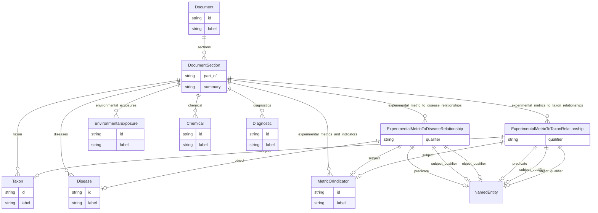

# Class: Document


URI: [alzrd:Document](http://w3id.org/ontogpt/alzrd_sectionDocument)





## Inheritance
* [NamedEntity](NamedEntity.md)
    * **Document**


## Slots

| Name | Cardinality and Range | Description | Inheritance |
| ---  | --- | --- | --- |
| [sections](sections.md) | * <br/> [DocumentSection](DocumentSection.md) | A semicolon-separated list of full sections of the document, including the fu... | direct |
| [id](id.md) | 1 <br/> [String](String.md) | A unique identifier for the named entity | [NamedEntity](NamedEntity.md) |
| [label](label.md) | 0..1 <br/> [String](String.md) | The label (name) of the named thing | [NamedEntity](NamedEntity.md) |


## Identifier and Mapping Information


### Schema Source


* from schema: http://w3id.org/ontogpt/alzrd_section


## Mappings

| Mapping Type | Mapped Value |
| ---  | ---  |
| self | alzrd:Document |
| native | alzrd:Document |


## LinkML Source

<!-- TODO: investigate https://stackoverflow.com/questions/37606292/how-to-create-tabbed-code-blocks-in-mkdocs-or-sphinx -->

### Direct

<details>
```yaml
name: Document
from_schema: http://w3id.org/ontogpt/alzrd_section
is_a: NamedEntity
attributes:
  sections:
    name: sections
    description: A semicolon-separated list of full sections of the document, including
      the full text of that section alone, beginning with the major division of the
      document, such as ABSTRACT, INTRODUCTION, METHODS, RESULTS, DISCUSSION, CONCLUSIONS,
      or a similar heading used by the text. The text should include the section title.
      If semicolons are present in the section text, they must be replaced with (SEMICOLON)
      to avoid parsing errors. A single phrase or ID is not a section. Do not format
      in Markdown.
    from_schema: http://w3id.org/ontogpt/alzrd_section
    rank: 1000
    domain_of:
    - Document
    range: DocumentSection
    multivalued: true
tree_root: true

```
</details>

### Induced

<details>
```yaml
name: Document
from_schema: http://w3id.org/ontogpt/alzrd_section
is_a: NamedEntity
attributes:
  sections:
    name: sections
    description: A semicolon-separated list of full sections of the document, including
      the full text of that section alone, beginning with the major division of the
      document, such as ABSTRACT, INTRODUCTION, METHODS, RESULTS, DISCUSSION, CONCLUSIONS,
      or a similar heading used by the text. The text should include the section title.
      If semicolons are present in the section text, they must be replaced with (SEMICOLON)
      to avoid parsing errors. A single phrase or ID is not a section. Do not format
      in Markdown.
    from_schema: http://w3id.org/ontogpt/alzrd_section
    rank: 1000
    alias: sections
    owner: Document
    domain_of:
    - Document
    range: DocumentSection
    multivalued: true
  id:
    name: id
    annotations:
      prompt.skip:
        tag: prompt.skip
        value: 'true'
    description: A unique identifier for the named entity
    comments:
    - this is populated during the grounding and normalization step
    from_schema: http://w3id.org/ontogpt/alzrd_section
    rank: 1000
    identifier: true
    alias: id
    owner: Document
    domain_of:
    - NamedEntity
    - Publication
    range: string
    required: true
  label:
    name: label
    annotations:
      owl:
        tag: owl
        value: AnnotationProperty, AnnotationAssertion
    description: The label (name) of the named thing
    from_schema: http://w3id.org/ontogpt/alzrd_section
    aliases:
    - name
    rank: 1000
    slot_uri: rdfs:label
    alias: label
    owner: Document
    domain_of:
    - NamedEntity
    range: string
tree_root: true

```
</details>