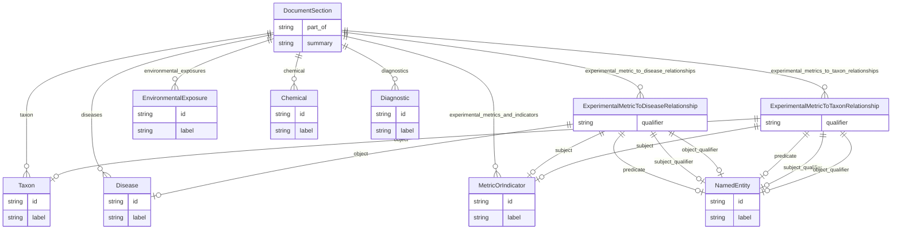

# Class: DocumentSection


URI: [alzrd:DocumentSection](http://w3id.org/ontogpt/alzrd_sectionDocumentSection)





## Inheritance
* [CompoundExpression](CompoundExpression.md)
    * **DocumentSection**


## Slots

| Name | Cardinality and Range | Description | Inheritance |
| ---  | --- | --- | --- |
| [part_of](part_of.md) | 0..1 <br/> [String](String.md) | The major document division that this section is a part of | direct |
| [summary](summary.md) | 0..1 <br/> [String](String.md) | A brief summary of the section, suitable for display in a table of contents o... | direct |
| [taxon](taxon.md) | * <br/> [Taxon](Taxon.md) | A semicolon-separated list of taxa or species of organisms mentioned in the s... | direct |
| [diagnostics](diagnostics.md) | * <br/> [Diagnostic](Diagnostic.md) | A semicolon-separated list of diagnostic procedures mentioned in the section | direct |
| [diseases](diseases.md) | * <br/> [Disease](Disease.md) | A semicolon-separated list of diseases or conditions mentioned in the section | direct |
| [chemical](chemical.md) | * <br/> [Chemical](Chemical.md) | A semicolon-separated list of chemicals, drugs, or other substances mentioned... | direct |
| [environmental_exposures](environmental_exposures.md) | * <br/> [EnvironmentalExposure](EnvironmentalExposure.md) | A semicolon-separated list of environmental exposures mentioned in the sectio... | direct |
| [experimental_metrics_and_indicators](experimental_metrics_and_indicators.md) | * <br/> [MetricOrIndicator](MetricOrIndicator.md) | A semicolon-separated list of of a experimental metrics, signs, symptoms, or ... | direct |
| [experimental_metrics_to_taxon_relationships](experimental_metrics_to_taxon_relationships.md) | * <br/> [ExperimentalMetricToTaxonRelationship](ExperimentalMetricToTaxonRelationship.md) | Semicolon-separated list of relationships between a specific experimental met... | direct |
| [experimental_metric_to_disease_relationships](experimental_metric_to_disease_relationships.md) | * <br/> [ExperimentalMetricToDiseaseRelationship](ExperimentalMetricToDiseaseRelationship.md) | Semicolon-separated list of relationships between a specific experimental met... | direct |


## Usages

| used by | used in | type | used |
| ---  | --- | --- | --- |
| [Document](Document.md) | [sections](sections.md) | range | [DocumentSection](DocumentSection.md) |


## Identifier and Mapping Information


### Schema Source


* from schema: http://w3id.org/ontogpt/alzrd_section


## Mappings

| Mapping Type | Mapped Value |
| ---  | ---  |
| self | alzrd:DocumentSection |
| native | alzrd:DocumentSection |


## LinkML Source

<!-- TODO: investigate https://stackoverflow.com/questions/37606292/how-to-create-tabbed-code-blocks-in-mkdocs-or-sphinx -->

### Direct

<details>
```yaml
name: DocumentSection
from_schema: http://w3id.org/ontogpt/alzrd_section
is_a: CompoundExpression
attributes:
  part_of:
    name: part_of
    description: The major document division that this section is a part of. Examples
      are "introduction", "methods", "results", "discussion", or "conclusions". Do
      not format in Markdown.
    from_schema: http://w3id.org/ontogpt/alzrd_section
    rank: 1000
    domain_of:
    - DocumentSection
    range: string
  summary:
    name: summary
    description: A brief summary of the section, suitable for display in a table of
      contents or search results. This should be a single sentence or phrase, not
      a full paragraph. Do not format in Markdown.
    from_schema: http://w3id.org/ontogpt/alzrd_section
    rank: 1000
    domain_of:
    - DocumentSection
    range: string
  taxon:
    name: taxon
    description: A semicolon-separated list of taxa or species of organisms mentioned
      in the section. Where possible, translate to the binomial species name (e.g.,
      change "mouse" to "Mus musculus"), unless a different species name is provided
      in the text. If no taxon is mentioned, return NOT FOUND.
    from_schema: http://w3id.org/ontogpt/alzrd_section
    rank: 1000
    domain_of:
    - DocumentSection
    range: Taxon
    multivalued: true
  diagnostics:
    name: diagnostics
    description: A semicolon-separated list of diagnostic procedures mentioned in
      the section. If no diagnostic procedures are mentioned, return NOT FOUND.
    from_schema: http://w3id.org/ontogpt/alzrd_section
    rank: 1000
    domain_of:
    - DocumentSection
    range: Diagnostic
    multivalued: true
  diseases:
    name: diseases
    description: A semicolon-separated list of diseases or conditions mentioned in
      the section. If no diseases are mentioned, return NOT FOUND.
    from_schema: http://w3id.org/ontogpt/alzrd_section
    rank: 1000
    domain_of:
    - DocumentSection
    range: Disease
    multivalued: true
  chemical:
    name: chemical
    description: A semicolon-separated list of chemicals, drugs, or other substances
      mentioned in the section. If no chemicals are mentioned, return NOT FOUND.
    from_schema: http://w3id.org/ontogpt/alzrd_section
    rank: 1000
    domain_of:
    - DocumentSection
    range: Chemical
    multivalued: true
  environmental_exposures:
    name: environmental_exposures
    description: A semicolon-separated list of environmental exposures mentioned in
      the section. These may include exposure to general classes of materials, e.g.,
      "exposure to pesticides", or other phenomena, e.g., "chronic stress". If no
      environmental exposures are mentioned, return NOT FOUND.
    from_schema: http://w3id.org/ontogpt/alzrd_section
    rank: 1000
    domain_of:
    - DocumentSection
    range: EnvironmentalExposure
    multivalued: true
  experimental_metrics_and_indicators:
    name: experimental_metrics_and_indicators
    description: A semicolon-separated list of of a experimental metrics, signs, symptoms,
      or outcomes used to measure the progression of Alzheimer's disease and related
      dementias. These may be quantitative or qualitative measures, including biomolecular
      assays. In experimental animal models these are analogues of cognitive impairment
      or indicators of disease progression modeling those observed in humans. Examples
      are Amyloid beta (Aβ) levels, Morris water maze test, tau phosphorylation, neurofibrillary
      tangles, and cognitive decline. If no experimental metrics are mentioned, return
      NOT FOUND.
    from_schema: http://w3id.org/ontogpt/alzrd_section
    rank: 1000
    domain_of:
    - DocumentSection
    range: MetricOrIndicator
    multivalued: true
  experimental_metrics_to_taxon_relationships:
    name: experimental_metrics_to_taxon_relationships
    description: Semicolon-separated list of relationships between a specific experimental
      metric, sign, symptom, or outcome and a taxon, where the relationship is used
      to measure progression of Alzheimer's disease and related dementias, or an experimental
      analogue, in the taxon. For example, "Amyloid beta (Aβ) levels are measured
      in Mus musculus" or "Morris water maze test is measured with Rattus norvegicus".
    from_schema: http://w3id.org/ontogpt/alzrd_section
    rank: 1000
    domain_of:
    - DocumentSection
    range: ExperimentalMetricToTaxonRelationship
    multivalued: true
  experimental_metric_to_disease_relationships:
    name: experimental_metric_to_disease_relationships
    description: Semicolon-separated list of relationships between a specific experimental
      metric, sign, symptom, or outcome and a disease or condition, where the relationship
      is used as an experimental model of progression or presence of a disease. For
      example, "Amyloid beta (Aβ) levels are used to model Alzheimer's disease" or
      "Morris water maze test is used to model Parkinson's disease".
    from_schema: http://w3id.org/ontogpt/alzrd_section
    rank: 1000
    domain_of:
    - DocumentSection
    range: ExperimentalMetricToDiseaseRelationship
    multivalued: true

```
</details>

### Induced

<details>
```yaml
name: DocumentSection
from_schema: http://w3id.org/ontogpt/alzrd_section
is_a: CompoundExpression
attributes:
  part_of:
    name: part_of
    description: The major document division that this section is a part of. Examples
      are "introduction", "methods", "results", "discussion", or "conclusions". Do
      not format in Markdown.
    from_schema: http://w3id.org/ontogpt/alzrd_section
    rank: 1000
    alias: part_of
    owner: DocumentSection
    domain_of:
    - DocumentSection
    range: string
  summary:
    name: summary
    description: A brief summary of the section, suitable for display in a table of
      contents or search results. This should be a single sentence or phrase, not
      a full paragraph. Do not format in Markdown.
    from_schema: http://w3id.org/ontogpt/alzrd_section
    rank: 1000
    alias: summary
    owner: DocumentSection
    domain_of:
    - DocumentSection
    range: string
  taxon:
    name: taxon
    description: A semicolon-separated list of taxa or species of organisms mentioned
      in the section. Where possible, translate to the binomial species name (e.g.,
      change "mouse" to "Mus musculus"), unless a different species name is provided
      in the text. If no taxon is mentioned, return NOT FOUND.
    from_schema: http://w3id.org/ontogpt/alzrd_section
    rank: 1000
    alias: taxon
    owner: DocumentSection
    domain_of:
    - DocumentSection
    range: Taxon
    multivalued: true
  diagnostics:
    name: diagnostics
    description: A semicolon-separated list of diagnostic procedures mentioned in
      the section. If no diagnostic procedures are mentioned, return NOT FOUND.
    from_schema: http://w3id.org/ontogpt/alzrd_section
    rank: 1000
    alias: diagnostics
    owner: DocumentSection
    domain_of:
    - DocumentSection
    range: Diagnostic
    multivalued: true
  diseases:
    name: diseases
    description: A semicolon-separated list of diseases or conditions mentioned in
      the section. If no diseases are mentioned, return NOT FOUND.
    from_schema: http://w3id.org/ontogpt/alzrd_section
    rank: 1000
    alias: diseases
    owner: DocumentSection
    domain_of:
    - DocumentSection
    range: Disease
    multivalued: true
  chemical:
    name: chemical
    description: A semicolon-separated list of chemicals, drugs, or other substances
      mentioned in the section. If no chemicals are mentioned, return NOT FOUND.
    from_schema: http://w3id.org/ontogpt/alzrd_section
    rank: 1000
    alias: chemical
    owner: DocumentSection
    domain_of:
    - DocumentSection
    range: Chemical
    multivalued: true
  environmental_exposures:
    name: environmental_exposures
    description: A semicolon-separated list of environmental exposures mentioned in
      the section. These may include exposure to general classes of materials, e.g.,
      "exposure to pesticides", or other phenomena, e.g., "chronic stress". If no
      environmental exposures are mentioned, return NOT FOUND.
    from_schema: http://w3id.org/ontogpt/alzrd_section
    rank: 1000
    alias: environmental_exposures
    owner: DocumentSection
    domain_of:
    - DocumentSection
    range: EnvironmentalExposure
    multivalued: true
  experimental_metrics_and_indicators:
    name: experimental_metrics_and_indicators
    description: A semicolon-separated list of of a experimental metrics, signs, symptoms,
      or outcomes used to measure the progression of Alzheimer's disease and related
      dementias. These may be quantitative or qualitative measures, including biomolecular
      assays. In experimental animal models these are analogues of cognitive impairment
      or indicators of disease progression modeling those observed in humans. Examples
      are Amyloid beta (Aβ) levels, Morris water maze test, tau phosphorylation, neurofibrillary
      tangles, and cognitive decline. If no experimental metrics are mentioned, return
      NOT FOUND.
    from_schema: http://w3id.org/ontogpt/alzrd_section
    rank: 1000
    alias: experimental_metrics_and_indicators
    owner: DocumentSection
    domain_of:
    - DocumentSection
    range: MetricOrIndicator
    multivalued: true
  experimental_metrics_to_taxon_relationships:
    name: experimental_metrics_to_taxon_relationships
    description: Semicolon-separated list of relationships between a specific experimental
      metric, sign, symptom, or outcome and a taxon, where the relationship is used
      to measure progression of Alzheimer's disease and related dementias, or an experimental
      analogue, in the taxon. For example, "Amyloid beta (Aβ) levels are measured
      in Mus musculus" or "Morris water maze test is measured with Rattus norvegicus".
    from_schema: http://w3id.org/ontogpt/alzrd_section
    rank: 1000
    alias: experimental_metrics_to_taxon_relationships
    owner: DocumentSection
    domain_of:
    - DocumentSection
    range: ExperimentalMetricToTaxonRelationship
    multivalued: true
  experimental_metric_to_disease_relationships:
    name: experimental_metric_to_disease_relationships
    description: Semicolon-separated list of relationships between a specific experimental
      metric, sign, symptom, or outcome and a disease or condition, where the relationship
      is used as an experimental model of progression or presence of a disease. For
      example, "Amyloid beta (Aβ) levels are used to model Alzheimer's disease" or
      "Morris water maze test is used to model Parkinson's disease".
    from_schema: http://w3id.org/ontogpt/alzrd_section
    rank: 1000
    alias: experimental_metric_to_disease_relationships
    owner: DocumentSection
    domain_of:
    - DocumentSection
    range: ExperimentalMetricToDiseaseRelationship
    multivalued: true

```
</details>