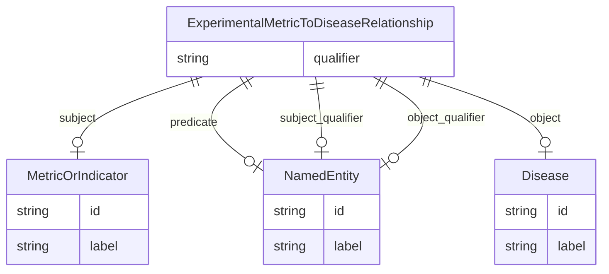

# Class: ExperimentalMetricToDiseaseRelationship


_A triple where the subject is an experimental metric, the object is a disease or condition, and the predicate describes the relationship between the metric and the disease, usually USED_TO_MODEL._


URI: [alzrd:ExperimentalMetricToDiseaseRelationship](http://w3id.org/ontogpt/alzrd_sectionExperimentalMetricToDiseaseRelationship)





## Inheritance
* [CompoundExpression](CompoundExpression.md)
    * [Triple](Triple.md)
        * **ExperimentalMetricToDiseaseRelationship**


## Slots

| Name | Cardinality and Range | Description | Inheritance |
| ---  | --- | --- | --- |
| [subject](subject.md) | 0..1 <br/> [MetricOrIndicator](MetricOrIndicator.md) | The name of an experimental metric, sign, symptom, or outcome used to measure... | [Triple](Triple.md) |
| [predicate](predicate.md) | 0..1 <br/> [NamedEntity](NamedEntity.md) | The relationship type, generally USED_TO_MODEL to indicate a metric is used t... | [Triple](Triple.md) |
| [object](object.md) | 0..1 <br/> [Disease](Disease.md) | The name of a disease or condition | [Triple](Triple.md) |
| [qualifier](qualifier.md) | 0..1 <br/> [String](String.md) | A qualifier for the statements, e | [Triple](Triple.md) |
| [subject_qualifier](subject_qualifier.md) | 0..1 <br/> [NamedEntity](NamedEntity.md) | An optional qualifier or modifier for the experimental metric | [Triple](Triple.md) |
| [object_qualifier](object_qualifier.md) | 0..1 <br/> [NamedEntity](NamedEntity.md) | An optional qualifier or modifier for the disease or condition | [Triple](Triple.md) |


## Usages

| used by | used in | type | used |
| ---  | --- | --- | --- |
| [DocumentSection](DocumentSection.md) | [experimental_metric_to_disease_relationships](experimental_metric_to_disease_relationships.md) | range | [ExperimentalMetricToDiseaseRelationship](ExperimentalMetricToDiseaseRelationship.md) |


## Identifier and Mapping Information


### Schema Source


* from schema: http://w3id.org/ontogpt/alzrd_section


## Mappings

| Mapping Type | Mapped Value |
| ---  | ---  |
| self | alzrd:ExperimentalMetricToDiseaseRelationship |
| native | alzrd:ExperimentalMetricToDiseaseRelationship |


## LinkML Source

<!-- TODO: investigate https://stackoverflow.com/questions/37606292/how-to-create-tabbed-code-blocks-in-mkdocs-or-sphinx -->

### Direct

<details>
```yaml
name: ExperimentalMetricToDiseaseRelationship
description: A triple where the subject is an experimental metric, the object is a
  disease or condition, and the predicate describes the relationship between the metric
  and the disease, usually USED_TO_MODEL.
from_schema: http://w3id.org/ontogpt/alzrd_section
is_a: Triple
slot_usage:
  subject:
    name: subject
    description: The name of an experimental metric, sign, symptom, or outcome used
      to measure the effects of treatments on symptoms or diagnostics, or of the progression
      of Alzheimer's disease and related dementias. In experimental animal models
      these are analogues of cognitive impairment or indicators of disease progression
      modeling those observed in humans. Examples are Amyloid beta (Aβ) levels, Morris
      water maze test, tau phosphorylation, neurofibrillary tangles, and cognitive
      decline.
    domain_of:
    - Triple
    range: MetricOrIndicator
  object:
    name: object
    description: The name of a disease or condition. Examples are Alzheimer's disease,
      Parkinson's disease, Huntington's disease.
    domain_of:
    - Triple
    range: Disease
  predicate:
    name: predicate
    description: The relationship type, generally USED_TO_MODEL to indicate a metric
      is used to model a disease or condition.
    domain_of:
    - Triple
    range: NamedEntity
  subject_qualifier:
    name: subject_qualifier
    description: An optional qualifier or modifier for the experimental metric. This
      may include the method of measurement or the specific assay used.
    domain_of:
    - Triple
    range: NamedEntity
  object_qualifier:
    name: object_qualifier
    description: An optional qualifier or modifier for the disease or condition. This
      may include the stage or subtype of the disease.
    domain_of:
    - Triple
    range: NamedEntity

```
</details>

### Induced

<details>
```yaml
name: ExperimentalMetricToDiseaseRelationship
description: A triple where the subject is an experimental metric, the object is a
  disease or condition, and the predicate describes the relationship between the metric
  and the disease, usually USED_TO_MODEL.
from_schema: http://w3id.org/ontogpt/alzrd_section
is_a: Triple
slot_usage:
  subject:
    name: subject
    description: The name of an experimental metric, sign, symptom, or outcome used
      to measure the effects of treatments on symptoms or diagnostics, or of the progression
      of Alzheimer's disease and related dementias. In experimental animal models
      these are analogues of cognitive impairment or indicators of disease progression
      modeling those observed in humans. Examples are Amyloid beta (Aβ) levels, Morris
      water maze test, tau phosphorylation, neurofibrillary tangles, and cognitive
      decline.
    domain_of:
    - Triple
    range: MetricOrIndicator
  object:
    name: object
    description: The name of a disease or condition. Examples are Alzheimer's disease,
      Parkinson's disease, Huntington's disease.
    domain_of:
    - Triple
    range: Disease
  predicate:
    name: predicate
    description: The relationship type, generally USED_TO_MODEL to indicate a metric
      is used to model a disease or condition.
    domain_of:
    - Triple
    range: NamedEntity
  subject_qualifier:
    name: subject_qualifier
    description: An optional qualifier or modifier for the experimental metric. This
      may include the method of measurement or the specific assay used.
    domain_of:
    - Triple
    range: NamedEntity
  object_qualifier:
    name: object_qualifier
    description: An optional qualifier or modifier for the disease or condition. This
      may include the stage or subtype of the disease.
    domain_of:
    - Triple
    range: NamedEntity
attributes:
  subject:
    name: subject
    description: The name of an experimental metric, sign, symptom, or outcome used
      to measure the effects of treatments on symptoms or diagnostics, or of the progression
      of Alzheimer's disease and related dementias. In experimental animal models
      these are analogues of cognitive impairment or indicators of disease progression
      modeling those observed in humans. Examples are Amyloid beta (Aβ) levels, Morris
      water maze test, tau phosphorylation, neurofibrillary tangles, and cognitive
      decline.
    from_schema: http://w3id.org/ontogpt/alzrd_section
    rank: 1000
    alias: subject
    owner: ExperimentalMetricToDiseaseRelationship
    domain_of:
    - Triple
    range: MetricOrIndicator
  predicate:
    name: predicate
    description: The relationship type, generally USED_TO_MODEL to indicate a metric
      is used to model a disease or condition.
    from_schema: http://w3id.org/ontogpt/alzrd_section
    rank: 1000
    alias: predicate
    owner: ExperimentalMetricToDiseaseRelationship
    domain_of:
    - Triple
    range: NamedEntity
  object:
    name: object
    description: The name of a disease or condition. Examples are Alzheimer's disease,
      Parkinson's disease, Huntington's disease.
    from_schema: http://w3id.org/ontogpt/alzrd_section
    rank: 1000
    alias: object
    owner: ExperimentalMetricToDiseaseRelationship
    domain_of:
    - Triple
    range: Disease
  qualifier:
    name: qualifier
    description: A qualifier for the statements, e.g. "NOT" for negation
    from_schema: http://w3id.org/ontogpt/alzrd_section
    rank: 1000
    alias: qualifier
    owner: ExperimentalMetricToDiseaseRelationship
    domain_of:
    - Triple
    range: string
  subject_qualifier:
    name: subject_qualifier
    description: An optional qualifier or modifier for the experimental metric. This
      may include the method of measurement or the specific assay used.
    from_schema: http://w3id.org/ontogpt/alzrd_section
    rank: 1000
    alias: subject_qualifier
    owner: ExperimentalMetricToDiseaseRelationship
    domain_of:
    - Triple
    range: NamedEntity
  object_qualifier:
    name: object_qualifier
    description: An optional qualifier or modifier for the disease or condition. This
      may include the stage or subtype of the disease.
    from_schema: http://w3id.org/ontogpt/alzrd_section
    rank: 1000
    alias: object_qualifier
    owner: ExperimentalMetricToDiseaseRelationship
    domain_of:
    - Triple
    range: NamedEntity

```
</details>