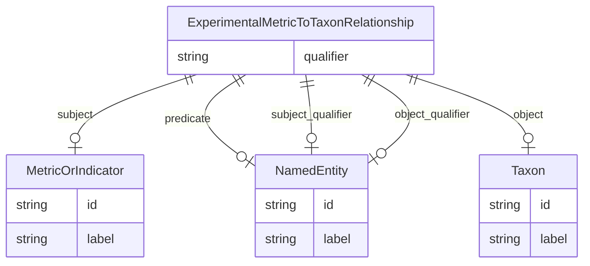

# Class: ExperimentalMetricToTaxonRelationship


_A triple where the subject is an experimental metric, the object is an taxon, metric, and the predicate describes the relationship between the metric and the taxon, usually MEASURED_IN._


URI: [alzrd:ExperimentalMetricToTaxonRelationship](http://w3id.org/ontogpt/alzrd_sectionExperimentalMetricToTaxonRelationship)





## Inheritance
* [CompoundExpression](CompoundExpression.md)
    * [Triple](Triple.md)
        * **ExperimentalMetricToTaxonRelationship**


## Slots

| Name | Cardinality and Range | Description | Inheritance |
| ---  | --- | --- | --- |
| [subject](subject.md) | 0..1 <br/> [MetricOrIndicator](MetricOrIndicator.md) | The name of an experimental metric, sign, symptom, or outcome used to measure... | [Triple](Triple.md) |
| [predicate](predicate.md) | 0..1 <br/> [NamedEntity](NamedEntity.md) | The relationship type, generally MEASURED_IN to indicate a metric is measured... | [Triple](Triple.md) |
| [object](object.md) | 0..1 <br/> [Taxon](Taxon.md) | The taxon or species of the model organism in which the experimental metric i... | [Triple](Triple.md) |
| [qualifier](qualifier.md) | 0..1 <br/> [String](String.md) | A qualifier for the statements, e | [Triple](Triple.md) |
| [subject_qualifier](subject_qualifier.md) | 0..1 <br/> [NamedEntity](NamedEntity.md) | An optional qualifier or modifier for the taxon | [Triple](Triple.md) |
| [object_qualifier](object_qualifier.md) | 0..1 <br/> [NamedEntity](NamedEntity.md) | An optional qualifier or modifier for the experimental metric | [Triple](Triple.md) |


## Usages

| used by | used in | type | used |
| ---  | --- | --- | --- |
| [DocumentSection](DocumentSection.md) | [experimental_metrics_to_taxon_relationships](experimental_metrics_to_taxon_relationships.md) | range | [ExperimentalMetricToTaxonRelationship](ExperimentalMetricToTaxonRelationship.md) |


## Identifier and Mapping Information


### Schema Source


* from schema: http://w3id.org/ontogpt/alzrd_section


## Mappings

| Mapping Type | Mapped Value |
| ---  | ---  |
| self | alzrd:ExperimentalMetricToTaxonRelationship |
| native | alzrd:ExperimentalMetricToTaxonRelationship |


## LinkML Source

<!-- TODO: investigate https://stackoverflow.com/questions/37606292/how-to-create-tabbed-code-blocks-in-mkdocs-or-sphinx -->

### Direct

<details>
```yaml
name: ExperimentalMetricToTaxonRelationship
description: A triple where the subject is an experimental metric, the object is an
  taxon, metric, and the predicate describes the relationship between the metric and
  the taxon, usually MEASURED_IN.
from_schema: http://w3id.org/ontogpt/alzrd_section
is_a: Triple
slot_usage:
  subject:
    name: subject
    description: The name of an experimental metric, sign, symptom, or outcome used
      to measure the effects of treatments on symptoms or diagnostics, or of the progression
      of Alzheimer's disease and related dementias. In experimental animal models
      these are analogues of cognitive impairment or indicators of disease progression
      modeling those observed in humans. Examples are Amyloid beta (Aβ) levels, Morris
      water maze test, tau phosphorylation, neurofibrillary tangles, and cognitive
      decline.
    domain_of:
    - Triple
    range: MetricOrIndicator
  object:
    name: object
    description: The taxon or species of the model organism in which the experimental
      metric is measured. For example, Mus musculus, Rattus norvegicus.
    domain_of:
    - Triple
    range: Taxon
  predicate:
    name: predicate
    description: The relationship type, generally MEASURED_IN to indicate a metric
      is measured in a taxon.
    domain_of:
    - Triple
    range: NamedEntity
  subject_qualifier:
    name: subject_qualifier
    description: An optional qualifier or modifier for the taxon. This may include
      a strain or genetic background of the model organism.
    domain_of:
    - Triple
    range: NamedEntity
  object_qualifier:
    name: object_qualifier
    description: An optional qualifier or modifier for the experimental metric. This
      may include the method of measurement or the specific assay used.
    domain_of:
    - Triple
    range: NamedEntity

```
</details>

### Induced

<details>
```yaml
name: ExperimentalMetricToTaxonRelationship
description: A triple where the subject is an experimental metric, the object is an
  taxon, metric, and the predicate describes the relationship between the metric and
  the taxon, usually MEASURED_IN.
from_schema: http://w3id.org/ontogpt/alzrd_section
is_a: Triple
slot_usage:
  subject:
    name: subject
    description: The name of an experimental metric, sign, symptom, or outcome used
      to measure the effects of treatments on symptoms or diagnostics, or of the progression
      of Alzheimer's disease and related dementias. In experimental animal models
      these are analogues of cognitive impairment or indicators of disease progression
      modeling those observed in humans. Examples are Amyloid beta (Aβ) levels, Morris
      water maze test, tau phosphorylation, neurofibrillary tangles, and cognitive
      decline.
    domain_of:
    - Triple
    range: MetricOrIndicator
  object:
    name: object
    description: The taxon or species of the model organism in which the experimental
      metric is measured. For example, Mus musculus, Rattus norvegicus.
    domain_of:
    - Triple
    range: Taxon
  predicate:
    name: predicate
    description: The relationship type, generally MEASURED_IN to indicate a metric
      is measured in a taxon.
    domain_of:
    - Triple
    range: NamedEntity
  subject_qualifier:
    name: subject_qualifier
    description: An optional qualifier or modifier for the taxon. This may include
      a strain or genetic background of the model organism.
    domain_of:
    - Triple
    range: NamedEntity
  object_qualifier:
    name: object_qualifier
    description: An optional qualifier or modifier for the experimental metric. This
      may include the method of measurement or the specific assay used.
    domain_of:
    - Triple
    range: NamedEntity
attributes:
  subject:
    name: subject
    description: The name of an experimental metric, sign, symptom, or outcome used
      to measure the effects of treatments on symptoms or diagnostics, or of the progression
      of Alzheimer's disease and related dementias. In experimental animal models
      these are analogues of cognitive impairment or indicators of disease progression
      modeling those observed in humans. Examples are Amyloid beta (Aβ) levels, Morris
      water maze test, tau phosphorylation, neurofibrillary tangles, and cognitive
      decline.
    from_schema: http://w3id.org/ontogpt/alzrd_section
    rank: 1000
    alias: subject
    owner: ExperimentalMetricToTaxonRelationship
    domain_of:
    - Triple
    range: MetricOrIndicator
  predicate:
    name: predicate
    description: The relationship type, generally MEASURED_IN to indicate a metric
      is measured in a taxon.
    from_schema: http://w3id.org/ontogpt/alzrd_section
    rank: 1000
    alias: predicate
    owner: ExperimentalMetricToTaxonRelationship
    domain_of:
    - Triple
    range: NamedEntity
  object:
    name: object
    description: The taxon or species of the model organism in which the experimental
      metric is measured. For example, Mus musculus, Rattus norvegicus.
    from_schema: http://w3id.org/ontogpt/alzrd_section
    rank: 1000
    alias: object
    owner: ExperimentalMetricToTaxonRelationship
    domain_of:
    - Triple
    range: Taxon
  qualifier:
    name: qualifier
    description: A qualifier for the statements, e.g. "NOT" for negation
    from_schema: http://w3id.org/ontogpt/alzrd_section
    rank: 1000
    alias: qualifier
    owner: ExperimentalMetricToTaxonRelationship
    domain_of:
    - Triple
    range: string
  subject_qualifier:
    name: subject_qualifier
    description: An optional qualifier or modifier for the taxon. This may include
      a strain or genetic background of the model organism.
    from_schema: http://w3id.org/ontogpt/alzrd_section
    rank: 1000
    alias: subject_qualifier
    owner: ExperimentalMetricToTaxonRelationship
    domain_of:
    - Triple
    range: NamedEntity
  object_qualifier:
    name: object_qualifier
    description: An optional qualifier or modifier for the experimental metric. This
      may include the method of measurement or the specific assay used.
    from_schema: http://w3id.org/ontogpt/alzrd_section
    rank: 1000
    alias: object_qualifier
    owner: ExperimentalMetricToTaxonRelationship
    domain_of:
    - Triple
    range: NamedEntity

```
</details>