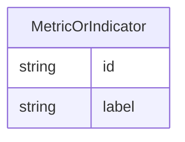

# Class: MetricOrIndicator


URI: [alzrd:MetricOrIndicator](http://w3id.org/ontogpt/alzrd_sectionMetricOrIndicator)





## Inheritance
* [NamedEntity](NamedEntity.md)
    * **MetricOrIndicator**


## Slots

| Name | Cardinality and Range | Description | Inheritance |
| ---  | --- | --- | --- |
| [id](id.md) | 1 <br/> [String](String.md) | A unique identifier for the named entity | [NamedEntity](NamedEntity.md) |
| [label](label.md) | 0..1 <br/> [String](String.md) | The label (name) of the named thing | [NamedEntity](NamedEntity.md) |


## Usages

| used by | used in | type | used |
| ---  | --- | --- | --- |
| [DocumentSection](DocumentSection.md) | [experimental_metrics_and_indicators](experimental_metrics_and_indicators.md) | range | [MetricOrIndicator](MetricOrIndicator.md) |
| [ExperimentalMetricToTaxonRelationship](ExperimentalMetricToTaxonRelationship.md) | [subject](subject.md) | range | [MetricOrIndicator](MetricOrIndicator.md) |
| [ExperimentalMetricToDiseaseRelationship](ExperimentalMetricToDiseaseRelationship.md) | [subject](subject.md) | range | [MetricOrIndicator](MetricOrIndicator.md) |


## Identifier and Mapping Information


### Valid ID Prefixes

Instances of this class *should* have identifiers with one of the following prefixes:

* MAXO

* MESH

* HP

* MP

* NBO

* SNOMEDCT


### Annotations

| property | value |
| --- | --- |
| annotators | sqlite:obo:hp, sqlite:obo:mondo, sqlite:obo:mp, sqlite:obo:nbo, sqlite:obo:maxo, sqlite:obo:mesh, bioportal:SNOMEDCT, sqlite:obo:ncit || prompt | The name of an experimental metric, sign, symptom, or outcome used to measure the effects of treatments on symptoms or diagnostics, or of the progression of Alzheimer's disease and related dementias. In experimental animal models these are analogues of cognitive impairment or indicators of disease progression modeling those observed in humans. Examples are Amyloid beta (Aβ) levels, Morris water maze test, tau phosphorylation, neurofibrillary tangles, and cognitive decline. |


### Schema Source


* from schema: http://w3id.org/ontogpt/alzrd_section


## Mappings

| Mapping Type | Mapped Value |
| ---  | ---  |
| self | alzrd:MetricOrIndicator |
| native | alzrd:MetricOrIndicator |


## LinkML Source

<!-- TODO: investigate https://stackoverflow.com/questions/37606292/how-to-create-tabbed-code-blocks-in-mkdocs-or-sphinx -->

### Direct

<details>
```yaml
name: MetricOrIndicator
id_prefixes:
- MAXO
- MESH
- HP
- MP
- NBO
- SNOMEDCT
annotations:
  annotators:
    tag: annotators
    value: sqlite:obo:hp, sqlite:obo:mondo, sqlite:obo:mp, sqlite:obo:nbo, sqlite:obo:maxo,
      sqlite:obo:mesh, bioportal:SNOMEDCT, sqlite:obo:ncit
  prompt:
    tag: prompt
    value: The name of an experimental metric, sign, symptom, or outcome used to measure
      the effects of treatments on symptoms or diagnostics, or of the progression
      of Alzheimer's disease and related dementias. In experimental animal models
      these are analogues of cognitive impairment or indicators of disease progression
      modeling those observed in humans. Examples are Amyloid beta (Aβ) levels, Morris
      water maze test, tau phosphorylation, neurofibrillary tangles, and cognitive
      decline.
from_schema: http://w3id.org/ontogpt/alzrd_section
is_a: NamedEntity

```
</details>

### Induced

<details>
```yaml
name: MetricOrIndicator
id_prefixes:
- MAXO
- MESH
- HP
- MP
- NBO
- SNOMEDCT
annotations:
  annotators:
    tag: annotators
    value: sqlite:obo:hp, sqlite:obo:mondo, sqlite:obo:mp, sqlite:obo:nbo, sqlite:obo:maxo,
      sqlite:obo:mesh, bioportal:SNOMEDCT, sqlite:obo:ncit
  prompt:
    tag: prompt
    value: The name of an experimental metric, sign, symptom, or outcome used to measure
      the effects of treatments on symptoms or diagnostics, or of the progression
      of Alzheimer's disease and related dementias. In experimental animal models
      these are analogues of cognitive impairment or indicators of disease progression
      modeling those observed in humans. Examples are Amyloid beta (Aβ) levels, Morris
      water maze test, tau phosphorylation, neurofibrillary tangles, and cognitive
      decline.
from_schema: http://w3id.org/ontogpt/alzrd_section
is_a: NamedEntity
attributes:
  id:
    name: id
    annotations:
      prompt.skip:
        tag: prompt.skip
        value: 'true'
    description: A unique identifier for the named entity
    comments:
    - this is populated during the grounding and normalization step
    from_schema: http://w3id.org/ontogpt/alzrd_section
    rank: 1000
    identifier: true
    alias: id
    owner: MetricOrIndicator
    domain_of:
    - NamedEntity
    - Publication
    range: string
    required: true
  label:
    name: label
    annotations:
      owl:
        tag: owl
        value: AnnotationProperty, AnnotationAssertion
    description: The label (name) of the named thing
    from_schema: http://w3id.org/ontogpt/alzrd_section
    aliases:
    - name
    rank: 1000
    slot_uri: rdfs:label
    alias: label
    owner: MetricOrIndicator
    domain_of:
    - NamedEntity
    range: string

```
</details>