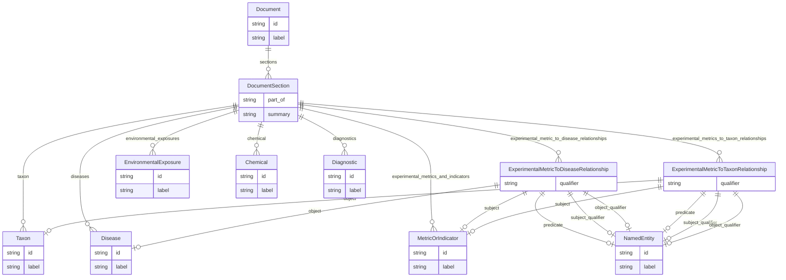

# Template for extracting Alzheimer's Disease Phenotypes by section

Template for extracting phenotypes of Alzheimer's disease and related dementias along with experimental metrics and model organisms. Assumes a large input text, on the order of a full scientific article or review. Focus is on extracting the methods and metrics used with different model organisms. This template will attempt to break up the input text by section before parsing, as opposed to parsing the entire text at once.

URI: http://w3id.org/ontogpt/alzrd_section

Name: alzrd_section

## Schema Diagram

## Classes

| Class | Description |
| --- | --- |
| [AnnotatorResult](AnnotatorResult.md) | None |
| [Any](Any.md) | None |
| [CompoundExpression](CompoundExpression.md) | None |
| &nbsp;&nbsp;&nbsp;&nbsp;&nbsp;&nbsp;&nbsp;&nbsp;[DocumentSection](DocumentSection.md) | None |
| &nbsp;&nbsp;&nbsp;&nbsp;&nbsp;&nbsp;&nbsp;&nbsp;[Triple](Triple.md) | Abstract parent for Relation Extraction tasks |
| &nbsp;&nbsp;&nbsp;&nbsp;&nbsp;&nbsp;&nbsp;&nbsp;&nbsp;&nbsp;&nbsp;&nbsp;&nbsp;&nbsp;&nbsp;&nbsp;[ExperimentalMetricToDiseaseRelationship](ExperimentalMetricToDiseaseRelationship.md) | A triple where the subject is an experimental metric, the object is a disease or condition, and the predicate describes the relationship between the metric and the disease, usually USED_TO_MODEL. |
| &nbsp;&nbsp;&nbsp;&nbsp;&nbsp;&nbsp;&nbsp;&nbsp;&nbsp;&nbsp;&nbsp;&nbsp;&nbsp;&nbsp;&nbsp;&nbsp;[ExperimentalMetricToTaxonRelationship](ExperimentalMetricToTaxonRelationship.md) | A triple where the subject is an experimental metric, the object is an taxon, metric, and the predicate describes the relationship between the metric and the taxon, usually MEASURED_IN. |
| [ExtractionResult](ExtractionResult.md) | A result of extracting knowledge on text |
| [NamedEntity](NamedEntity.md) | None |
| &nbsp;&nbsp;&nbsp;&nbsp;&nbsp;&nbsp;&nbsp;&nbsp;[Chemical](Chemical.md) | None |
| &nbsp;&nbsp;&nbsp;&nbsp;&nbsp;&nbsp;&nbsp;&nbsp;[Diagnostic](Diagnostic.md) | None |
| &nbsp;&nbsp;&nbsp;&nbsp;&nbsp;&nbsp;&nbsp;&nbsp;[Disease](Disease.md) | None |
| &nbsp;&nbsp;&nbsp;&nbsp;&nbsp;&nbsp;&nbsp;&nbsp;[Document](Document.md) | None |
| &nbsp;&nbsp;&nbsp;&nbsp;&nbsp;&nbsp;&nbsp;&nbsp;[EnvironmentalExposure](EnvironmentalExposure.md) | None |
| &nbsp;&nbsp;&nbsp;&nbsp;&nbsp;&nbsp;&nbsp;&nbsp;[MetricOrIndicator](MetricOrIndicator.md) | None |
| &nbsp;&nbsp;&nbsp;&nbsp;&nbsp;&nbsp;&nbsp;&nbsp;[RelationshipType](RelationshipType.md) | None |
| &nbsp;&nbsp;&nbsp;&nbsp;&nbsp;&nbsp;&nbsp;&nbsp;[Taxon](Taxon.md) | None |
| [Publication](Publication.md) | None |
| [TextWithEntity](TextWithEntity.md) | A text containing one or more instances of a single type of entity. |
| [TextWithTriples](TextWithTriples.md) | A text containing one or more relations of the Triple type. |

## Slots

| Slot | Description |
| --- | --- |
| [abstract](abstract.md) | The abstract of the publication |
| [chemical](chemical.md) | A semicolon-separated list of chemicals, drugs, or other substances mentioned... |
| [combined_text](combined_text.md) |  |
| [diagnostics](diagnostics.md) | A semicolon-separated list of diagnostic procedures mentioned in the section |
| [diseases](diseases.md) | A semicolon-separated list of diseases or conditions mentioned in the section |
| [entities](entities.md) |  |
| [environmental_exposures](environmental_exposures.md) | A semicolon-separated list of environmental exposures mentioned in the sectio... |
| [experimental_metric_to_disease_relationships](experimental_metric_to_disease_relationships.md) | Semicolon-separated list of relationships between a specific experimental met... |
| [experimental_metrics_and_indicators](experimental_metrics_and_indicators.md) | A semicolon-separated list of of a experimental metrics, signs, symptoms, or ... |
| [experimental_metrics_to_taxon_relationships](experimental_metrics_to_taxon_relationships.md) | Semicolon-separated list of relationships between a specific experimental met... |
| [extracted_object](extracted_object.md) | The complex objects extracted from the text |
| [full_text](full_text.md) | The full text of the publication |
| [id](id.md) | A unique identifier for the named entity |
| [input_id](input_id.md) |  |
| [input_text](input_text.md) |  |
| [input_title](input_title.md) |  |
| [label](label.md) | The label (name) of the named thing |
| [named_entities](named_entities.md) | Named entities extracted from the text |
| [object](object.md) |  |
| [object_id](object_id.md) |  |
| [object_qualifier](object_qualifier.md) | An optional qualifier or modifier for the object of the statement, e |
| [object_text](object_text.md) |  |
| [part_of](part_of.md) | The major document division that this section is a part of |
| [predicate](predicate.md) |  |
| [prompt](prompt.md) |  |
| [publication](publication.md) |  |
| [qualifier](qualifier.md) | A qualifier for the statements, e |
| [raw_completion_output](raw_completion_output.md) |  |
| [sections](sections.md) | A semicolon-separated list of full sections of the document, including the fu... |
| [subject](subject.md) |  |
| [subject_qualifier](subject_qualifier.md) | An optional qualifier or modifier for the subject of the statement, e |
| [subject_text](subject_text.md) |  |
| [summary](summary.md) | A brief summary of the section, suitable for display in a table of contents o... |
| [taxon](taxon.md) | A semicolon-separated list of taxa or species of organisms mentioned in the s... |
| [title](title.md) | The title of the publication |
| [triples](triples.md) |  |

## Enumerations

| Enumeration | Description |
| --- | --- |
| [NullDataOptions](NullDataOptions.md) |  |

## Types

| Type | Description |
| --- | --- |
| [Boolean](Boolean.md) | A binary (true or false) value |
| [Curie](Curie.md) | a compact URI |
| [Date](Date.md) | a date (year, month and day) in an idealized calendar |
| [DateOrDatetime](DateOrDatetime.md) | Either a date or a datetime |
| [Datetime](Datetime.md) | The combination of a date and time |
| [Decimal](Decimal.md) | A real number with arbitrary precision that conforms to the xsd:decimal speci... |
| [Double](Double.md) | A real number that conforms to the xsd:double specification |
| [Float](Float.md) | A real number that conforms to the xsd:float specification |
| [Integer](Integer.md) | An integer |
| [Jsonpath](Jsonpath.md) | A string encoding a JSON Path |
| [Jsonpointer](Jsonpointer.md) | A string encoding a JSON Pointer |
| [Ncname](Ncname.md) | Prefix part of CURIE |
| [Nodeidentifier](Nodeidentifier.md) | A URI, CURIE or BNODE that represents a node in a model |
| [Objectidentifier](Objectidentifier.md) | A URI or CURIE that represents an object in the model |
| [Sparqlpath](Sparqlpath.md) | A string encoding a SPARQL Property Path |
| [String](String.md) | A character string |
| [Time](Time.md) | A time object represents a (local) time of day, independent of any particular... |
| [Uri](Uri.md) | a complete URI |
| [Uriorcurie](Uriorcurie.md) | a URI or a CURIE |

## Subsets

| Subset | Description |
| --- | --- |
