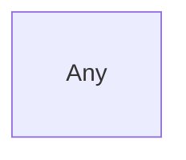

# Class: Any


URI: [linkml:Any](https://w3id.org/linkml/Any)





<!-- no inheritance hierarchy -->


## Slots

| Name | Cardinality and Range | Description | Inheritance |
| ---  | --- | --- | --- |


## Usages

| used by | used in | type | used |
| ---  | --- | --- | --- |
| [ExtractionResult](ExtractionResult.md) | [extracted_object](extracted_object.md) | range | [Any](Any.md) |
| [ExtractionResult](ExtractionResult.md) | [named_entities](named_entities.md) | range | [Any](Any.md) |


## Identifier and Mapping Information


### Schema Source


* from schema: https://w3id.org/ontogpt/biological_process


## Mappings

| Mapping Type | Mapped Value |
| ---  | ---  |
| self | linkml:Any |
| native | bp:Any |


## LinkML Source

<!-- TODO: investigate https://stackoverflow.com/questions/37606292/how-to-create-tabbed-code-blocks-in-mkdocs-or-sphinx -->

### Direct

<details>
```yaml
name: Any
from_schema: https://w3id.org/ontogpt/biological_process
class_uri: linkml:Any

```
</details>

### Induced

<details>
```yaml
name: Any
from_schema: https://w3id.org/ontogpt/biological_process
class_uri: linkml:Any

```
</details>