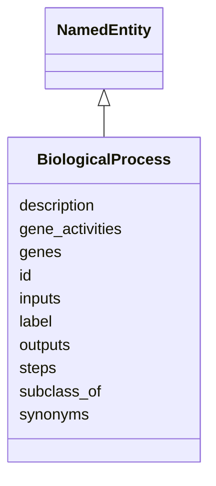

# Class: BiologicalProcess


URI: [bp:BiologicalProcess](http://w3id.org/ontogpt/biological-process-templateBiologicalProcess)





## Inheritance
* [NamedEntity](NamedEntity.md)
    * **BiologicalProcess**


## Slots

| Name | Cardinality and Range | Description | Inheritance |
| ---  | --- | --- | --- |
| [label](label.md) | 0..1 <br/> NONE |  | direct |
| [description](description.md) | 0..1 <br/> NONE | a textual description of the biological process | direct |
| [synonyms](synonyms.md) | 0..* <br/> NONE | alternative names of the biological process | direct |
| [subclass_of](subclass_of.md) | 0..1 <br/> [BiologicalProcess](BiologicalProcess.md) | the category to which this biological process belongs | direct |
| [inputs](inputs.md) | 0..* <br/> [ChemicalEntity](ChemicalEntity.md) | the inputs of the biological process | direct |
| [outputs](outputs.md) | 0..* <br/> [ChemicalEntity](ChemicalEntity.md) | the outputs of the biological process | direct |
| [steps](steps.md) | 0..* <br/> [MolecularActivity](MolecularActivity.md) | the steps involved in this biological process | direct |
| [genes](genes.md) | 0..* <br/> [Gene](Gene.md) |  | direct |
| [gene_activities](gene_activities.md) | 0..* <br/> [GeneMolecularActivityRelationship](GeneMolecularActivityRelationship.md) | semicolon-separated list of gene to molecular activity relationships | direct |
| [id](id.md) | 0..1 <br/> NONE |  | [NamedEntity](NamedEntity.md) |


## Usages

| used by | used in | type | used |
| ---  | --- | --- | --- |
| [BiologicalProcess](BiologicalProcess.md) | [subclass_of](subclass_of.md) | range | [BiologicalProcess](BiologicalProcess.md) |


## Identifier and Mapping Information


### Schema Source


* from schema: https://w3id.org/ontogpt/biological_process


## Mappings

| Mapping Type | Mapped Value |
| ---  | ---  |
| self | bp:BiologicalProcess |
| native | bp:BiologicalProcess |


## LinkML Source

<!-- TODO: investigate https://stackoverflow.com/questions/37606292/how-to-create-tabbed-code-blocks-in-mkdocs-or-sphinx -->

### Direct

<details>
```yaml
name: BiologicalProcess
from_schema: https://w3id.org/ontogpt/biological_process
rank: 1000
is_a: NamedEntity
attributes:
  label:
    name: label
    description: the name of the biological process
    from_schema: https://w3id.org/ontogpt/biological_process
    rank: 1000
  description:
    name: description
    description: a textual description of the biological process
    from_schema: https://w3id.org/ontogpt/biological_process
    rank: 1000
  synonyms:
    name: synonyms
    description: alternative names of the biological process
    from_schema: https://w3id.org/ontogpt/biological_process
    rank: 1000
    multivalued: true
  subclass_of:
    name: subclass_of
    description: the category to which this biological process belongs
    from_schema: https://w3id.org/ontogpt/biological_process
    rank: 1000
    range: BiologicalProcess
  inputs:
    name: inputs
    description: the inputs of the biological process
    from_schema: https://w3id.org/ontogpt/biological_process
    rank: 1000
    multivalued: true
    range: ChemicalEntity
  outputs:
    name: outputs
    description: the outputs of the biological process
    from_schema: https://w3id.org/ontogpt/biological_process
    rank: 1000
    multivalued: true
    range: ChemicalEntity
  steps:
    name: steps
    description: the steps involved in this biological process
    from_schema: https://w3id.org/ontogpt/biological_process
    rank: 1000
    multivalued: true
    range: MolecularActivity
  genes:
    name: genes
    from_schema: https://w3id.org/ontogpt/biological_process
    rank: 1000
    multivalued: true
    range: Gene
  gene_activities:
    name: gene_activities
    description: semicolon-separated list of gene to molecular activity relationships
    from_schema: https://w3id.org/ontogpt/biological_process
    rank: 1000
    multivalued: true
    range: GeneMolecularActivityRelationship

```
</details>

### Induced

<details>
```yaml
name: BiologicalProcess
from_schema: https://w3id.org/ontogpt/biological_process
rank: 1000
is_a: NamedEntity
attributes:
  label:
    name: label
    description: the name of the biological process
    from_schema: https://w3id.org/ontogpt/biological_process
    rank: 1000
    alias: label
    owner: BiologicalProcess
    domain_of:
    - BiologicalProcess
    - NamedEntity
    range: string
  description:
    name: description
    description: a textual description of the biological process
    from_schema: https://w3id.org/ontogpt/biological_process
    rank: 1000
    alias: description
    owner: BiologicalProcess
    domain_of:
    - BiologicalProcess
    range: string
  synonyms:
    name: synonyms
    description: alternative names of the biological process
    from_schema: https://w3id.org/ontogpt/biological_process
    rank: 1000
    multivalued: true
    alias: synonyms
    owner: BiologicalProcess
    domain_of:
    - BiologicalProcess
    range: string
  subclass_of:
    name: subclass_of
    description: the category to which this biological process belongs
    from_schema: https://w3id.org/ontogpt/biological_process
    rank: 1000
    alias: subclass_of
    owner: BiologicalProcess
    domain_of:
    - BiologicalProcess
    range: BiologicalProcess
  inputs:
    name: inputs
    description: the inputs of the biological process
    from_schema: https://w3id.org/ontogpt/biological_process
    rank: 1000
    multivalued: true
    alias: inputs
    owner: BiologicalProcess
    domain_of:
    - BiologicalProcess
    range: ChemicalEntity
  outputs:
    name: outputs
    description: the outputs of the biological process
    from_schema: https://w3id.org/ontogpt/biological_process
    rank: 1000
    multivalued: true
    alias: outputs
    owner: BiologicalProcess
    domain_of:
    - BiologicalProcess
    range: ChemicalEntity
  steps:
    name: steps
    description: the steps involved in this biological process
    from_schema: https://w3id.org/ontogpt/biological_process
    rank: 1000
    multivalued: true
    alias: steps
    owner: BiologicalProcess
    domain_of:
    - BiologicalProcess
    range: MolecularActivity
  genes:
    name: genes
    from_schema: https://w3id.org/ontogpt/biological_process
    rank: 1000
    multivalued: true
    alias: genes
    owner: BiologicalProcess
    domain_of:
    - BiologicalProcess
    range: Gene
  gene_activities:
    name: gene_activities
    description: semicolon-separated list of gene to molecular activity relationships
    from_schema: https://w3id.org/ontogpt/biological_process
    rank: 1000
    multivalued: true
    alias: gene_activities
    owner: BiologicalProcess
    domain_of:
    - BiologicalProcess
    range: GeneMolecularActivityRelationship
  id:
    name: id
    annotations:
      prompt.skip:
        tag: prompt.skip
        value: 'true'
    description: A unique identifier for the named entity
    comments:
    - this is populated during the grounding and normalization step
    from_schema: http://w3id.org/ontogpt/core
    rank: 1000
    identifier: true
    alias: id
    owner: BiologicalProcess
    domain_of:
    - NamedEntity
    - Publication
    range: string

```
</details>