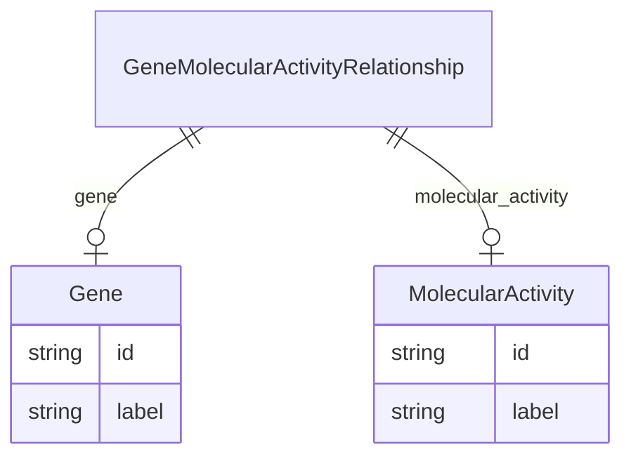

# Class: GeneMolecularActivityRelationship


URI: [bp:GeneMolecularActivityRelationship](http://w3id.org/ontogpt/biological-process-templateGeneMolecularActivityRelationship)





<!-- no inheritance hierarchy -->


## Slots

| Name | Cardinality and Range | Description | Inheritance |
| ---  | --- | --- | --- |
| [gene](gene.md) | 0..1 <br/> [Gene](Gene.md) |  | direct |
| [molecular_activity](molecular_activity.md) | 0..1 <br/> [MolecularActivity](MolecularActivity.md) |  | direct |


## Usages

| used by | used in | type | used |
| ---  | --- | --- | --- |
| [BiologicalProcess](BiologicalProcess.md) | [gene_activities](gene_activities.md) | range | [GeneMolecularActivityRelationship](GeneMolecularActivityRelationship.md) |


## Identifier and Mapping Information


### Schema Source


* from schema: https://w3id.org/ontogpt/biological_process


## Mappings

| Mapping Type | Mapped Value |
| ---  | ---  |
| self | bp:GeneMolecularActivityRelationship |
| native | bp:GeneMolecularActivityRelationship |


## LinkML Source

<!-- TODO: investigate https://stackoverflow.com/questions/37606292/how-to-create-tabbed-code-blocks-in-mkdocs-or-sphinx -->

### Direct

<details>
```yaml
name: GeneMolecularActivityRelationship
from_schema: https://w3id.org/ontogpt/biological_process
attributes:
  gene:
    name: gene
    from_schema: https://w3id.org/ontogpt/biological_process
    rank: 1000
    domain_of:
    - GeneMolecularActivityRelationship
    range: Gene
  molecular_activity:
    name: molecular_activity
    from_schema: https://w3id.org/ontogpt/biological_process
    rank: 1000
    domain_of:
    - GeneMolecularActivityRelationship
    range: MolecularActivity

```
</details>

### Induced

<details>
```yaml
name: GeneMolecularActivityRelationship
from_schema: https://w3id.org/ontogpt/biological_process
attributes:
  gene:
    name: gene
    from_schema: https://w3id.org/ontogpt/biological_process
    rank: 1000
    alias: gene
    owner: GeneMolecularActivityRelationship
    domain_of:
    - GeneMolecularActivityRelationship
    range: Gene
  molecular_activity:
    name: molecular_activity
    from_schema: https://w3id.org/ontogpt/biological_process
    rank: 1000
    alias: molecular_activity
    owner: GeneMolecularActivityRelationship
    domain_of:
    - GeneMolecularActivityRelationship
    range: MolecularActivity

```
</details>