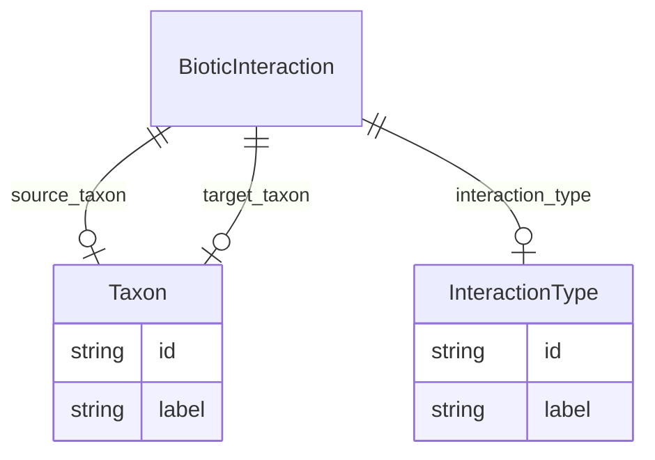

# Class: BioticInteraction


URI: [bp:BioticInteraction](http://w3id.org/ontogpt/biotic-interaction-templateBioticInteraction)





<!-- no inheritance hierarchy -->


## Slots

| Name | Cardinality and Range | Description | Inheritance |
| ---  | --- | --- | --- |
| [source_taxon](source_taxon.md) | 0..1 <br/> [Taxon](Taxon.md) | the taxon that is the subject of the interaction | direct |
| [target_taxon](target_taxon.md) | 0..1 <br/> [Taxon](Taxon.md) | the taxon that is the object of the interaction | direct |
| [interaction_type](interaction_type.md) | 0..1 <br/> [InteractionType](InteractionType.md) | the type of interaction | direct |


## Usages

| used by | used in | type | used |
| ---  | --- | --- | --- |
| [Container](Container.md) | [interactions](interactions.md) | range | [BioticInteraction](BioticInteraction.md) |


## Identifier and Mapping Information


### Annotations

| property | value |
| --- | --- |
| prompt | A semi-colon separated list of taxon to taxon relationships || prompt.example | Carcharodon carcharias eats elephant seal; Pandarus sinuatus parasitizes Carcharodon carcharias; orca eats Carcharodon carcharias |


### Schema Source


* from schema: https://w3id.org/ontogpt/biotic_interaction


## Mappings

| Mapping Type | Mapped Value |
| ---  | ---  |
| self | bp:BioticInteraction |
| native | bp:BioticInteraction |


## LinkML Source

<!-- TODO: investigate https://stackoverflow.com/questions/37606292/how-to-create-tabbed-code-blocks-in-mkdocs-or-sphinx -->

### Direct

<details>
```yaml
name: BioticInteraction
annotations:
  prompt:
    tag: prompt
    value: A semi-colon separated list of taxon to taxon relationships
  prompt.example:
    tag: prompt.example
    value: Carcharodon carcharias eats elephant seal; Pandarus sinuatus parasitizes
      Carcharodon carcharias; orca eats Carcharodon carcharias
from_schema: https://w3id.org/ontogpt/biotic_interaction
attributes:
  source_taxon:
    name: source_taxon
    description: the taxon that is the subject of the interaction
    from_schema: https://w3id.org/ontogpt/biotic_interaction
    rank: 1000
    domain_of:
    - BioticInteraction
    range: Taxon
  target_taxon:
    name: target_taxon
    description: the taxon that is the object of the interaction
    from_schema: https://w3id.org/ontogpt/biotic_interaction
    rank: 1000
    domain_of:
    - BioticInteraction
    range: Taxon
  interaction_type:
    name: interaction_type
    description: the type of interaction
    from_schema: https://w3id.org/ontogpt/biotic_interaction
    rank: 1000
    domain_of:
    - BioticInteraction
    range: InteractionType

```
</details>

### Induced

<details>
```yaml
name: BioticInteraction
annotations:
  prompt:
    tag: prompt
    value: A semi-colon separated list of taxon to taxon relationships
  prompt.example:
    tag: prompt.example
    value: Carcharodon carcharias eats elephant seal; Pandarus sinuatus parasitizes
      Carcharodon carcharias; orca eats Carcharodon carcharias
from_schema: https://w3id.org/ontogpt/biotic_interaction
attributes:
  source_taxon:
    name: source_taxon
    description: the taxon that is the subject of the interaction
    from_schema: https://w3id.org/ontogpt/biotic_interaction
    rank: 1000
    alias: source_taxon
    owner: BioticInteraction
    domain_of:
    - BioticInteraction
    range: Taxon
  target_taxon:
    name: target_taxon
    description: the taxon that is the object of the interaction
    from_schema: https://w3id.org/ontogpt/biotic_interaction
    rank: 1000
    alias: target_taxon
    owner: BioticInteraction
    domain_of:
    - BioticInteraction
    range: Taxon
  interaction_type:
    name: interaction_type
    description: the type of interaction
    from_schema: https://w3id.org/ontogpt/biotic_interaction
    rank: 1000
    alias: interaction_type
    owner: BioticInteraction
    domain_of:
    - BioticInteraction
    range: InteractionType

```
</details>