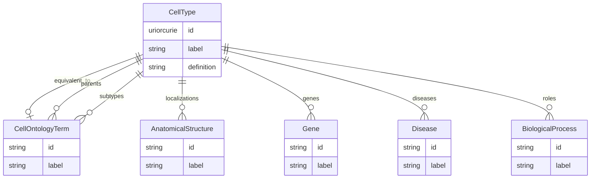

# Class: CellType


_Represents a cell type_


URI: [cell_type:CellType](http://w3id.org/ontogpt/cell_type/CellType)





## Inheritance
* **CellType**
    * [ImmuneCell](ImmuneCell.md)
    * [Neuron](Neuron.md)


## Slots

| Name | Cardinality and Range | Description | Inheritance |
| ---  | --- | --- | --- |
| [id](id.md) | 1 <br/> [Uriorcurie](Uriorcurie.md) |  | direct |
| [label](label.md) | 0..1 <br/> [String](String.md) | the concise name of the cell type | direct |
| [equivalent_to](equivalent_to.md) | 0..1 <br/> [CellOntologyTerm](CellOntologyTerm.md) | the the cell type described | direct |
| [definition](definition.md) | 0..1 <br/> [String](String.md) |  | direct |
| [parents](parents.md) | * <br/> [CellOntologyTerm](CellOntologyTerm.md) | categorization | direct |
| [subtypes](subtypes.md) | * <br/> [CellOntologyTerm](CellOntologyTerm.md) |  | direct |
| [localizations](localizations.md) | * <br/> [AnatomicalStructure](AnatomicalStructure.md) |  | direct |
| [genes](genes.md) | * <br/> [Gene](Gene.md) |  | direct |
| [diseases](diseases.md) | * <br/> [Disease](Disease.md) |  | direct |
| [roles](roles.md) | * <br/> [BiologicalProcess](BiologicalProcess.md) |  | direct |


## Identifier and Mapping Information


### Schema Source


* from schema: http://w3id.org/ontogpt/cell_type


## Mappings

| Mapping Type | Mapped Value |
| ---  | ---  |
| self | cell_type:CellType |
| native | cell_type:CellType |


## LinkML Source

<!-- TODO: investigate https://stackoverflow.com/questions/37606292/how-to-create-tabbed-code-blocks-in-mkdocs-or-sphinx -->

### Direct

<details>
```yaml
name: CellType
description: Represents a cell type
from_schema: http://w3id.org/ontogpt/cell_type
attributes:
  id:
    name: id
    annotations:
      prompt.skip:
        tag: prompt.skip
        value: true
    from_schema: http://w3id.org/ontogpt/cell_type
    rank: 1000
    slot_uri: rdf:Resource
    identifier: true
    domain_of:
    - CellType
    - NamedEntity
    - Publication
    range: uriorcurie
    required: true
  label:
    name: label
    annotations:
      owl:
        tag: owl
        value: AnnotationAssertion
    description: the concise name of the cell type
    from_schema: http://w3id.org/ontogpt/cell_type
    rank: 1000
    slot_uri: rdfs:label
    domain_of:
    - CellType
    - NamedEntity
    range: string
  equivalent_to:
    name: equivalent_to
    annotations:
      prompt:
        tag: prompt
        value: the cell type described in the text
      owl:
        tag: owl
        value: AnnotationAssertion
    description: the the cell type described
    from_schema: http://w3id.org/ontogpt/cell_type
    rank: 1000
    slot_uri: skos:exactMatch
    domain_of:
    - CellType
    range: CellOntologyTerm
  definition:
    name: definition
    annotations:
      prompt:
        tag: prompt
        value: A concise textual definition in genus-differentia form, i.e  'A <genus>
          that <differentiating characteristics>'
      owl:
        tag: owl
        value: AnnotationProperty, AnnotationAssertion
    from_schema: http://w3id.org/ontogpt/cell_type
    rank: 1000
    slot_uri: IAO:0000115
    domain_of:
    - CellType
  parents:
    name: parents
    annotations:
      prompt:
        tag: prompt
        value: semicolon-separated list of parent (broader) cell types
      owl:
        tag: owl
        value: SubClassOf
    description: categorization
    from_schema: http://w3id.org/ontogpt/cell_type
    rank: 1000
    multivalued: true
    domain_of:
    - CellType
    range: CellOntologyTerm
  subtypes:
    name: subtypes
    annotations:
      prompt:
        tag: prompt
        value: semicolon-separated list of the subtypes (subclasses) of this cell
          type. Use concise terms, and separate elements in a list using semicolon
          (;)
      owl.template:
        tag: owl.template
        value: '

          SubClassOf( {{ tr(subtype) }} {{ id }} )

          

          '
    from_schema: http://w3id.org/ontogpt/cell_type
    rank: 1000
    multivalued: true
    domain_of:
    - CellType
    range: CellOntologyTerm
  localizations:
    name: localizations
    annotations:
      prompt:
        tag: prompt
        value: semicolon-separated list of anatomical structures in which this cell
          type is localized
      owl:
        tag: owl
        value: SubClassOf, ObjectSomeValuesFrom
    from_schema: http://w3id.org/ontogpt/cell_type
    rank: 1000
    slot_uri: BFO:0000050
    multivalued: true
    domain_of:
    - CellType
    range: AnatomicalStructure
  genes:
    name: genes
    annotations:
      prompt:
        tag: prompt
        value: semicolon-separated list of genes expressed in cells of this type
      owl:
        tag: owl
        value: SubClassOf, ObjectSomeValuesFrom
    from_schema: http://w3id.org/ontogpt/cell_type
    rank: 1000
    slot_uri: RO:0002292
    multivalued: true
    domain_of:
    - CellType
    range: Gene
  diseases:
    name: diseases
    annotations:
      prompt:
        tag: prompt
        value: semicolon-separated list of diseases in which this cell type is implicated
      owl.template:
        tag: owl.template
        value: '

          SubClassOf( {{ tr(disease) }} ObjectSomeValuesFrom( RO:0004026 {{ id }}
          ))

          

          '
    from_schema: http://w3id.org/ontogpt/cell_type
    rank: 1000
    multivalued: true
    domain_of:
    - CellType
    range: Disease
  roles:
    name: roles
    annotations:
      prompt:
        tag: prompt
        value: semicolon-separated list of roles (e.g. biological processes) that
          this cell type plays. These should be short descriptive terms corresponding
          to ontology terms in the GO biological process hierarchy.
      owl:
        tag: owl
        value: SubClassOf, ObjectSomeValuesFrom
    from_schema: http://w3id.org/ontogpt/cell_type
    rank: 1000
    slot_uri: RO:0002215
    multivalued: true
    domain_of:
    - CellType
    range: BiologicalProcess
tree_root: true

```
</details>

### Induced

<details>
```yaml
name: CellType
description: Represents a cell type
from_schema: http://w3id.org/ontogpt/cell_type
attributes:
  id:
    name: id
    annotations:
      prompt.skip:
        tag: prompt.skip
        value: true
    from_schema: http://w3id.org/ontogpt/cell_type
    rank: 1000
    slot_uri: rdf:Resource
    identifier: true
    alias: id
    owner: CellType
    domain_of:
    - CellType
    - NamedEntity
    - Publication
    range: uriorcurie
    required: true
  label:
    name: label
    annotations:
      owl:
        tag: owl
        value: AnnotationAssertion
    description: the concise name of the cell type
    from_schema: http://w3id.org/ontogpt/cell_type
    rank: 1000
    slot_uri: rdfs:label
    alias: label
    owner: CellType
    domain_of:
    - CellType
    - NamedEntity
    range: string
  equivalent_to:
    name: equivalent_to
    annotations:
      prompt:
        tag: prompt
        value: the cell type described in the text
      owl:
        tag: owl
        value: AnnotationAssertion
    description: the the cell type described
    from_schema: http://w3id.org/ontogpt/cell_type
    rank: 1000
    slot_uri: skos:exactMatch
    alias: equivalent_to
    owner: CellType
    domain_of:
    - CellType
    range: CellOntologyTerm
  definition:
    name: definition
    annotations:
      prompt:
        tag: prompt
        value: A concise textual definition in genus-differentia form, i.e  'A <genus>
          that <differentiating characteristics>'
      owl:
        tag: owl
        value: AnnotationProperty, AnnotationAssertion
    from_schema: http://w3id.org/ontogpt/cell_type
    rank: 1000
    slot_uri: IAO:0000115
    alias: definition
    owner: CellType
    domain_of:
    - CellType
    range: string
  parents:
    name: parents
    annotations:
      prompt:
        tag: prompt
        value: semicolon-separated list of parent (broader) cell types
      owl:
        tag: owl
        value: SubClassOf
    description: categorization
    from_schema: http://w3id.org/ontogpt/cell_type
    rank: 1000
    multivalued: true
    alias: parents
    owner: CellType
    domain_of:
    - CellType
    range: CellOntologyTerm
  subtypes:
    name: subtypes
    annotations:
      prompt:
        tag: prompt
        value: semicolon-separated list of the subtypes (subclasses) of this cell
          type. Use concise terms, and separate elements in a list using semicolon
          (;)
      owl.template:
        tag: owl.template
        value: '

          SubClassOf( {{ tr(subtype) }} {{ id }} )

          

          '
    from_schema: http://w3id.org/ontogpt/cell_type
    rank: 1000
    multivalued: true
    alias: subtypes
    owner: CellType
    domain_of:
    - CellType
    range: CellOntologyTerm
  localizations:
    name: localizations
    annotations:
      prompt:
        tag: prompt
        value: semicolon-separated list of anatomical structures in which this cell
          type is localized
      owl:
        tag: owl
        value: SubClassOf, ObjectSomeValuesFrom
    from_schema: http://w3id.org/ontogpt/cell_type
    rank: 1000
    slot_uri: BFO:0000050
    multivalued: true
    alias: localizations
    owner: CellType
    domain_of:
    - CellType
    range: AnatomicalStructure
  genes:
    name: genes
    annotations:
      prompt:
        tag: prompt
        value: semicolon-separated list of genes expressed in cells of this type
      owl:
        tag: owl
        value: SubClassOf, ObjectSomeValuesFrom
    from_schema: http://w3id.org/ontogpt/cell_type
    rank: 1000
    slot_uri: RO:0002292
    multivalued: true
    alias: genes
    owner: CellType
    domain_of:
    - CellType
    range: Gene
  diseases:
    name: diseases
    annotations:
      prompt:
        tag: prompt
        value: semicolon-separated list of diseases in which this cell type is implicated
      owl.template:
        tag: owl.template
        value: '

          SubClassOf( {{ tr(disease) }} ObjectSomeValuesFrom( RO:0004026 {{ id }}
          ))

          

          '
    from_schema: http://w3id.org/ontogpt/cell_type
    rank: 1000
    multivalued: true
    alias: diseases
    owner: CellType
    domain_of:
    - CellType
    range: Disease
  roles:
    name: roles
    annotations:
      prompt:
        tag: prompt
        value: semicolon-separated list of roles (e.g. biological processes) that
          this cell type plays. These should be short descriptive terms corresponding
          to ontology terms in the GO biological process hierarchy.
      owl:
        tag: owl
        value: SubClassOf, ObjectSomeValuesFrom
    from_schema: http://w3id.org/ontogpt/cell_type
    rank: 1000
    slot_uri: RO:0002215
    multivalued: true
    alias: roles
    owner: CellType
    domain_of:
    - CellType
    range: BiologicalProcess
tree_root: true

```
</details>