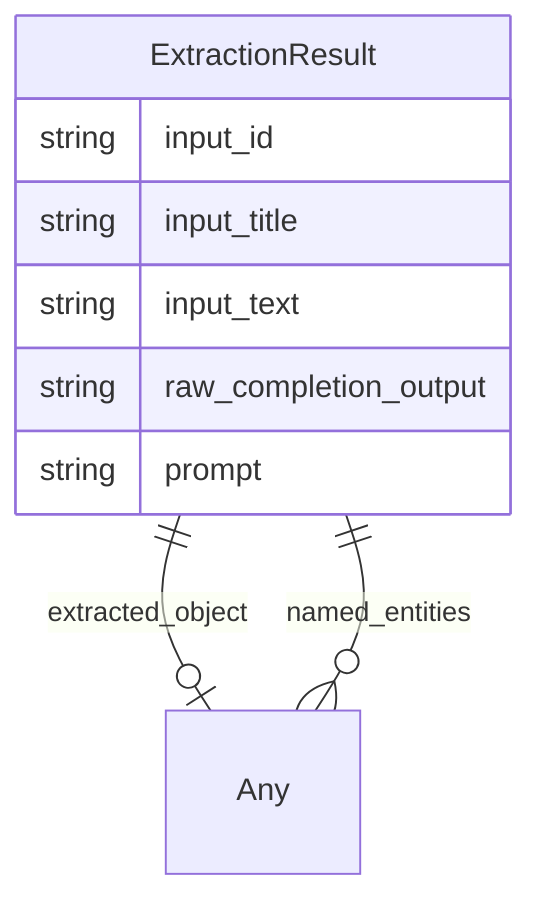

# Class: ExtractionResult


_A result of extracting knowledge on text_


URI: [cell_type:ExtractionResult](http://w3id.org/ontogpt/cell_type/ExtractionResult)





<!-- no inheritance hierarchy -->


## Slots

| Name | Cardinality and Range | Description | Inheritance |
| ---  | --- | --- | --- |
| [input_id](input_id.md) | 0..1 <br/> [String](String.md) |  | direct |
| [input_title](input_title.md) | 0..1 <br/> [String](String.md) |  | direct |
| [input_text](input_text.md) | 0..1 <br/> [String](String.md) |  | direct |
| [raw_completion_output](raw_completion_output.md) | 0..1 <br/> [String](String.md) |  | direct |
| [prompt](prompt.md) | 0..1 <br/> [String](String.md) |  | direct |
| [extracted_object](extracted_object.md) | 0..1 <br/> [Any](Any.md) | The complex objects extracted from the text | direct |
| [named_entities](named_entities.md) | * <br/> [Any](Any.md) | Named entities extracted from the text | direct |


## Identifier and Mapping Information


### Schema Source


* from schema: http://w3id.org/ontogpt/cell_type


## Mappings

| Mapping Type | Mapped Value |
| ---  | ---  |
| self | cell_type:ExtractionResult |
| native | cell_type:ExtractionResult |


## LinkML Source

<!-- TODO: investigate https://stackoverflow.com/questions/37606292/how-to-create-tabbed-code-blocks-in-mkdocs-or-sphinx -->

### Direct

<details>
```yaml
name: ExtractionResult
description: A result of extracting knowledge on text
from_schema: http://w3id.org/ontogpt/cell_type
attributes:
  input_id:
    name: input_id
    from_schema: http://w3id.org/ontogpt/cell_type
    rank: 1000
    domain_of:
    - ExtractionResult
  input_title:
    name: input_title
    from_schema: http://w3id.org/ontogpt/cell_type
    rank: 1000
    domain_of:
    - ExtractionResult
  input_text:
    name: input_text
    from_schema: http://w3id.org/ontogpt/cell_type
    rank: 1000
    domain_of:
    - ExtractionResult
  raw_completion_output:
    name: raw_completion_output
    from_schema: http://w3id.org/ontogpt/cell_type
    rank: 1000
    domain_of:
    - ExtractionResult
  prompt:
    name: prompt
    from_schema: http://w3id.org/ontogpt/cell_type
    rank: 1000
    domain_of:
    - ExtractionResult
  extracted_object:
    name: extracted_object
    description: The complex objects extracted from the text
    from_schema: http://w3id.org/ontogpt/cell_type
    rank: 1000
    domain_of:
    - ExtractionResult
    range: Any
    inlined: true
  named_entities:
    name: named_entities
    description: Named entities extracted from the text
    from_schema: http://w3id.org/ontogpt/cell_type
    rank: 1000
    multivalued: true
    domain_of:
    - ExtractionResult
    range: Any
    inlined: true
    inlined_as_list: true

```
</details>

### Induced

<details>
```yaml
name: ExtractionResult
description: A result of extracting knowledge on text
from_schema: http://w3id.org/ontogpt/cell_type
attributes:
  input_id:
    name: input_id
    from_schema: http://w3id.org/ontogpt/cell_type
    rank: 1000
    alias: input_id
    owner: ExtractionResult
    domain_of:
    - ExtractionResult
    range: string
  input_title:
    name: input_title
    from_schema: http://w3id.org/ontogpt/cell_type
    rank: 1000
    alias: input_title
    owner: ExtractionResult
    domain_of:
    - ExtractionResult
    range: string
  input_text:
    name: input_text
    from_schema: http://w3id.org/ontogpt/cell_type
    rank: 1000
    alias: input_text
    owner: ExtractionResult
    domain_of:
    - ExtractionResult
    range: string
  raw_completion_output:
    name: raw_completion_output
    from_schema: http://w3id.org/ontogpt/cell_type
    rank: 1000
    alias: raw_completion_output
    owner: ExtractionResult
    domain_of:
    - ExtractionResult
    range: string
  prompt:
    name: prompt
    from_schema: http://w3id.org/ontogpt/cell_type
    rank: 1000
    alias: prompt
    owner: ExtractionResult
    domain_of:
    - ExtractionResult
    range: string
  extracted_object:
    name: extracted_object
    description: The complex objects extracted from the text
    from_schema: http://w3id.org/ontogpt/cell_type
    rank: 1000
    alias: extracted_object
    owner: ExtractionResult
    domain_of:
    - ExtractionResult
    range: Any
    inlined: true
  named_entities:
    name: named_entities
    description: Named entities extracted from the text
    from_schema: http://w3id.org/ontogpt/cell_type
    rank: 1000
    multivalued: true
    alias: named_entities
    owner: ExtractionResult
    domain_of:
    - ExtractionResult
    range: Any
    inlined: true
    inlined_as_list: true

```
</details>