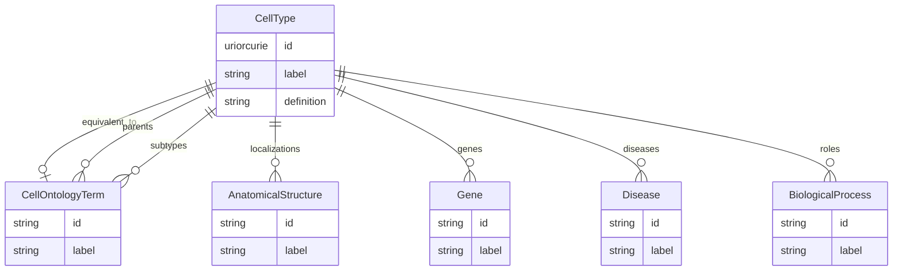

# Composite Disease

A template for representing cell types

URI: http://w3id.org/ontogpt/cell_type

Name: cell_type

## Schema Diagram

## Classes

| Class | Description |
| --- | --- |
| [AnnotatorResult](AnnotatorResult.md) | None |
| [Any](Any.md) | None |
| [CellType](CellType.md) | Represents a cell type |
| &nbsp;&nbsp;&nbsp;&nbsp;&nbsp;&nbsp;&nbsp;&nbsp;[ImmuneCell](ImmuneCell.md) | None |
| &nbsp;&nbsp;&nbsp;&nbsp;&nbsp;&nbsp;&nbsp;&nbsp;[Neuron](Neuron.md) | None |
| &nbsp;&nbsp;&nbsp;&nbsp;&nbsp;&nbsp;&nbsp;&nbsp;&nbsp;&nbsp;&nbsp;&nbsp;&nbsp;&nbsp;&nbsp;&nbsp;[Interneuron](Interneuron.md) | None |
| [CompoundExpression](CompoundExpression.md) | None |
| &nbsp;&nbsp;&nbsp;&nbsp;&nbsp;&nbsp;&nbsp;&nbsp;[Triple](Triple.md) | Abstract parent for Relation Extraction tasks |
| [ExtractionResult](ExtractionResult.md) | A result of extracting knowledge on text |
| [NamedEntity](NamedEntity.md) | None |
| &nbsp;&nbsp;&nbsp;&nbsp;&nbsp;&nbsp;&nbsp;&nbsp;[AnatomicalStructure](AnatomicalStructure.md) | None |
| &nbsp;&nbsp;&nbsp;&nbsp;&nbsp;&nbsp;&nbsp;&nbsp;&nbsp;&nbsp;&nbsp;&nbsp;&nbsp;&nbsp;&nbsp;&nbsp;[BrainRegion](BrainRegion.md) | None |
| &nbsp;&nbsp;&nbsp;&nbsp;&nbsp;&nbsp;&nbsp;&nbsp;[BiologicalProcess](BiologicalProcess.md) | None |
| &nbsp;&nbsp;&nbsp;&nbsp;&nbsp;&nbsp;&nbsp;&nbsp;[CellOntologyTerm](CellOntologyTerm.md) | None |
| &nbsp;&nbsp;&nbsp;&nbsp;&nbsp;&nbsp;&nbsp;&nbsp;[ChemicalEntity](ChemicalEntity.md) | None |
| &nbsp;&nbsp;&nbsp;&nbsp;&nbsp;&nbsp;&nbsp;&nbsp;&nbsp;&nbsp;&nbsp;&nbsp;&nbsp;&nbsp;&nbsp;&nbsp;[Neurotransmitter](Neurotransmitter.md) | None |
| &nbsp;&nbsp;&nbsp;&nbsp;&nbsp;&nbsp;&nbsp;&nbsp;[Disease](Disease.md) | None |
| &nbsp;&nbsp;&nbsp;&nbsp;&nbsp;&nbsp;&nbsp;&nbsp;[Drug](Drug.md) | None |
| &nbsp;&nbsp;&nbsp;&nbsp;&nbsp;&nbsp;&nbsp;&nbsp;[Gene](Gene.md) | None |
| &nbsp;&nbsp;&nbsp;&nbsp;&nbsp;&nbsp;&nbsp;&nbsp;[Pathway](Pathway.md) | None |
| &nbsp;&nbsp;&nbsp;&nbsp;&nbsp;&nbsp;&nbsp;&nbsp;[ProteinOrComplex](ProteinOrComplex.md) | None |
| &nbsp;&nbsp;&nbsp;&nbsp;&nbsp;&nbsp;&nbsp;&nbsp;[RelationshipType](RelationshipType.md) | None |
| [Publication](Publication.md) | None |
| [TextWithEntity](TextWithEntity.md) | A text containing one or more instances of a single type of entity. |
| [TextWithTriples](TextWithTriples.md) | A text containing one or more relations of the Triple type. |

## Slots

| Slot | Description |
| --- | --- |
| [abstract](abstract.md) | The abstract of the publication |
| [combined_text](combined_text.md) |  |
| [definition](definition.md) |  |
| [diseases](diseases.md) |  |
| [entities](entities.md) |  |
| [equivalent_to](equivalent_to.md) | the the cell type described |
| [extracted_object](extracted_object.md) | The complex objects extracted from the text |
| [full_text](full_text.md) | The full text of the publication |
| [genes](genes.md) |  |
| [has_surface_markers](has_surface_markers.md) |  |
| [id](id.md) |  |
| [input_id](input_id.md) |  |
| [input_text](input_text.md) |  |
| [input_title](input_title.md) |  |
| [label](label.md) | the concise name of the cell type |
| [localizations](localizations.md) |  |
| [named_entities](named_entities.md) | Named entities extracted from the text |
| [object](object.md) |  |
| [object_id](object_id.md) |  |
| [object_qualifier](object_qualifier.md) | An optional qualifier or modifier for the object of the statement, e |
| [object_text](object_text.md) |  |
| [parents](parents.md) | categorization |
| [predicate](predicate.md) |  |
| [projects_to_or_from](projects_to_or_from.md) | Brain structures from which this cell type projects into or receives projecti... |
| [prompt](prompt.md) |  |
| [publication](publication.md) |  |
| [qualifier](qualifier.md) | A qualifier for the statements, e |
| [raw_completion_output](raw_completion_output.md) |  |
| [releases_neurotransitter](releases_neurotransitter.md) |  |
| [roles](roles.md) |  |
| [subject](subject.md) |  |
| [subject_qualifier](subject_qualifier.md) | An optional qualifier or modifier for the subject of the statement, e |
| [subject_text](subject_text.md) |  |
| [subtypes](subtypes.md) |  |
| [title](title.md) | The title of the publication |
| [triples](triples.md) |  |

## Enumerations

| Enumeration | Description |
| --- | --- |
| [BrainRegionIdentifier](BrainRegionIdentifier.md) | Brain region (or for now, any nervous system part) |
| [NeurotransmitterIdentifier](NeurotransmitterIdentifier.md) |  |
| [NullDataOptions](NullDataOptions.md) |  |

## Types

| Type | Description |
| --- | --- |
| [Boolean](Boolean.md) | A binary (true or false) value |
| [Curie](Curie.md) | a compact URI |
| [Date](Date.md) | a date (year, month and day) in an idealized calendar |
| [DateOrDatetime](DateOrDatetime.md) | Either a date or a datetime |
| [Datetime](Datetime.md) | The combination of a date and time |
| [Decimal](Decimal.md) | A real number with arbitrary precision that conforms to the xsd:decimal speci... |
| [Double](Double.md) | A real number that conforms to the xsd:double specification |
| [Float](Float.md) | A real number that conforms to the xsd:float specification |
| [Integer](Integer.md) | An integer |
| [Jsonpath](Jsonpath.md) | A string encoding a JSON Path |
| [Jsonpointer](Jsonpointer.md) | A string encoding a JSON Pointer |
| [Ncname](Ncname.md) | Prefix part of CURIE |
| [Nodeidentifier](Nodeidentifier.md) | A URI, CURIE or BNODE that represents a node in a model |
| [Objectidentifier](Objectidentifier.md) | A URI or CURIE that represents an object in the model |
| [Sparqlpath](Sparqlpath.md) | A string encoding a SPARQL Property Path |
| [String](String.md) | A character string |
| [Time](Time.md) | A time object represents a (local) time of day, independent of any particular... |
| [Uri](Uri.md) | a complete URI |
| [Uriorcurie](Uriorcurie.md) | a URI or a CURIE |

## Subsets

| Subset | Description |
| --- | --- |
