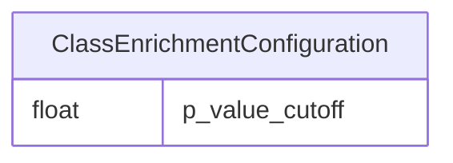

# Class: ClassEnrichmentConfiguration
_configuration for search_


URI: [ontoenrich:ClassEnrichmentConfiguration](https://w3id.org/oak/class-enrichment/ClassEnrichmentConfiguration)





<!-- no inheritance hierarchy -->


## Slots

| Name | Cardinality and Range | Description | Inheritance |
| ---  | --- | --- | --- |
| [p_value_cutoff](p_value_cutoff.md) | 1..1 <br/> [Float](Float.md) | p-value cutoff for enrichment | direct |


## Identifier and Mapping Information


### Schema Source


* from schema: https://w3id.org/oak/class-enrichment


## Mappings

| Mapping Type | Mapped Value |
| ---  | ---  |
| self | ontoenrich:ClassEnrichmentConfiguration |
| native | ontoenrich:ClassEnrichmentConfiguration |


## LinkML Source

<!-- TODO: investigate https://stackoverflow.com/questions/37606292/how-to-create-tabbed-code-blocks-in-mkdocs-or-sphinx -->

### Direct

<details>
```yaml
name: ClassEnrichmentConfiguration
description: configuration for search
from_schema: https://w3id.org/oak/class-enrichment
rank: 1000
attributes:
  p_value_cutoff:
    name: p_value_cutoff
    description: p-value cutoff for enrichment
    from_schema: https://w3id.org/oak/class-enrichment
    rank: 1000
    range: float
    required: true

```
</details>

### Induced

<details>
```yaml
name: ClassEnrichmentConfiguration
description: configuration for search
from_schema: https://w3id.org/oak/class-enrichment
rank: 1000
attributes:
  p_value_cutoff:
    name: p_value_cutoff
    description: p-value cutoff for enrichment
    from_schema: https://w3id.org/oak/class-enrichment
    rank: 1000
    alias: p_value_cutoff
    owner: ClassEnrichmentConfiguration
    domain_of:
    - ClassEnrichmentConfiguration
    range: float
    required: true

```
</details>