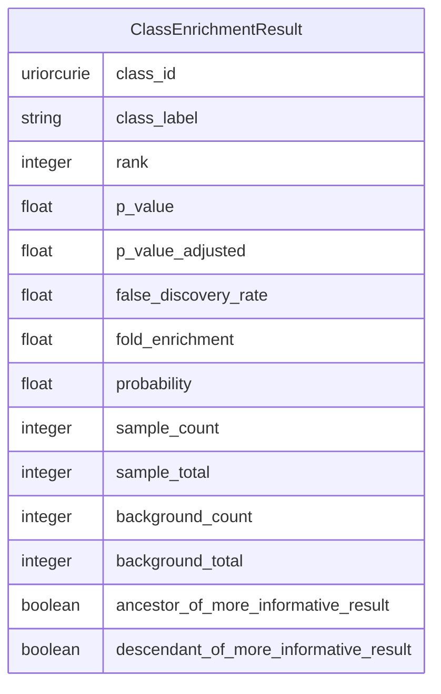

# Class: ClassEnrichmentResult


_A single enrichment result_


URI: [ontoenrich:ClassEnrichmentResult](https://w3id.org/oak/class-enrichment/ClassEnrichmentResult)





<!-- no inheritance hierarchy -->


## Slots

| Name | Cardinality and Range | Description | Inheritance |
| ---  | --- | --- | --- |
| [class_id](class_id.md) | 1 <br/> [Uriorcurie](Uriorcurie.md) | The class id | direct |
| [class_label](class_label.md) | 0..1 <br/> [String](String.md) | The class label | direct |
| [rank](rank.md) | 0..1 <br/> [Integer](Integer.md) | The rank of this result | direct |
| [p_value](p_value.md) | 1 <br/> [Float](Float.md) | The p-value | direct |
| [p_value_adjusted](p_value_adjusted.md) | 0..1 <br/> [Float](Float.md) | The adjusted p-value | direct |
| [false_discovery_rate](false_discovery_rate.md) | 0..1 <br/> [Float](Float.md) | The false discovery rate | direct |
| [fold_enrichment](fold_enrichment.md) | 0..1 <br/> [Float](Float.md) | The fold enrichment | direct |
| [probability](probability.md) | 0..1 <br/> [Float](Float.md) | The probability, as estimated by model-based approaches | direct |
| [sample_count](sample_count.md) | 0..1 <br/> [Integer](Integer.md) | The number of entities in the sample with this class | direct |
| [sample_total](sample_total.md) | 0..1 <br/> [Integer](Integer.md) | The total number of entities in the sample | direct |
| [background_count](background_count.md) | 0..1 <br/> [Integer](Integer.md) | The background count | direct |
| [background_total](background_total.md) | 0..1 <br/> [Integer](Integer.md) | The background total | direct |
| [ancestor_of_more_informative_result](ancestor_of_more_informative_result.md) | 0..1 <br/> [Boolean](Boolean.md) | This term is more general than a previously reported result | direct |
| [descendant_of_more_informative_result](descendant_of_more_informative_result.md) | 0..1 <br/> [Boolean](Boolean.md) | This term is more specific than a previously reported result | direct |


## Usages

| used by | used in | type | used |
| ---  | --- | --- | --- |
| [ClassEnrichmentResultSet](ClassEnrichmentResultSet.md) | [results](results.md) | range | [ClassEnrichmentResult](ClassEnrichmentResult.md) |


## Identifier and Mapping Information


### Schema Source


* from schema: https://w3id.org/oak/class-enrichment


## Mappings

| Mapping Type | Mapped Value |
| ---  | ---  |
| self | ontoenrich:ClassEnrichmentResult |
| native | ontoenrich:ClassEnrichmentResult |


## LinkML Source

<!-- TODO: investigate https://stackoverflow.com/questions/37606292/how-to-create-tabbed-code-blocks-in-mkdocs-or-sphinx -->

### Direct

<details>
```yaml
name: ClassEnrichmentResult
description: A single enrichment result
from_schema: https://w3id.org/oak/class-enrichment
attributes:
  class_id:
    name: class_id
    description: The class id
    from_schema: https://w3id.org/oak/class-enrichment
    rank: 1000
    domain_of:
    - ClassEnrichmentResult
    range: uriorcurie
    required: true
  class_label:
    name: class_label
    description: The class label
    from_schema: https://w3id.org/oak/class-enrichment
    rank: 1000
    domain_of:
    - ClassEnrichmentResult
    range: string
  rank:
    name: rank
    description: The rank of this result
    from_schema: https://w3id.org/oak/class-enrichment
    rank: 1000
    domain_of:
    - ClassEnrichmentResult
    range: integer
  p_value:
    name: p_value
    description: The p-value
    from_schema: https://w3id.org/oak/class-enrichment
    rank: 1000
    slot_uri: OBI:0000175
    domain_of:
    - ClassEnrichmentResult
    range: float
    required: true
  p_value_adjusted:
    name: p_value_adjusted
    description: The adjusted p-value
    from_schema: https://w3id.org/oak/class-enrichment
    rank: 1000
    domain_of:
    - ClassEnrichmentResult
    range: float
  false_discovery_rate:
    name: false_discovery_rate
    description: The false discovery rate
    from_schema: https://w3id.org/oak/class-enrichment
    rank: 1000
    domain_of:
    - ClassEnrichmentResult
    range: float
  fold_enrichment:
    name: fold_enrichment
    description: The fold enrichment
    from_schema: https://w3id.org/oak/class-enrichment
    rank: 1000
    domain_of:
    - ClassEnrichmentResult
    range: float
  probability:
    name: probability
    description: The probability, as estimated by model-based approaches
    from_schema: https://w3id.org/oak/class-enrichment
    rank: 1000
    domain_of:
    - ClassEnrichmentResult
    range: float
    minimum_value: 0
    maximum_value: 1
  sample_count:
    name: sample_count
    description: The number of entities in the sample with this class
    from_schema: https://w3id.org/oak/class-enrichment
    rank: 1000
    domain_of:
    - ClassEnrichmentResult
    range: integer
  sample_total:
    name: sample_total
    description: The total number of entities in the sample
    from_schema: https://w3id.org/oak/class-enrichment
    rank: 1000
    domain_of:
    - ClassEnrichmentResult
    range: integer
  background_count:
    name: background_count
    description: The background count
    from_schema: https://w3id.org/oak/class-enrichment
    rank: 1000
    domain_of:
    - ClassEnrichmentResult
    range: integer
  background_total:
    name: background_total
    description: The background total
    from_schema: https://w3id.org/oak/class-enrichment
    rank: 1000
    domain_of:
    - ClassEnrichmentResult
    range: integer
  ancestor_of_more_informative_result:
    name: ancestor_of_more_informative_result
    description: This term is more general than a previously reported result
    from_schema: https://w3id.org/oak/class-enrichment
    rank: 1000
    domain_of:
    - ClassEnrichmentResult
    range: boolean
  descendant_of_more_informative_result:
    name: descendant_of_more_informative_result
    description: This term is more specific than a previously reported result
    from_schema: https://w3id.org/oak/class-enrichment
    rank: 1000
    domain_of:
    - ClassEnrichmentResult
    range: boolean

```
</details>

### Induced

<details>
```yaml
name: ClassEnrichmentResult
description: A single enrichment result
from_schema: https://w3id.org/oak/class-enrichment
attributes:
  class_id:
    name: class_id
    description: The class id
    from_schema: https://w3id.org/oak/class-enrichment
    rank: 1000
    alias: class_id
    owner: ClassEnrichmentResult
    domain_of:
    - ClassEnrichmentResult
    range: uriorcurie
    required: true
  class_label:
    name: class_label
    description: The class label
    from_schema: https://w3id.org/oak/class-enrichment
    rank: 1000
    alias: class_label
    owner: ClassEnrichmentResult
    domain_of:
    - ClassEnrichmentResult
    range: string
  rank:
    name: rank
    description: The rank of this result
    from_schema: https://w3id.org/oak/class-enrichment
    rank: 1000
    alias: rank
    owner: ClassEnrichmentResult
    domain_of:
    - ClassEnrichmentResult
    range: integer
  p_value:
    name: p_value
    description: The p-value
    from_schema: https://w3id.org/oak/class-enrichment
    rank: 1000
    slot_uri: OBI:0000175
    alias: p_value
    owner: ClassEnrichmentResult
    domain_of:
    - ClassEnrichmentResult
    range: float
    required: true
  p_value_adjusted:
    name: p_value_adjusted
    description: The adjusted p-value
    from_schema: https://w3id.org/oak/class-enrichment
    rank: 1000
    alias: p_value_adjusted
    owner: ClassEnrichmentResult
    domain_of:
    - ClassEnrichmentResult
    range: float
  false_discovery_rate:
    name: false_discovery_rate
    description: The false discovery rate
    from_schema: https://w3id.org/oak/class-enrichment
    rank: 1000
    alias: false_discovery_rate
    owner: ClassEnrichmentResult
    domain_of:
    - ClassEnrichmentResult
    range: float
  fold_enrichment:
    name: fold_enrichment
    description: The fold enrichment
    from_schema: https://w3id.org/oak/class-enrichment
    rank: 1000
    alias: fold_enrichment
    owner: ClassEnrichmentResult
    domain_of:
    - ClassEnrichmentResult
    range: float
  probability:
    name: probability
    description: The probability, as estimated by model-based approaches
    from_schema: https://w3id.org/oak/class-enrichment
    rank: 1000
    alias: probability
    owner: ClassEnrichmentResult
    domain_of:
    - ClassEnrichmentResult
    range: float
    minimum_value: 0
    maximum_value: 1
  sample_count:
    name: sample_count
    description: The number of entities in the sample with this class
    from_schema: https://w3id.org/oak/class-enrichment
    rank: 1000
    alias: sample_count
    owner: ClassEnrichmentResult
    domain_of:
    - ClassEnrichmentResult
    range: integer
  sample_total:
    name: sample_total
    description: The total number of entities in the sample
    from_schema: https://w3id.org/oak/class-enrichment
    rank: 1000
    alias: sample_total
    owner: ClassEnrichmentResult
    domain_of:
    - ClassEnrichmentResult
    range: integer
  background_count:
    name: background_count
    description: The background count
    from_schema: https://w3id.org/oak/class-enrichment
    rank: 1000
    alias: background_count
    owner: ClassEnrichmentResult
    domain_of:
    - ClassEnrichmentResult
    range: integer
  background_total:
    name: background_total
    description: The background total
    from_schema: https://w3id.org/oak/class-enrichment
    rank: 1000
    alias: background_total
    owner: ClassEnrichmentResult
    domain_of:
    - ClassEnrichmentResult
    range: integer
  ancestor_of_more_informative_result:
    name: ancestor_of_more_informative_result
    description: This term is more general than a previously reported result
    from_schema: https://w3id.org/oak/class-enrichment
    rank: 1000
    alias: ancestor_of_more_informative_result
    owner: ClassEnrichmentResult
    domain_of:
    - ClassEnrichmentResult
    range: boolean
  descendant_of_more_informative_result:
    name: descendant_of_more_informative_result
    description: This term is more specific than a previously reported result
    from_schema: https://w3id.org/oak/class-enrichment
    rank: 1000
    alias: descendant_of_more_informative_result
    owner: ClassEnrichmentResult
    domain_of:
    - ClassEnrichmentResult
    range: boolean

```
</details>