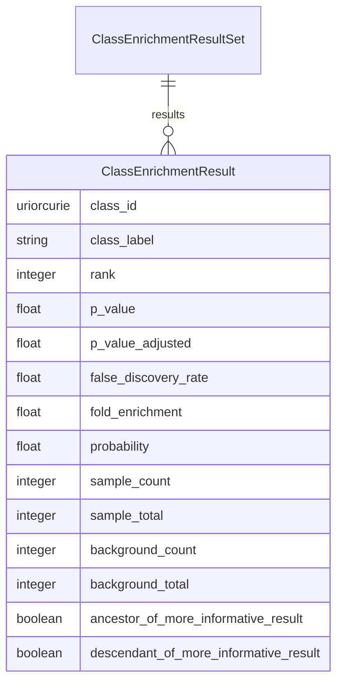

# Class: ClassEnrichmentResultSet


_A collection of enrichemt results_


URI: [ontoenrich:ClassEnrichmentResultSet](https://w3id.org/oak/class-enrichment/ClassEnrichmentResultSet)





<!-- no inheritance hierarchy -->


## Slots

| Name | Cardinality and Range | Description | Inheritance |
| ---  | --- | --- | --- |
| [results](results.md) | * <br/> [ClassEnrichmentResult](ClassEnrichmentResult.md) | The enrichment results | direct |


## Identifier and Mapping Information


### Schema Source


* from schema: https://w3id.org/oak/class-enrichment


## Mappings

| Mapping Type | Mapped Value |
| ---  | ---  |
| self | ontoenrich:ClassEnrichmentResultSet |
| native | ontoenrich:ClassEnrichmentResultSet |


## LinkML Source

<!-- TODO: investigate https://stackoverflow.com/questions/37606292/how-to-create-tabbed-code-blocks-in-mkdocs-or-sphinx -->

### Direct

<details>
```yaml
name: ClassEnrichmentResultSet
description: A collection of enrichemt results
from_schema: https://w3id.org/oak/class-enrichment
attributes:
  results:
    name: results
    description: The enrichment results
    from_schema: https://w3id.org/oak/class-enrichment
    rank: 1000
    multivalued: true
    domain_of:
    - ClassEnrichmentResultSet
    range: ClassEnrichmentResult

```
</details>

### Induced

<details>
```yaml
name: ClassEnrichmentResultSet
description: A collection of enrichemt results
from_schema: https://w3id.org/oak/class-enrichment
attributes:
  results:
    name: results
    description: The enrichment results
    from_schema: https://w3id.org/oak/class-enrichment
    rank: 1000
    multivalued: true
    alias: results
    owner: ClassEnrichmentResultSet
    domain_of:
    - ClassEnrichmentResultSet
    range: ClassEnrichmentResult

```
</details>