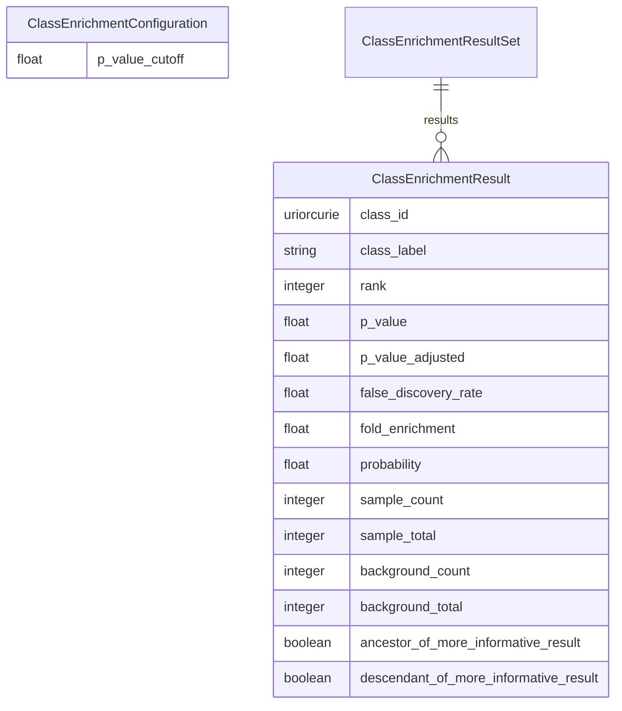

# Class Enrichment Datamodel

A datamodel for representing the results of class enrichment on gene sets

URI: https://w3id.org/oak/class-enrichment

Name: class-enrichment

## Schema Diagram

## Classes

| Class | Description |
| --- | --- |
| [ClassEnrichmentConfiguration](ClassEnrichmentConfiguration.md) | configuration for search |
| [ClassEnrichmentResult](ClassEnrichmentResult.md) | A single enrichment result |
| [ClassEnrichmentResultSet](ClassEnrichmentResultSet.md) | A collection of enrichemt results |

## Slots

| Slot | Description |
| --- | --- |
| [ancestor_of_more_informative_result](ancestor_of_more_informative_result.md) | This term is more general than a previously reported result |
| [background_count](background_count.md) | The background count |
| [background_total](background_total.md) | The background total |
| [class_id](class_id.md) | The class id |
| [class_label](class_label.md) | The class label |
| [descendant_of_more_informative_result](descendant_of_more_informative_result.md) | This term is more specific than a previously reported result |
| [false_discovery_rate](false_discovery_rate.md) | The false discovery rate |
| [fold_enrichment](fold_enrichment.md) | The fold enrichment |
| [p_value](p_value.md) | The p-value |
| [p_value_adjusted](p_value_adjusted.md) | The adjusted p-value |
| [p_value_cutoff](p_value_cutoff.md) | p-value cutoff for enrichment |
| [probability](probability.md) | The probability, as estimated by model-based approaches |
| [rank](rank.md) | The rank of this result |
| [results](results.md) | The enrichment results |
| [sample_count](sample_count.md) | The number of entities in the sample with this class |
| [sample_total](sample_total.md) | The total number of entities in the sample |

## Enumerations

| Enumeration | Description |
| --- | --- |
| [SortFieldEnum](SortFieldEnum.md) | The field to sort by |

## Types

| Type | Description |
| --- | --- |
| [Boolean](Boolean.md) | A binary (true or false) value |
| [Curie](Curie.md) | a compact URI |
| [Date](Date.md) | a date (year, month and day) in an idealized calendar |
| [DateOrDatetime](DateOrDatetime.md) | Either a date or a datetime |
| [Datetime](Datetime.md) | The combination of a date and time |
| [Decimal](Decimal.md) | A real number with arbitrary precision that conforms to the xsd:decimal speci... |
| [Double](Double.md) | A real number that conforms to the xsd:double specification |
| [Float](Float.md) | A real number that conforms to the xsd:float specification |
| [Integer](Integer.md) | An integer |
| [Jsonpath](Jsonpath.md) | A string encoding a JSON Path |
| [Jsonpointer](Jsonpointer.md) | A string encoding a JSON Pointer |
| [Ncname](Ncname.md) | Prefix part of CURIE |
| [Nodeidentifier](Nodeidentifier.md) | A URI, CURIE or BNODE that represents a node in a model |
| [Objectidentifier](Objectidentifier.md) | A URI or CURIE that represents an object in the model |
| [Position](Position.md) |  |
| [Sparqlpath](Sparqlpath.md) | A string encoding a SPARQL Property Path |
| [String](String.md) | A character string |
| [Time](Time.md) | A time object represents a (local) time of day, independent of any particular... |
| [Uri](Uri.md) | a complete URI |
| [Uriorcurie](Uriorcurie.md) | a URI or a CURIE |

## Subsets

| Subset | Description |
| --- | --- |
