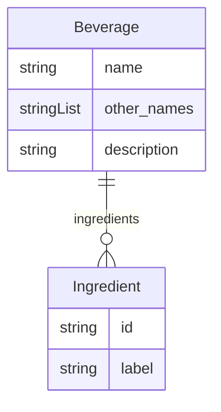

# Class: Beverage


URI: [coffee:Beverage](http://w3id.org/ontogpt/coffee/Beverage)





<!-- no inheritance hierarchy -->


## Slots

| Name | Cardinality and Range | Description | Inheritance |
| ---  | --- | --- | --- |
| [name](name.md) | 0..1 <br/> [String](String.md) | The common name of the beverage, for example, caffè macchiato | direct |
| [other_names](other_names.md) | 0..* <br/> [String](String.md) | A semicolon-separated list of alternative names for the beverage, including E... | direct |
| [description](description.md) | 0..1 <br/> [String](String.md) | A one sentence description of the beverage | direct |
| [ingredients](ingredients.md) | 0..* <br/> [Ingredient](Ingredient.md) | A semicolon-separated list of ingredients in the beverage, without volumes or... | direct |


## Usages

| used by | used in | type | used |
| ---  | --- | --- | --- |
| [BeverageSet](BeverageSet.md) | [beverages](beverages.md) | range | [Beverage](Beverage.md) |


## Identifier and Mapping Information


### Schema Source


* from schema: http://w3id.org/ontogpt/coffee


## Mappings

| Mapping Type | Mapped Value |
| ---  | ---  |
| self | coffee:Beverage |
| native | coffee:Beverage |


## LinkML Source

<!-- TODO: investigate https://stackoverflow.com/questions/37606292/how-to-create-tabbed-code-blocks-in-mkdocs-or-sphinx -->

### Direct

<details>
```yaml
name: Beverage
from_schema: http://w3id.org/ontogpt/coffee
attributes:
  name:
    name: name
    description: The common name of the beverage, for example, caffè macchiato.
    from_schema: http://w3id.org/ontogpt/coffee
    rank: 1000
  other_names:
    name: other_names
    description: A semicolon-separated list of alternative names for the beverage,
      including English names like 'stained coffee' or regional variations.
    from_schema: http://w3id.org/ontogpt/coffee
    rank: 1000
    multivalued: true
  description:
    name: description
    description: A one sentence description of the beverage.
    from_schema: http://w3id.org/ontogpt/coffee
    rank: 1000
  ingredients:
    name: ingredients
    description: A semicolon-separated list of ingredients in the beverage, without
      volumes or units.
    from_schema: http://w3id.org/ontogpt/coffee
    rank: 1000
    multivalued: true
    range: Ingredient

```
</details>

### Induced

<details>
```yaml
name: Beverage
from_schema: http://w3id.org/ontogpt/coffee
attributes:
  name:
    name: name
    description: The common name of the beverage, for example, caffè macchiato.
    from_schema: http://w3id.org/ontogpt/coffee
    rank: 1000
    alias: name
    owner: Beverage
    domain_of:
    - Beverage
    range: string
  other_names:
    name: other_names
    description: A semicolon-separated list of alternative names for the beverage,
      including English names like 'stained coffee' or regional variations.
    from_schema: http://w3id.org/ontogpt/coffee
    rank: 1000
    multivalued: true
    alias: other_names
    owner: Beverage
    domain_of:
    - Beverage
    range: string
  description:
    name: description
    description: A one sentence description of the beverage.
    from_schema: http://w3id.org/ontogpt/coffee
    rank: 1000
    alias: description
    owner: Beverage
    domain_of:
    - Beverage
    range: string
  ingredients:
    name: ingredients
    description: A semicolon-separated list of ingredients in the beverage, without
      volumes or units.
    from_schema: http://w3id.org/ontogpt/coffee
    rank: 1000
    multivalued: true
    alias: ingredients
    owner: Beverage
    domain_of:
    - Beverage
    range: Ingredient

```
</details>