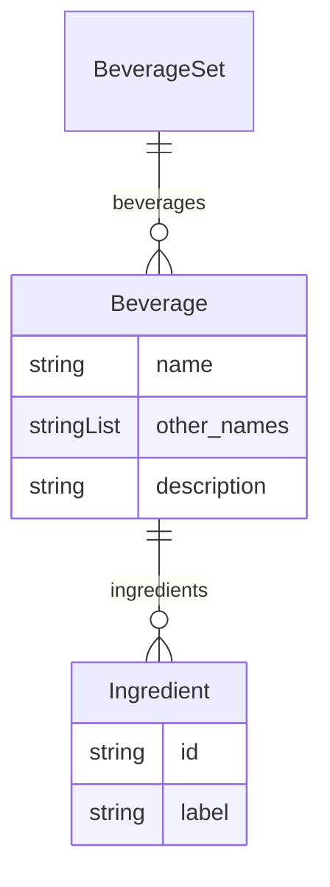

# Class: BeverageSet


URI: [coffee:BeverageSet](http://w3id.org/ontogpt/coffee/BeverageSet)





<!-- no inheritance hierarchy -->


## Slots

| Name | Cardinality and Range | Description | Inheritance |
| ---  | --- | --- | --- |
| [beverages](beverages.md) | 0..* <br/> [Beverage](Beverage.md) |  | direct |


## Identifier and Mapping Information


### Schema Source


* from schema: http://w3id.org/ontogpt/coffee


## Mappings

| Mapping Type | Mapped Value |
| ---  | ---  |
| self | coffee:BeverageSet |
| native | coffee:BeverageSet |


## LinkML Source

<!-- TODO: investigate https://stackoverflow.com/questions/37606292/how-to-create-tabbed-code-blocks-in-mkdocs-or-sphinx -->

### Direct

<details>
```yaml
name: BeverageSet
from_schema: http://w3id.org/ontogpt/coffee
attributes:
  beverages:
    name: beverages
    from_schema: http://w3id.org/ontogpt/coffee
    rank: 1000
    multivalued: true
    range: Beverage
    inlined: true
    inlined_as_list: true
tree_root: true

```
</details>

### Induced

<details>
```yaml
name: BeverageSet
from_schema: http://w3id.org/ontogpt/coffee
attributes:
  beverages:
    name: beverages
    from_schema: http://w3id.org/ontogpt/coffee
    rank: 1000
    multivalued: true
    alias: beverages
    owner: BeverageSet
    domain_of:
    - BeverageSet
    range: Beverage
    inlined: true
    inlined_as_list: true
tree_root: true

```
</details>