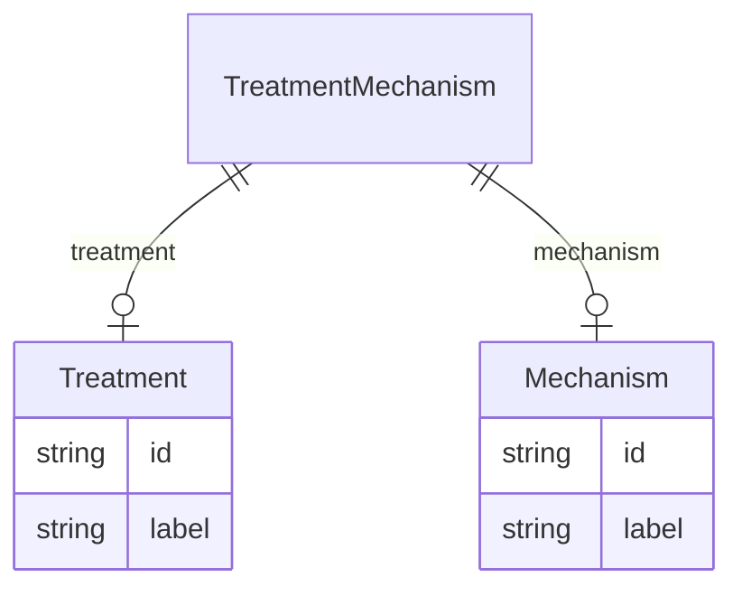

# Class: TreatmentMechanism


URI: [composite_disease:TreatmentMechanism](http://w3id.org/ontogpt/composite_disease/TreatmentMechanism)





## Inheritance
* [CompoundExpression](CompoundExpression.md)
    * **TreatmentMechanism**


## Slots

| Name | Cardinality and Range | Description | Inheritance |
| ---  | --- | --- | --- |
| [treatment](treatment.md) | 0..1 <br/> [Treatment](Treatment.md) |  | direct |
| [mechanism](mechanism.md) | 0..1 <br/> [Mechanism](Mechanism.md) |  | direct |


## Usages

| used by | used in | type | used |
| ---  | --- | --- | --- |
| [CompositeDisease](CompositeDisease.md) | [treatment_mechanisms](treatment_mechanisms.md) | range | [TreatmentMechanism](TreatmentMechanism.md) |


## Identifier and Mapping Information


### Schema Source


* from schema: http://w3id.org/ontogpt/composite_disease


## Mappings

| Mapping Type | Mapped Value |
| ---  | ---  |
| self | composite_disease:TreatmentMechanism |
| native | composite_disease:TreatmentMechanism |


## LinkML Source

<!-- TODO: investigate https://stackoverflow.com/questions/37606292/how-to-create-tabbed-code-blocks-in-mkdocs-or-sphinx -->

### Direct

<details>
```yaml
name: TreatmentMechanism
from_schema: http://w3id.org/ontogpt/composite_disease
is_a: CompoundExpression
attributes:
  treatment:
    name: treatment
    from_schema: http://w3id.org/ontogpt/composite_disease
    rank: 1000
    domain_of:
    - TreatmentMechanism
    - TreatmentAdverseEffect
    - TreatmentEfficacy
    range: Treatment
  mechanism:
    name: mechanism
    from_schema: http://w3id.org/ontogpt/composite_disease
    rank: 1000
    domain_of:
    - TreatmentMechanism
    range: Mechanism

```
</details>

### Induced

<details>
```yaml
name: TreatmentMechanism
from_schema: http://w3id.org/ontogpt/composite_disease
is_a: CompoundExpression
attributes:
  treatment:
    name: treatment
    from_schema: http://w3id.org/ontogpt/composite_disease
    rank: 1000
    alias: treatment
    owner: TreatmentMechanism
    domain_of:
    - TreatmentMechanism
    - TreatmentAdverseEffect
    - TreatmentEfficacy
    range: Treatment
  mechanism:
    name: mechanism
    from_schema: http://w3id.org/ontogpt/composite_disease
    rank: 1000
    alias: mechanism
    owner: TreatmentMechanism
    domain_of:
    - TreatmentMechanism
    range: Mechanism

```
</details>