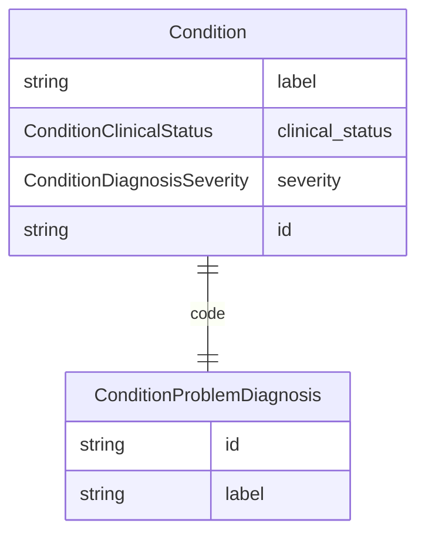

# Class: Condition


URI: [UNKNOWN:Condition](UNKNOWN:Condition)





## Inheritance
* [NamedEntity](NamedEntity.md)
    * **Condition**


## Slots

| Name | Cardinality and Range | Description | Inheritance |
| ---  | --- | --- | --- |
| [label](label.md) | 0..1 <br/> [String](String.md) | The concise name of the condition, problem, or diagnosis | direct |
| [clinical_status](clinical_status.md) | 1 <br/> [ConditionClinicalStatus](ConditionClinicalStatus.md) | The clinical status of the condition | direct |
| [severity](severity.md) | 0..1 <br/> [ConditionDiagnosisSeverity](ConditionDiagnosisSeverity.md) | Subjective severity of condition | direct |
| [code](code.md) | 1 <br/> [ConditionProblemDiagnosis](ConditionProblemDiagnosis.md) | The condition, problem, or diagnosis found in this note | direct |
| [id](id.md) | 1 <br/> [String](String.md) | A unique identifier for the named entity | [NamedEntity](NamedEntity.md) |


## Identifier and Mapping Information


### Schema Source


* from schema: http://w3id.org/ontogpt/condition


## Mappings

| Mapping Type | Mapped Value |
| ---  | ---  |
| self | UNKNOWN:Condition |
| native | UNKNOWN:Condition |


## LinkML Source

<!-- TODO: investigate https://stackoverflow.com/questions/37606292/how-to-create-tabbed-code-blocks-in-mkdocs-or-sphinx -->

### Direct

<details>
```yaml
name: Condition
from_schema: http://w3id.org/ontogpt/condition
is_a: NamedEntity
attributes:
  label:
    name: label
    description: The concise name of the condition, problem, or diagnosis.
    from_schema: http://w3id.org/ontogpt/condition
    rank: 1000
    domain_of:
    - Condition
    - NamedEntity
  clinical_status:
    name: clinical_status
    description: The clinical status of the condition.
    from_schema: http://w3id.org/ontogpt/condition
    rank: 1000
    ifabsent: string("unknown")
    domain_of:
    - Condition
    range: ConditionClinicalStatus
    required: true
  severity:
    name: severity
    description: Subjective severity of condition.
    from_schema: http://w3id.org/ontogpt/condition
    rank: 1000
    domain_of:
    - Condition
    range: ConditionDiagnosisSeverity
  code:
    name: code
    description: The condition, problem, or diagnosis found in this note.
    from_schema: http://w3id.org/ontogpt/condition
    rank: 1000
    domain_of:
    - Condition
    range: ConditionProblemDiagnosis
    required: true
tree_root: true

```
</details>

### Induced

<details>
```yaml
name: Condition
from_schema: http://w3id.org/ontogpt/condition
is_a: NamedEntity
attributes:
  label:
    name: label
    description: The concise name of the condition, problem, or diagnosis.
    from_schema: http://w3id.org/ontogpt/condition
    rank: 1000
    alias: label
    owner: Condition
    domain_of:
    - Condition
    - NamedEntity
  clinical_status:
    name: clinical_status
    description: The clinical status of the condition.
    from_schema: http://w3id.org/ontogpt/condition
    rank: 1000
    ifabsent: string("unknown")
    alias: clinical_status
    owner: Condition
    domain_of:
    - Condition
    range: ConditionClinicalStatus
    required: true
  severity:
    name: severity
    description: Subjective severity of condition.
    from_schema: http://w3id.org/ontogpt/condition
    rank: 1000
    alias: severity
    owner: Condition
    domain_of:
    - Condition
    range: ConditionDiagnosisSeverity
  code:
    name: code
    description: The condition, problem, or diagnosis found in this note.
    from_schema: http://w3id.org/ontogpt/condition
    rank: 1000
    alias: code
    owner: Condition
    domain_of:
    - Condition
    range: ConditionProblemDiagnosis
    required: true
  id:
    name: id
    annotations:
      prompt.skip:
        tag: prompt.skip
        value: 'true'
    description: A unique identifier for the named entity
    comments:
    - this is populated during the grounding and normalization step
    from_schema: http://w3id.org/ontogpt/condition
    rank: 1000
    identifier: true
    alias: id
    owner: Condition
    domain_of:
    - NamedEntity
    - Publication
    range: string
    required: true
tree_root: true

```
</details>