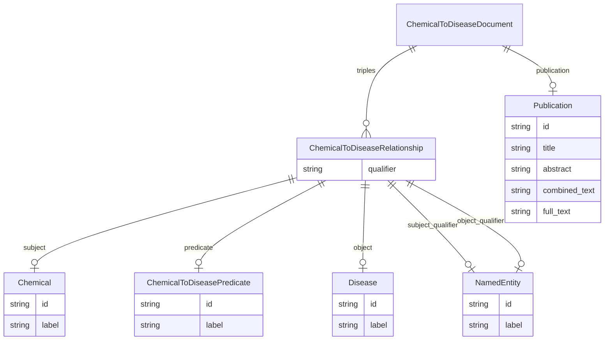

# Class: ChemicalToDiseaseDocument
_A document that contains chemical to disease relations._


URI: [drug:ChemicalToDiseaseDocument](http://w3id.org/ontogpt/drug/ChemicalToDiseaseDocument)





## Inheritance
* [TextWithTriples](TextWithTriples.md)
    * **ChemicalToDiseaseDocument**


## Slots

| Name | Cardinality and Range | Description | Inheritance |
| ---  | --- | --- | --- |
| [publication](publication.md) | 0..1 <br/> [Publication](Publication.md) |  | [TextWithTriples](TextWithTriples.md) |
| [triples](triples.md) | 0..* <br/> [ChemicalToDiseaseRelationship](ChemicalToDiseaseRelationship.md) |  | [TextWithTriples](TextWithTriples.md) |


## Identifier and Mapping Information


### Schema Source


* from schema: http://w3id.org/ontogpt/ctd


## Mappings

| Mapping Type | Mapped Value |
| ---  | ---  |
| self | drug:ChemicalToDiseaseDocument |
| native | drug:ChemicalToDiseaseDocument |


## LinkML Source

<!-- TODO: investigate https://stackoverflow.com/questions/37606292/how-to-create-tabbed-code-blocks-in-mkdocs-or-sphinx -->

### Direct

<details>
```yaml
name: ChemicalToDiseaseDocument
description: A document that contains chemical to disease relations.
from_schema: http://w3id.org/ontogpt/ctd
rank: 1000
is_a: TextWithTriples
slot_usage:
  triples:
    name: triples
    annotations:
      prompt:
        tag: prompt
        value: 'A semi-colon separated list of chemical to disease relationships,
          where the relationship is either INDUCES or TREATS. for example: Lidocaine
          INDUCES cardiac asystole;  Hydroxychloroquine NOT TREATS COVID-19; Methyldopa
          INDUCES Hypotension; Monosodium Glutamate NOT INDUCES Headache; Imatinib
          TREATS cancer'
      exclude:
        tag: exclude
        value: Lidocaine, cardiac asystole, Hydroxychloroquine, COVID-19, Methyldopa,
          Headache, Imatinib, cancer
    domain_of:
    - TextWithTriples
    range: ChemicalToDiseaseRelationship

```
</details>

### Induced

<details>
```yaml
name: ChemicalToDiseaseDocument
description: A document that contains chemical to disease relations.
from_schema: http://w3id.org/ontogpt/ctd
rank: 1000
is_a: TextWithTriples
slot_usage:
  triples:
    name: triples
    annotations:
      prompt:
        tag: prompt
        value: 'A semi-colon separated list of chemical to disease relationships,
          where the relationship is either INDUCES or TREATS. for example: Lidocaine
          INDUCES cardiac asystole;  Hydroxychloroquine NOT TREATS COVID-19; Methyldopa
          INDUCES Hypotension; Monosodium Glutamate NOT INDUCES Headache; Imatinib
          TREATS cancer'
      exclude:
        tag: exclude
        value: Lidocaine, cardiac asystole, Hydroxychloroquine, COVID-19, Methyldopa,
          Headache, Imatinib, cancer
    domain_of:
    - TextWithTriples
    range: ChemicalToDiseaseRelationship
attributes:
  publication:
    name: publication
    annotations:
      prompt.skip:
        tag: prompt.skip
        value: 'true'
    from_schema: http://w3id.org/ontogpt/ctd
    rank: 1000
    alias: publication
    owner: ChemicalToDiseaseDocument
    domain_of:
    - TextWithTriples
    range: Publication
    inlined: true
  triples:
    name: triples
    annotations:
      prompt:
        tag: prompt
        value: 'A semi-colon separated list of chemical to disease relationships,
          where the relationship is either INDUCES or TREATS. for example: Lidocaine
          INDUCES cardiac asystole;  Hydroxychloroquine NOT TREATS COVID-19; Methyldopa
          INDUCES Hypotension; Monosodium Glutamate NOT INDUCES Headache; Imatinib
          TREATS cancer'
      exclude:
        tag: exclude
        value: Lidocaine, cardiac asystole, Hydroxychloroquine, COVID-19, Methyldopa,
          Headache, Imatinib, cancer
    from_schema: http://w3id.org/ontogpt/ctd
    rank: 1000
    multivalued: true
    alias: triples
    owner: ChemicalToDiseaseDocument
    domain_of:
    - TextWithTriples
    range: ChemicalToDiseaseRelationship
    inlined: true
    inlined_as_list: true

```
</details>