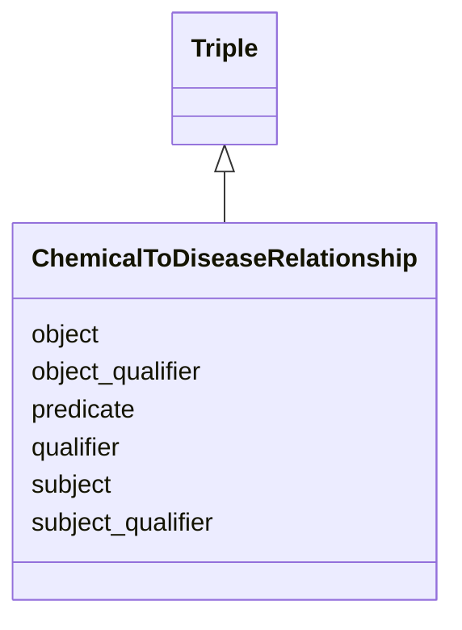

# Class: ChemicalToDiseaseRelationship
_A triple where the subject is a chemical and the object is a disease._


URI: [drug:ChemicalToDiseaseRelationship](http://w3id.org/ontogpt/drug/ChemicalToDiseaseRelationship)





## Inheritance
* [CompoundExpression](CompoundExpression.md)
    * [Triple](Triple.md)
        * **ChemicalToDiseaseRelationship**


## Slots

| Name | Cardinality and Range | Description | Inheritance |
| ---  | --- | --- | --- |
| [predicate](predicate.md) | 0..1 <br/> [RelationshipType](RelationshipType.md) |  | [Triple](Triple.md) |
| [object_qualifier](object_qualifier.md) | 0..1 <br/> [NamedEntity](NamedEntity.md) | An optional qualifier or modifier for the object of the statement, e | [Triple](Triple.md) |
| [qualifier](qualifier.md) | 0..1 <br/> [xsd:string](xsd:string) | A qualifier for the statements, e | [Triple](Triple.md) |
| [object](object.md) | 0..1 <br/> [NamedEntity](NamedEntity.md) |  | [Triple](Triple.md) |
| [subject](subject.md) | 0..1 <br/> [NamedEntity](NamedEntity.md) |  | [Triple](Triple.md) |
| [subject_qualifier](subject_qualifier.md) | 0..1 <br/> [NamedEntity](NamedEntity.md) | An optional qualifier or modifier for the subject of the statement, e | [Triple](Triple.md) |


## Usages

| used by | used in | type | used |
| ---  | --- | --- | --- |
| [ChemicalToDiseaseDocument](ChemicalToDiseaseDocument.md) | [triples](triples.md) | range | [ChemicalToDiseaseRelationship](ChemicalToDiseaseRelationship.md) |


## Identifier and Mapping Information


### Schema Source


* from schema: http://w3id.org/ontogpt/ctd


## Mappings

| Mapping Type | Mapped Value |
| ---  | ---  |
| self | drug:ChemicalToDiseaseRelationship |
| native | drug:ChemicalToDiseaseRelationship |


## LinkML Source

<!-- TODO: investigate https://stackoverflow.com/questions/37606292/how-to-create-tabbed-code-blocks-in-mkdocs-or-sphinx -->

### Direct

<details>
```yaml
name: ChemicalToDiseaseRelationship
description: A triple where the subject is a chemical and the object is a disease.
from_schema: http://w3id.org/ontogpt/ctd
rank: 1000
is_a: Triple
slot_usage:
  subject:
    name: subject
    description: 'The chemical substance, drug, or small molecule.  or example: Lidocaine,
      Monosodium Glutamate, Imatinib.'
    domain_of:
    - Triple
    - Triple
    range: Chemical
  object:
    name: object
    description: The disease or condition that is being treated or induced by the
      chemical. For example, asthma, cancer, covid-19, cardiac asystole, Hypotension,
      Headache.
    domain_of:
    - Triple
    - Triple
    range: Disease
  predicate:
    name: predicate
    description: The relationship type, e.g. INDUCES, TREATS.
    domain_of:
    - Triple
    - Triple
    range: ChemicalToDiseasePredicate
  subject_qualifier:
    name: subject_qualifier
    description: An optional qualifier or modifier for the chemical, e.g. "high dose"
      or "intravenously administered"
    domain_of:
    - Triple
    - Triple
    range: NamedEntity
  object_qualifier:
    name: object_qualifier
    description: An optional qualifier or modifier for the disease, e.g. "severe"
      or "with additional complications"
    domain_of:
    - Triple
    - Triple
    range: NamedEntity

```
</details>

### Induced

<details>
```yaml
name: ChemicalToDiseaseRelationship
description: A triple where the subject is a chemical and the object is a disease.
from_schema: http://w3id.org/ontogpt/ctd
rank: 1000
is_a: Triple
slot_usage:
  subject:
    name: subject
    description: 'The chemical substance, drug, or small molecule.  or example: Lidocaine,
      Monosodium Glutamate, Imatinib.'
    domain_of:
    - Triple
    - Triple
    range: Chemical
  object:
    name: object
    description: The disease or condition that is being treated or induced by the
      chemical. For example, asthma, cancer, covid-19, cardiac asystole, Hypotension,
      Headache.
    domain_of:
    - Triple
    - Triple
    range: Disease
  predicate:
    name: predicate
    description: The relationship type, e.g. INDUCES, TREATS.
    domain_of:
    - Triple
    - Triple
    range: ChemicalToDiseasePredicate
  subject_qualifier:
    name: subject_qualifier
    description: An optional qualifier or modifier for the chemical, e.g. "high dose"
      or "intravenously administered"
    domain_of:
    - Triple
    - Triple
    range: NamedEntity
  object_qualifier:
    name: object_qualifier
    description: An optional qualifier or modifier for the disease, e.g. "severe"
      or "with additional complications"
    domain_of:
    - Triple
    - Triple
    range: NamedEntity
attributes:
  subject:
    name: subject
    description: 'The chemical substance, drug, or small molecule.  or example: Lidocaine,
      Monosodium Glutamate, Imatinib.'
    from_schema: http://w3id.org/ontogpt/core
    rank: 1000
    alias: subject
    owner: ChemicalToDiseaseRelationship
    domain_of:
    - Triple
    - Triple
    range: Chemical
  predicate:
    name: predicate
    description: The relationship type, e.g. INDUCES, TREATS.
    from_schema: http://w3id.org/ontogpt/core
    rank: 1000
    alias: predicate
    owner: ChemicalToDiseaseRelationship
    domain_of:
    - Triple
    - Triple
    range: ChemicalToDiseasePredicate
  object:
    name: object
    description: The disease or condition that is being treated or induced by the
      chemical. For example, asthma, cancer, covid-19, cardiac asystole, Hypotension,
      Headache.
    from_schema: http://w3id.org/ontogpt/core
    rank: 1000
    alias: object
    owner: ChemicalToDiseaseRelationship
    domain_of:
    - Triple
    - Triple
    range: Disease
  qualifier:
    name: qualifier
    description: A qualifier for the statements, e.g. "NOT" for negation
    from_schema: http://w3id.org/ontogpt/core
    rank: 1000
    alias: qualifier
    owner: ChemicalToDiseaseRelationship
    domain_of:
    - Triple
    range: string
  subject_qualifier:
    name: subject_qualifier
    description: An optional qualifier or modifier for the chemical, e.g. "high dose"
      or "intravenously administered"
    from_schema: http://w3id.org/ontogpt/core
    rank: 1000
    alias: subject_qualifier
    owner: ChemicalToDiseaseRelationship
    domain_of:
    - Triple
    - Triple
    range: NamedEntity
  object_qualifier:
    name: object_qualifier
    description: An optional qualifier or modifier for the disease, e.g. "severe"
      or "with additional complications"
    from_schema: http://w3id.org/ontogpt/core
    rank: 1000
    alias: object_qualifier
    owner: ChemicalToDiseaseRelationship
    domain_of:
    - Triple
    - Triple
    range: NamedEntity

```
</details>