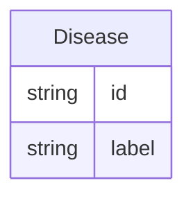

# Class: Disease


URI: [drug:Disease](http://w3id.org/ontogpt/drug/Disease)





## Inheritance
* [NamedEntity](NamedEntity.md)
    * **Disease**


## Slots

| Name | Cardinality and Range | Description | Inheritance |
| ---  | --- | --- | --- |
| [id](id.md) | 1..1 <br/> [String](String.md) | A unique identifier for the named entity | [NamedEntity](NamedEntity.md) |
| [label](label.md) | 0..1 <br/> [String](String.md) | The label (name) of the named thing | [NamedEntity](NamedEntity.md) |


## Usages

| used by | used in | type | used |
| ---  | --- | --- | --- |
| [ChemicalToDiseaseRelationship](ChemicalToDiseaseRelationship.md) | [object](object.md) | range | [Disease](Disease.md) |


## Identifier and Mapping Information


### Valid ID Prefixes

Instances of this class *should* have identifiers with one of the following prefixes:

* MESH


### Annotations

| property | value |
| --- | --- |
| annotators | sqlite:obo:mesh, sqlite:obo:mondo, sqlite:obo:hp, sqlite:obo:ncit, sqlite:obo:doid, bioportal:meddra || prompt.examples | cardiac asystole, COVID-19, Headache, cancer |


### Schema Source


* from schema: http://w3id.org/ontogpt/ctd


## Mappings

| Mapping Type | Mapped Value |
| ---  | ---  |
| self | drug:Disease |
| native | drug:Disease |


## LinkML Source

<!-- TODO: investigate https://stackoverflow.com/questions/37606292/how-to-create-tabbed-code-blocks-in-mkdocs-or-sphinx -->

### Direct

<details>
```yaml
name: Disease
id_prefixes:
- MESH
annotations:
  annotators:
    tag: annotators
    value: sqlite:obo:mesh, sqlite:obo:mondo, sqlite:obo:hp, sqlite:obo:ncit, sqlite:obo:doid,
      bioportal:meddra
  prompt.examples:
    tag: prompt.examples
    value: cardiac asystole, COVID-19, Headache, cancer
from_schema: http://w3id.org/ontogpt/ctd
rank: 1000
is_a: NamedEntity
slot_usage:
  id:
    name: id
    values_from:
    - MeshDiseaseIdentifier
    domain_of:
    - NamedEntity
    - Publication
    pattern: ^MESH:[CD][0-9]{6}$

```
</details>

### Induced

<details>
```yaml
name: Disease
id_prefixes:
- MESH
annotations:
  annotators:
    tag: annotators
    value: sqlite:obo:mesh, sqlite:obo:mondo, sqlite:obo:hp, sqlite:obo:ncit, sqlite:obo:doid,
      bioportal:meddra
  prompt.examples:
    tag: prompt.examples
    value: cardiac asystole, COVID-19, Headache, cancer
from_schema: http://w3id.org/ontogpt/ctd
rank: 1000
is_a: NamedEntity
slot_usage:
  id:
    name: id
    values_from:
    - MeshDiseaseIdentifier
    domain_of:
    - NamedEntity
    - Publication
    pattern: ^MESH:[CD][0-9]{6}$
attributes:
  id:
    name: id
    description: A unique identifier for the named entity
    from_schema: http://w3id.org/ontogpt/ctd
    rank: 1000
    values_from:
    - MeshDiseaseIdentifier
    identifier: true
    alias: id
    owner: Disease
    domain_of:
    - NamedEntity
    - Publication
    range: string
    pattern: ^MESH:[CD][0-9]{6}$
  label:
    name: label
    annotations:
      owl:
        tag: owl
        value: AnnotationProperty, AnnotationAssertion
    description: The label (name) of the named thing
    from_schema: http://w3id.org/ontogpt/ctd
    aliases:
    - name
    rank: 1000
    slot_uri: rdfs:label
    alias: label
    owner: Disease
    domain_of:
    - NamedEntity
    range: string

```
</details>