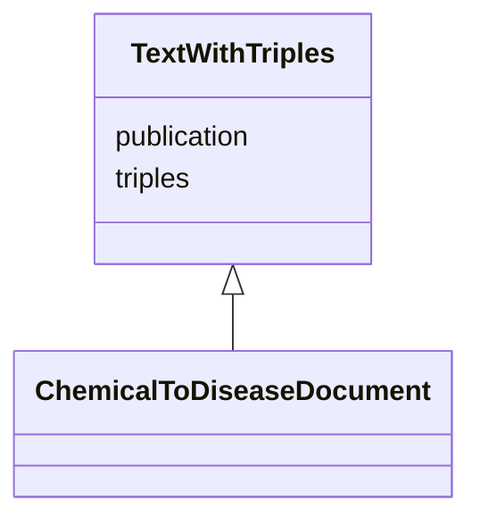

# Class: TextWithTriples


URI: [core:TextWithTriples](http://w3id.org/ontogpt/core/TextWithTriples)





## Inheritance
* **TextWithTriples**
    * [ChemicalToDiseaseDocument](ChemicalToDiseaseDocument.md)


## Slots

| Name | Cardinality and Range | Description | Inheritance |
| ---  | --- | --- | --- |
| [publication](publication.md) | 0..1 <br/> [Publication](Publication.md) |  | direct |
| [triples](triples.md) | 0..* <br/> [Triple](Triple.md) |  | direct |


## Identifier and Mapping Information


### Schema Source


* from schema: http://w3id.org/ontogpt/core


## Mappings

| Mapping Type | Mapped Value |
| ---  | ---  |
| self | core:TextWithTriples |
| native | core:TextWithTriples |


## LinkML Source

<!-- TODO: investigate https://stackoverflow.com/questions/37606292/how-to-create-tabbed-code-blocks-in-mkdocs-or-sphinx -->

### Direct

<details>
```yaml
name: TextWithTriples
from_schema: http://w3id.org/ontogpt/core
rank: 1000
attributes:
  publication:
    name: publication
    annotations:
      prompt.skip:
        tag: prompt.skip
        value: 'true'
    from_schema: http://w3id.org/ontogpt/core
    rank: 1000
    range: Publication
    inlined: true
  triples:
    name: triples
    from_schema: http://w3id.org/ontogpt/core
    rank: 1000
    multivalued: true
    range: Triple
    inlined: true
    inlined_as_list: true

```
</details>

### Induced

<details>
```yaml
name: TextWithTriples
from_schema: http://w3id.org/ontogpt/core
rank: 1000
attributes:
  publication:
    name: publication
    annotations:
      prompt.skip:
        tag: prompt.skip
        value: 'true'
    from_schema: http://w3id.org/ontogpt/core
    rank: 1000
    alias: publication
    owner: TextWithTriples
    domain_of:
    - TextWithTriples
    range: Publication
    inlined: true
  triples:
    name: triples
    from_schema: http://w3id.org/ontogpt/core
    rank: 1000
    multivalued: true
    alias: triples
    owner: TextWithTriples
    domain_of:
    - TextWithTriples
    range: Triple
    inlined: true
    inlined_as_list: true

```
</details>