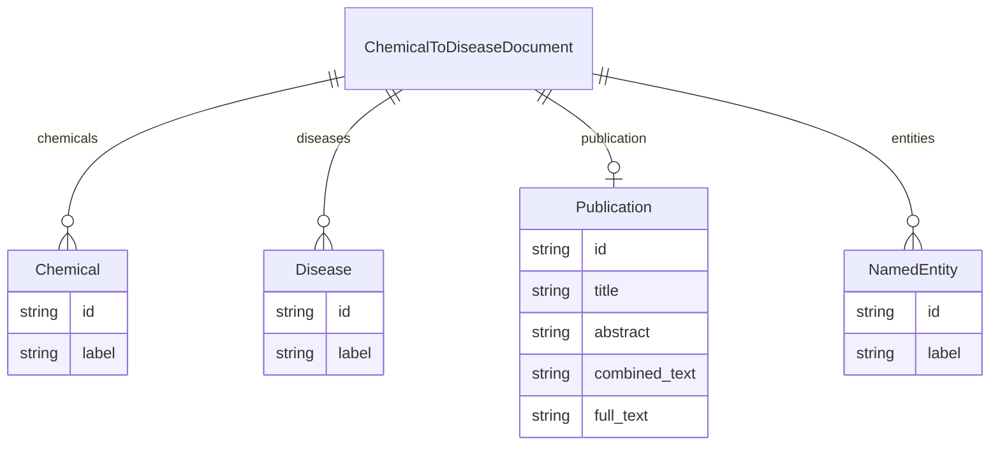

# Class: ChemicalToDiseaseDocument


_A document that contains chemical and disease entities._


URI: [ctdner:ChemicalToDiseaseDocument](http://w3id.org/ontogpt/ctd_nerChemicalToDiseaseDocument)





## Inheritance
* [TextWithEntity](TextWithEntity.md)
    * **ChemicalToDiseaseDocument**


## Slots

| Name | Cardinality and Range | Description | Inheritance |
| ---  | --- | --- | --- |
| [chemicals](chemicals.md) | * <br/> [Chemical](Chemical.md) | One or more chemical substances, drugs, or small molecules | direct |
| [diseases](diseases.md) | * <br/> [Disease](Disease.md) | One or more diseases or conditions | direct |
| [publication](publication.md) | 0..1 <br/> [Publication](Publication.md) |  | [TextWithEntity](TextWithEntity.md) |
| [entities](entities.md) | * <br/> [NamedEntity](NamedEntity.md) |  | [TextWithEntity](TextWithEntity.md) |


## Identifier and Mapping Information


### Schema Source


* from schema: http://w3id.org/ontogpt/ctd_ner


## Mappings

| Mapping Type | Mapped Value |
| ---  | ---  |
| self | ctdner:ChemicalToDiseaseDocument |
| native | ctdner:ChemicalToDiseaseDocument |


## LinkML Source

<!-- TODO: investigate https://stackoverflow.com/questions/37606292/how-to-create-tabbed-code-blocks-in-mkdocs-or-sphinx -->

### Direct

<details>
```yaml
name: ChemicalToDiseaseDocument
description: A document that contains chemical and disease entities.
from_schema: http://w3id.org/ontogpt/ctd_ner
is_a: TextWithEntity
attributes:
  chemicals:
    name: chemicals
    annotations:
      prompt:
        tag: prompt
        value: 'A semi-colon separated list of chemical names, for example: Lidocaine;
          Hydroxychloroquine; Methyldopa; Monosodium Glutamate; Imatinib'
    description: One or more chemical substances, drugs, or small molecules.
    from_schema: http://w3id.org/ontogpt/ctd_ner
    rank: 1000
    multivalued: true
    domain_of:
    - ChemicalToDiseaseDocument
    range: Chemical
  diseases:
    name: diseases
    annotations:
      prompt:
        tag: prompt
        value: 'A semi-colon separated list of disease names, for example: cardiac
          asystole; COVID-19; Hypotension; Headache; cancer'
    description: One or more diseases or conditions.
    from_schema: http://w3id.org/ontogpt/ctd_ner
    rank: 1000
    multivalued: true
    domain_of:
    - ChemicalToDiseaseDocument
    range: Disease

```
</details>

### Induced

<details>
```yaml
name: ChemicalToDiseaseDocument
description: A document that contains chemical and disease entities.
from_schema: http://w3id.org/ontogpt/ctd_ner
is_a: TextWithEntity
attributes:
  chemicals:
    name: chemicals
    annotations:
      prompt:
        tag: prompt
        value: 'A semi-colon separated list of chemical names, for example: Lidocaine;
          Hydroxychloroquine; Methyldopa; Monosodium Glutamate; Imatinib'
    description: One or more chemical substances, drugs, or small molecules.
    from_schema: http://w3id.org/ontogpt/ctd_ner
    rank: 1000
    multivalued: true
    alias: chemicals
    owner: ChemicalToDiseaseDocument
    domain_of:
    - ChemicalToDiseaseDocument
    range: Chemical
  diseases:
    name: diseases
    annotations:
      prompt:
        tag: prompt
        value: 'A semi-colon separated list of disease names, for example: cardiac
          asystole; COVID-19; Hypotension; Headache; cancer'
    description: One or more diseases or conditions.
    from_schema: http://w3id.org/ontogpt/ctd_ner
    rank: 1000
    multivalued: true
    alias: diseases
    owner: ChemicalToDiseaseDocument
    domain_of:
    - ChemicalToDiseaseDocument
    range: Disease
  publication:
    name: publication
    annotations:
      prompt.skip:
        tag: prompt.skip
        value: 'true'
    from_schema: http://w3id.org/ontogpt/ctd_ner
    alias: publication
    owner: ChemicalToDiseaseDocument
    domain_of:
    - TextWithTriples
    - TextWithEntity
    range: Publication
    inlined: true
  entities:
    name: entities
    from_schema: http://w3id.org/ontogpt/ctd_ner
    rank: 1000
    multivalued: true
    alias: entities
    owner: ChemicalToDiseaseDocument
    domain_of:
    - TextWithEntity
    range: NamedEntity

```
</details>