# Class: DataSubset


_A subset of a dataset, likely containing multiple files of multiple potential purposes and properties._


URI: [data_sheets_schema:DataSubset](https://w3id.org/bridge2ai/data-sheets-schema/DataSubset)

```mermaid
erDiagram
DataSubset {
    string is_data_split  
    string is_subpopulation  
    integer bytes  
    string dialect  
    EncodingEnum encoding  
    FormatEnum format  
    string hash  
    string md5  
    string media_type  
    string path  
    string sha256  
    string is_tabular  
    CompressionEnum compression  
    uriorcurie conforms_to  
    uriorcurie conforms_to_class  
    uriorcurie conforms_to_schema  
    stringList created_by  
    string created_on  
    string description  
    uriorcurie doi  
    uri download_url  
    string id  
    string issued  
    stringList keywords  
    string language  
    string last_updated_on  
    string license  
    string modified_by  
    string page  
    uriorcurie publisher  
    uriorcurie status  
    string title  
    string version  
    string was_derived_from  
}
Deidentification {
    stringList description  
    string id  
    string name  
}
Software {
    string version  
    string license  
    string url  
    string id  
    string name  
    string description  
}
ExtensionMechanism {
    stringList description  
    string id  
    string name  
}
VersionAccess {
    stringList description  
    string id  
    string name  
}
RetentionLimits {
    stringList description  
    string id  
    string name  
}
UpdatePlan {
    stringList description  
    string id  
    string name  
}
Erratum {
    stringList description  
    string id  
    string name  
}
Maintainer {
    stringList description  
    string id  
    string name  
}
ExportControlRegulatoryRestrictions {
    stringList description  
    string id  
    string name  
}
IPRestrictions {
    stringList description  
    string id  
    string name  
}
LicenseAndUseTerms {
    stringList description  
    string id  
    string name  
}
DistributionDate {
    stringList description  
    string id  
    string name  
}
DistributionFormat {
    stringList description  
    string id  
    string name  
}
DiscouragedUse {
    stringList description  
    string id  
    string name  
}
FutureUseImpact {
    stringList description  
    string id  
    string name  
}
OtherTask {
    stringList description  
    string id  
    string name  
}
UseRepository {
    stringList description  
    string id  
    string name  
}
ExistingUse {
    stringList description  
    string id  
    string name  
}
RawData {
    stringList description  
    string id  
    string name  
}
LabelingStrategy {
    stringList description  
    string id  
    string name  
}
CleaningStrategy {
    stringList description  
    string id  
    string name  
}
PreprocessingStrategy {
    stringList description  
    string id  
    string name  
}
DataProtectionImpact {
    stringList description  
    string id  
    string name  
}
EthicalReview {
    stringList description  
    string id  
    string name  
}
CollectionTimeframe {
    stringList description  
    string id  
    string name  
}
DataCollector {
    stringList description  
    string id  
    string name  
}
SamplingStrategy {
    stringList is_sample  
    stringList is_random  
    stringList source_data  
    stringList is_representative  
    stringList representative_verification  
    stringList why_not_representative  
    stringList strategies  
    string id  
    string name  
    string description  
}
CollectionMechanism {
    stringList description  
    string id  
    string name  
}
InstanceAcquisition {
    stringList description  
    string was_directly_observed  
    string was_reported_by_subjects  
    string was_inferred_derived  
    string was_validated_verified  
    string id  
    string name  
}
SensitiveElement {
    stringList description  
    string id  
    string name  
}
Subpopulation {
    stringList identification  
    stringList distribution  
    string id  
    string name  
    string description  
}
ContentWarning {
    stringList warnings  
    string id  
    string name  
    string description  
}
Confidentiality {
    stringList description  
    string id  
    string name  
}
ExternalResource {
    stringList external_resources  
    stringList future_guarantees  
    stringList archival  
    stringList restrictions  
    string id  
    string name  
    string description  
}
DataAnomaly {
    stringList description  
    string id  
    string name  
}
Instance {
    string representation  
    string instance_type  
    string data_type  
    integer counts  
    string label  
    string id  
    string name  
    string description  
}
MissingInfo {
    stringList missing  
    stringList why_missing  
    string id  
    string name  
    string description  
}
FundingMechanism {
    string id  
    string name  
    string description  
}
Grant {
    string grant_number  
    string id  
    string name  
    string description  
}
Grantor {
    string email  
    ror_identifier ror_id  
    wikidata_identifier wikidata_id  
    string id  
    string name  
    string description  
}
Creator {
    string id  
    string name  
    string description  
}
Organization {
    string email  
    ror_identifier ror_id  
    wikidata_identifier wikidata_id  
    string id  
    string name  
    string description  
}
Person {
    string email  
    string id  
    string name  
    string description  
}
AddressingGap {
    string response  
    string id  
    string name  
    string description  
}
Task {
    string response  
    string id  
    string name  
    string description  
}
Purpose {
    string response  
    string id  
    string name  
    string description  
}

DataSubset ||--}o Purpose : "purposes"
DataSubset ||--}o Task : "tasks"
DataSubset ||--}o AddressingGap : "addressing_gaps"
DataSubset ||--}o Creator : "creators"
DataSubset ||--}o FundingMechanism : "funders"
DataSubset ||--}o DataSubset : "subsets"
DataSubset ||--}o Instance : "instances"
DataSubset ||--}o DataAnomaly : "anomalies"
DataSubset ||--}o ExternalResource : "external_resources"
DataSubset ||--}o Confidentiality : "confidential_elements"
DataSubset ||--}o ContentWarning : "content_warnings"
DataSubset ||--}o Subpopulation : "subpopulations"
DataSubset ||--}o SensitiveElement : "sensitive_elements"
DataSubset ||--}o InstanceAcquisition : "acquisition_methods"
DataSubset ||--}o CollectionMechanism : "collection_mechanisms"
DataSubset ||--}o SamplingStrategy : "sampling_strategies"
DataSubset ||--}o DataCollector : "data_collectors"
DataSubset ||--}o CollectionTimeframe : "collection_timeframes"
DataSubset ||--}o EthicalReview : "ethical_reviews"
DataSubset ||--}o DataProtectionImpact : "data_protection_impacts"
DataSubset ||--}o PreprocessingStrategy : "preprocessing_strategies"
DataSubset ||--}o CleaningStrategy : "cleaning_strategies"
DataSubset ||--}o LabelingStrategy : "labeling_strategies"
DataSubset ||--}o RawData : "raw_sources"
DataSubset ||--}o ExistingUse : "existing_uses"
DataSubset ||--}o UseRepository : "use_repository"
DataSubset ||--}o OtherTask : "other_tasks"
DataSubset ||--}o FutureUseImpact : "future_use_impacts"
DataSubset ||--}o DiscouragedUse : "discouraged_uses"
DataSubset ||--}o DistributionFormat : "distribution_formats"
DataSubset ||--}o DistributionDate : "distribution_dates"
DataSubset ||--|o LicenseAndUseTerms : "license_and_use_terms"
DataSubset ||--|o IPRestrictions : "ip_restrictions"
DataSubset ||--|o ExportControlRegulatoryRestrictions : "regulatory_restrictions"
DataSubset ||--}o Maintainer : "maintainers"
DataSubset ||--}o Erratum : "errata"
DataSubset ||--|o UpdatePlan : "updates"
DataSubset ||--|o RetentionLimits : "retention_limit"
DataSubset ||--|o VersionAccess : "version_access"
DataSubset ||--|o ExtensionMechanism : "extension_mechanism"
DataSubset ||--|o Deidentification : "is_deidentified"
Deidentification ||--}o Software : "used_software"
ExtensionMechanism ||--}o Software : "used_software"
VersionAccess ||--}o Software : "used_software"
RetentionLimits ||--}o Software : "used_software"
UpdatePlan ||--}o Software : "used_software"
Erratum ||--}o Software : "used_software"
Maintainer ||--}o Software : "used_software"
ExportControlRegulatoryRestrictions ||--}o Software : "used_software"
IPRestrictions ||--}o Software : "used_software"
LicenseAndUseTerms ||--}o Software : "used_software"
DistributionDate ||--}o Software : "used_software"
DistributionFormat ||--}o Software : "used_software"
DiscouragedUse ||--}o Software : "used_software"
FutureUseImpact ||--}o Software : "used_software"
OtherTask ||--}o Software : "used_software"
UseRepository ||--}o Software : "used_software"
ExistingUse ||--}o Software : "used_software"
RawData ||--}o Software : "used_software"
LabelingStrategy ||--}o Software : "used_software"
CleaningStrategy ||--}o Software : "used_software"
PreprocessingStrategy ||--}o Software : "used_software"
DataProtectionImpact ||--}o Software : "used_software"
EthicalReview ||--}o Software : "used_software"
CollectionTimeframe ||--}o Software : "used_software"
DataCollector ||--}o Software : "used_software"
SamplingStrategy ||--}o Software : "used_software"
CollectionMechanism ||--}o Software : "used_software"
InstanceAcquisition ||--}o Software : "used_software"
SensitiveElement ||--}o Software : "used_software"
Subpopulation ||--}o Software : "used_software"
ContentWarning ||--}o Software : "used_software"
Confidentiality ||--}o Software : "used_software"
ExternalResource ||--}o Software : "used_software"
DataAnomaly ||--}o Software : "used_software"
Instance ||--}o SamplingStrategy : "sampling_strategies"
Instance ||--}o MissingInfo : "missing_information"
Instance ||--}o Software : "used_software"
MissingInfo ||--}o Software : "used_software"
FundingMechanism ||--|o Grantor : "grantor"
FundingMechanism ||--|o Grant : "grant"
FundingMechanism ||--}o Software : "used_software"
Creator ||--|o Person : "principal_investigator"
Creator ||--|o Organization : "affiliation"
Creator ||--}o Software : "used_software"
Person ||--}o Organization : "affiliation"
AddressingGap ||--}o Software : "used_software"
Task ||--}o Software : "used_software"
Purpose ||--}o Software : "used_software"

```





## Inheritance
* [Information](Information.md)
    * [Dataset](Dataset.md)
        * **DataSubset**


## Slots

| Name | Cardinality and Range | Description | Inheritance |
| ---  | --- | --- | --- |
| [is_data_split](is_data_split.md) | 0..1 <br/> [String](String.md) | Is this subset a split of the larger dataset, e | direct |
| [is_subpopulation](is_subpopulation.md) | 0..1 <br/> [String](String.md) | Is this subset a subpopulation of the larger dataset, e | direct |
| [bytes](bytes.md) | 0..1 <br/> [Integer](Integer.md) | Size of the data in bytes | [Dataset](Dataset.md) |
| [dialect](dialect.md) | 0..1 <br/> [String](String.md) |  | [Dataset](Dataset.md) |
| [encoding](encoding.md) | 0..1 <br/> [EncodingEnum](EncodingEnum.md) | The encoding of the data | [Dataset](Dataset.md) |
| [format](format.md) | 0..1 <br/> [FormatEnum](FormatEnum.md) | The format of the data | [Dataset](Dataset.md) |
| [hash](hash.md) | 0..1 <br/> [String](String.md) | The hash representation of the data, e | [Dataset](Dataset.md) |
| [md5](md5.md) | 0..1 <br/> [String](String.md) | The md5 hash representation of the data | [Dataset](Dataset.md) |
| [media_type](media_type.md) | 0..1 <br/> [String](String.md) | The media type of the data | [Dataset](Dataset.md) |
| [path](path.md) | 0..1 <br/> [String](String.md) |  | [Dataset](Dataset.md) |
| [sha256](sha256.md) | 0..1 <br/> [String](String.md) | The sha256 hash representation of the data | [Dataset](Dataset.md) |
| [purposes](purposes.md) | * <br/> [Purpose](Purpose.md) |  | [Dataset](Dataset.md) |
| [tasks](tasks.md) | * <br/> [Task](Task.md) |  | [Dataset](Dataset.md) |
| [addressing_gaps](addressing_gaps.md) | * <br/> [AddressingGap](AddressingGap.md) |  | [Dataset](Dataset.md) |
| [creators](creators.md) | * <br/> [Creator](Creator.md) |  | [Dataset](Dataset.md) |
| [funders](funders.md) | * <br/> [FundingMechanism](FundingMechanism.md) |  | [Dataset](Dataset.md) |
| [subsets](subsets.md) | * <br/> [DataSubset](DataSubset.md) |  | [Dataset](Dataset.md) |
| [instances](instances.md) | * <br/> [Instance](Instance.md) |  | [Dataset](Dataset.md) |
| [anomalies](anomalies.md) | * <br/> [DataAnomaly](DataAnomaly.md) |  | [Dataset](Dataset.md) |
| [external_resources](external_resources.md) | * <br/> [ExternalResource](ExternalResource.md) |  | [Dataset](Dataset.md) |
| [confidential_elements](confidential_elements.md) | * <br/> [Confidentiality](Confidentiality.md) |  | [Dataset](Dataset.md) |
| [content_warnings](content_warnings.md) | * <br/> [ContentWarning](ContentWarning.md) |  | [Dataset](Dataset.md) |
| [subpopulations](subpopulations.md) | * <br/> [Subpopulation](Subpopulation.md) |  | [Dataset](Dataset.md) |
| [sensitive_elements](sensitive_elements.md) | * <br/> [SensitiveElement](SensitiveElement.md) |  | [Dataset](Dataset.md) |
| [acquisition_methods](acquisition_methods.md) | * <br/> [InstanceAcquisition](InstanceAcquisition.md) |  | [Dataset](Dataset.md) |
| [collection_mechanisms](collection_mechanisms.md) | * <br/> [CollectionMechanism](CollectionMechanism.md) |  | [Dataset](Dataset.md) |
| [sampling_strategies](sampling_strategies.md) | * <br/> [SamplingStrategy](SamplingStrategy.md) |  | [Dataset](Dataset.md) |
| [data_collectors](data_collectors.md) | * <br/> [DataCollector](DataCollector.md) |  | [Dataset](Dataset.md) |
| [collection_timeframes](collection_timeframes.md) | * <br/> [CollectionTimeframe](CollectionTimeframe.md) |  | [Dataset](Dataset.md) |
| [ethical_reviews](ethical_reviews.md) | * <br/> [EthicalReview](EthicalReview.md) |  | [Dataset](Dataset.md) |
| [data_protection_impacts](data_protection_impacts.md) | * <br/> [DataProtectionImpact](DataProtectionImpact.md) |  | [Dataset](Dataset.md) |
| [preprocessing_strategies](preprocessing_strategies.md) | * <br/> [PreprocessingStrategy](PreprocessingStrategy.md) |  | [Dataset](Dataset.md) |
| [cleaning_strategies](cleaning_strategies.md) | * <br/> [CleaningStrategy](CleaningStrategy.md) |  | [Dataset](Dataset.md) |
| [labeling_strategies](labeling_strategies.md) | * <br/> [LabelingStrategy](LabelingStrategy.md) |  | [Dataset](Dataset.md) |
| [raw_sources](raw_sources.md) | * <br/> [RawData](RawData.md) |  | [Dataset](Dataset.md) |
| [existing_uses](existing_uses.md) | * <br/> [ExistingUse](ExistingUse.md) |  | [Dataset](Dataset.md) |
| [use_repository](use_repository.md) | * <br/> [UseRepository](UseRepository.md) |  | [Dataset](Dataset.md) |
| [other_tasks](other_tasks.md) | * <br/> [OtherTask](OtherTask.md) |  | [Dataset](Dataset.md) |
| [future_use_impacts](future_use_impacts.md) | * <br/> [FutureUseImpact](FutureUseImpact.md) |  | [Dataset](Dataset.md) |
| [discouraged_uses](discouraged_uses.md) | * <br/> [DiscouragedUse](DiscouragedUse.md) |  | [Dataset](Dataset.md) |
| [distribution_formats](distribution_formats.md) | * <br/> [DistributionFormat](DistributionFormat.md) |  | [Dataset](Dataset.md) |
| [distribution_dates](distribution_dates.md) | * <br/> [DistributionDate](DistributionDate.md) |  | [Dataset](Dataset.md) |
| [license_and_use_terms](license_and_use_terms.md) | 0..1 <br/> [LicenseAndUseTerms](LicenseAndUseTerms.md) |  | [Dataset](Dataset.md) |
| [ip_restrictions](ip_restrictions.md) | 0..1 <br/> [IPRestrictions](IPRestrictions.md) |  | [Dataset](Dataset.md) |
| [regulatory_restrictions](regulatory_restrictions.md) | 0..1 <br/> [ExportControlRegulatoryRestrictions](ExportControlRegulatoryRestrictions.md) |  | [Dataset](Dataset.md) |
| [maintainers](maintainers.md) | * <br/> [Maintainer](Maintainer.md) |  | [Dataset](Dataset.md) |
| [errata](errata.md) | * <br/> [Erratum](Erratum.md) |  | [Dataset](Dataset.md) |
| [updates](updates.md) | 0..1 <br/> [UpdatePlan](UpdatePlan.md) |  | [Dataset](Dataset.md) |
| [retention_limit](retention_limit.md) | 0..1 <br/> [RetentionLimits](RetentionLimits.md) |  | [Dataset](Dataset.md) |
| [version_access](version_access.md) | 0..1 <br/> [VersionAccess](VersionAccess.md) |  | [Dataset](Dataset.md) |
| [extension_mechanism](extension_mechanism.md) | 0..1 <br/> [ExtensionMechanism](ExtensionMechanism.md) |  | [Dataset](Dataset.md) |
| [is_deidentified](is_deidentified.md) | 0..1 <br/> [Deidentification](Deidentification.md) |  | [Dataset](Dataset.md) |
| [is_tabular](is_tabular.md) | 0..1 <br/> [String](String.md) |  | [Dataset](Dataset.md) |
| [compression](compression.md) | 0..1 <br/> [CompressionEnum](CompressionEnum.md) | The compression format of the data | [Information](Information.md) |
| [conforms_to](conforms_to.md) | 0..1 <br/> [Uriorcurie](Uriorcurie.md) | The standard to which the data conforms | [Information](Information.md) |
| [conforms_to_class](conforms_to_class.md) | 0..1 <br/> [Uriorcurie](Uriorcurie.md) | The class in the schema to which the data object instantiates | [Information](Information.md) |
| [conforms_to_schema](conforms_to_schema.md) | 0..1 <br/> [Uriorcurie](Uriorcurie.md) | The schema to which the data conforms | [Information](Information.md) |
| [created_by](created_by.md) | * <br/> [String](String.md) | Agent that created the element | [Information](Information.md) |
| [created_on](created_on.md) | 0..1 <br/> [String](String.md) | Date and Time at which the element was created | [Information](Information.md) |
| [description](description.md) | 0..1 <br/> [String](String.md) | human readable description of the information | [Information](Information.md) |
| [doi](doi.md) | 0..1 <br/> [Uriorcurie](Uriorcurie.md) | The Digital Object Identifier of the data, with the doi prefix | [Information](Information.md) |
| [download_url](download_url.md) | 0..1 <br/> [Uri](Uri.md) | URL from which the data can be downloaded | [Information](Information.md) |
| [id](id.md) | 1 <br/> [String](String.md) | the unique name of the dataset | [Information](Information.md) |
| [issued](issued.md) | 0..1 <br/> [String](String.md) |  | [Information](Information.md) |
| [keywords](keywords.md) | * <br/> [String](String.md) | Keywords associated with the data | [Information](Information.md) |
| [language](language.md) | 0..1 <br/> [String](String.md) | language in which the information is expressed | [Information](Information.md) |
| [last_updated_on](last_updated_on.md) | 0..1 <br/> [String](String.md) | Date and Time at which the element was last updated | [Information](Information.md) |
| [license](license.md) | 0..1 <br/> [String](String.md) | license for the data | [Information](Information.md) |
| [modified_by](modified_by.md) | 0..1 <br/> [String](String.md) | agent that modified the element | [Information](Information.md) |
| [page](page.md) | 0..1 <br/> [String](String.md) |  | [Information](Information.md) |
| [publisher](publisher.md) | 0..1 <br/> [Uriorcurie](Uriorcurie.md) |  | [Information](Information.md) |
| [status](status.md) | 0..1 <br/> [Uriorcurie](Uriorcurie.md) | Status of the element in terms of its maturity or life cycle | [Information](Information.md) |
| [title](title.md) | 0..1 <br/> [String](String.md) | the official title of the element | [Information](Information.md) |
| [version](version.md) | 0..1 <br/> [String](String.md) | particular version of schema | [Information](Information.md) |
| [was_derived_from](was_derived_from.md) | 0..1 <br/> [String](String.md) | A derivation is a transformation of an entity into another, an update of an e... | [Information](Information.md) |


## Usages

| used by | used in | type | used |
| ---  | --- | --- | --- |
| [Dataset](Dataset.md) | [subsets](subsets.md) | range | [DataSubset](DataSubset.md) |
| [DataSubset](DataSubset.md) | [subsets](subsets.md) | range | [DataSubset](DataSubset.md) |


## Identifier and Mapping Information


### Schema Source


* from schema: https://w3id.org/bridge2ai/data-sheets-schema


## Mappings

| Mapping Type | Mapped Value |
| ---  | ---  |
| self | data_sheets_schema:DataSubset |
| native | data_sheets_schema:DataSubset |


## LinkML Source

<!-- TODO: investigate https://stackoverflow.com/questions/37606292/how-to-create-tabbed-code-blocks-in-mkdocs-or-sphinx -->

### Direct

<details>
```yaml
name: DataSubset
description: A subset of a dataset, likely containing multiple files of multiple potential
  purposes and properties.
from_schema: https://w3id.org/bridge2ai/data-sheets-schema
is_a: Dataset
attributes:
  is_data_split:
    name: is_data_split
    description: Is this subset a split of the larger dataset, e.g., is it a set for
      model training, testing, or validation?
    from_schema: https://w3id.org/bridge2ai/data-sheets-schema
    rank: 1000
    domain_of:
    - DataSubset
    range: string
  is_subpopulation:
    name: is_subpopulation
    description: Is this subset a subpopulation of the larger dataset, e.g., is it
      a set of data for a specific demographic?
    from_schema: https://w3id.org/bridge2ai/data-sheets-schema
    rank: 1000
    domain_of:
    - DataSubset
    range: string

```
</details>

### Induced

<details>
```yaml
name: DataSubset
description: A subset of a dataset, likely containing multiple files of multiple potential
  purposes and properties.
from_schema: https://w3id.org/bridge2ai/data-sheets-schema
is_a: Dataset
attributes:
  is_data_split:
    name: is_data_split
    description: Is this subset a split of the larger dataset, e.g., is it a set for
      model training, testing, or validation?
    from_schema: https://w3id.org/bridge2ai/data-sheets-schema
    rank: 1000
    alias: is_data_split
    owner: DataSubset
    domain_of:
    - DataSubset
    range: string
  is_subpopulation:
    name: is_subpopulation
    description: Is this subset a subpopulation of the larger dataset, e.g., is it
      a set of data for a specific demographic?
    from_schema: https://w3id.org/bridge2ai/data-sheets-schema
    rank: 1000
    alias: is_subpopulation
    owner: DataSubset
    domain_of:
    - DataSubset
    range: string
  bytes:
    name: bytes
    description: Size of the data in bytes.
    from_schema: https://w3id.org/bridge2ai/data-sheets-schema
    rank: 1000
    slot_uri: dcat:byteSize
    alias: bytes
    owner: DataSubset
    domain_of:
    - Dataset
    range: integer
  dialect:
    name: dialect
    from_schema: https://w3id.org/bridge2ai/data-sheets-schema
    rank: 1000
    slot_uri: csvw:dialect
    alias: dialect
    owner: DataSubset
    domain_of:
    - Dataset
    range: string
  encoding:
    name: encoding
    description: The encoding of the data. This is not the same as the media type.
      Rather, this is the encoding of the data in a more specific sense, e.g., UTF-8,
      ASCII, etc.
    from_schema: https://w3id.org/bridge2ai/data-sheets-schema
    rank: 1000
    alias: encoding
    owner: DataSubset
    domain_of:
    - Dataset
    range: EncodingEnum
  format:
    name: format
    description: The format of the data. This is not the same as the media type. Rather,
      this is the format of the data in a more specific sense, e.g., CSV, JSON, etc.
    from_schema: https://w3id.org/bridge2ai/data-sheets-schema
    rank: 1000
    slot_uri: dcterms:format
    alias: format
    owner: DataSubset
    domain_of:
    - Dataset
    range: FormatEnum
  hash:
    name: hash
    description: The hash representation of the data, e.g., sha256, md5, etc. Subtypes
      have their own slots.
    from_schema: https://w3id.org/bridge2ai/data-sheets-schema
    rank: 1000
    alias: hash
    owner: DataSubset
    domain_of:
    - Dataset
    range: string
  md5:
    name: md5
    description: The md5 hash representation of the data.
    from_schema: https://w3id.org/bridge2ai/data-sheets-schema
    rank: 1000
    is_a: hash
    alias: md5
    owner: DataSubset
    domain_of:
    - Dataset
    range: string
  media_type:
    name: media_type
    description: The media type of the data. This is not the same as the format. Rather,
      this is the media type of the data in a more general sense, e.g., text/csv,
      application/json, etc., though as it is defined here the media type can be any
      string.
    examples:
    - value: text/csv
    - value: application/json
    from_schema: https://w3id.org/bridge2ai/data-sheets-schema
    exact_mappings:
    - frictionless:mediatype
    - schema:encodingFormat
    rank: 1000
    slot_uri: dcat:mediaType
    alias: media_type
    owner: DataSubset
    domain_of:
    - Dataset
    range: string
  path:
    name: path
    from_schema: https://w3id.org/bridge2ai/data-sheets-schema
    close_mappings:
    - frictionless:path
    rank: 1000
    alias: path
    owner: DataSubset
    domain_of:
    - Dataset
    range: string
  sha256:
    name: sha256
    description: The sha256 hash representation of the data.
    from_schema: https://w3id.org/bridge2ai/data-sheets-schema
    rank: 1000
    is_a: hash
    alias: sha256
    owner: DataSubset
    domain_of:
    - Dataset
    range: string
  purposes:
    name: purposes
    from_schema: https://w3id.org/bridge2ai/data-sheets-schema
    rank: 1000
    multivalued: true
    alias: purposes
    owner: DataSubset
    domain_of:
    - Dataset
    range: Purpose
  tasks:
    name: tasks
    from_schema: https://w3id.org/bridge2ai/data-sheets-schema
    rank: 1000
    multivalued: true
    alias: tasks
    owner: DataSubset
    domain_of:
    - Dataset
    range: Task
  addressing_gaps:
    name: addressing_gaps
    from_schema: https://w3id.org/bridge2ai/data-sheets-schema
    rank: 1000
    multivalued: true
    alias: addressing_gaps
    owner: DataSubset
    domain_of:
    - Dataset
    range: AddressingGap
  creators:
    name: creators
    from_schema: https://w3id.org/bridge2ai/data-sheets-schema
    rank: 1000
    multivalued: true
    alias: creators
    owner: DataSubset
    domain_of:
    - Dataset
    range: Creator
  funders:
    name: funders
    from_schema: https://w3id.org/bridge2ai/data-sheets-schema
    rank: 1000
    multivalued: true
    alias: funders
    owner: DataSubset
    domain_of:
    - Dataset
    range: FundingMechanism
  subsets:
    name: subsets
    from_schema: https://w3id.org/bridge2ai/data-sheets-schema
    exact_mappings:
    - schema:distribution
    rank: 1000
    slot_uri: dcat:distribution
    multivalued: true
    alias: subsets
    owner: DataSubset
    domain_of:
    - Dataset
    range: DataSubset
  instances:
    name: instances
    from_schema: https://w3id.org/bridge2ai/data-sheets-schema
    rank: 1000
    multivalued: true
    alias: instances
    owner: DataSubset
    domain_of:
    - Dataset
    range: Instance
  anomalies:
    name: anomalies
    from_schema: https://w3id.org/bridge2ai/data-sheets-schema
    rank: 1000
    multivalued: true
    alias: anomalies
    owner: DataSubset
    domain_of:
    - Dataset
    range: DataAnomaly
  external_resources:
    name: external_resources
    from_schema: https://w3id.org/bridge2ai/data-sheets-schema
    rank: 1000
    multivalued: true
    alias: external_resources
    owner: DataSubset
    domain_of:
    - Dataset
    - ExternalResource
    range: ExternalResource
  confidential_elements:
    name: confidential_elements
    from_schema: https://w3id.org/bridge2ai/data-sheets-schema
    rank: 1000
    multivalued: true
    alias: confidential_elements
    owner: DataSubset
    domain_of:
    - Dataset
    range: Confidentiality
  content_warnings:
    name: content_warnings
    from_schema: https://w3id.org/bridge2ai/data-sheets-schema
    rank: 1000
    multivalued: true
    alias: content_warnings
    owner: DataSubset
    domain_of:
    - Dataset
    range: ContentWarning
  subpopulations:
    name: subpopulations
    from_schema: https://w3id.org/bridge2ai/data-sheets-schema
    rank: 1000
    multivalued: true
    alias: subpopulations
    owner: DataSubset
    domain_of:
    - Dataset
    range: Subpopulation
  sensitive_elements:
    name: sensitive_elements
    from_schema: https://w3id.org/bridge2ai/data-sheets-schema
    rank: 1000
    multivalued: true
    alias: sensitive_elements
    owner: DataSubset
    domain_of:
    - Dataset
    range: SensitiveElement
  acquisition_methods:
    name: acquisition_methods
    from_schema: https://w3id.org/bridge2ai/data-sheets-schema
    rank: 1000
    multivalued: true
    alias: acquisition_methods
    owner: DataSubset
    domain_of:
    - Dataset
    range: InstanceAcquisition
  collection_mechanisms:
    name: collection_mechanisms
    from_schema: https://w3id.org/bridge2ai/data-sheets-schema
    rank: 1000
    multivalued: true
    alias: collection_mechanisms
    owner: DataSubset
    domain_of:
    - Dataset
    range: CollectionMechanism
  sampling_strategies:
    name: sampling_strategies
    from_schema: https://w3id.org/bridge2ai/data-sheets-schema
    rank: 1000
    multivalued: true
    alias: sampling_strategies
    owner: DataSubset
    domain_of:
    - Dataset
    - Instance
    range: SamplingStrategy
  data_collectors:
    name: data_collectors
    from_schema: https://w3id.org/bridge2ai/data-sheets-schema
    rank: 1000
    multivalued: true
    alias: data_collectors
    owner: DataSubset
    domain_of:
    - Dataset
    range: DataCollector
  collection_timeframes:
    name: collection_timeframes
    from_schema: https://w3id.org/bridge2ai/data-sheets-schema
    rank: 1000
    multivalued: true
    alias: collection_timeframes
    owner: DataSubset
    domain_of:
    - Dataset
    range: CollectionTimeframe
  ethical_reviews:
    name: ethical_reviews
    from_schema: https://w3id.org/bridge2ai/data-sheets-schema
    rank: 1000
    multivalued: true
    alias: ethical_reviews
    owner: DataSubset
    domain_of:
    - Dataset
    range: EthicalReview
  data_protection_impacts:
    name: data_protection_impacts
    from_schema: https://w3id.org/bridge2ai/data-sheets-schema
    rank: 1000
    multivalued: true
    alias: data_protection_impacts
    owner: DataSubset
    domain_of:
    - Dataset
    range: DataProtectionImpact
  preprocessing_strategies:
    name: preprocessing_strategies
    from_schema: https://w3id.org/bridge2ai/data-sheets-schema
    rank: 1000
    multivalued: true
    alias: preprocessing_strategies
    owner: DataSubset
    domain_of:
    - Dataset
    range: PreprocessingStrategy
  cleaning_strategies:
    name: cleaning_strategies
    from_schema: https://w3id.org/bridge2ai/data-sheets-schema
    rank: 1000
    multivalued: true
    alias: cleaning_strategies
    owner: DataSubset
    domain_of:
    - Dataset
    range: CleaningStrategy
  labeling_strategies:
    name: labeling_strategies
    from_schema: https://w3id.org/bridge2ai/data-sheets-schema
    rank: 1000
    multivalued: true
    alias: labeling_strategies
    owner: DataSubset
    domain_of:
    - Dataset
    range: LabelingStrategy
  raw_sources:
    name: raw_sources
    from_schema: https://w3id.org/bridge2ai/data-sheets-schema
    rank: 1000
    multivalued: true
    alias: raw_sources
    owner: DataSubset
    domain_of:
    - Dataset
    range: RawData
  existing_uses:
    name: existing_uses
    from_schema: https://w3id.org/bridge2ai/data-sheets-schema
    rank: 1000
    multivalued: true
    alias: existing_uses
    owner: DataSubset
    domain_of:
    - Dataset
    range: ExistingUse
  use_repository:
    name: use_repository
    from_schema: https://w3id.org/bridge2ai/data-sheets-schema
    rank: 1000
    multivalued: true
    alias: use_repository
    owner: DataSubset
    domain_of:
    - Dataset
    range: UseRepository
  other_tasks:
    name: other_tasks
    from_schema: https://w3id.org/bridge2ai/data-sheets-schema
    rank: 1000
    multivalued: true
    alias: other_tasks
    owner: DataSubset
    domain_of:
    - Dataset
    range: OtherTask
  future_use_impacts:
    name: future_use_impacts
    from_schema: https://w3id.org/bridge2ai/data-sheets-schema
    rank: 1000
    multivalued: true
    alias: future_use_impacts
    owner: DataSubset
    domain_of:
    - Dataset
    range: FutureUseImpact
  discouraged_uses:
    name: discouraged_uses
    from_schema: https://w3id.org/bridge2ai/data-sheets-schema
    rank: 1000
    multivalued: true
    alias: discouraged_uses
    owner: DataSubset
    domain_of:
    - Dataset
    range: DiscouragedUse
  distribution_formats:
    name: distribution_formats
    from_schema: https://w3id.org/bridge2ai/data-sheets-schema
    rank: 1000
    multivalued: true
    alias: distribution_formats
    owner: DataSubset
    domain_of:
    - Dataset
    range: DistributionFormat
  distribution_dates:
    name: distribution_dates
    from_schema: https://w3id.org/bridge2ai/data-sheets-schema
    rank: 1000
    multivalued: true
    alias: distribution_dates
    owner: DataSubset
    domain_of:
    - Dataset
    range: DistributionDate
  license_and_use_terms:
    name: license_and_use_terms
    from_schema: https://w3id.org/bridge2ai/data-sheets-schema
    rank: 1000
    alias: license_and_use_terms
    owner: DataSubset
    domain_of:
    - Dataset
    range: LicenseAndUseTerms
  ip_restrictions:
    name: ip_restrictions
    from_schema: https://w3id.org/bridge2ai/data-sheets-schema
    rank: 1000
    alias: ip_restrictions
    owner: DataSubset
    domain_of:
    - Dataset
    range: IPRestrictions
  regulatory_restrictions:
    name: regulatory_restrictions
    from_schema: https://w3id.org/bridge2ai/data-sheets-schema
    rank: 1000
    alias: regulatory_restrictions
    owner: DataSubset
    domain_of:
    - Dataset
    range: ExportControlRegulatoryRestrictions
  maintainers:
    name: maintainers
    from_schema: https://w3id.org/bridge2ai/data-sheets-schema
    rank: 1000
    multivalued: true
    alias: maintainers
    owner: DataSubset
    domain_of:
    - Dataset
    range: Maintainer
  errata:
    name: errata
    from_schema: https://w3id.org/bridge2ai/data-sheets-schema
    rank: 1000
    multivalued: true
    alias: errata
    owner: DataSubset
    domain_of:
    - Dataset
    range: Erratum
  updates:
    name: updates
    from_schema: https://w3id.org/bridge2ai/data-sheets-schema
    rank: 1000
    alias: updates
    owner: DataSubset
    domain_of:
    - Dataset
    range: UpdatePlan
  retention_limit:
    name: retention_limit
    from_schema: https://w3id.org/bridge2ai/data-sheets-schema
    rank: 1000
    alias: retention_limit
    owner: DataSubset
    domain_of:
    - Dataset
    range: RetentionLimits
  version_access:
    name: version_access
    from_schema: https://w3id.org/bridge2ai/data-sheets-schema
    rank: 1000
    alias: version_access
    owner: DataSubset
    domain_of:
    - Dataset
    range: VersionAccess
  extension_mechanism:
    name: extension_mechanism
    from_schema: https://w3id.org/bridge2ai/data-sheets-schema
    rank: 1000
    alias: extension_mechanism
    owner: DataSubset
    domain_of:
    - Dataset
    range: ExtensionMechanism
  is_deidentified:
    name: is_deidentified
    from_schema: https://w3id.org/bridge2ai/data-sheets-schema
    rank: 1000
    alias: is_deidentified
    owner: DataSubset
    domain_of:
    - Dataset
    range: Deidentification
  is_tabular:
    name: is_tabular
    from_schema: https://w3id.org/bridge2ai/data-sheets-schema
    rank: 1000
    alias: is_tabular
    owner: DataSubset
    domain_of:
    - Dataset
    range: string
  compression:
    name: compression
    description: The compression format of the data. This is not the same as the media
      type. Rather, this is the compression format of the data in a more specific
      sense, e.g., zip, gzip, etc.
    from_schema: https://w3id.org/bridge2ai/data-sheets-schema
    rank: 1000
    alias: compression
    owner: DataSubset
    domain_of:
    - Information
    range: CompressionEnum
  conforms_to:
    name: conforms_to
    description: The standard to which the data conforms. This is not the same as
      the media type. Rather, this is the standard to which the data conforms in a
      more specific sense, e.g., frictionless, schema.org, etc.
    from_schema: https://w3id.org/bridge2ai/data-sheets-schema
    rank: 1000
    slot_uri: dcterms:conformsTo
    alias: conforms_to
    owner: DataSubset
    domain_of:
    - Information
    range: uriorcurie
  conforms_to_class:
    name: conforms_to_class
    description: The class in the schema to which the data object instantiates.
    from_schema: https://w3id.org/bridge2ai/data-sheets-schema
    rank: 1000
    is_a: conforms_to
    alias: conforms_to_class
    owner: DataSubset
    domain_of:
    - Information
    range: uriorcurie
  conforms_to_schema:
    name: conforms_to_schema
    description: The schema to which the data conforms. This is not the same as the
      media type. Rather, this is the schema to which the data conforms in a more
      specific sense, and even more specific than the general set of standards it
      conforms to.
    from_schema: https://w3id.org/bridge2ai/data-sheets-schema
    exact_mappings:
    - frictionless:schema
    rank: 1000
    is_a: conforms_to
    alias: conforms_to_schema
    owner: DataSubset
    domain_of:
    - Information
    range: uriorcurie
  created_by:
    name: created_by
    description: Agent that created the element
    from_schema: https://w3id.org/bridge2ai/data-sheets-schema
    rank: 1000
    slot_uri: pav:createdBy
    multivalued: true
    alias: created_by
    owner: DataSubset
    domain_of:
    - Information
    range: string
  created_on:
    name: created_on
    description: Date and Time at which the element was created
    from_schema: https://w3id.org/bridge2ai/data-sheets-schema
    rank: 1000
    slot_uri: pav:createdOn
    alias: created_on
    owner: DataSubset
    domain_of:
    - Information
    range: string
  description:
    name: description
    description: human readable description of the information
    from_schema: https://w3id.org/bridge2ai/data-sheets-schema
    rank: 1000
    slot_uri: dcterms:description
    alias: description
    owner: DataSubset
    domain_of:
    - NamedThing
    - Information
    - Relationships
    - Splits
    - DataAnomaly
    - Confidentiality
    - Deidentification
    - SensitiveElement
    - InstanceAcquisition
    - CollectionMechanism
    - DataCollector
    - CollectionTimeframe
    - EthicalReview
    - DirectCollection
    - CollectionNotification
    - CollectionConsent
    - ConsentRevocation
    - DataProtectionImpact
    - PreprocessingStrategy
    - CleaningStrategy
    - LabelingStrategy
    - RawData
    - ExistingUse
    - UseRepository
    - OtherTask
    - FutureUseImpact
    - DiscouragedUse
    - ThirdPartySharing
    - DistributionFormat
    - DistributionDate
    - LicenseAndUseTerms
    - IPRestrictions
    - ExportControlRegulatoryRestrictions
    - Maintainer
    - Erratum
    - UpdatePlan
    - RetentionLimits
    - VersionAccess
    - ExtensionMechanism
    range: string
  doi:
    name: doi
    description: The Digital Object Identifier of the data, with the doi prefix.
    examples:
    - value: doi:10.48550/arXiv.2310.03666
    from_schema: https://w3id.org/bridge2ai/data-sheets-schema
    rank: 1000
    alias: doi
    owner: DataSubset
    domain_of:
    - Information
    range: uriorcurie
  download_url:
    name: download_url
    description: URL from which the data can be downloaded. This is not the same as
      the landing page, which is a page that describes the dataset. Rather, this URL
      points directly to the data itself.
    from_schema: https://w3id.org/bridge2ai/data-sheets-schema
    exact_mappings:
    - schema:url
    close_mappings:
    - frictionless:path
    rank: 1000
    slot_uri: dcat:downloadURL
    alias: download_url
    owner: DataSubset
    domain_of:
    - Information
    range: uri
  id:
    name: id
    description: the unique name of the dataset
    from_schema: https://w3id.org/bridge2ai/data-sheets-schema
    exact_mappings:
    - schema:name
    rank: 1000
    slot_uri: dcterms:identifier
    identifier: true
    alias: id
    owner: DataSubset
    domain_of:
    - NamedThing
    - Information
    range: string
    required: true
  issued:
    name: issued
    from_schema: https://w3id.org/bridge2ai/data-sheets-schema
    rank: 1000
    slot_uri: dcterms:issued
    alias: issued
    owner: DataSubset
    domain_of:
    - Information
    range: string
  keywords:
    name: keywords
    description: Keywords associated with the data. These may be provided by the data
      creator or assigned later in a manual or automated manner.
    from_schema: https://w3id.org/bridge2ai/data-sheets-schema
    exact_mappings:
    - schema:keywords
    rank: 1000
    singular_name: keyword
    slot_uri: dcat:keyword
    multivalued: true
    alias: keywords
    owner: DataSubset
    domain_of:
    - Information
    range: string
  language:
    name: language
    description: language in which the information is expressed
    from_schema: https://w3id.org/bridge2ai/data-sheets-schema
    rank: 1000
    alias: language
    owner: DataSubset
    domain_of:
    - Information
    range: string
  last_updated_on:
    name: last_updated_on
    description: Date and Time at which the element was last updated
    from_schema: https://w3id.org/bridge2ai/data-sheets-schema
    rank: 1000
    slot_uri: pav:lastUpdatedOn
    alias: last_updated_on
    owner: DataSubset
    domain_of:
    - Information
    range: string
  license:
    name: license
    description: license for the data
    from_schema: https://w3id.org/bridge2ai/data-sheets-schema
    exact_mappings:
    - frictionless:licenses
    rank: 1000
    slot_uri: dcterms:license
    alias: license
    owner: DataSubset
    domain_of:
    - Information
    - Software
    range: string
  modified_by:
    name: modified_by
    description: agent that modified the element
    from_schema: https://w3id.org/bridge2ai/data-sheets-schema
    rank: 1000
    slot_uri: oslc:modifiedBy
    alias: modified_by
    owner: DataSubset
    domain_of:
    - Information
    range: string
  page:
    name: page
    from_schema: https://w3id.org/bridge2ai/data-sheets-schema
    rank: 1000
    slot_uri: dcat:landingPage
    alias: page
    owner: DataSubset
    domain_of:
    - Information
    range: string
  publisher:
    name: publisher
    from_schema: https://w3id.org/bridge2ai/data-sheets-schema
    rank: 1000
    slot_uri: dcterms:publisher
    alias: publisher
    owner: DataSubset
    domain_of:
    - Information
    range: uriorcurie
  status:
    name: status
    description: Status of the element in terms of its maturity or life cycle
    examples:
    - value: bibo:draft
    from_schema: https://w3id.org/bridge2ai/data-sheets-schema
    rank: 1000
    slot_uri: bibo:status
    alias: status
    owner: DataSubset
    domain_of:
    - Information
    range: uriorcurie
  title:
    name: title
    description: the official title of the element
    from_schema: https://w3id.org/bridge2ai/data-sheets-schema
    rank: 1000
    slot_uri: dcterms:title
    alias: title
    owner: DataSubset
    domain_of:
    - Information
    range: string
  version:
    name: version
    description: particular version of schema
    from_schema: https://w3id.org/bridge2ai/data-sheets-schema
    exact_mappings:
    - schema:version
    - dcterms:hasVersion
    rank: 1000
    slot_uri: pav:version
    alias: version
    owner: DataSubset
    domain_of:
    - Information
    - Software
    range: string
  was_derived_from:
    name: was_derived_from
    description: A derivation is a transformation of an entity into another, an update
      of an entity resulting in a new one, or the construction of a new entity based
      on a pre-existing entity.@en
    from_schema: https://w3id.org/bridge2ai/data-sheets-schema
    rank: 1000
    slot_uri: prov:wasDerivedFrom
    alias: was_derived_from
    owner: DataSubset
    domain_of:
    - Information
    range: string

```
</details>