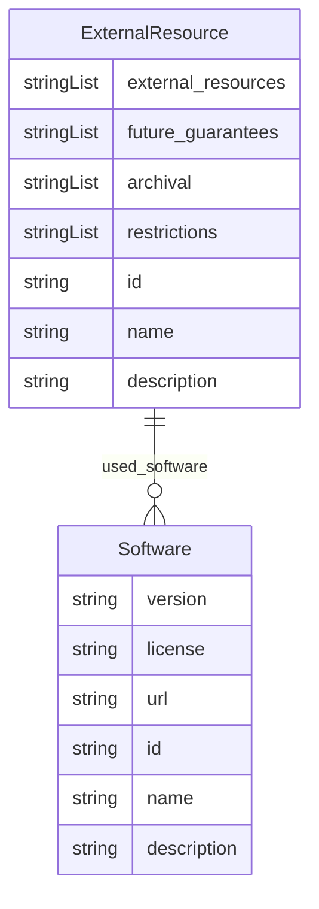

# Class: ExternalResource


_Is the dataset self-contained, or does it link to or otherwise rely on external resources (e.g., websites, tweets, other datasets)? If it links to or relies on external resources, a) are there guarantees that they will exist, and remain constant, over time; b) are there official archival versions of the complete dataset (i.e., including the external resources as they existed at the time the dataset was created); c) are there any restrictions (e.g., licenses, fees) associated with any of the external resources that might apply to a dataset consumer? Please provide descriptions of all external resources and any restrictions associated with them, as well as links or other access points, as appropriate._


URI: [data_sheets_schema:ExternalResource](https://w3id.org/bridge2ai/data-sheets-schema/ExternalResource)





## Inheritance
* [NamedThing](NamedThing.md)
    * [DatasetProperty](DatasetProperty.md)
        * **ExternalResource**


## Slots

| Name | Cardinality and Range | Description | Inheritance |
| ---  | --- | --- | --- |
| [external_resources](external_resources.md) | * <br/> [String](String.md) |  | direct |
| [future_guarantees](future_guarantees.md) | * <br/> [String](String.md) |  | direct |
| [archival](archival.md) | * <br/> [String](String.md) |  | direct |
| [restrictions](restrictions.md) | * <br/> [String](String.md) |  | direct |
| [used_software](used_software.md) | * <br/> [Software](Software.md) | What software was used as part of this dataset property? | [DatasetProperty](DatasetProperty.md) |
| [id](id.md) | 1 <br/> [String](String.md) | the unique name of the dataset | [NamedThing](NamedThing.md) |
| [name](name.md) | 0..1 <br/> [String](String.md) |  | [NamedThing](NamedThing.md) |
| [description](description.md) | 0..1 <br/> [String](String.md) | human readable description of the information | [NamedThing](NamedThing.md) |


## Usages

| used by | used in | type | used |
| ---  | --- | --- | --- |
| [Dataset](Dataset.md) | [external_resources](external_resources.md) | range | [ExternalResource](ExternalResource.md) |
| [DataSubset](DataSubset.md) | [external_resources](external_resources.md) | range | [ExternalResource](ExternalResource.md) |


## Identifier and Mapping Information


### Schema Source


* from schema: https://w3id.org/bridge2ai/data-sheets-schema


## Mappings

| Mapping Type | Mapped Value |
| ---  | ---  |
| self | data_sheets_schema:ExternalResource |
| native | data_sheets_schema:ExternalResource |


## LinkML Source

<!-- TODO: investigate https://stackoverflow.com/questions/37606292/how-to-create-tabbed-code-blocks-in-mkdocs-or-sphinx -->

### Direct

<details>
```yaml
name: ExternalResource
description: Is the dataset self-contained, or does it link to or otherwise rely on
  external resources (e.g., websites, tweets, other datasets)? If it links to or relies
  on external resources, a) are there guarantees that they will exist, and remain
  constant, over time; b) are there official archival versions of the complete dataset
  (i.e., including the external resources as they existed at the time the dataset
  was created); c) are there any restrictions (e.g., licenses, fees) associated with
  any of the external resources that might apply to a dataset consumer? Please provide
  descriptions of all external resources and any restrictions associated with them,
  as well as links or other access points, as appropriate.
in_subset:
- Composition
from_schema: https://w3id.org/bridge2ai/data-sheets-schema
is_a: DatasetProperty
attributes:
  external_resources:
    name: external_resources
    from_schema: https://w3id.org/bridge2ai/data-sheets-schema
    multivalued: true
    domain_of:
    - Dataset
    - ExternalResource
    range: string
  future_guarantees:
    name: future_guarantees
    from_schema: https://w3id.org/bridge2ai/data-sheets-schema
    rank: 1000
    multivalued: true
    domain_of:
    - ExternalResource
    range: string
  archival:
    name: archival
    from_schema: https://w3id.org/bridge2ai/data-sheets-schema
    rank: 1000
    multivalued: true
    domain_of:
    - ExternalResource
    range: string
  restrictions:
    name: restrictions
    from_schema: https://w3id.org/bridge2ai/data-sheets-schema
    rank: 1000
    multivalued: true
    domain_of:
    - ExternalResource
    range: string

```
</details>

### Induced

<details>
```yaml
name: ExternalResource
description: Is the dataset self-contained, or does it link to or otherwise rely on
  external resources (e.g., websites, tweets, other datasets)? If it links to or relies
  on external resources, a) are there guarantees that they will exist, and remain
  constant, over time; b) are there official archival versions of the complete dataset
  (i.e., including the external resources as they existed at the time the dataset
  was created); c) are there any restrictions (e.g., licenses, fees) associated with
  any of the external resources that might apply to a dataset consumer? Please provide
  descriptions of all external resources and any restrictions associated with them,
  as well as links or other access points, as appropriate.
in_subset:
- Composition
from_schema: https://w3id.org/bridge2ai/data-sheets-schema
is_a: DatasetProperty
attributes:
  external_resources:
    name: external_resources
    from_schema: https://w3id.org/bridge2ai/data-sheets-schema
    multivalued: true
    alias: external_resources
    owner: ExternalResource
    domain_of:
    - Dataset
    - ExternalResource
    range: string
  future_guarantees:
    name: future_guarantees
    from_schema: https://w3id.org/bridge2ai/data-sheets-schema
    rank: 1000
    multivalued: true
    alias: future_guarantees
    owner: ExternalResource
    domain_of:
    - ExternalResource
    range: string
  archival:
    name: archival
    from_schema: https://w3id.org/bridge2ai/data-sheets-schema
    rank: 1000
    multivalued: true
    alias: archival
    owner: ExternalResource
    domain_of:
    - ExternalResource
    range: string
  restrictions:
    name: restrictions
    from_schema: https://w3id.org/bridge2ai/data-sheets-schema
    rank: 1000
    multivalued: true
    alias: restrictions
    owner: ExternalResource
    domain_of:
    - ExternalResource
    range: string
  used_software:
    name: used_software
    description: What software was used as part of this dataset property?
    from_schema: https://w3id.org/bridge2ai/data-sheets-schema
    rank: 1000
    multivalued: true
    alias: used_software
    owner: ExternalResource
    domain_of:
    - DatasetProperty
    range: Software
  id:
    name: id
    description: the unique name of the dataset
    from_schema: https://w3id.org/bridge2ai/data-sheets-schema
    exact_mappings:
    - schema:name
    rank: 1000
    slot_uri: dcterms:identifier
    identifier: true
    alias: id
    owner: ExternalResource
    domain_of:
    - NamedThing
    - Information
    range: string
    required: true
  name:
    name: name
    from_schema: https://w3id.org/bridge2ai/data-sheets-schema
    rank: 1000
    slot_uri: schema:name
    alias: name
    owner: ExternalResource
    domain_of:
    - NamedThing
    range: string
  description:
    name: description
    description: human readable description of the information
    from_schema: https://w3id.org/bridge2ai/data-sheets-schema
    rank: 1000
    slot_uri: dcterms:description
    alias: description
    owner: ExternalResource
    domain_of:
    - NamedThing
    - Information
    - Relationships
    - Splits
    - DataAnomaly
    - Confidentiality
    - Deidentification
    - SensitiveElement
    - InstanceAcquisition
    - CollectionMechanism
    - DataCollector
    - CollectionTimeframe
    - EthicalReview
    - DirectCollection
    - CollectionNotification
    - CollectionConsent
    - ConsentRevocation
    - DataProtectionImpact
    - PreprocessingStrategy
    - CleaningStrategy
    - LabelingStrategy
    - RawData
    - ExistingUse
    - UseRepository
    - OtherTask
    - FutureUseImpact
    - DiscouragedUse
    - ThirdPartySharing
    - DistributionFormat
    - DistributionDate
    - LicenseAndUseTerms
    - IPRestrictions
    - ExportControlRegulatoryRestrictions
    - Maintainer
    - Erratum
    - UpdatePlan
    - RetentionLimits
    - VersionAccess
    - ExtensionMechanism
    range: string

```
</details>