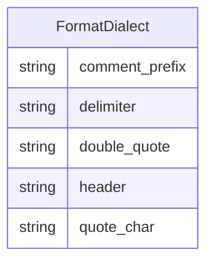

# Class: FormatDialect


_Additional format information for a file_


URI: [data_sheets_schema:FormatDialect](https://w3id.org/bridge2ai/data-sheets-schema/FormatDialect)





<!-- no inheritance hierarchy -->


## Slots

| Name | Cardinality and Range | Description | Inheritance |
| ---  | --- | --- | --- |
| [comment_prefix](comment_prefix.md) | 0..1 <br/> [String](String.md) |  | direct |
| [delimiter](delimiter.md) | 0..1 <br/> [String](String.md) |  | direct |
| [double_quote](double_quote.md) | 0..1 <br/> [String](String.md) |  | direct |
| [header](header.md) | 0..1 <br/> [String](String.md) |  | direct |
| [quote_char](quote_char.md) | 0..1 <br/> [String](String.md) |  | direct |


## Identifier and Mapping Information


### Schema Source


* from schema: https://w3id.org/bridge2ai/data-sheets-schema


## Mappings

| Mapping Type | Mapped Value |
| ---  | ---  |
| self | data_sheets_schema:FormatDialect |
| native | data_sheets_schema:FormatDialect |


## LinkML Source

<!-- TODO: investigate https://stackoverflow.com/questions/37606292/how-to-create-tabbed-code-blocks-in-mkdocs-or-sphinx -->

### Direct

<details>
```yaml
name: FormatDialect
description: Additional format information for a file
from_schema: https://w3id.org/bridge2ai/data-sheets-schema
attributes:
  comment_prefix:
    name: comment_prefix
    from_schema: https://w3id.org/bridge2ai/data-sheets-schema
    rank: 1000
    domain_of:
    - FormatDialect
  delimiter:
    name: delimiter
    from_schema: https://w3id.org/bridge2ai/data-sheets-schema
    rank: 1000
    domain_of:
    - FormatDialect
  double_quote:
    name: double_quote
    from_schema: https://w3id.org/bridge2ai/data-sheets-schema
    rank: 1000
    domain_of:
    - FormatDialect
  header:
    name: header
    from_schema: https://w3id.org/bridge2ai/data-sheets-schema
    rank: 1000
    domain_of:
    - FormatDialect
  quote_char:
    name: quote_char
    from_schema: https://w3id.org/bridge2ai/data-sheets-schema
    rank: 1000
    domain_of:
    - FormatDialect

```
</details>

### Induced

<details>
```yaml
name: FormatDialect
description: Additional format information for a file
from_schema: https://w3id.org/bridge2ai/data-sheets-schema
attributes:
  comment_prefix:
    name: comment_prefix
    from_schema: https://w3id.org/bridge2ai/data-sheets-schema
    rank: 1000
    alias: comment_prefix
    owner: FormatDialect
    domain_of:
    - FormatDialect
    range: string
  delimiter:
    name: delimiter
    from_schema: https://w3id.org/bridge2ai/data-sheets-schema
    rank: 1000
    alias: delimiter
    owner: FormatDialect
    domain_of:
    - FormatDialect
    range: string
  double_quote:
    name: double_quote
    from_schema: https://w3id.org/bridge2ai/data-sheets-schema
    rank: 1000
    alias: double_quote
    owner: FormatDialect
    domain_of:
    - FormatDialect
    range: string
  header:
    name: header
    from_schema: https://w3id.org/bridge2ai/data-sheets-schema
    rank: 1000
    alias: header
    owner: FormatDialect
    domain_of:
    - FormatDialect
    range: string
  quote_char:
    name: quote_char
    from_schema: https://w3id.org/bridge2ai/data-sheets-schema
    rank: 1000
    alias: quote_char
    owner: FormatDialect
    domain_of:
    - FormatDialect
    range: string

```
</details>