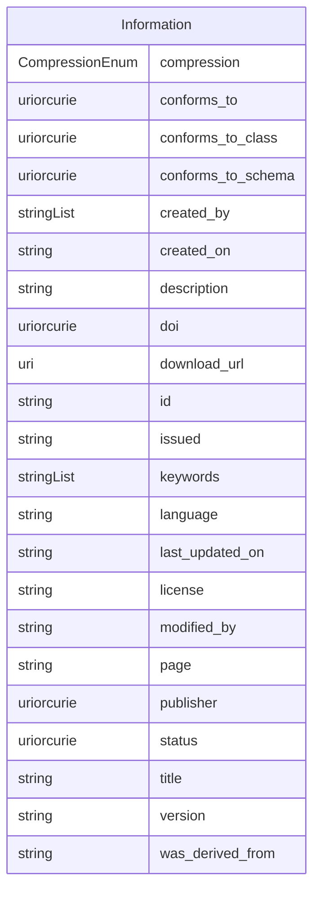

# Class: Information


_Grouping for datasets and data files_


* __NOTE__: this is an abstract class and should not be instantiated directly


URI: [data_sheets_schema:Information](https://w3id.org/bridge2ai/data-sheets-schema/Information)





## Inheritance
* **Information**
    * [DatasetCollection](DatasetCollection.md)
    * [Dataset](Dataset.md)


## Slots

| Name | Cardinality and Range | Description | Inheritance |
| ---  | --- | --- | --- |
| [compression](compression.md) | 0..1 <br/> [CompressionEnum](CompressionEnum.md) | The compression format of the data | direct |
| [conforms_to](conforms_to.md) | 0..1 <br/> [Uriorcurie](Uriorcurie.md) | The standard to which the data conforms | direct |
| [conforms_to_class](conforms_to_class.md) | 0..1 <br/> [Uriorcurie](Uriorcurie.md) | The class in the schema to which the data object instantiates | direct |
| [conforms_to_schema](conforms_to_schema.md) | 0..1 <br/> [Uriorcurie](Uriorcurie.md) | The schema to which the data conforms | direct |
| [created_by](created_by.md) | * <br/> [String](String.md) | Agent that created the element | direct |
| [created_on](created_on.md) | 0..1 <br/> [String](String.md) | Date and Time at which the element was created | direct |
| [description](description.md) | 0..1 <br/> [String](String.md) | human readable description of the information | direct |
| [doi](doi.md) | 0..1 <br/> [Uriorcurie](Uriorcurie.md) | The Digital Object Identifier of the data, with the doi prefix | direct |
| [download_url](download_url.md) | 0..1 <br/> [Uri](Uri.md) | URL from which the data can be downloaded | direct |
| [id](id.md) | 1 <br/> [String](String.md) | the unique name of the dataset | direct |
| [issued](issued.md) | 0..1 <br/> [String](String.md) |  | direct |
| [keywords](keywords.md) | * <br/> [String](String.md) | Keywords associated with the data | direct |
| [language](language.md) | 0..1 <br/> [String](String.md) | language in which the information is expressed | direct |
| [last_updated_on](last_updated_on.md) | 0..1 <br/> [String](String.md) | Date and Time at which the element was last updated | direct |
| [license](license.md) | 0..1 <br/> [String](String.md) | license for the data | direct |
| [modified_by](modified_by.md) | 0..1 <br/> [String](String.md) | agent that modified the element | direct |
| [page](page.md) | 0..1 <br/> [String](String.md) |  | direct |
| [publisher](publisher.md) | 0..1 <br/> [Uriorcurie](Uriorcurie.md) |  | direct |
| [status](status.md) | 0..1 <br/> [Uriorcurie](Uriorcurie.md) | Status of the element in terms of its maturity or life cycle | direct |
| [title](title.md) | 0..1 <br/> [String](String.md) | the official title of the element | direct |
| [version](version.md) | 0..1 <br/> [String](String.md) | particular version of schema | direct |
| [was_derived_from](was_derived_from.md) | 0..1 <br/> [String](String.md) | A derivation is a transformation of an entity into another, an update of an e... | direct |


## Identifier and Mapping Information


### Schema Source


* from schema: https://w3id.org/bridge2ai/data-sheets-schema


## Mappings

| Mapping Type | Mapped Value |
| ---  | ---  |
| self | data_sheets_schema:Information |
| native | data_sheets_schema:Information |
| close | schema:CreativeWork |


## LinkML Source

<!-- TODO: investigate https://stackoverflow.com/questions/37606292/how-to-create-tabbed-code-blocks-in-mkdocs-or-sphinx -->

### Direct

<details>
```yaml
name: Information
description: Grouping for datasets and data files
from_schema: https://w3id.org/bridge2ai/data-sheets-schema
close_mappings:
- schema:CreativeWork
abstract: true
slots:
- compression
- conforms_to
- conforms_to_class
- conforms_to_schema
- created_by
- created_on
- description
- doi
- download_url
- id
- issued
- keywords
- language
- last_updated_on
- license
- modified_by
- page
- publisher
- status
- title
- version
- was_derived_from

```
</details>

### Induced

<details>
```yaml
name: Information
description: Grouping for datasets and data files
from_schema: https://w3id.org/bridge2ai/data-sheets-schema
close_mappings:
- schema:CreativeWork
abstract: true
attributes:
  compression:
    name: compression
    description: The compression format of the data. This is not the same as the media
      type. Rather, this is the compression format of the data in a more specific
      sense, e.g., zip, gzip, etc.
    from_schema: https://w3id.org/bridge2ai/data-sheets-schema
    rank: 1000
    alias: compression
    owner: Information
    domain_of:
    - Information
    range: CompressionEnum
  conforms_to:
    name: conforms_to
    description: The standard to which the data conforms. This is not the same as
      the media type. Rather, this is the standard to which the data conforms in a
      more specific sense, e.g., frictionless, schema.org, etc.
    from_schema: https://w3id.org/bridge2ai/data-sheets-schema
    rank: 1000
    slot_uri: dcterms:conformsTo
    alias: conforms_to
    owner: Information
    domain_of:
    - Information
    range: uriorcurie
  conforms_to_class:
    name: conforms_to_class
    description: The class in the schema to which the data object instantiates.
    from_schema: https://w3id.org/bridge2ai/data-sheets-schema
    rank: 1000
    is_a: conforms_to
    alias: conforms_to_class
    owner: Information
    domain_of:
    - Information
    range: uriorcurie
  conforms_to_schema:
    name: conforms_to_schema
    description: The schema to which the data conforms. This is not the same as the
      media type. Rather, this is the schema to which the data conforms in a more
      specific sense, and even more specific than the general set of standards it
      conforms to.
    from_schema: https://w3id.org/bridge2ai/data-sheets-schema
    exact_mappings:
    - frictionless:schema
    rank: 1000
    is_a: conforms_to
    alias: conforms_to_schema
    owner: Information
    domain_of:
    - Information
    range: uriorcurie
  created_by:
    name: created_by
    description: Agent that created the element
    from_schema: https://w3id.org/bridge2ai/data-sheets-schema
    rank: 1000
    slot_uri: pav:createdBy
    multivalued: true
    alias: created_by
    owner: Information
    domain_of:
    - Information
    range: string
  created_on:
    name: created_on
    description: Date and Time at which the element was created
    from_schema: https://w3id.org/bridge2ai/data-sheets-schema
    rank: 1000
    slot_uri: pav:createdOn
    alias: created_on
    owner: Information
    domain_of:
    - Information
    range: string
  description:
    name: description
    description: human readable description of the information
    from_schema: https://w3id.org/bridge2ai/data-sheets-schema
    rank: 1000
    slot_uri: dcterms:description
    alias: description
    owner: Information
    domain_of:
    - NamedThing
    - Information
    - Relationships
    - Splits
    - DataAnomaly
    - Confidentiality
    - Deidentification
    - SensitiveElement
    - InstanceAcquisition
    - CollectionMechanism
    - DataCollector
    - CollectionTimeframe
    - EthicalReview
    - DirectCollection
    - CollectionNotification
    - CollectionConsent
    - ConsentRevocation
    - DataProtectionImpact
    - PreprocessingStrategy
    - CleaningStrategy
    - LabelingStrategy
    - RawData
    - ExistingUse
    - UseRepository
    - OtherTask
    - FutureUseImpact
    - DiscouragedUse
    - ThirdPartySharing
    - DistributionFormat
    - DistributionDate
    - LicenseAndUseTerms
    - IPRestrictions
    - ExportControlRegulatoryRestrictions
    - Maintainer
    - Erratum
    - UpdatePlan
    - RetentionLimits
    - VersionAccess
    - ExtensionMechanism
    range: string
  doi:
    name: doi
    description: The Digital Object Identifier of the data, with the doi prefix.
    examples:
    - value: doi:10.48550/arXiv.2310.03666
    from_schema: https://w3id.org/bridge2ai/data-sheets-schema
    rank: 1000
    alias: doi
    owner: Information
    domain_of:
    - Information
    range: uriorcurie
  download_url:
    name: download_url
    description: URL from which the data can be downloaded. This is not the same as
      the landing page, which is a page that describes the dataset. Rather, this URL
      points directly to the data itself.
    from_schema: https://w3id.org/bridge2ai/data-sheets-schema
    exact_mappings:
    - schema:url
    close_mappings:
    - frictionless:path
    rank: 1000
    slot_uri: dcat:downloadURL
    alias: download_url
    owner: Information
    domain_of:
    - Information
    range: uri
  id:
    name: id
    description: the unique name of the dataset
    from_schema: https://w3id.org/bridge2ai/data-sheets-schema
    exact_mappings:
    - schema:name
    rank: 1000
    slot_uri: dcterms:identifier
    identifier: true
    alias: id
    owner: Information
    domain_of:
    - NamedThing
    - Information
    range: string
    required: true
  issued:
    name: issued
    from_schema: https://w3id.org/bridge2ai/data-sheets-schema
    rank: 1000
    slot_uri: dcterms:issued
    alias: issued
    owner: Information
    domain_of:
    - Information
    range: string
  keywords:
    name: keywords
    description: Keywords associated with the data. These may be provided by the data
      creator or assigned later in a manual or automated manner.
    from_schema: https://w3id.org/bridge2ai/data-sheets-schema
    exact_mappings:
    - schema:keywords
    rank: 1000
    singular_name: keyword
    slot_uri: dcat:keyword
    multivalued: true
    alias: keywords
    owner: Information
    domain_of:
    - Information
    range: string
  language:
    name: language
    description: language in which the information is expressed
    from_schema: https://w3id.org/bridge2ai/data-sheets-schema
    rank: 1000
    alias: language
    owner: Information
    domain_of:
    - Information
    range: string
  last_updated_on:
    name: last_updated_on
    description: Date and Time at which the element was last updated
    from_schema: https://w3id.org/bridge2ai/data-sheets-schema
    rank: 1000
    slot_uri: pav:lastUpdatedOn
    alias: last_updated_on
    owner: Information
    domain_of:
    - Information
    range: string
  license:
    name: license
    description: license for the data
    from_schema: https://w3id.org/bridge2ai/data-sheets-schema
    exact_mappings:
    - frictionless:licenses
    rank: 1000
    slot_uri: dcterms:license
    alias: license
    owner: Information
    domain_of:
    - Information
    - Software
    range: string
  modified_by:
    name: modified_by
    description: agent that modified the element
    from_schema: https://w3id.org/bridge2ai/data-sheets-schema
    rank: 1000
    slot_uri: oslc:modifiedBy
    alias: modified_by
    owner: Information
    domain_of:
    - Information
    range: string
  page:
    name: page
    from_schema: https://w3id.org/bridge2ai/data-sheets-schema
    rank: 1000
    slot_uri: dcat:landingPage
    alias: page
    owner: Information
    domain_of:
    - Information
    range: string
  publisher:
    name: publisher
    from_schema: https://w3id.org/bridge2ai/data-sheets-schema
    rank: 1000
    slot_uri: dcterms:publisher
    alias: publisher
    owner: Information
    domain_of:
    - Information
    range: uriorcurie
  status:
    name: status
    description: Status of the element in terms of its maturity or life cycle
    examples:
    - value: bibo:draft
    from_schema: https://w3id.org/bridge2ai/data-sheets-schema
    rank: 1000
    slot_uri: bibo:status
    alias: status
    owner: Information
    domain_of:
    - Information
    range: uriorcurie
  title:
    name: title
    description: the official title of the element
    from_schema: https://w3id.org/bridge2ai/data-sheets-schema
    rank: 1000
    slot_uri: dcterms:title
    alias: title
    owner: Information
    domain_of:
    - Information
    range: string
  version:
    name: version
    description: particular version of schema
    from_schema: https://w3id.org/bridge2ai/data-sheets-schema
    exact_mappings:
    - schema:version
    - dcterms:hasVersion
    rank: 1000
    slot_uri: pav:version
    alias: version
    owner: Information
    domain_of:
    - Information
    - Software
    range: string
  was_derived_from:
    name: was_derived_from
    description: A derivation is a transformation of an entity into another, an update
      of an entity resulting in a new one, or the construction of a new entity based
      on a pre-existing entity.@en
    from_schema: https://w3id.org/bridge2ai/data-sheets-schema
    rank: 1000
    slot_uri: prov:wasDerivedFrom
    alias: was_derived_from
    owner: Information
    domain_of:
    - Information
    range: string

```
</details>