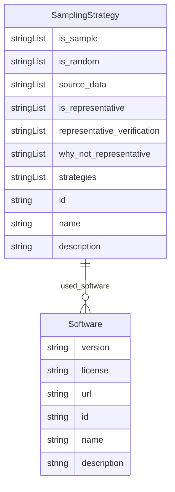

# Class: SamplingStrategy


_Does the dataset contain all possible instances or is it a sample (not necessarily random) of instances from a larger set? If the dataset is a sample, then what is the larger set? Is the sample representative of the larger set (e.g., geographic coverage)? If so, please describe how this representativeness was validated/verified. If it is not representative of the larger set, please describe why not (e.g., to cover a more diverse range of instances, because instances were withheld or unavailable)._


URI: [data_sheets_schema:SamplingStrategy](https://w3id.org/bridge2ai/data-sheets-schema/SamplingStrategy)





## Inheritance
* [NamedThing](NamedThing.md)
    * [DatasetProperty](DatasetProperty.md)
        * **SamplingStrategy**


## Slots

| Name | Cardinality and Range | Description | Inheritance |
| ---  | --- | --- | --- |
| [is_sample](is_sample.md) | * <br/> [String](String.md) |  | direct |
| [is_random](is_random.md) | * <br/> [String](String.md) |  | direct |
| [source_data](source_data.md) | * <br/> [String](String.md) |  | direct |
| [is_representative](is_representative.md) | * <br/> [String](String.md) |  | direct |
| [representative_verification](representative_verification.md) | * <br/> [String](String.md) |  | direct |
| [why_not_representative](why_not_representative.md) | * <br/> [String](String.md) |  | direct |
| [strategies](strategies.md) | * <br/> [String](String.md) | If the dataset is a sample from a larger set, what was the sampling strategy ... | direct |
| [used_software](used_software.md) | * <br/> [Software](Software.md) | What software was used as part of this dataset property? | [DatasetProperty](DatasetProperty.md) |
| [id](id.md) | 1 <br/> [String](String.md) | the unique name of the dataset | [NamedThing](NamedThing.md) |
| [name](name.md) | 0..1 <br/> [String](String.md) |  | [NamedThing](NamedThing.md) |
| [description](description.md) | 0..1 <br/> [String](String.md) | human readable description of the information | [NamedThing](NamedThing.md) |


## Usages

| used by | used in | type | used |
| ---  | --- | --- | --- |
| [Dataset](Dataset.md) | [sampling_strategies](sampling_strategies.md) | range | [SamplingStrategy](SamplingStrategy.md) |
| [DataSubset](DataSubset.md) | [sampling_strategies](sampling_strategies.md) | range | [SamplingStrategy](SamplingStrategy.md) |
| [Instance](Instance.md) | [sampling_strategies](sampling_strategies.md) | range | [SamplingStrategy](SamplingStrategy.md) |


## Identifier and Mapping Information


### Schema Source


* from schema: https://w3id.org/bridge2ai/data-sheets-schema


## Mappings

| Mapping Type | Mapped Value |
| ---  | ---  |
| self | data_sheets_schema:SamplingStrategy |
| native | data_sheets_schema:SamplingStrategy |


## LinkML Source

<!-- TODO: investigate https://stackoverflow.com/questions/37606292/how-to-create-tabbed-code-blocks-in-mkdocs-or-sphinx -->

### Direct

<details>
```yaml
name: SamplingStrategy
description: Does the dataset contain all possible instances or is it a sample (not
  necessarily random) of instances from a larger set? If the dataset is a sample,
  then what is the larger set? Is the sample representative of the larger set (e.g.,
  geographic coverage)? If so, please describe how this representativeness was validated/verified.
  If it is not representative of the larger set, please describe why not (e.g., to
  cover a more diverse range of instances, because instances were withheld or unavailable).
in_subset:
- Composition
- Collection
from_schema: https://w3id.org/bridge2ai/data-sheets-schema
is_a: DatasetProperty
attributes:
  is_sample:
    name: is_sample
    from_schema: https://w3id.org/bridge2ai/data-sheets-schema
    rank: 1000
    multivalued: true
    domain_of:
    - SamplingStrategy
    range: string
  is_random:
    name: is_random
    from_schema: https://w3id.org/bridge2ai/data-sheets-schema
    rank: 1000
    multivalued: true
    domain_of:
    - SamplingStrategy
    range: string
  source_data:
    name: source_data
    from_schema: https://w3id.org/bridge2ai/data-sheets-schema
    rank: 1000
    multivalued: true
    domain_of:
    - SamplingStrategy
    range: string
  is_representative:
    name: is_representative
    from_schema: https://w3id.org/bridge2ai/data-sheets-schema
    rank: 1000
    multivalued: true
    domain_of:
    - SamplingStrategy
    range: string
  representative_verification:
    name: representative_verification
    from_schema: https://w3id.org/bridge2ai/data-sheets-schema
    rank: 1000
    multivalued: true
    domain_of:
    - SamplingStrategy
    range: string
  why_not_representative:
    name: why_not_representative
    from_schema: https://w3id.org/bridge2ai/data-sheets-schema
    rank: 1000
    multivalued: true
    domain_of:
    - SamplingStrategy
    range: string
  strategies:
    name: strategies
    description: If the dataset is a sample from a larger set, what was the sampling
      strategy (e.g., deterministic, probabilistic with specific sampling probabilities)?
    from_schema: https://w3id.org/bridge2ai/data-sheets-schema
    rank: 1000
    multivalued: true
    domain_of:
    - SamplingStrategy
    range: string

```
</details>

### Induced

<details>
```yaml
name: SamplingStrategy
description: Does the dataset contain all possible instances or is it a sample (not
  necessarily random) of instances from a larger set? If the dataset is a sample,
  then what is the larger set? Is the sample representative of the larger set (e.g.,
  geographic coverage)? If so, please describe how this representativeness was validated/verified.
  If it is not representative of the larger set, please describe why not (e.g., to
  cover a more diverse range of instances, because instances were withheld or unavailable).
in_subset:
- Composition
- Collection
from_schema: https://w3id.org/bridge2ai/data-sheets-schema
is_a: DatasetProperty
attributes:
  is_sample:
    name: is_sample
    from_schema: https://w3id.org/bridge2ai/data-sheets-schema
    rank: 1000
    multivalued: true
    alias: is_sample
    owner: SamplingStrategy
    domain_of:
    - SamplingStrategy
    range: string
  is_random:
    name: is_random
    from_schema: https://w3id.org/bridge2ai/data-sheets-schema
    rank: 1000
    multivalued: true
    alias: is_random
    owner: SamplingStrategy
    domain_of:
    - SamplingStrategy
    range: string
  source_data:
    name: source_data
    from_schema: https://w3id.org/bridge2ai/data-sheets-schema
    rank: 1000
    multivalued: true
    alias: source_data
    owner: SamplingStrategy
    domain_of:
    - SamplingStrategy
    range: string
  is_representative:
    name: is_representative
    from_schema: https://w3id.org/bridge2ai/data-sheets-schema
    rank: 1000
    multivalued: true
    alias: is_representative
    owner: SamplingStrategy
    domain_of:
    - SamplingStrategy
    range: string
  representative_verification:
    name: representative_verification
    from_schema: https://w3id.org/bridge2ai/data-sheets-schema
    rank: 1000
    multivalued: true
    alias: representative_verification
    owner: SamplingStrategy
    domain_of:
    - SamplingStrategy
    range: string
  why_not_representative:
    name: why_not_representative
    from_schema: https://w3id.org/bridge2ai/data-sheets-schema
    rank: 1000
    multivalued: true
    alias: why_not_representative
    owner: SamplingStrategy
    domain_of:
    - SamplingStrategy
    range: string
  strategies:
    name: strategies
    description: If the dataset is a sample from a larger set, what was the sampling
      strategy (e.g., deterministic, probabilistic with specific sampling probabilities)?
    from_schema: https://w3id.org/bridge2ai/data-sheets-schema
    rank: 1000
    multivalued: true
    alias: strategies
    owner: SamplingStrategy
    domain_of:
    - SamplingStrategy
    range: string
  used_software:
    name: used_software
    description: What software was used as part of this dataset property?
    from_schema: https://w3id.org/bridge2ai/data-sheets-schema
    rank: 1000
    multivalued: true
    alias: used_software
    owner: SamplingStrategy
    domain_of:
    - DatasetProperty
    range: Software
  id:
    name: id
    description: the unique name of the dataset
    from_schema: https://w3id.org/bridge2ai/data-sheets-schema
    exact_mappings:
    - schema:name
    rank: 1000
    slot_uri: dcterms:identifier
    identifier: true
    alias: id
    owner: SamplingStrategy
    domain_of:
    - NamedThing
    - Information
    range: string
    required: true
  name:
    name: name
    from_schema: https://w3id.org/bridge2ai/data-sheets-schema
    rank: 1000
    slot_uri: schema:name
    alias: name
    owner: SamplingStrategy
    domain_of:
    - NamedThing
    range: string
  description:
    name: description
    description: human readable description of the information
    from_schema: https://w3id.org/bridge2ai/data-sheets-schema
    rank: 1000
    slot_uri: dcterms:description
    alias: description
    owner: SamplingStrategy
    domain_of:
    - NamedThing
    - Information
    - Relationships
    - Splits
    - DataAnomaly
    - Confidentiality
    - Deidentification
    - SensitiveElement
    - InstanceAcquisition
    - CollectionMechanism
    - DataCollector
    - CollectionTimeframe
    - EthicalReview
    - DirectCollection
    - CollectionNotification
    - CollectionConsent
    - ConsentRevocation
    - DataProtectionImpact
    - PreprocessingStrategy
    - CleaningStrategy
    - LabelingStrategy
    - RawData
    - ExistingUse
    - UseRepository
    - OtherTask
    - FutureUseImpact
    - DiscouragedUse
    - ThirdPartySharing
    - DistributionFormat
    - DistributionDate
    - LicenseAndUseTerms
    - IPRestrictions
    - ExportControlRegulatoryRestrictions
    - Maintainer
    - Erratum
    - UpdatePlan
    - RetentionLimits
    - VersionAccess
    - ExtensionMechanism
    range: string

```
</details>