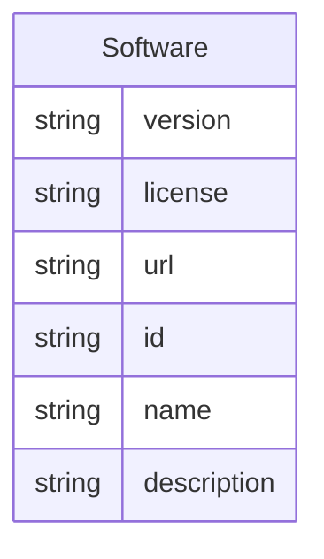

# Class: Software


_A software program or library._


URI: [data_sheets_schema:Software](https://w3id.org/bridge2ai/data-sheets-schema/Software)





## Inheritance
* [NamedThing](NamedThing.md)
    * **Software**


## Slots

| Name | Cardinality and Range | Description | Inheritance |
| ---  | --- | --- | --- |
| [version](version.md) | 0..1 <br/> [String](String.md) |  | direct |
| [license](license.md) | 0..1 <br/> [String](String.md) |  | direct |
| [url](url.md) | 0..1 <br/> [String](String.md) |  | direct |
| [id](id.md) | 1 <br/> [String](String.md) | the unique name of the dataset | [NamedThing](NamedThing.md) |
| [name](name.md) | 0..1 <br/> [String](String.md) |  | [NamedThing](NamedThing.md) |
| [description](description.md) | 0..1 <br/> [String](String.md) | human readable description of the information | [NamedThing](NamedThing.md) |


## Usages

| used by | used in | type | used |
| ---  | --- | --- | --- |
| [DatasetProperty](DatasetProperty.md) | [used_software](used_software.md) | range | [Software](Software.md) |
| [Purpose](Purpose.md) | [used_software](used_software.md) | range | [Software](Software.md) |
| [Task](Task.md) | [used_software](used_software.md) | range | [Software](Software.md) |
| [AddressingGap](AddressingGap.md) | [used_software](used_software.md) | range | [Software](Software.md) |
| [Creator](Creator.md) | [used_software](used_software.md) | range | [Software](Software.md) |
| [FundingMechanism](FundingMechanism.md) | [used_software](used_software.md) | range | [Software](Software.md) |
| [Instance](Instance.md) | [used_software](used_software.md) | range | [Software](Software.md) |
| [SamplingStrategy](SamplingStrategy.md) | [used_software](used_software.md) | range | [Software](Software.md) |
| [MissingInfo](MissingInfo.md) | [used_software](used_software.md) | range | [Software](Software.md) |
| [Relationships](Relationships.md) | [used_software](used_software.md) | range | [Software](Software.md) |
| [Splits](Splits.md) | [used_software](used_software.md) | range | [Software](Software.md) |
| [DataAnomaly](DataAnomaly.md) | [used_software](used_software.md) | range | [Software](Software.md) |
| [ExternalResource](ExternalResource.md) | [used_software](used_software.md) | range | [Software](Software.md) |
| [Confidentiality](Confidentiality.md) | [used_software](used_software.md) | range | [Software](Software.md) |
| [ContentWarning](ContentWarning.md) | [used_software](used_software.md) | range | [Software](Software.md) |
| [Subpopulation](Subpopulation.md) | [used_software](used_software.md) | range | [Software](Software.md) |
| [Deidentification](Deidentification.md) | [used_software](used_software.md) | range | [Software](Software.md) |
| [SensitiveElement](SensitiveElement.md) | [used_software](used_software.md) | range | [Software](Software.md) |
| [InstanceAcquisition](InstanceAcquisition.md) | [used_software](used_software.md) | range | [Software](Software.md) |
| [CollectionMechanism](CollectionMechanism.md) | [used_software](used_software.md) | range | [Software](Software.md) |
| [DataCollector](DataCollector.md) | [used_software](used_software.md) | range | [Software](Software.md) |
| [CollectionTimeframe](CollectionTimeframe.md) | [used_software](used_software.md) | range | [Software](Software.md) |
| [EthicalReview](EthicalReview.md) | [used_software](used_software.md) | range | [Software](Software.md) |
| [DirectCollection](DirectCollection.md) | [used_software](used_software.md) | range | [Software](Software.md) |
| [CollectionNotification](CollectionNotification.md) | [used_software](used_software.md) | range | [Software](Software.md) |
| [CollectionConsent](CollectionConsent.md) | [used_software](used_software.md) | range | [Software](Software.md) |
| [ConsentRevocation](ConsentRevocation.md) | [used_software](used_software.md) | range | [Software](Software.md) |
| [DataProtectionImpact](DataProtectionImpact.md) | [used_software](used_software.md) | range | [Software](Software.md) |
| [PreprocessingStrategy](PreprocessingStrategy.md) | [used_software](used_software.md) | range | [Software](Software.md) |
| [CleaningStrategy](CleaningStrategy.md) | [used_software](used_software.md) | range | [Software](Software.md) |
| [LabelingStrategy](LabelingStrategy.md) | [used_software](used_software.md) | range | [Software](Software.md) |
| [RawData](RawData.md) | [used_software](used_software.md) | range | [Software](Software.md) |
| [ExistingUse](ExistingUse.md) | [used_software](used_software.md) | range | [Software](Software.md) |
| [UseRepository](UseRepository.md) | [used_software](used_software.md) | range | [Software](Software.md) |
| [OtherTask](OtherTask.md) | [used_software](used_software.md) | range | [Software](Software.md) |
| [FutureUseImpact](FutureUseImpact.md) | [used_software](used_software.md) | range | [Software](Software.md) |
| [DiscouragedUse](DiscouragedUse.md) | [used_software](used_software.md) | range | [Software](Software.md) |
| [ThirdPartySharing](ThirdPartySharing.md) | [used_software](used_software.md) | range | [Software](Software.md) |
| [DistributionFormat](DistributionFormat.md) | [used_software](used_software.md) | range | [Software](Software.md) |
| [DistributionDate](DistributionDate.md) | [used_software](used_software.md) | range | [Software](Software.md) |
| [LicenseAndUseTerms](LicenseAndUseTerms.md) | [used_software](used_software.md) | range | [Software](Software.md) |
| [IPRestrictions](IPRestrictions.md) | [used_software](used_software.md) | range | [Software](Software.md) |
| [ExportControlRegulatoryRestrictions](ExportControlRegulatoryRestrictions.md) | [used_software](used_software.md) | range | [Software](Software.md) |
| [Maintainer](Maintainer.md) | [used_software](used_software.md) | range | [Software](Software.md) |
| [Erratum](Erratum.md) | [used_software](used_software.md) | range | [Software](Software.md) |
| [UpdatePlan](UpdatePlan.md) | [used_software](used_software.md) | range | [Software](Software.md) |
| [RetentionLimits](RetentionLimits.md) | [used_software](used_software.md) | range | [Software](Software.md) |
| [VersionAccess](VersionAccess.md) | [used_software](used_software.md) | range | [Software](Software.md) |
| [ExtensionMechanism](ExtensionMechanism.md) | [used_software](used_software.md) | range | [Software](Software.md) |


## Identifier and Mapping Information


### Schema Source


* from schema: https://w3id.org/bridge2ai/data-sheets-schema


## Mappings

| Mapping Type | Mapped Value |
| ---  | ---  |
| self | data_sheets_schema:Software |
| native | data_sheets_schema:Software |


## LinkML Source

<!-- TODO: investigate https://stackoverflow.com/questions/37606292/how-to-create-tabbed-code-blocks-in-mkdocs-or-sphinx -->

### Direct

<details>
```yaml
name: Software
description: A software program or library.
from_schema: https://w3id.org/bridge2ai/data-sheets-schema
is_a: NamedThing
attributes:
  version:
    name: version
    from_schema: https://w3id.org/bridge2ai/data-sheets-schema
    domain_of:
    - Information
    - Software
    range: string
  license:
    name: license
    from_schema: https://w3id.org/bridge2ai/data-sheets-schema
    domain_of:
    - Information
    - Software
    range: string
  url:
    name: url
    from_schema: https://w3id.org/bridge2ai/data-sheets-schema
    rank: 1000
    domain_of:
    - Software
    range: string

```
</details>

### Induced

<details>
```yaml
name: Software
description: A software program or library.
from_schema: https://w3id.org/bridge2ai/data-sheets-schema
is_a: NamedThing
attributes:
  version:
    name: version
    from_schema: https://w3id.org/bridge2ai/data-sheets-schema
    alias: version
    owner: Software
    domain_of:
    - Information
    - Software
    range: string
  license:
    name: license
    from_schema: https://w3id.org/bridge2ai/data-sheets-schema
    alias: license
    owner: Software
    domain_of:
    - Information
    - Software
    range: string
  url:
    name: url
    from_schema: https://w3id.org/bridge2ai/data-sheets-schema
    rank: 1000
    alias: url
    owner: Software
    domain_of:
    - Software
    range: string
  id:
    name: id
    description: the unique name of the dataset
    from_schema: https://w3id.org/bridge2ai/data-sheets-schema
    exact_mappings:
    - schema:name
    rank: 1000
    slot_uri: dcterms:identifier
    identifier: true
    alias: id
    owner: Software
    domain_of:
    - NamedThing
    - Information
    range: string
    required: true
  name:
    name: name
    from_schema: https://w3id.org/bridge2ai/data-sheets-schema
    rank: 1000
    slot_uri: schema:name
    alias: name
    owner: Software
    domain_of:
    - NamedThing
    range: string
  description:
    name: description
    description: human readable description of the information
    from_schema: https://w3id.org/bridge2ai/data-sheets-schema
    rank: 1000
    slot_uri: dcterms:description
    alias: description
    owner: Software
    domain_of:
    - NamedThing
    - Information
    - Relationships
    - Splits
    - DataAnomaly
    - Confidentiality
    - Deidentification
    - SensitiveElement
    - InstanceAcquisition
    - CollectionMechanism
    - DataCollector
    - CollectionTimeframe
    - EthicalReview
    - DirectCollection
    - CollectionNotification
    - CollectionConsent
    - ConsentRevocation
    - DataProtectionImpact
    - PreprocessingStrategy
    - CleaningStrategy
    - LabelingStrategy
    - RawData
    - ExistingUse
    - UseRepository
    - OtherTask
    - FutureUseImpact
    - DiscouragedUse
    - ThirdPartySharing
    - DistributionFormat
    - DistributionDate
    - LicenseAndUseTerms
    - IPRestrictions
    - ExportControlRegulatoryRestrictions
    - Maintainer
    - Erratum
    - UpdatePlan
    - RetentionLimits
    - VersionAccess
    - ExtensionMechanism
    range: string

```
</details>