# data-sheets-schema

A LinkML schema for Datasheets for Datasets.

URI: https://w3id.org/bridge2ai/data-sheets-schema

Name: data-sheets-schema

## Schema Diagram

```mermaid
erDiagram
DatasetCollection {
    CompressionEnum compression  
    uriorcurie conforms_to  
    uriorcurie conforms_to_class  
    uriorcurie conforms_to_schema  
    stringList created_by  
    string created_on  
    string description  
    uriorcurie doi  
    uri download_url  
    string id  
    string issued  
    stringList keywords  
    string language  
    string last_updated_on  
    string license  
    string modified_by  
    string page  
    uriorcurie publisher  
    uriorcurie status  
    string title  
    string version  
    string was_derived_from  
}
Dataset {
    integer bytes  
    string dialect  
    EncodingEnum encoding  
    FormatEnum format  
    string hash  
    string md5  
    string media_type  
    string path  
    string sha256  
    string is_tabular  
    CompressionEnum compression  
    uriorcurie conforms_to  
    uriorcurie conforms_to_class  
    uriorcurie conforms_to_schema  
    stringList created_by  
    string created_on  
    string description  
    uriorcurie doi  
    uri download_url  
    string id  
    string issued  
    stringList keywords  
    string language  
    string last_updated_on  
    string license  
    string modified_by  
    string page  
    uriorcurie publisher  
    uriorcurie status  
    string title  
    string version  
    string was_derived_from  
}
Deidentification {
    stringList description  
    string id  
    string name  
}
Software {
    string version  
    string license  
    string url  
    string id  
    string name  
    string description  
}
ExtensionMechanism {
    stringList description  
    string id  
    string name  
}
VersionAccess {
    stringList description  
    string id  
    string name  
}
RetentionLimits {
    stringList description  
    string id  
    string name  
}
UpdatePlan {
    stringList description  
    string id  
    string name  
}
Erratum {
    stringList description  
    string id  
    string name  
}
Maintainer {
    stringList description  
    string id  
    string name  
}
ExportControlRegulatoryRestrictions {
    stringList description  
    string id  
    string name  
}
IPRestrictions {
    stringList description  
    string id  
    string name  
}
LicenseAndUseTerms {
    stringList description  
    string id  
    string name  
}
DistributionDate {
    stringList description  
    string id  
    string name  
}
DistributionFormat {
    stringList description  
    string id  
    string name  
}
DiscouragedUse {
    stringList description  
    string id  
    string name  
}
FutureUseImpact {
    stringList description  
    string id  
    string name  
}
OtherTask {
    stringList description  
    string id  
    string name  
}
UseRepository {
    stringList description  
    string id  
    string name  
}
ExistingUse {
    stringList description  
    string id  
    string name  
}
RawData {
    stringList description  
    string id  
    string name  
}
LabelingStrategy {
    stringList description  
    string id  
    string name  
}
CleaningStrategy {
    stringList description  
    string id  
    string name  
}
PreprocessingStrategy {
    stringList description  
    string id  
    string name  
}
DataProtectionImpact {
    stringList description  
    string id  
    string name  
}
EthicalReview {
    stringList description  
    string id  
    string name  
}
CollectionTimeframe {
    stringList description  
    string id  
    string name  
}
DataCollector {
    stringList description  
    string id  
    string name  
}
SamplingStrategy {
    stringList is_sample  
    stringList is_random  
    stringList source_data  
    stringList is_representative  
    stringList representative_verification  
    stringList why_not_representative  
    stringList strategies  
    string id  
    string name  
    string description  
}
CollectionMechanism {
    stringList description  
    string id  
    string name  
}
InstanceAcquisition {
    stringList description  
    string was_directly_observed  
    string was_reported_by_subjects  
    string was_inferred_derived  
    string was_validated_verified  
    string id  
    string name  
}
SensitiveElement {
    stringList description  
    string id  
    string name  
}
Subpopulation {
    stringList identification  
    stringList distribution  
    string id  
    string name  
    string description  
}
ContentWarning {
    stringList warnings  
    string id  
    string name  
    string description  
}
Confidentiality {
    stringList description  
    string id  
    string name  
}
ExternalResource {
    stringList external_resources  
    stringList future_guarantees  
    stringList archival  
    stringList restrictions  
    string id  
    string name  
    string description  
}
DataAnomaly {
    stringList description  
    string id  
    string name  
}
Instance {
    string representation  
    string instance_type  
    string data_type  
    integer counts  
    string label  
    string id  
    string name  
    string description  
}
MissingInfo {
    stringList missing  
    stringList why_missing  
    string id  
    string name  
    string description  
}
DataSubset {
    string is_data_split  
    string is_subpopulation  
    integer bytes  
    string dialect  
    EncodingEnum encoding  
    FormatEnum format  
    string hash  
    string md5  
    string media_type  
    string path  
    string sha256  
    string is_tabular  
    CompressionEnum compression  
    uriorcurie conforms_to  
    uriorcurie conforms_to_class  
    uriorcurie conforms_to_schema  
    stringList created_by  
    string created_on  
    string description  
    uriorcurie doi  
    uri download_url  
    string id  
    string issued  
    stringList keywords  
    string language  
    string last_updated_on  
    string license  
    string modified_by  
    string page  
    uriorcurie publisher  
    uriorcurie status  
    string title  
    string version  
    string was_derived_from  
}
FundingMechanism {
    string id  
    string name  
    string description  
}
Grant {
    string grant_number  
    string id  
    string name  
    string description  
}
Grantor {
    string email  
    ror_identifier ror_id  
    wikidata_identifier wikidata_id  
    string id  
    string name  
    string description  
}
Creator {
    string id  
    string name  
    string description  
}
Organization {
    string email  
    ror_identifier ror_id  
    wikidata_identifier wikidata_id  
    string id  
    string name  
    string description  
}
Person {
    string email  
    string id  
    string name  
    string description  
}
AddressingGap {
    string response  
    string id  
    string name  
    string description  
}
Task {
    string response  
    string id  
    string name  
    string description  
}
Purpose {
    string response  
    string id  
    string name  
    string description  
}

DatasetCollection ||--}o Dataset : "resources"
Dataset ||--}o Purpose : "purposes"
Dataset ||--}o Task : "tasks"
Dataset ||--}o AddressingGap : "addressing_gaps"
Dataset ||--}o Creator : "creators"
Dataset ||--}o FundingMechanism : "funders"
Dataset ||--}o DataSubset : "subsets"
Dataset ||--}o Instance : "instances"
Dataset ||--}o DataAnomaly : "anomalies"
Dataset ||--}o ExternalResource : "external_resources"
Dataset ||--}o Confidentiality : "confidential_elements"
Dataset ||--}o ContentWarning : "content_warnings"
Dataset ||--}o Subpopulation : "subpopulations"
Dataset ||--}o SensitiveElement : "sensitive_elements"
Dataset ||--}o InstanceAcquisition : "acquisition_methods"
Dataset ||--}o CollectionMechanism : "collection_mechanisms"
Dataset ||--}o SamplingStrategy : "sampling_strategies"
Dataset ||--}o DataCollector : "data_collectors"
Dataset ||--}o CollectionTimeframe : "collection_timeframes"
Dataset ||--}o EthicalReview : "ethical_reviews"
Dataset ||--}o DataProtectionImpact : "data_protection_impacts"
Dataset ||--}o PreprocessingStrategy : "preprocessing_strategies"
Dataset ||--}o CleaningStrategy : "cleaning_strategies"
Dataset ||--}o LabelingStrategy : "labeling_strategies"
Dataset ||--}o RawData : "raw_sources"
Dataset ||--}o ExistingUse : "existing_uses"
Dataset ||--}o UseRepository : "use_repository"
Dataset ||--}o OtherTask : "other_tasks"
Dataset ||--}o FutureUseImpact : "future_use_impacts"
Dataset ||--}o DiscouragedUse : "discouraged_uses"
Dataset ||--}o DistributionFormat : "distribution_formats"
Dataset ||--}o DistributionDate : "distribution_dates"
Dataset ||--|o LicenseAndUseTerms : "license_and_use_terms"
Dataset ||--|o IPRestrictions : "ip_restrictions"
Dataset ||--|o ExportControlRegulatoryRestrictions : "regulatory_restrictions"
Dataset ||--}o Maintainer : "maintainers"
Dataset ||--}o Erratum : "errata"
Dataset ||--|o UpdatePlan : "updates"
Dataset ||--|o RetentionLimits : "retention_limit"
Dataset ||--|o VersionAccess : "version_access"
Dataset ||--|o ExtensionMechanism : "extension_mechanism"
Dataset ||--|o Deidentification : "is_deidentified"
Deidentification ||--}o Software : "used_software"
ExtensionMechanism ||--}o Software : "used_software"
VersionAccess ||--}o Software : "used_software"
RetentionLimits ||--}o Software : "used_software"
UpdatePlan ||--}o Software : "used_software"
Erratum ||--}o Software : "used_software"
Maintainer ||--}o Software : "used_software"
ExportControlRegulatoryRestrictions ||--}o Software : "used_software"
IPRestrictions ||--}o Software : "used_software"
LicenseAndUseTerms ||--}o Software : "used_software"
DistributionDate ||--}o Software : "used_software"
DistributionFormat ||--}o Software : "used_software"
DiscouragedUse ||--}o Software : "used_software"
FutureUseImpact ||--}o Software : "used_software"
OtherTask ||--}o Software : "used_software"
UseRepository ||--}o Software : "used_software"
ExistingUse ||--}o Software : "used_software"
RawData ||--}o Software : "used_software"
LabelingStrategy ||--}o Software : "used_software"
CleaningStrategy ||--}o Software : "used_software"
PreprocessingStrategy ||--}o Software : "used_software"
DataProtectionImpact ||--}o Software : "used_software"
EthicalReview ||--}o Software : "used_software"
CollectionTimeframe ||--}o Software : "used_software"
DataCollector ||--}o Software : "used_software"
SamplingStrategy ||--}o Software : "used_software"
CollectionMechanism ||--}o Software : "used_software"
InstanceAcquisition ||--}o Software : "used_software"
SensitiveElement ||--}o Software : "used_software"
Subpopulation ||--}o Software : "used_software"
ContentWarning ||--}o Software : "used_software"
Confidentiality ||--}o Software : "used_software"
ExternalResource ||--}o Software : "used_software"
DataAnomaly ||--}o Software : "used_software"
Instance ||--}o SamplingStrategy : "sampling_strategies"
Instance ||--}o MissingInfo : "missing_information"
Instance ||--}o Software : "used_software"
MissingInfo ||--}o Software : "used_software"
DataSubset ||--}o Purpose : "purposes"
DataSubset ||--}o Task : "tasks"
DataSubset ||--}o AddressingGap : "addressing_gaps"
DataSubset ||--}o Creator : "creators"
DataSubset ||--}o FundingMechanism : "funders"
DataSubset ||--}o DataSubset : "subsets"
DataSubset ||--}o Instance : "instances"
DataSubset ||--}o DataAnomaly : "anomalies"
DataSubset ||--}o ExternalResource : "external_resources"
DataSubset ||--}o Confidentiality : "confidential_elements"
DataSubset ||--}o ContentWarning : "content_warnings"
DataSubset ||--}o Subpopulation : "subpopulations"
DataSubset ||--}o SensitiveElement : "sensitive_elements"
DataSubset ||--}o InstanceAcquisition : "acquisition_methods"
DataSubset ||--}o CollectionMechanism : "collection_mechanisms"
DataSubset ||--}o SamplingStrategy : "sampling_strategies"
DataSubset ||--}o DataCollector : "data_collectors"
DataSubset ||--}o CollectionTimeframe : "collection_timeframes"
DataSubset ||--}o EthicalReview : "ethical_reviews"
DataSubset ||--}o DataProtectionImpact : "data_protection_impacts"
DataSubset ||--}o PreprocessingStrategy : "preprocessing_strategies"
DataSubset ||--}o CleaningStrategy : "cleaning_strategies"
DataSubset ||--}o LabelingStrategy : "labeling_strategies"
DataSubset ||--}o RawData : "raw_sources"
DataSubset ||--}o ExistingUse : "existing_uses"
DataSubset ||--}o UseRepository : "use_repository"
DataSubset ||--}o OtherTask : "other_tasks"
DataSubset ||--}o FutureUseImpact : "future_use_impacts"
DataSubset ||--}o DiscouragedUse : "discouraged_uses"
DataSubset ||--}o DistributionFormat : "distribution_formats"
DataSubset ||--}o DistributionDate : "distribution_dates"
DataSubset ||--|o LicenseAndUseTerms : "license_and_use_terms"
DataSubset ||--|o IPRestrictions : "ip_restrictions"
DataSubset ||--|o ExportControlRegulatoryRestrictions : "regulatory_restrictions"
DataSubset ||--}o Maintainer : "maintainers"
DataSubset ||--}o Erratum : "errata"
DataSubset ||--|o UpdatePlan : "updates"
DataSubset ||--|o RetentionLimits : "retention_limit"
DataSubset ||--|o VersionAccess : "version_access"
DataSubset ||--|o ExtensionMechanism : "extension_mechanism"
DataSubset ||--|o Deidentification : "is_deidentified"
FundingMechanism ||--|o Grantor : "grantor"
FundingMechanism ||--|o Grant : "grant"
FundingMechanism ||--}o Software : "used_software"
Creator ||--|o Person : "principal_investigator"
Creator ||--|o Organization : "affiliation"
Creator ||--}o Software : "used_software"
Person ||--}o Organization : "affiliation"
AddressingGap ||--}o Software : "used_software"
Task ||--}o Software : "used_software"
Purpose ||--}o Software : "used_software"

```

## Classes

| Class | Description |
| --- | --- |
| [FormatDialect](FormatDialect.md) | Additional format information for a file |
| [Information](Information.md) | Grouping for datasets and data files |
| &nbsp;&nbsp;&nbsp;&nbsp;&nbsp;&nbsp;&nbsp;&nbsp;[Dataset](Dataset.md) | A single component of related observations and/or information that can be read, manipulated, transformed, and otherwise interpreted. |
| &nbsp;&nbsp;&nbsp;&nbsp;&nbsp;&nbsp;&nbsp;&nbsp;&nbsp;&nbsp;&nbsp;&nbsp;&nbsp;&nbsp;&nbsp;&nbsp;[DataSubset](DataSubset.md) | A subset of a dataset, likely containing multiple files of multiple potential purposes and properties. |
| &nbsp;&nbsp;&nbsp;&nbsp;&nbsp;&nbsp;&nbsp;&nbsp;[DatasetCollection](DatasetCollection.md) | A collection of related datasets, likely containing multiple files of multiple potential purposes and properties. |
| [NamedThing](NamedThing.md) | A generic grouping for any identifiable entity |
| &nbsp;&nbsp;&nbsp;&nbsp;&nbsp;&nbsp;&nbsp;&nbsp;[DatasetProperty](DatasetProperty.md) | Represents a single property of a dataset, or a set of related properties. |
| &nbsp;&nbsp;&nbsp;&nbsp;&nbsp;&nbsp;&nbsp;&nbsp;&nbsp;&nbsp;&nbsp;&nbsp;&nbsp;&nbsp;&nbsp;&nbsp;[AddressingGap](AddressingGap.md) | Was there a specific gap that needed to be filled by creation of the dataset? |
| &nbsp;&nbsp;&nbsp;&nbsp;&nbsp;&nbsp;&nbsp;&nbsp;&nbsp;&nbsp;&nbsp;&nbsp;&nbsp;&nbsp;&nbsp;&nbsp;[CleaningStrategy](CleaningStrategy.md) | Was any cleaning of the data done (e.g., removal of instances, processing of missing values)? |
| &nbsp;&nbsp;&nbsp;&nbsp;&nbsp;&nbsp;&nbsp;&nbsp;&nbsp;&nbsp;&nbsp;&nbsp;&nbsp;&nbsp;&nbsp;&nbsp;[CollectionConsent](CollectionConsent.md) | Did the individuals in question consent to the collection and use of their data? If so, please describe (or show with screenshots or other information) how consent was requested and provided, and provide a link or other access point to, or otherwise reproduce, the exact language to which the individuals consented. |
| &nbsp;&nbsp;&nbsp;&nbsp;&nbsp;&nbsp;&nbsp;&nbsp;&nbsp;&nbsp;&nbsp;&nbsp;&nbsp;&nbsp;&nbsp;&nbsp;[CollectionMechanism](CollectionMechanism.md) | What mechanisms or procedures were used to collect the data (e.g., hardware apparatuses or sensors, manual human curation, software programs, software APIs)? How were these mechanisms or procedures validated? |
| &nbsp;&nbsp;&nbsp;&nbsp;&nbsp;&nbsp;&nbsp;&nbsp;&nbsp;&nbsp;&nbsp;&nbsp;&nbsp;&nbsp;&nbsp;&nbsp;[CollectionNotification](CollectionNotification.md) | Were the individuals in question notified about the data collection? If so, please describe (or show with screenshots or other information) how notice was provided, and provide a link or other access point to, or otherwise reproduce, the exact language of the notification itself. |
| &nbsp;&nbsp;&nbsp;&nbsp;&nbsp;&nbsp;&nbsp;&nbsp;&nbsp;&nbsp;&nbsp;&nbsp;&nbsp;&nbsp;&nbsp;&nbsp;[CollectionTimeframe](CollectionTimeframe.md) | Over what timeframe was the data collected? Does this timeframe match the creation timeframe of the data associated with the instances (e.g., recent crawl of old news articles)? If not, please describe the timeframe in which the data associated with the instances was created. |
| &nbsp;&nbsp;&nbsp;&nbsp;&nbsp;&nbsp;&nbsp;&nbsp;&nbsp;&nbsp;&nbsp;&nbsp;&nbsp;&nbsp;&nbsp;&nbsp;[Confidentiality](Confidentiality.md) | Does the dataset contain data that might be considered confidential (e.g., data that is protected by legal privilege or by doctor patient confidentiality, data that includes the content of individuals’ non-public communications)? |
| &nbsp;&nbsp;&nbsp;&nbsp;&nbsp;&nbsp;&nbsp;&nbsp;&nbsp;&nbsp;&nbsp;&nbsp;&nbsp;&nbsp;&nbsp;&nbsp;[ConsentRevocation](ConsentRevocation.md) | If consent was obtained, were the consenting individuals provided with a mechanism to revoke their consent in the future or 8 for certain uses? If so, please provide a description, as well as a link or other access point to the mechanism (if appropriate). |
| &nbsp;&nbsp;&nbsp;&nbsp;&nbsp;&nbsp;&nbsp;&nbsp;&nbsp;&nbsp;&nbsp;&nbsp;&nbsp;&nbsp;&nbsp;&nbsp;[ContentWarning](ContentWarning.md) | Does the dataset contain data that, if viewed directly, might be offensive, insulting, threatening, or might otherwise cause anxiety? If so, please describe why. |
| &nbsp;&nbsp;&nbsp;&nbsp;&nbsp;&nbsp;&nbsp;&nbsp;&nbsp;&nbsp;&nbsp;&nbsp;&nbsp;&nbsp;&nbsp;&nbsp;[Creator](Creator.md) | Who created the dataset (e.g., which team, research group) and on behalf of which entity (e.g., company, institution, organization)? This may also be considered a team. |
| &nbsp;&nbsp;&nbsp;&nbsp;&nbsp;&nbsp;&nbsp;&nbsp;&nbsp;&nbsp;&nbsp;&nbsp;&nbsp;&nbsp;&nbsp;&nbsp;[DataAnomaly](DataAnomaly.md) | Are there any errors, sources of noise, or redundancies in the dataset? If so, please provide a description. |
| &nbsp;&nbsp;&nbsp;&nbsp;&nbsp;&nbsp;&nbsp;&nbsp;&nbsp;&nbsp;&nbsp;&nbsp;&nbsp;&nbsp;&nbsp;&nbsp;[DataCollector](DataCollector.md) | Who was involved in the data collection process (e.g., students, crowdworkers, contractors) and how were they compensated (e.g., how much were crowdworkers paid)? |
| &nbsp;&nbsp;&nbsp;&nbsp;&nbsp;&nbsp;&nbsp;&nbsp;&nbsp;&nbsp;&nbsp;&nbsp;&nbsp;&nbsp;&nbsp;&nbsp;[DataProtectionImpact](DataProtectionImpact.md) | Has an analysis of the potential impact of the dataset and its use on data subjects (e.g., a data protection impact analysis) been conducted? If so, please provide a description of this analysis, including the outcomes, as well as a link or other access point to any supporting documentation. |
| &nbsp;&nbsp;&nbsp;&nbsp;&nbsp;&nbsp;&nbsp;&nbsp;&nbsp;&nbsp;&nbsp;&nbsp;&nbsp;&nbsp;&nbsp;&nbsp;[Deidentification](Deidentification.md) | Is it possible to identify individuals (i.e., one or more natural persons), either directly or indirectly (i.e., in combination with other data) from the dataset? |
| &nbsp;&nbsp;&nbsp;&nbsp;&nbsp;&nbsp;&nbsp;&nbsp;&nbsp;&nbsp;&nbsp;&nbsp;&nbsp;&nbsp;&nbsp;&nbsp;[DirectCollection](DirectCollection.md) | Did you collect the data from the individuals in question directly, or obtain it via third parties or other sources (e.g., websites)? |
| &nbsp;&nbsp;&nbsp;&nbsp;&nbsp;&nbsp;&nbsp;&nbsp;&nbsp;&nbsp;&nbsp;&nbsp;&nbsp;&nbsp;&nbsp;&nbsp;[DiscouragedUse](DiscouragedUse.md) | Are there tasks for which the dataset should not be used? |
| &nbsp;&nbsp;&nbsp;&nbsp;&nbsp;&nbsp;&nbsp;&nbsp;&nbsp;&nbsp;&nbsp;&nbsp;&nbsp;&nbsp;&nbsp;&nbsp;[DistributionDate](DistributionDate.md) | When will the dataset be distributed? |
| &nbsp;&nbsp;&nbsp;&nbsp;&nbsp;&nbsp;&nbsp;&nbsp;&nbsp;&nbsp;&nbsp;&nbsp;&nbsp;&nbsp;&nbsp;&nbsp;[DistributionFormat](DistributionFormat.md) | How will the dataset will be distributed (e.g., tarball on website, API, GitHub)? |
| &nbsp;&nbsp;&nbsp;&nbsp;&nbsp;&nbsp;&nbsp;&nbsp;&nbsp;&nbsp;&nbsp;&nbsp;&nbsp;&nbsp;&nbsp;&nbsp;[Erratum](Erratum.md) | Is there an erratum? If so, please provide a link or other access point. |
| &nbsp;&nbsp;&nbsp;&nbsp;&nbsp;&nbsp;&nbsp;&nbsp;&nbsp;&nbsp;&nbsp;&nbsp;&nbsp;&nbsp;&nbsp;&nbsp;[EthicalReview](EthicalReview.md) | Were any ethical review processes conducted (e.g., by an institutional review board)? If so, please provide a description of these review processes, including the outcomes, as well as a link or other access point to any supporting documentation. |
| &nbsp;&nbsp;&nbsp;&nbsp;&nbsp;&nbsp;&nbsp;&nbsp;&nbsp;&nbsp;&nbsp;&nbsp;&nbsp;&nbsp;&nbsp;&nbsp;[ExistingUse](ExistingUse.md) | Has the dataset been used for any tasks already? |
| &nbsp;&nbsp;&nbsp;&nbsp;&nbsp;&nbsp;&nbsp;&nbsp;&nbsp;&nbsp;&nbsp;&nbsp;&nbsp;&nbsp;&nbsp;&nbsp;[ExportControlRegulatoryRestrictions](ExportControlRegulatoryRestrictions.md) | Do any export controls or other regulatory restrictions apply to the dataset or to individual instances? If so, please describe these restrictions, and provide a link or other access point to, or otherwise reproduce, any supporting documentation. |
| &nbsp;&nbsp;&nbsp;&nbsp;&nbsp;&nbsp;&nbsp;&nbsp;&nbsp;&nbsp;&nbsp;&nbsp;&nbsp;&nbsp;&nbsp;&nbsp;[ExtensionMechanism](ExtensionMechanism.md) | If others want to extend/augment/build on/contribute to the dataset, is there a mechanism for them to do so? If so, please provide a description. Will these contributions be validated/verified? If so, please describe how. If not, why not? Is there a process for communicating/distributing these contributions to dataset consumers? If so, please provide a description. |
| &nbsp;&nbsp;&nbsp;&nbsp;&nbsp;&nbsp;&nbsp;&nbsp;&nbsp;&nbsp;&nbsp;&nbsp;&nbsp;&nbsp;&nbsp;&nbsp;[ExternalResource](ExternalResource.md) | Is the dataset self-contained, or does it link to or otherwise rely on external resources (e.g., websites, tweets, other datasets)? If it links to or relies on external resources, a) are there guarantees that they will exist, and remain constant, over time; b) are there official archival versions of the complete dataset (i.e., including the external resources as they existed at the time the dataset was created); c) are there any restrictions (e.g., licenses, fees) associated with any of the external resources that might apply to a dataset consumer? Please provide descriptions of all external resources and any restrictions associated with them, as well as links or other access points, as appropriate. |
| &nbsp;&nbsp;&nbsp;&nbsp;&nbsp;&nbsp;&nbsp;&nbsp;&nbsp;&nbsp;&nbsp;&nbsp;&nbsp;&nbsp;&nbsp;&nbsp;[FundingMechanism](FundingMechanism.md) | Who funded the creation of the dataset? If there is an associated grant, please provide the name of the grantor and the grant name and number. |
| &nbsp;&nbsp;&nbsp;&nbsp;&nbsp;&nbsp;&nbsp;&nbsp;&nbsp;&nbsp;&nbsp;&nbsp;&nbsp;&nbsp;&nbsp;&nbsp;[FutureUseImpact](FutureUseImpact.md) | Is there anything about the composition of the dataset or the way it was collected and preprocessed/cleaned/labeled that might impact future uses? For example, is there anything that a dataset consumer might need to know to avoid uses that could result in unfair treatment of individuals or groups (e.g., stereotyping, quality of service issues) or other risks or harms (e.g., legal risks, financial harms)? If so, please provide a description. Is there anything a dataset consumer could do to mitigate these risks or harms? |
| &nbsp;&nbsp;&nbsp;&nbsp;&nbsp;&nbsp;&nbsp;&nbsp;&nbsp;&nbsp;&nbsp;&nbsp;&nbsp;&nbsp;&nbsp;&nbsp;[Instance](Instance.md) | What do the instances that comprise the dataset represent (e.g., documents, photos, people, countries)? |
| &nbsp;&nbsp;&nbsp;&nbsp;&nbsp;&nbsp;&nbsp;&nbsp;&nbsp;&nbsp;&nbsp;&nbsp;&nbsp;&nbsp;&nbsp;&nbsp;[InstanceAcquisition](InstanceAcquisition.md) | How was the data associated with each instance acquired? Was the data directly observable (e.g., raw text, movie ratings), reported by subjects (e.g., survey responses), or indirectly inferred/derived from other data (e.g., part-of-speech tags, model-based guesses for age or language)? If the data was reported by subjects or indirectly inferred/derived from other data, was the data validated/verified? |
| &nbsp;&nbsp;&nbsp;&nbsp;&nbsp;&nbsp;&nbsp;&nbsp;&nbsp;&nbsp;&nbsp;&nbsp;&nbsp;&nbsp;&nbsp;&nbsp;[IPRestrictions](IPRestrictions.md) | Have any third parties imposed IP-based or other restrictions on the data associated with the instances? If so, please describe these restrictions, and provide a link or other access point to, or otherwise reproduce, any relevant licensing terms, as well as any fees associated with these restrictions. |
| &nbsp;&nbsp;&nbsp;&nbsp;&nbsp;&nbsp;&nbsp;&nbsp;&nbsp;&nbsp;&nbsp;&nbsp;&nbsp;&nbsp;&nbsp;&nbsp;[LabelingStrategy](LabelingStrategy.md) | Was any preprocessing/cleaning/labeling of the data done (e.g., part-of-speech tagging)? |
| &nbsp;&nbsp;&nbsp;&nbsp;&nbsp;&nbsp;&nbsp;&nbsp;&nbsp;&nbsp;&nbsp;&nbsp;&nbsp;&nbsp;&nbsp;&nbsp;[LicenseAndUseTerms](LicenseAndUseTerms.md) | Will the dataset be distributed under a copyright or other intellectual property (IP) license, and/or under applicable terms of use (ToU)? If so, please describe this license and/or ToU, and provide a link or other access point to, or otherwise reproduce, any relevant licensing terms or ToU, as well as any fees associated with these restrictions. |
| &nbsp;&nbsp;&nbsp;&nbsp;&nbsp;&nbsp;&nbsp;&nbsp;&nbsp;&nbsp;&nbsp;&nbsp;&nbsp;&nbsp;&nbsp;&nbsp;[Maintainer](Maintainer.md) | Who will be supporting/hosting/maintaining the dataset? |
| &nbsp;&nbsp;&nbsp;&nbsp;&nbsp;&nbsp;&nbsp;&nbsp;&nbsp;&nbsp;&nbsp;&nbsp;&nbsp;&nbsp;&nbsp;&nbsp;[MissingInfo](MissingInfo.md) | Is any information missing from individual instances? If so, please provide a description, explaining why this information is missing (e.g., because it was unavailable). This does not include intentionally removed information, but might include, e.g., redacted text. |
| &nbsp;&nbsp;&nbsp;&nbsp;&nbsp;&nbsp;&nbsp;&nbsp;&nbsp;&nbsp;&nbsp;&nbsp;&nbsp;&nbsp;&nbsp;&nbsp;[OtherTask](OtherTask.md) | What (other) tasks could the dataset be used for? |
| &nbsp;&nbsp;&nbsp;&nbsp;&nbsp;&nbsp;&nbsp;&nbsp;&nbsp;&nbsp;&nbsp;&nbsp;&nbsp;&nbsp;&nbsp;&nbsp;[PreprocessingStrategy](PreprocessingStrategy.md) | Was any preprocessing of the data done (e.g., discretization or bucketing, tokenization, SIFT feature extraction)? |
| &nbsp;&nbsp;&nbsp;&nbsp;&nbsp;&nbsp;&nbsp;&nbsp;&nbsp;&nbsp;&nbsp;&nbsp;&nbsp;&nbsp;&nbsp;&nbsp;[Purpose](Purpose.md) | For what purpose was the dataset created? |
| &nbsp;&nbsp;&nbsp;&nbsp;&nbsp;&nbsp;&nbsp;&nbsp;&nbsp;&nbsp;&nbsp;&nbsp;&nbsp;&nbsp;&nbsp;&nbsp;[RawData](RawData.md) | Was the “raw” data saved in addition to the preprocessed/cleaned/labeled data (e.g., to support unanticipated future uses)? If so, please provide a link or other access point to the “raw” data. |
| &nbsp;&nbsp;&nbsp;&nbsp;&nbsp;&nbsp;&nbsp;&nbsp;&nbsp;&nbsp;&nbsp;&nbsp;&nbsp;&nbsp;&nbsp;&nbsp;[Relationships](Relationships.md) | Are relationships between individual instances made explicit (e.g., users’ movie ratings, social network links)? If so, please describe how these relationships are made explicit. |
| &nbsp;&nbsp;&nbsp;&nbsp;&nbsp;&nbsp;&nbsp;&nbsp;&nbsp;&nbsp;&nbsp;&nbsp;&nbsp;&nbsp;&nbsp;&nbsp;[RetentionLimits](RetentionLimits.md) | If the dataset relates to people, are there applicable limits on the retention of the data associated with the instances (e.g., were the individuals in question told that their data would be retained for a fixed period of time and then deleted)? If so, please describe these limits and explain how they will be enforced. |
| &nbsp;&nbsp;&nbsp;&nbsp;&nbsp;&nbsp;&nbsp;&nbsp;&nbsp;&nbsp;&nbsp;&nbsp;&nbsp;&nbsp;&nbsp;&nbsp;[SamplingStrategy](SamplingStrategy.md) | Does the dataset contain all possible instances or is it a sample (not necessarily random) of instances from a larger set? If the dataset is a sample, then what is the larger set? Is the sample representative of the larger set (e.g., geographic coverage)? If so, please describe how this representativeness was validated/verified. If it is not representative of the larger set, please describe why not (e.g., to cover a more diverse range of instances, because instances were withheld or unavailable). |
| &nbsp;&nbsp;&nbsp;&nbsp;&nbsp;&nbsp;&nbsp;&nbsp;&nbsp;&nbsp;&nbsp;&nbsp;&nbsp;&nbsp;&nbsp;&nbsp;[SensitiveElement](SensitiveElement.md) | Does the dataset contain data that might be considered sensitive in any way (e.g., data that reveals race or ethnic origins, sexual orientations, religious beliefs, political opinions or union memberships, or locations; financial or health data; biometric or genetic data; forms of government identification, such as social security numbers; criminal history)? |
| &nbsp;&nbsp;&nbsp;&nbsp;&nbsp;&nbsp;&nbsp;&nbsp;&nbsp;&nbsp;&nbsp;&nbsp;&nbsp;&nbsp;&nbsp;&nbsp;[Splits](Splits.md) | Are there recommended data splits (e.g., training, development/validation, testing)? If so, please provide a description of these splits, explaining the rationale behind them. |
| &nbsp;&nbsp;&nbsp;&nbsp;&nbsp;&nbsp;&nbsp;&nbsp;&nbsp;&nbsp;&nbsp;&nbsp;&nbsp;&nbsp;&nbsp;&nbsp;[Subpopulation](Subpopulation.md) | Does the dataset identify any subpopulations (e.g., by age, gender)? If so, please describe how these subpopulations are identified and provide a description of their respective distributions within the dataset. |
| &nbsp;&nbsp;&nbsp;&nbsp;&nbsp;&nbsp;&nbsp;&nbsp;&nbsp;&nbsp;&nbsp;&nbsp;&nbsp;&nbsp;&nbsp;&nbsp;[Task](Task.md) | Was there a specific task in mind for the dataset's application? |
| &nbsp;&nbsp;&nbsp;&nbsp;&nbsp;&nbsp;&nbsp;&nbsp;&nbsp;&nbsp;&nbsp;&nbsp;&nbsp;&nbsp;&nbsp;&nbsp;[ThirdPartySharing](ThirdPartySharing.md) | Will the dataset be distributed to third parties outside of the entity (e.g., company, institution, organization) on behalf of which the dataset was created? |
| &nbsp;&nbsp;&nbsp;&nbsp;&nbsp;&nbsp;&nbsp;&nbsp;&nbsp;&nbsp;&nbsp;&nbsp;&nbsp;&nbsp;&nbsp;&nbsp;[UpdatePlan](UpdatePlan.md) | Will the dataset be updated (e.g., to correct labeling errors, add new instances, delete instances)? If so, please describe how often, by whom, and how updates will be communicated to dataset consumers (e.g., mailing list, GitHub)? |
| &nbsp;&nbsp;&nbsp;&nbsp;&nbsp;&nbsp;&nbsp;&nbsp;&nbsp;&nbsp;&nbsp;&nbsp;&nbsp;&nbsp;&nbsp;&nbsp;[UseRepository](UseRepository.md) | Is there a repository that links to any or all papers or systems that use the dataset? If so, please provide a link or other access point. |
| &nbsp;&nbsp;&nbsp;&nbsp;&nbsp;&nbsp;&nbsp;&nbsp;&nbsp;&nbsp;&nbsp;&nbsp;&nbsp;&nbsp;&nbsp;&nbsp;[VersionAccess](VersionAccess.md) | Will older versions of the dataset continue to be supported/hosted/maintained? If so, please describe how. If not, please describe how its obsolescence will be communicated to dataset consumers. |
| &nbsp;&nbsp;&nbsp;&nbsp;&nbsp;&nbsp;&nbsp;&nbsp;[Grant](Grant.md) | What is the name and/or identifier of the specific mechanism providing monetary support or other resources supporting creation of the dataset? |
| &nbsp;&nbsp;&nbsp;&nbsp;&nbsp;&nbsp;&nbsp;&nbsp;[Organization](Organization.md) | A collection of people acting in common interests. |
| &nbsp;&nbsp;&nbsp;&nbsp;&nbsp;&nbsp;&nbsp;&nbsp;&nbsp;&nbsp;&nbsp;&nbsp;&nbsp;&nbsp;&nbsp;&nbsp;[Grantor](Grantor.md) | What is the name and/or identifier of the organization providing monetary support or other resources supporting creation of the dataset? |
| &nbsp;&nbsp;&nbsp;&nbsp;&nbsp;&nbsp;&nbsp;&nbsp;[Person](Person.md) | An individual human being. |
| &nbsp;&nbsp;&nbsp;&nbsp;&nbsp;&nbsp;&nbsp;&nbsp;[Software](Software.md) | A software program or library. |

## Slots

| Slot | Description |
| --- | --- |
| [acquisition_methods](acquisition_methods.md) |  |
| [addressing_gaps](addressing_gaps.md) |  |
| [affiliation](affiliation.md) | The organization(s) to which the person belongs |
| [anomalies](anomalies.md) |  |
| [archival](archival.md) |  |
| [bytes](bytes.md) | Size of the data in bytes |
| [cleaning_strategies](cleaning_strategies.md) |  |
| [collection_mechanisms](collection_mechanisms.md) |  |
| [collection_timeframes](collection_timeframes.md) |  |
| [comment_prefix](comment_prefix.md) |  |
| [compression](compression.md) | The compression format of the data |
| [confidential_elements](confidential_elements.md) |  |
| [conforms_to](conforms_to.md) | The standard to which the data conforms |
| [conforms_to_class](conforms_to_class.md) | The class in the schema to which the data object instantiates |
| [conforms_to_schema](conforms_to_schema.md) | The schema to which the data conforms |
| [content_warnings](content_warnings.md) |  |
| [counts](counts.md) | How many instances are there in total (of each type, if appropriate)? |
| [created_by](created_by.md) | Agent that created the element |
| [created_on](created_on.md) | Date and Time at which the element was created |
| [creators](creators.md) |  |
| [data_collectors](data_collectors.md) |  |
| [data_protection_impacts](data_protection_impacts.md) |  |
| [data_type](data_type.md) | What data does each instance consist of? “Raw” data (e |
| [delimiter](delimiter.md) |  |
| [description](description.md) | human readable description of the information |
| [dialect](dialect.md) |  |
| [discouraged_uses](discouraged_uses.md) |  |
| [distribution](distribution.md) |  |
| [distribution_dates](distribution_dates.md) |  |
| [distribution_formats](distribution_formats.md) |  |
| [doi](doi.md) | The Digital Object Identifier of the data, with the doi prefix |
| [double_quote](double_quote.md) |  |
| [download_url](download_url.md) | URL from which the data can be downloaded |
| [email](email.md) | The email address of the person |
| [encoding](encoding.md) | The encoding of the data |
| [errata](errata.md) |  |
| [ethical_reviews](ethical_reviews.md) |  |
| [existing_uses](existing_uses.md) |  |
| [extension_mechanism](extension_mechanism.md) |  |
| [external_resources](external_resources.md) |  |
| [format](format.md) | The format of the data |
| [funders](funders.md) |  |
| [future_guarantees](future_guarantees.md) |  |
| [future_use_impacts](future_use_impacts.md) |  |
| [grant](grant.md) |  |
| [grant_number](grant_number.md) | The alphanumeric identifier for the grant |
| [grantor](grantor.md) |  |
| [hash](hash.md) | The hash representation of the data, e |
| [header](header.md) |  |
| [id](id.md) | the unique name of the dataset |
| [identification](identification.md) |  |
| [instance_type](instance_type.md) | Are there multiple types of instances (e |
| [instances](instances.md) |  |
| [ip_restrictions](ip_restrictions.md) |  |
| [is_data_split](is_data_split.md) | Is this subset a split of the larger dataset, e |
| [is_deidentified](is_deidentified.md) |  |
| [is_random](is_random.md) |  |
| [is_representative](is_representative.md) |  |
| [is_sample](is_sample.md) |  |
| [is_subpopulation](is_subpopulation.md) | Is this subset a subpopulation of the larger dataset, e |
| [is_tabular](is_tabular.md) |  |
| [issued](issued.md) |  |
| [keywords](keywords.md) | Keywords associated with the data |
| [label](label.md) | Is there a label or target associated with each instance? |
| [labeling_strategies](labeling_strategies.md) |  |
| [language](language.md) | language in which the information is expressed |
| [last_updated_on](last_updated_on.md) | Date and Time at which the element was last updated |
| [license](license.md) | license for the data |
| [license_and_use_terms](license_and_use_terms.md) |  |
| [maintainers](maintainers.md) |  |
| [md5](md5.md) | The md5 hash representation of the data |
| [media_type](media_type.md) | The media type of the data |
| [missing](missing.md) |  |
| [missing_information](missing_information.md) |  |
| [modified_by](modified_by.md) | agent that modified the element |
| [name](name.md) |  |
| [other_tasks](other_tasks.md) |  |
| [page](page.md) |  |
| [path](path.md) |  |
| [preprocessing_strategies](preprocessing_strategies.md) |  |
| [principal_investigator](principal_investigator.md) |  |
| [profile](profile.md) | The frictionless data profile to which the data conforms |
| [publisher](publisher.md) |  |
| [purposes](purposes.md) |  |
| [quote_char](quote_char.md) |  |
| [raw_sources](raw_sources.md) |  |
| [regulatory_restrictions](regulatory_restrictions.md) |  |
| [representation](representation.md) |  |
| [representative_verification](representative_verification.md) |  |
| [resources](resources.md) |  |
| [response](response.md) |  |
| [restrictions](restrictions.md) |  |
| [retention_limit](retention_limit.md) |  |
| [ror_id](ror_id.md) | Unique ROR identifier |
| [sampling_strategies](sampling_strategies.md) |  |
| [sensitive_elements](sensitive_elements.md) |  |
| [sha256](sha256.md) | The sha256 hash representation of the data |
| [source_data](source_data.md) |  |
| [status](status.md) | Status of the element in terms of its maturity or life cycle |
| [strategies](strategies.md) | If the dataset is a sample from a larger set, what was the sampling strategy ... |
| [subpopulations](subpopulations.md) |  |
| [subsets](subsets.md) |  |
| [tasks](tasks.md) |  |
| [themes](themes.md) | Themes associated with the data |
| [title](title.md) | the official title of the element |
| [updates](updates.md) |  |
| [url](url.md) |  |
| [use_repository](use_repository.md) |  |
| [used_software](used_software.md) | What software was used as part of this dataset property? |
| [version](version.md) | particular version of schema |
| [version_access](version_access.md) |  |
| [warnings](warnings.md) |  |
| [was_derived_from](was_derived_from.md) | A derivation is a transformation of an entity into another, an update of an e... |
| [was_directly_observed](was_directly_observed.md) | Was the data directly observable (e |
| [was_inferred_derived](was_inferred_derived.md) | Was the data indirectly inferred/derived from other data (e |
| [was_reported_by_subjects](was_reported_by_subjects.md) | Was the data reported by subjects (e |
| [was_validated_verified](was_validated_verified.md) | Was the data validated/verified? |
| [why_missing](why_missing.md) |  |
| [why_not_representative](why_not_representative.md) |  |
| [wikidata_id](wikidata_id.md) | Unique Wikidata identifier |

## Enumerations

| Enumeration | Description |
| --- | --- |
| [CompressionEnum](CompressionEnum.md) |  |
| [CreatorOrMaintainerEnum](CreatorOrMaintainerEnum.md) | The entity responsible for maintaining a dataset |
| [EncodingEnum](EncodingEnum.md) |  |
| [FormatEnum](FormatEnum.md) |  |
| [MediaTypeEnum](MediaTypeEnum.md) |  |

## Types

| Type | Description |
| --- | --- |
| [Boolean](Boolean.md) | A binary (true or false) value |
| [Curie](Curie.md) | a compact URI |
| [Date](Date.md) | a date (year, month and day) in an idealized calendar |
| [DateOrDatetime](DateOrDatetime.md) | Either a date or a datetime |
| [Datetime](Datetime.md) | The combination of a date and time |
| [Decimal](Decimal.md) | A real number with arbitrary precision that conforms to the xsd:decimal speci... |
| [Double](Double.md) | A real number that conforms to the xsd:double specification |
| [Float](Float.md) | A real number that conforms to the xsd:float specification |
| [Integer](Integer.md) | An integer |
| [Jsonpath](Jsonpath.md) | A string encoding a JSON Path |
| [Jsonpointer](Jsonpointer.md) | A string encoding a JSON Pointer |
| [Ncname](Ncname.md) | Prefix part of CURIE |
| [Nodeidentifier](Nodeidentifier.md) | A URI, CURIE or BNODE that represents a node in a model |
| [Objectidentifier](Objectidentifier.md) | A URI or CURIE that represents an object in the model |
| [RorIdentifier](RorIdentifier.md) | Identifier from Research Organization Registry |
| [Sparqlpath](Sparqlpath.md) | A string encoding a SPARQL Property Path |
| [String](String.md) | A character string |
| [Time](Time.md) | A time object represents a (local) time of day, independent of any particular... |
| [Uri](Uri.md) | a complete URI |
| [Uriorcurie](Uriorcurie.md) | a URI or a CURIE |
| [WikidataIdentifier](WikidataIdentifier.md) | Identifier from Wikidata open knowledge base |

## Subsets

| Subset | Description |
| --- | --- |
| [Collection](Collection.md) | The questions in this section are designed to elicit information that may hel... |
| [Composition](Composition.md) | The questions in this section are intended to provide dataset consumers with ... |
| [Distribution](Distribution.md) | The questions in this section pertain to dataset distribution |
| [Maintenance](Maintenance.md) | The questions in this section are intended to encourage dataset creators to p... |
| [Motivation](Motivation.md) | The questions in this section are primarily intended to encourage dataset cre... |
| [Preprocessing-Cleaning-Labeling](Preprocessing-Cleaning-Labeling.md) | The questions in this section are intended to provide dataset consumers with ... |
| [Uses](Uses.md) | The questions in this section are intended to encourage dataset creators to r... |
