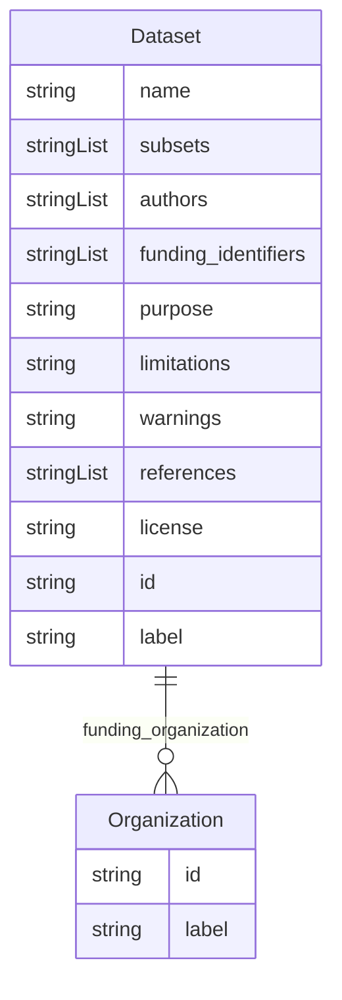

# Class: Dataset


_A document that contains a description of a dataset._


URI: [d4d:Dataset](http://w3id.org/ontogpt/datasheetDataset)





## Inheritance
* [NamedEntity](NamedEntity.md)
    * **Dataset**


## Slots

| Name | Cardinality and Range | Description | Inheritance |
| ---  | --- | --- | --- |
| [name](name.md) | 0..1 <br/> [String](String.md) | The name of the dataset | direct |
| [subsets](subsets.md) | * <br/> [String](String.md) | Semicolon-separated list of names of any subsets of the dataset | direct |
| [authors](authors.md) | * <br/> [String](String.md) | Semicolon-separated list of names of creators of the dataset | direct |
| [funding_organization](funding_organization.md) | * <br/> [Organization](Organization.md) | Semicolon-separated list of organizations supporting creation of the dataset | direct |
| [funding_identifiers](funding_identifiers.md) | * <br/> [String](String.md) | Semicolon-separated list of names, numbers, or other identifiers for grants s... | direct |
| [purpose](purpose.md) | 0..1 <br/> [String](String.md) | The stated purpose of the dataset | direct |
| [limitations](limitations.md) | 0..1 <br/> [String](String.md) | Known limitations of the dataset | direct |
| [warnings](warnings.md) | 0..1 <br/> [String](String.md) | Warnings regarding content or application of the dataset | direct |
| [references](references.md) | * <br/> [String](String.md) | Semicolon-separated list of publications describing the data or the process u... | direct |
| [license](license.md) | 0..1 <br/> [String](String.md) | The set of rules defining the rights of the developer and the users of the da... | direct |
| [id](id.md) | 1 <br/> [String](String.md) | A unique identifier for the named entity | [NamedEntity](NamedEntity.md) |
| [label](label.md) | 0..1 <br/> [String](String.md) | The label (name) of the named thing | [NamedEntity](NamedEntity.md) |


## Identifier and Mapping Information


### Schema Source


* from schema: http://w3id.org/ontogpt/datasheet


## Mappings

| Mapping Type | Mapped Value |
| ---  | ---  |
| self | d4d:Dataset |
| native | d4d:Dataset |


## LinkML Source

<!-- TODO: investigate https://stackoverflow.com/questions/37606292/how-to-create-tabbed-code-blocks-in-mkdocs-or-sphinx -->

### Direct

<details>
```yaml
name: Dataset
description: A document that contains a description of a dataset.
from_schema: http://w3id.org/ontogpt/datasheet
is_a: NamedEntity
attributes:
  name:
    name: name
    description: The name of the dataset.
    from_schema: http://w3id.org/ontogpt/datasheet
    rank: 1000
    domain_of:
    - Dataset
  subsets:
    name: subsets
    description: Semicolon-separated list of names of any subsets of the dataset.
    from_schema: http://w3id.org/ontogpt/datasheet
    rank: 1000
    multivalued: true
    domain_of:
    - Dataset
  authors:
    name: authors
    description: Semicolon-separated list of names of creators of the dataset.
    from_schema: http://w3id.org/ontogpt/datasheet
    rank: 1000
    multivalued: true
    domain_of:
    - Dataset
  funding_organization:
    name: funding_organization
    description: Semicolon-separated list of organizations supporting creation of
      the dataset.
    from_schema: http://w3id.org/ontogpt/datasheet
    rank: 1000
    multivalued: true
    domain_of:
    - Dataset
    range: Organization
  funding_identifiers:
    name: funding_identifiers
    description: Semicolon-separated list of names, numbers, or other identifiers
      for grants supporting creation of the dataset.
    from_schema: http://w3id.org/ontogpt/datasheet
    rank: 1000
    multivalued: true
    domain_of:
    - Dataset
  purpose:
    name: purpose
    description: The stated purpose of the dataset. This should be no more than 1
      sentence.
    from_schema: http://w3id.org/ontogpt/datasheet
    rank: 1000
    domain_of:
    - Dataset
  limitations:
    name: limitations
    description: Known limitations of the dataset. This should be no more than 1 sentence.
    from_schema: http://w3id.org/ontogpt/datasheet
    rank: 1000
    domain_of:
    - Dataset
  warnings:
    name: warnings
    description: Warnings regarding content or application of the dataset.
    from_schema: http://w3id.org/ontogpt/datasheet
    rank: 1000
    domain_of:
    - Dataset
  references:
    name: references
    description: Semicolon-separated list of publications describing the data or the
      process used to produce it.
    from_schema: http://w3id.org/ontogpt/datasheet
    rank: 1000
    multivalued: true
    domain_of:
    - Dataset
  license:
    name: license
    description: The set of rules defining the rights of the developer and the users
      of the dataset, for example, BSD-3 or CC0.
    from_schema: http://w3id.org/ontogpt/datasheet
    rank: 1000
    domain_of:
    - Dataset
tree_root: true

```
</details>

### Induced

<details>
```yaml
name: Dataset
description: A document that contains a description of a dataset.
from_schema: http://w3id.org/ontogpt/datasheet
is_a: NamedEntity
attributes:
  name:
    name: name
    description: The name of the dataset.
    from_schema: http://w3id.org/ontogpt/datasheet
    rank: 1000
    alias: name
    owner: Dataset
    domain_of:
    - Dataset
    range: string
  subsets:
    name: subsets
    description: Semicolon-separated list of names of any subsets of the dataset.
    from_schema: http://w3id.org/ontogpt/datasheet
    rank: 1000
    multivalued: true
    alias: subsets
    owner: Dataset
    domain_of:
    - Dataset
    range: string
  authors:
    name: authors
    description: Semicolon-separated list of names of creators of the dataset.
    from_schema: http://w3id.org/ontogpt/datasheet
    rank: 1000
    multivalued: true
    alias: authors
    owner: Dataset
    domain_of:
    - Dataset
    range: string
  funding_organization:
    name: funding_organization
    description: Semicolon-separated list of organizations supporting creation of
      the dataset.
    from_schema: http://w3id.org/ontogpt/datasheet
    rank: 1000
    multivalued: true
    alias: funding_organization
    owner: Dataset
    domain_of:
    - Dataset
    range: Organization
  funding_identifiers:
    name: funding_identifiers
    description: Semicolon-separated list of names, numbers, or other identifiers
      for grants supporting creation of the dataset.
    from_schema: http://w3id.org/ontogpt/datasheet
    rank: 1000
    multivalued: true
    alias: funding_identifiers
    owner: Dataset
    domain_of:
    - Dataset
    range: string
  purpose:
    name: purpose
    description: The stated purpose of the dataset. This should be no more than 1
      sentence.
    from_schema: http://w3id.org/ontogpt/datasheet
    rank: 1000
    alias: purpose
    owner: Dataset
    domain_of:
    - Dataset
    range: string
  limitations:
    name: limitations
    description: Known limitations of the dataset. This should be no more than 1 sentence.
    from_schema: http://w3id.org/ontogpt/datasheet
    rank: 1000
    alias: limitations
    owner: Dataset
    domain_of:
    - Dataset
    range: string
  warnings:
    name: warnings
    description: Warnings regarding content or application of the dataset.
    from_schema: http://w3id.org/ontogpt/datasheet
    rank: 1000
    alias: warnings
    owner: Dataset
    domain_of:
    - Dataset
    range: string
  references:
    name: references
    description: Semicolon-separated list of publications describing the data or the
      process used to produce it.
    from_schema: http://w3id.org/ontogpt/datasheet
    rank: 1000
    multivalued: true
    alias: references
    owner: Dataset
    domain_of:
    - Dataset
    range: string
  license:
    name: license
    description: The set of rules defining the rights of the developer and the users
      of the dataset, for example, BSD-3 or CC0.
    from_schema: http://w3id.org/ontogpt/datasheet
    rank: 1000
    alias: license
    owner: Dataset
    domain_of:
    - Dataset
    range: string
  id:
    name: id
    annotations:
      prompt.skip:
        tag: prompt.skip
        value: 'true'
    description: A unique identifier for the named entity
    comments:
    - this is populated during the grounding and normalization step
    from_schema: http://w3id.org/ontogpt/datasheet
    rank: 1000
    identifier: true
    alias: id
    owner: Dataset
    domain_of:
    - NamedEntity
    - Publication
    range: string
    required: true
  label:
    name: label
    annotations:
      owl:
        tag: owl
        value: AnnotationProperty, AnnotationAssertion
    description: The label (name) of the named thing
    from_schema: http://w3id.org/ontogpt/datasheet
    aliases:
    - name
    rank: 1000
    slot_uri: rdfs:label
    alias: label
    owner: Dataset
    domain_of:
    - NamedEntity
    range: string
tree_root: true

```
</details>