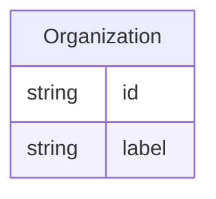

# Class: Organization


URI: [d4d:Organization](http://w3id.org/ontogpt/datasheetOrganization)





## Inheritance
* [NamedEntity](NamedEntity.md)
    * **Organization**


## Slots

| Name | Cardinality and Range | Description | Inheritance |
| ---  | --- | --- | --- |
| [id](id.md) | 1 <br/> [String](String.md) | A unique identifier for the named entity | [NamedEntity](NamedEntity.md) |
| [label](label.md) | 0..1 <br/> [String](String.md) | The label (name) of the named thing | [NamedEntity](NamedEntity.md) |


## Usages

| used by | used in | type | used |
| ---  | --- | --- | --- |
| [Dataset](Dataset.md) | [funding_organization](funding_organization.md) | range | [Organization](Organization.md) |


## Identifier and Mapping Information


### Valid ID Prefixes

Instances of this class *should* have identifiers with one of the following prefixes:

* wikidata

* NCIT


### Annotations

| property | value |
| --- | --- |
| annotators | wikidata:, sqlite:obo:ncit |


### Schema Source


* from schema: http://w3id.org/ontogpt/datasheet


## Mappings

| Mapping Type | Mapped Value |
| ---  | ---  |
| self | d4d:Organization |
| native | d4d:Organization |


## LinkML Source

<!-- TODO: investigate https://stackoverflow.com/questions/37606292/how-to-create-tabbed-code-blocks-in-mkdocs-or-sphinx -->

### Direct

<details>
```yaml
name: Organization
id_prefixes:
- wikidata
- NCIT
annotations:
  annotators:
    tag: annotators
    value: wikidata:, sqlite:obo:ncit
from_schema: http://w3id.org/ontogpt/datasheet
is_a: NamedEntity

```
</details>

### Induced

<details>
```yaml
name: Organization
id_prefixes:
- wikidata
- NCIT
annotations:
  annotators:
    tag: annotators
    value: wikidata:, sqlite:obo:ncit
from_schema: http://w3id.org/ontogpt/datasheet
is_a: NamedEntity
attributes:
  id:
    name: id
    annotations:
      prompt.skip:
        tag: prompt.skip
        value: 'true'
    description: A unique identifier for the named entity
    comments:
    - this is populated during the grounding and normalization step
    from_schema: http://w3id.org/ontogpt/datasheet
    rank: 1000
    identifier: true
    alias: id
    owner: Organization
    domain_of:
    - NamedEntity
    - Publication
    range: string
    required: true
  label:
    name: label
    annotations:
      owl:
        tag: owl
        value: AnnotationProperty, AnnotationAssertion
    description: The label (name) of the named thing
    from_schema: http://w3id.org/ontogpt/datasheet
    aliases:
    - name
    rank: 1000
    slot_uri: rdfs:label
    alias: label
    owner: Organization
    domain_of:
    - NamedEntity
    range: string

```
</details>