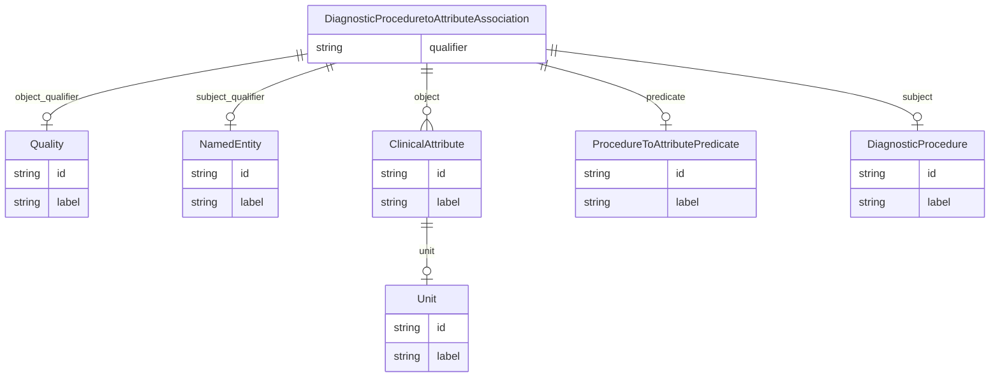

# Class: DiagnosticProceduretoAttributeAssociation


_A triple representing a relationship between a diagnostic procedure and a measured attribute, e.g., "blood pressure measurement" is associated with "blood pressure" (or in OBA, something like OBA:VT0000183, "blood pressure trait")._


URI: [diag:DiagnosticProceduretoAttributeAssociation](http://w3id.org/ontogpt/diagnostic_procedure/DiagnosticProceduretoAttributeAssociation)





## Inheritance
* [CompoundExpression](CompoundExpression.md)
    * [Triple](Triple.md)
        * **DiagnosticProceduretoAttributeAssociation**


## Slots

| Name | Cardinality and Range | Description | Inheritance |
| ---  | --- | --- | --- |
| [subject](subject.md) | 0..1 <br/> [DiagnosticProcedure](DiagnosticProcedure.md) | A diagnostic procedure yielding a result, which in turn may be interpreted as... | [Triple](Triple.md) |
| [predicate](predicate.md) | 0..1 <br/> [ProcedureToAttributePredicate](ProcedureToAttributePredicate.md) | The relationship type, e | [Triple](Triple.md) |
| [object](object.md) | * <br/> [ClinicalAttribute](ClinicalAttribute.md) | Any measurable clinical attribute | [Triple](Triple.md) |
| [qualifier](qualifier.md) | 0..1 <br/> [String](String.md) | A qualifier for the statements, e | [Triple](Triple.md) |
| [subject_qualifier](subject_qualifier.md) | 0..1 <br/> [NamedEntity](NamedEntity.md) | An optional qualifier or modifier for the procedure | [Triple](Triple.md) |
| [object_qualifier](object_qualifier.md) | 0..1 <br/> [Quality](Quality.md) | An optional qualifier or modifier for the phenotype | [Triple](Triple.md) |


## Identifier and Mapping Information


### Schema Source


* from schema: http://w3id.org/ontogpt/diagnostic_procedure


## Mappings

| Mapping Type | Mapped Value |
| ---  | ---  |
| self | diag:DiagnosticProceduretoAttributeAssociation |
| native | diag:DiagnosticProceduretoAttributeAssociation |


## LinkML Source

<!-- TODO: investigate https://stackoverflow.com/questions/37606292/how-to-create-tabbed-code-blocks-in-mkdocs-or-sphinx -->

### Direct

<details>
```yaml
name: DiagnosticProceduretoAttributeAssociation
description: A triple representing a relationship between a diagnostic procedure and
  a measured attribute, e.g., "blood pressure measurement" is associated with "blood
  pressure" (or in OBA, something like OBA:VT0000183, "blood pressure trait").
from_schema: http://w3id.org/ontogpt/diagnostic_procedure
is_a: Triple
slot_usage:
  subject:
    name: subject
    description: A diagnostic procedure yielding a result, which in turn may be interpreted
      as a phenotype. Procedures include "heart rate measurement", "blood pressure
      measurement", "oxygen saturation measurement", etc. In practice, procedures
      may be named based on what they measure, with the "measurement" part left implicit.
    domain_of:
    - Triple
    range: DiagnosticProcedure
  object:
    name: object
    description: Any measurable clinical attribute.
    domain_of:
    - Triple
    range: ClinicalAttribute
    multivalued: true
  predicate:
    name: predicate
    description: The relationship type, e.g. RELATED_TO
    domain_of:
    - Triple
    range: ProcedureToAttributePredicate
  subject_qualifier:
    name: subject_qualifier
    description: An optional qualifier or modifier for the procedure.
    domain_of:
    - Triple
    range: NamedEntity
  object_qualifier:
    name: object_qualifier
    description: An optional qualifier or modifier for the phenotype.
    domain_of:
    - Triple
    range: Quality

```
</details>

### Induced

<details>
```yaml
name: DiagnosticProceduretoAttributeAssociation
description: A triple representing a relationship between a diagnostic procedure and
  a measured attribute, e.g., "blood pressure measurement" is associated with "blood
  pressure" (or in OBA, something like OBA:VT0000183, "blood pressure trait").
from_schema: http://w3id.org/ontogpt/diagnostic_procedure
is_a: Triple
slot_usage:
  subject:
    name: subject
    description: A diagnostic procedure yielding a result, which in turn may be interpreted
      as a phenotype. Procedures include "heart rate measurement", "blood pressure
      measurement", "oxygen saturation measurement", etc. In practice, procedures
      may be named based on what they measure, with the "measurement" part left implicit.
    domain_of:
    - Triple
    range: DiagnosticProcedure
  object:
    name: object
    description: Any measurable clinical attribute.
    domain_of:
    - Triple
    range: ClinicalAttribute
    multivalued: true
  predicate:
    name: predicate
    description: The relationship type, e.g. RELATED_TO
    domain_of:
    - Triple
    range: ProcedureToAttributePredicate
  subject_qualifier:
    name: subject_qualifier
    description: An optional qualifier or modifier for the procedure.
    domain_of:
    - Triple
    range: NamedEntity
  object_qualifier:
    name: object_qualifier
    description: An optional qualifier or modifier for the phenotype.
    domain_of:
    - Triple
    range: Quality
attributes:
  subject:
    name: subject
    description: A diagnostic procedure yielding a result, which in turn may be interpreted
      as a phenotype. Procedures include "heart rate measurement", "blood pressure
      measurement", "oxygen saturation measurement", etc. In practice, procedures
      may be named based on what they measure, with the "measurement" part left implicit.
    from_schema: http://w3id.org/ontogpt/diagnostic_procedure
    rank: 1000
    alias: subject
    owner: DiagnosticProceduretoAttributeAssociation
    domain_of:
    - Triple
    range: DiagnosticProcedure
  predicate:
    name: predicate
    description: The relationship type, e.g. RELATED_TO
    from_schema: http://w3id.org/ontogpt/diagnostic_procedure
    rank: 1000
    alias: predicate
    owner: DiagnosticProceduretoAttributeAssociation
    domain_of:
    - Triple
    range: ProcedureToAttributePredicate
  object:
    name: object
    description: Any measurable clinical attribute.
    from_schema: http://w3id.org/ontogpt/diagnostic_procedure
    rank: 1000
    alias: object
    owner: DiagnosticProceduretoAttributeAssociation
    domain_of:
    - Triple
    range: ClinicalAttribute
    multivalued: true
  qualifier:
    name: qualifier
    description: A qualifier for the statements, e.g. "NOT" for negation
    from_schema: http://w3id.org/ontogpt/diagnostic_procedure
    rank: 1000
    alias: qualifier
    owner: DiagnosticProceduretoAttributeAssociation
    domain_of:
    - Triple
    range: string
  subject_qualifier:
    name: subject_qualifier
    description: An optional qualifier or modifier for the procedure.
    from_schema: http://w3id.org/ontogpt/diagnostic_procedure
    rank: 1000
    alias: subject_qualifier
    owner: DiagnosticProceduretoAttributeAssociation
    domain_of:
    - Triple
    range: NamedEntity
  object_qualifier:
    name: object_qualifier
    description: An optional qualifier or modifier for the phenotype.
    from_schema: http://w3id.org/ontogpt/diagnostic_procedure
    rank: 1000
    alias: object_qualifier
    owner: DiagnosticProceduretoAttributeAssociation
    domain_of:
    - Triple
    range: Quality

```
</details>