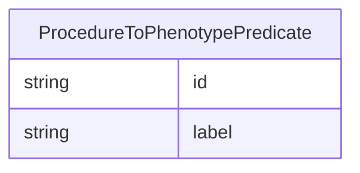

# Class: ProcedureToPhenotypePredicate
_A predicate for procedure to phenotype relationships, defining "this procedure is intended to provide support for/against this phenotype"._


URI: [diag:ProcedureToPhenotypePredicate](http://w3id.org/ontogpt/diagnostic_procedure/ProcedureToPhenotypePredicate)





## Inheritance
* [NamedEntity](NamedEntity.md)
    * [RelationshipType](RelationshipType.md)
        * **ProcedureToPhenotypePredicate**


## Slots

| Name | Cardinality and Range | Description | Inheritance |
| ---  | --- | --- | --- |
| [id](id.md) | 1..1 <br/> [String](String.md) | A unique identifier for the named entity | [NamedEntity](NamedEntity.md) |
| [label](label.md) | 0..1 <br/> [String](String.md) | The label (name) of the named thing | [NamedEntity](NamedEntity.md) |


## Usages

| used by | used in | type | used |
| ---  | --- | --- | --- |
| [DiagnosticProceduretoPhenotypeAssociation](DiagnosticProceduretoPhenotypeAssociation.md) | [predicate](predicate.md) | range | [ProcedureToPhenotypePredicate](ProcedureToPhenotypePredicate.md) |


## Identifier and Mapping Information


### Schema Source


* from schema: http://w3id.org/ontogpt/diagnostic_procedure


## Mappings

| Mapping Type | Mapped Value |
| ---  | ---  |
| self | diag:ProcedureToPhenotypePredicate |
| native | diag:ProcedureToPhenotypePredicate |


## LinkML Source

<!-- TODO: investigate https://stackoverflow.com/questions/37606292/how-to-create-tabbed-code-blocks-in-mkdocs-or-sphinx -->

### Direct

<details>
```yaml
name: ProcedureToPhenotypePredicate
description: A predicate for procedure to phenotype relationships, defining "this
  procedure is intended to provide support for/against this phenotype".
from_schema: http://w3id.org/ontogpt/diagnostic_procedure
rank: 1000
is_a: RelationshipType

```
</details>

### Induced

<details>
```yaml
name: ProcedureToPhenotypePredicate
description: A predicate for procedure to phenotype relationships, defining "this
  procedure is intended to provide support for/against this phenotype".
from_schema: http://w3id.org/ontogpt/diagnostic_procedure
rank: 1000
is_a: RelationshipType
attributes:
  id:
    name: id
    annotations:
      prompt.skip:
        tag: prompt.skip
        value: 'true'
    description: A unique identifier for the named entity
    comments:
    - this is populated during the grounding and normalization step
    from_schema: http://w3id.org/ontogpt/diagnostic_procedure
    rank: 1000
    identifier: true
    alias: id
    owner: ProcedureToPhenotypePredicate
    domain_of:
    - NamedEntity
    - Publication
    range: string
  label:
    name: label
    annotations:
      owl:
        tag: owl
        value: AnnotationProperty, AnnotationAssertion
    description: The label (name) of the named thing
    from_schema: http://w3id.org/ontogpt/diagnostic_procedure
    aliases:
    - name
    rank: 1000
    slot_uri: rdfs:label
    alias: label
    owner: ProcedureToPhenotypePredicate
    domain_of:
    - NamedEntity
    range: string

```
</details>