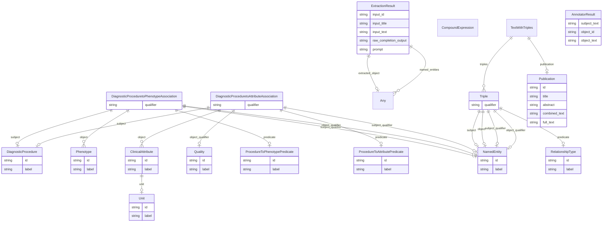

# Diagnostic Procedure Template

A template for clinical diagnostic procedures and the phenotypes they may contribute to.

URI: http://w3id.org/ontogpt/diagnostic_procedure
Name: diagnostic_procedure

## Schema Diagram

## Classes

| Class | Description |
| --- | --- |
| [AnnotatorResult](AnnotatorResult.md) |  |
| [Any](Any.md) |  |
| [ClinicalAttribute](ClinicalAttribute.md) |  |
| [CompoundExpression](CompoundExpression.md) |  |
| [DiagnosticProcedure](DiagnosticProcedure.md) |  |
| [DiagnosticProceduretoAttributeAssociation](DiagnosticProceduretoAttributeAssociation.md) | A triple representing a relationship between a diagnostic procedure and a mea... |
| [DiagnosticProceduretoPhenotypeAssociation](DiagnosticProceduretoPhenotypeAssociation.md) | A triple representing a relationship between a diagnostic procedure and an as... |
| [ExtractionResult](ExtractionResult.md) | A result of extracting knowledge on text |
| [NamedEntity](NamedEntity.md) |  |
| [Phenotype](Phenotype.md) |  |
| [ProcedureToAttributePredicate](ProcedureToAttributePredicate.md) | A predicate for procedure to attribute relationships, defining "this procedur... |
| [ProcedureToPhenotypePredicate](ProcedureToPhenotypePredicate.md) | A predicate for procedure to phenotype relationships, defining "this procedur... |
| [Publication](Publication.md) |  |
| [Quality](Quality.md) |  |
| [RelationshipType](RelationshipType.md) |  |
| [TextWithTriples](TextWithTriples.md) |  |
| [Triple](Triple.md) | Abstract parent for Relation Extraction tasks |
| [Unit](Unit.md) |  |

## Slots

| Slot | Description |
| --- | --- |
| [abstract](abstract.md) | The abstract of the publication |
| [combined_text](combined_text.md) |  |
| [extracted_object](extracted_object.md) | The complex objects extracted from the text |
| [full_text](full_text.md) | The full text of the publication |
| [id](id.md) | A unique identifier for the named entity |
| [input_id](input_id.md) |  |
| [input_text](input_text.md) |  |
| [input_title](input_title.md) |  |
| [label](label.md) | The label (name) of the named thing |
| [named_entities](named_entities.md) | Named entities extracted from the text |
| [object](object.md) |  |
| [object_id](object_id.md) |  |
| [object_qualifier](object_qualifier.md) | An optional qualifier or modifier for the object of the statement, e |
| [object_text](object_text.md) |  |
| [predicate](predicate.md) |  |
| [prompt](prompt.md) |  |
| [publication](publication.md) |  |
| [qualifier](qualifier.md) | A qualifier for the statements, e |
| [raw_completion_output](raw_completion_output.md) |  |
| [subject](subject.md) |  |
| [subject_qualifier](subject_qualifier.md) | An optional qualifier or modifier for the subject of the statement, e |
| [subject_text](subject_text.md) |  |
| [title](title.md) | The title of the publication |
| [triples](triples.md) |  |
| [unit](unit.md) | the unit used to measure the attribute |

## Enumerations

| Enumeration | Description |
| --- | --- |

## Types

| Type | Description |
| --- | --- |
| [Boolean](Boolean.md) | A binary (true or false) value |
| [Date](Date.md) | a date (year, month and day) in an idealized calendar |
| [DateOrDatetime](DateOrDatetime.md) | Either a date or a datetime |
| [Datetime](Datetime.md) | The combination of a date and time |
| [Decimal](Decimal.md) | A real number with arbitrary precision that conforms to the xsd:decimal speci... |
| [Double](Double.md) | A real number that conforms to the xsd:double specification |
| [Float](Float.md) | A real number that conforms to the xsd:float specification |
| [Integer](Integer.md) | An integer |
| [Ncname](Ncname.md) | Prefix part of CURIE |
| [Nodeidentifier](Nodeidentifier.md) | A URI, CURIE or BNODE that represents a node in a model |
| [Objectidentifier](Objectidentifier.md) | A URI or CURIE that represents an object in the model |
| [String](String.md) | A character string |
| [Time](Time.md) | A time object represents a (local) time of day, independent of any particular... |
| [Uri](Uri.md) | a complete URI |
| [Uriorcurie](Uriorcurie.md) | a URI or a CURIE |

## Subsets

| Subset | Description |
| --- | --- |
