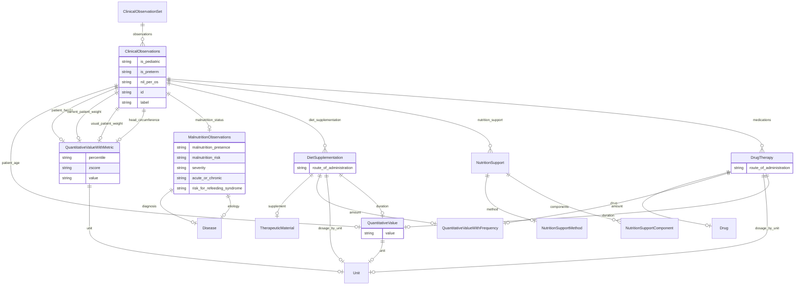

# Class: ClinicalObservationSet


_A set of sets of clinical observations._


URI: [dietitian_notes:ClinicalObservationSet](dietitian_notes:ClinicalObservationSet)





<!-- no inheritance hierarchy -->


## Slots

| Name | Cardinality and Range | Description | Inheritance |
| ---  | --- | --- | --- |
| [observations](observations.md) | * <br/> [ClinicalObservations](ClinicalObservations.md) |  | direct |


## Identifier and Mapping Information


### Schema Source


* from schema: http://w3id.org/ontogpt/dietician_notes


## Mappings

| Mapping Type | Mapped Value |
| ---  | ---  |
| self | dietitian_notes:ClinicalObservationSet |
| native | dietitian_notes:ClinicalObservationSet |


## LinkML Source

<!-- TODO: investigate https://stackoverflow.com/questions/37606292/how-to-create-tabbed-code-blocks-in-mkdocs-or-sphinx -->

### Direct

<details>
```yaml
name: ClinicalObservationSet
description: A set of sets of clinical observations.
from_schema: http://w3id.org/ontogpt/dietician_notes
attributes:
  observations:
    name: observations
    from_schema: http://w3id.org/ontogpt/dietician_notes
    rank: 1000
    domain_of:
    - ClinicalObservationSet
    range: ClinicalObservations
    multivalued: true

```
</details>

### Induced

<details>
```yaml
name: ClinicalObservationSet
description: A set of sets of clinical observations.
from_schema: http://w3id.org/ontogpt/dietician_notes
attributes:
  observations:
    name: observations
    from_schema: http://w3id.org/ontogpt/dietician_notes
    rank: 1000
    alias: observations
    owner: ClinicalObservationSet
    domain_of:
    - ClinicalObservationSet
    range: ClinicalObservations
    multivalued: true

```
</details>