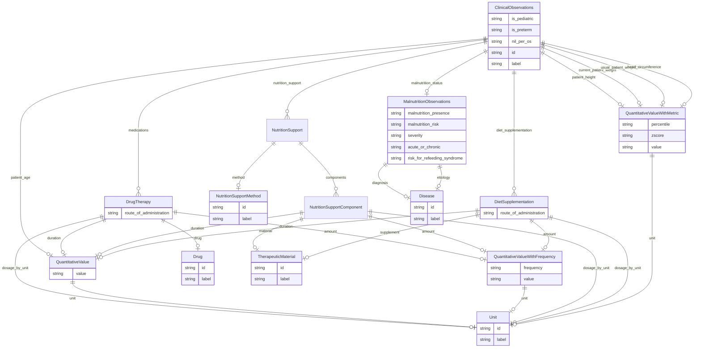

# Class: ClinicalObservations


_A set of clinical observations about a single patient at a single time._


URI: [dietitian_notes:ClinicalObservations](dietitian_notes:ClinicalObservations)





## Inheritance
* [NamedEntity](NamedEntity.md)
    * **ClinicalObservations**


## Slots

| Name | Cardinality and Range | Description | Inheritance |
| ---  | --- | --- | --- |
| [is_pediatric](is_pediatric.md) | 0..1 <br/> [String](String.md) |  | direct |
| [is_preterm](is_preterm.md) | 0..1 <br/> [String](String.md) |  | direct |
| [patient_age](patient_age.md) | 0..1 <br/> [QuantitativeValue](QuantitativeValue.md) |  | direct |
| [patient_height](patient_height.md) | 0..1 <br/> [QuantitativeValueWithMetric](QuantitativeValueWithMetric.md) |  | direct |
| [current_patient_weight](current_patient_weight.md) | 0..1 <br/> [QuantitativeValueWithMetric](QuantitativeValueWithMetric.md) |  | direct |
| [usual_patient_weight](usual_patient_weight.md) | 0..1 <br/> [QuantitativeValueWithMetric](QuantitativeValueWithMetric.md) |  | direct |
| [head_circumference](head_circumference.md) | 0..1 <br/> [QuantitativeValueWithMetric](QuantitativeValueWithMetric.md) |  | direct |
| [malnutrition_status](malnutrition_status.md) | 0..1 <br/> [MalnutritionObservations](MalnutritionObservations.md) |  | direct |
| [diet_supplementation](diet_supplementation.md) | * <br/> [DietSupplementation](DietSupplementation.md) | A semicolon-separated list of the patient's diet supplementation therapies | direct |
| [nutrition_support](nutrition_support.md) | * <br/> [NutritionSupport](NutritionSupport.md) | A semicolon-separated list of the patient's nutrition support therapies, usua... | direct |
| [medications](medications.md) | * <br/> [DrugTherapy](DrugTherapy.md) | A semicolon-separated list of the patient's medications | direct |
| [nil_per_os](nil_per_os.md) | 0..1 <br/> [String](String.md) | True if the patient is not receiving any oral nutrition, False otherwise | direct |
| [id](id.md) | 1 <br/> [String](String.md) | A unique identifier for the named entity | [NamedEntity](NamedEntity.md) |
| [label](label.md) | 0..1 <br/> [String](String.md) | The label (name) of the named thing | [NamedEntity](NamedEntity.md) |


## Usages

| used by | used in | type | used |
| ---  | --- | --- | --- |
| [ClinicalObservationSet](ClinicalObservationSet.md) | [observations](observations.md) | range | [ClinicalObservations](ClinicalObservations.md) |


## Identifier and Mapping Information


### Schema Source


* from schema: http://w3id.org/ontogpt/dietician_notes


## Mappings

| Mapping Type | Mapped Value |
| ---  | ---  |
| self | dietitian_notes:ClinicalObservations |
| native | dietitian_notes:ClinicalObservations |


## LinkML Source

<!-- TODO: investigate https://stackoverflow.com/questions/37606292/how-to-create-tabbed-code-blocks-in-mkdocs-or-sphinx -->

### Direct

<details>
```yaml
name: ClinicalObservations
description: A set of clinical observations about a single patient at a single time.
from_schema: http://w3id.org/ontogpt/dietician_notes
is_a: NamedEntity
attributes:
  is_pediatric:
    name: is_pediatric
    annotations:
      prompt:
        tag: prompt
        value: True if the patient is a child, False otherwise.
    from_schema: http://w3id.org/ontogpt/dietician_notes
    rank: 1000
    domain_of:
    - ClinicalObservations
    range: string
  is_preterm:
    name: is_preterm
    annotations:
      prompt:
        tag: prompt
        value: True if the patient's birth was preterm, False otherwise. A birth before
          37 weeks gestation is preterm.
    from_schema: http://w3id.org/ontogpt/dietician_notes
    rank: 1000
    domain_of:
    - ClinicalObservations
    range: string
  patient_age:
    name: patient_age
    annotations:
      prompt:
        tag: prompt
        value: The patient's age at the time of the current assessment. Omit the word
          "old" from the response. 'Not provided' if not provided.
    from_schema: http://w3id.org/ontogpt/dietician_notes
    rank: 1000
    domain_of:
    - ClinicalObservations
    range: QuantitativeValue
  patient_height:
    name: patient_height
    annotations:
      prompt:
        tag: prompt
        value: The value and units of the patient's height. This should include all
          units, percentiles, and z-scores. 'Not provided' if not provided.
    from_schema: http://w3id.org/ontogpt/dietician_notes
    rank: 1000
    domain_of:
    - ClinicalObservations
    range: QuantitativeValueWithMetric
  current_patient_weight:
    name: current_patient_weight
    annotations:
      prompt:
        tag: prompt
        value: 'The value and units of the patient''s actual body weight at the time
          of the current assessment. This should include all units, percentiles, and
          z-scores. Relevant acronyms: IBW: ideal body weight, UBW: usual body weight,
          ABW: actual body weight. ''Not provided'' if not provided.'
    from_schema: http://w3id.org/ontogpt/dietician_notes
    rank: 1000
    domain_of:
    - ClinicalObservations
    range: QuantitativeValueWithMetric
  usual_patient_weight:
    name: usual_patient_weight
    annotations:
      prompt:
        tag: prompt
        value: 'The value and units of the patient''s body weight under usual conditions
          and/or in the recent past. This should include all units, percentiles, and
          z-scores. Relevant acronyms: IBW: ideal body weight, UBW: usual body weight,
          ABW: actual body weight. ''Not provided'' if not provided.'
    from_schema: http://w3id.org/ontogpt/dietician_notes
    rank: 1000
    domain_of:
    - ClinicalObservations
    range: QuantitativeValueWithMetric
  head_circumference:
    name: head_circumference
    annotations:
      prompt:
        tag: prompt
        value: The value and units of the patient's head circumference. This may be
          abbreviated as "HC". 'Not provided' if not provided.
    from_schema: http://w3id.org/ontogpt/dietician_notes
    rank: 1000
    domain_of:
    - ClinicalObservations
    range: QuantitativeValueWithMetric
  malnutrition_status:
    name: malnutrition_status
    annotations:
      prompt:
        tag: prompt
        value: Observations of the patient's malnutrition status. This should include
          any details of malnutrition presence, risk, severity, duration, diagnosis,
          and etiology. Should also include any risk for refeeding syndrome. 'Not
          provided' if not provided.
    from_schema: http://w3id.org/ontogpt/dietician_notes
    rank: 1000
    domain_of:
    - ClinicalObservations
    range: MalnutritionObservations
  diet_supplementation:
    name: diet_supplementation
    description: 'A semicolon-separated list of the patient''s diet supplementation
      therapies. Split on specific ingredients and their amounts. All acronyms should
      be expanded, omitting the original acronym. Relevant acronyms: PO: per os/by
      mouth, TPN: total parenteral nutrition, PN: parenteral nutrition, EN: enteral
      nutrition, D#%: dextrose percentage (e.g. D5%) for PN infusion, AA # g/kg/d:
      amino acid provisions (may also be in percentages) for PN infusion, SMOF # g/kg/d:
      soy MCT olive fish oil emulsion for PN infusion, GIR: glucose infusion rate,
      SBS: short bowel syndrome, LIS: low intermittent suction, BW: birth weight,
      EHM: exclusively human milk, RTBW: return to birth weight, Mg: magnesium, Phos:
      phosphorus, GI: gastrointestinal, PICC: peripherally inserted central catheter,
      DOL: day of life, TG: triglycerides, KUB: Kidney ureter bladder CT'
    from_schema: http://w3id.org/ontogpt/dietician_notes
    rank: 1000
    domain_of:
    - ClinicalObservations
    range: DietSupplementation
    multivalued: true
  nutrition_support:
    name: nutrition_support
    description: 'A semicolon-separated list of the patient''s nutrition support therapies,
      usually enteral or parenteral nutrition. All acronyms should be expanded, omitting
      the original acronym. Relevant acronyms: PO: per os/by mouth, TPN: total parenteral
      nutrition, PN: parenteral nutrition, EN: enteral nutrition, D#%: dextrose percentage
      (e.g. D5%) for PN infusion, AA # g/kg/d: amino acid provisions (may also be
      in percentages) for PN infusion, SMOF # g/kg/d: soy MCT olive fish oil emulsion
      for PN infusion, GIR: glucose infusion rate, SBS: short bowel syndrome, LIS:
      low intermittent suction, BW: birth weight, EHM: exclusively human milk, RTBW:
      return to birth weight, Mg: magnesium, Phos: phosphorus, GI: gastrointestinal,
      PICC: peripherally inserted central catheter, DOL: day of life, TG: triglycerides,
      KUB: Kidney ureter bladder CT'
    from_schema: http://w3id.org/ontogpt/dietician_notes
    rank: 1000
    domain_of:
    - ClinicalObservations
    range: NutritionSupport
    multivalued: true
  medications:
    name: medications
    description: 'A semicolon-separated list of the patient''s medications. This should
      include the medication name, dosage, frequency, and route of administration.
      Relevant acronyms: PO: per os/by mouth, PRN: pro re nata/as needed. ''Not provided''
      if not provided.'
    from_schema: http://w3id.org/ontogpt/dietician_notes
    rank: 1000
    domain_of:
    - ClinicalObservations
    range: DrugTherapy
    multivalued: true
  nil_per_os:
    name: nil_per_os
    description: True if the patient is not receiving any oral nutrition, False otherwise.
      NPO means nil per os/nothing by mouth. N/A if not indicated.
    from_schema: http://w3id.org/ontogpt/dietician_notes
    rank: 1000
    domain_of:
    - ClinicalObservations
    range: string
tree_root: true

```
</details>

### Induced

<details>
```yaml
name: ClinicalObservations
description: A set of clinical observations about a single patient at a single time.
from_schema: http://w3id.org/ontogpt/dietician_notes
is_a: NamedEntity
attributes:
  is_pediatric:
    name: is_pediatric
    annotations:
      prompt:
        tag: prompt
        value: True if the patient is a child, False otherwise.
    from_schema: http://w3id.org/ontogpt/dietician_notes
    rank: 1000
    alias: is_pediatric
    owner: ClinicalObservations
    domain_of:
    - ClinicalObservations
    range: string
  is_preterm:
    name: is_preterm
    annotations:
      prompt:
        tag: prompt
        value: True if the patient's birth was preterm, False otherwise. A birth before
          37 weeks gestation is preterm.
    from_schema: http://w3id.org/ontogpt/dietician_notes
    rank: 1000
    alias: is_preterm
    owner: ClinicalObservations
    domain_of:
    - ClinicalObservations
    range: string
  patient_age:
    name: patient_age
    annotations:
      prompt:
        tag: prompt
        value: The patient's age at the time of the current assessment. Omit the word
          "old" from the response. 'Not provided' if not provided.
    from_schema: http://w3id.org/ontogpt/dietician_notes
    rank: 1000
    alias: patient_age
    owner: ClinicalObservations
    domain_of:
    - ClinicalObservations
    range: QuantitativeValue
  patient_height:
    name: patient_height
    annotations:
      prompt:
        tag: prompt
        value: The value and units of the patient's height. This should include all
          units, percentiles, and z-scores. 'Not provided' if not provided.
    from_schema: http://w3id.org/ontogpt/dietician_notes
    rank: 1000
    alias: patient_height
    owner: ClinicalObservations
    domain_of:
    - ClinicalObservations
    range: QuantitativeValueWithMetric
  current_patient_weight:
    name: current_patient_weight
    annotations:
      prompt:
        tag: prompt
        value: 'The value and units of the patient''s actual body weight at the time
          of the current assessment. This should include all units, percentiles, and
          z-scores. Relevant acronyms: IBW: ideal body weight, UBW: usual body weight,
          ABW: actual body weight. ''Not provided'' if not provided.'
    from_schema: http://w3id.org/ontogpt/dietician_notes
    rank: 1000
    alias: current_patient_weight
    owner: ClinicalObservations
    domain_of:
    - ClinicalObservations
    range: QuantitativeValueWithMetric
  usual_patient_weight:
    name: usual_patient_weight
    annotations:
      prompt:
        tag: prompt
        value: 'The value and units of the patient''s body weight under usual conditions
          and/or in the recent past. This should include all units, percentiles, and
          z-scores. Relevant acronyms: IBW: ideal body weight, UBW: usual body weight,
          ABW: actual body weight. ''Not provided'' if not provided.'
    from_schema: http://w3id.org/ontogpt/dietician_notes
    rank: 1000
    alias: usual_patient_weight
    owner: ClinicalObservations
    domain_of:
    - ClinicalObservations
    range: QuantitativeValueWithMetric
  head_circumference:
    name: head_circumference
    annotations:
      prompt:
        tag: prompt
        value: The value and units of the patient's head circumference. This may be
          abbreviated as "HC". 'Not provided' if not provided.
    from_schema: http://w3id.org/ontogpt/dietician_notes
    rank: 1000
    alias: head_circumference
    owner: ClinicalObservations
    domain_of:
    - ClinicalObservations
    range: QuantitativeValueWithMetric
  malnutrition_status:
    name: malnutrition_status
    annotations:
      prompt:
        tag: prompt
        value: Observations of the patient's malnutrition status. This should include
          any details of malnutrition presence, risk, severity, duration, diagnosis,
          and etiology. Should also include any risk for refeeding syndrome. 'Not
          provided' if not provided.
    from_schema: http://w3id.org/ontogpt/dietician_notes
    rank: 1000
    alias: malnutrition_status
    owner: ClinicalObservations
    domain_of:
    - ClinicalObservations
    range: MalnutritionObservations
  diet_supplementation:
    name: diet_supplementation
    description: 'A semicolon-separated list of the patient''s diet supplementation
      therapies. Split on specific ingredients and their amounts. All acronyms should
      be expanded, omitting the original acronym. Relevant acronyms: PO: per os/by
      mouth, TPN: total parenteral nutrition, PN: parenteral nutrition, EN: enteral
      nutrition, D#%: dextrose percentage (e.g. D5%) for PN infusion, AA # g/kg/d:
      amino acid provisions (may also be in percentages) for PN infusion, SMOF # g/kg/d:
      soy MCT olive fish oil emulsion for PN infusion, GIR: glucose infusion rate,
      SBS: short bowel syndrome, LIS: low intermittent suction, BW: birth weight,
      EHM: exclusively human milk, RTBW: return to birth weight, Mg: magnesium, Phos:
      phosphorus, GI: gastrointestinal, PICC: peripherally inserted central catheter,
      DOL: day of life, TG: triglycerides, KUB: Kidney ureter bladder CT'
    from_schema: http://w3id.org/ontogpt/dietician_notes
    rank: 1000
    alias: diet_supplementation
    owner: ClinicalObservations
    domain_of:
    - ClinicalObservations
    range: DietSupplementation
    multivalued: true
  nutrition_support:
    name: nutrition_support
    description: 'A semicolon-separated list of the patient''s nutrition support therapies,
      usually enteral or parenteral nutrition. All acronyms should be expanded, omitting
      the original acronym. Relevant acronyms: PO: per os/by mouth, TPN: total parenteral
      nutrition, PN: parenteral nutrition, EN: enteral nutrition, D#%: dextrose percentage
      (e.g. D5%) for PN infusion, AA # g/kg/d: amino acid provisions (may also be
      in percentages) for PN infusion, SMOF # g/kg/d: soy MCT olive fish oil emulsion
      for PN infusion, GIR: glucose infusion rate, SBS: short bowel syndrome, LIS:
      low intermittent suction, BW: birth weight, EHM: exclusively human milk, RTBW:
      return to birth weight, Mg: magnesium, Phos: phosphorus, GI: gastrointestinal,
      PICC: peripherally inserted central catheter, DOL: day of life, TG: triglycerides,
      KUB: Kidney ureter bladder CT'
    from_schema: http://w3id.org/ontogpt/dietician_notes
    rank: 1000
    alias: nutrition_support
    owner: ClinicalObservations
    domain_of:
    - ClinicalObservations
    range: NutritionSupport
    multivalued: true
  medications:
    name: medications
    description: 'A semicolon-separated list of the patient''s medications. This should
      include the medication name, dosage, frequency, and route of administration.
      Relevant acronyms: PO: per os/by mouth, PRN: pro re nata/as needed. ''Not provided''
      if not provided.'
    from_schema: http://w3id.org/ontogpt/dietician_notes
    rank: 1000
    alias: medications
    owner: ClinicalObservations
    domain_of:
    - ClinicalObservations
    range: DrugTherapy
    multivalued: true
  nil_per_os:
    name: nil_per_os
    description: True if the patient is not receiving any oral nutrition, False otherwise.
      NPO means nil per os/nothing by mouth. N/A if not indicated.
    from_schema: http://w3id.org/ontogpt/dietician_notes
    rank: 1000
    alias: nil_per_os
    owner: ClinicalObservations
    domain_of:
    - ClinicalObservations
    range: string
  id:
    name: id
    annotations:
      prompt.skip:
        tag: prompt.skip
        value: 'true'
    description: A unique identifier for the named entity
    comments:
    - this is populated during the grounding and normalization step
    from_schema: http://w3id.org/ontogpt/dietician_notes
    rank: 1000
    identifier: true
    alias: id
    owner: ClinicalObservations
    domain_of:
    - NamedEntity
    - Publication
    range: string
    required: true
  label:
    name: label
    annotations:
      owl:
        tag: owl
        value: AnnotationProperty, AnnotationAssertion
    description: The label (name) of the named thing
    from_schema: http://w3id.org/ontogpt/dietician_notes
    aliases:
    - name
    rank: 1000
    slot_uri: rdfs:label
    alias: label
    owner: ClinicalObservations
    domain_of:
    - NamedEntity
    range: string
tree_root: true

```
</details>