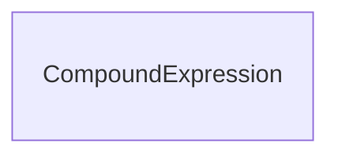

# Class: CompoundExpression


* __NOTE__: this is an abstract class and should not be instantiated directly


URI: [dietitian_notes:CompoundExpression](dietitian_notes:CompoundExpression)





## Inheritance
* **CompoundExpression**
    * [QuantitativeValue](QuantitativeValue.md)
    * [DietSupplementation](DietSupplementation.md)
    * [NutritionSupport](NutritionSupport.md)
    * [NutritionSupportComponent](NutritionSupportComponent.md)
    * [DrugTherapy](DrugTherapy.md)
    * [Triple](Triple.md)


## Slots

| Name | Cardinality and Range | Description | Inheritance |
| ---  | --- | --- | --- |


## Identifier and Mapping Information


### Schema Source


* from schema: http://w3id.org/ontogpt/dietician_notes


## Mappings

| Mapping Type | Mapped Value |
| ---  | ---  |
| self | dietitian_notes:CompoundExpression |
| native | dietitian_notes:CompoundExpression |


## LinkML Source

<!-- TODO: investigate https://stackoverflow.com/questions/37606292/how-to-create-tabbed-code-blocks-in-mkdocs-or-sphinx -->

### Direct

<details>
```yaml
name: CompoundExpression
from_schema: http://w3id.org/ontogpt/dietician_notes
abstract: true

```
</details>

### Induced

<details>
```yaml
name: CompoundExpression
from_schema: http://w3id.org/ontogpt/dietician_notes
abstract: true

```
</details>