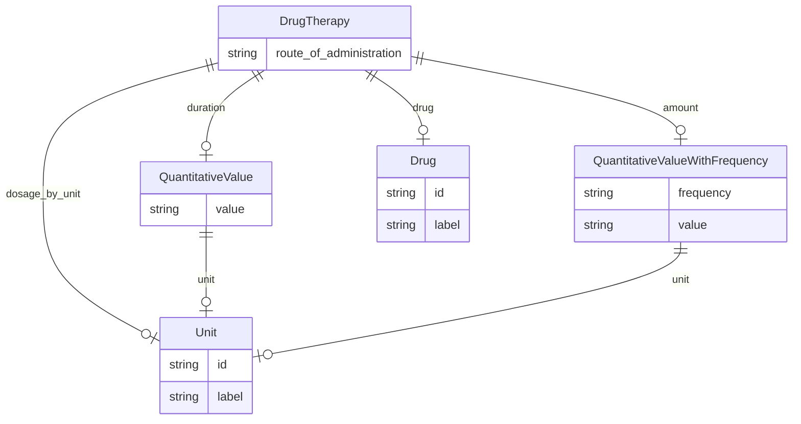

# Class: DrugTherapy


URI: [dietitian_notes:DrugTherapy](dietitian_notes:DrugTherapy)





## Inheritance
* [CompoundExpression](CompoundExpression.md)
    * **DrugTherapy**


## Slots

| Name | Cardinality and Range | Description | Inheritance |
| ---  | --- | --- | --- |
| [drug](drug.md) | 0..1 <br/> [Drug](Drug.md) | The name of a specific drug for a patient's preventative or therapeutic treat... | direct |
| [amount](amount.md) | 0..1 <br/> [QuantitativeValueWithFrequency](QuantitativeValueWithFrequency.md) | The quantity or dosage of the drug, if provided | direct |
| [dosage_by_unit](dosage_by_unit.md) | 0..1 <br/> [Unit](Unit.md) | The unit of a patient's properties used to determine drug dosage | direct |
| [duration](duration.md) | 0..1 <br/> [QuantitativeValue](QuantitativeValue.md) | The duration of the drug therapy, if provided | direct |
| [route_of_administration](route_of_administration.md) | 0..1 <br/> [String](String.md) | The route of administration for the drug therapy, if provided | direct |


## Usages

| used by | used in | type | used |
| ---  | --- | --- | --- |
| [ClinicalObservations](ClinicalObservations.md) | [medications](medications.md) | range | [DrugTherapy](DrugTherapy.md) |


## Identifier and Mapping Information


### Annotations

| property | value |
| --- | --- |
| owl | IntersectionOf |


### Schema Source


* from schema: http://w3id.org/ontogpt/dietician_notes


## Mappings

| Mapping Type | Mapped Value |
| ---  | ---  |
| self | dietitian_notes:DrugTherapy |
| native | dietitian_notes:DrugTherapy |


## LinkML Source

<!-- TODO: investigate https://stackoverflow.com/questions/37606292/how-to-create-tabbed-code-blocks-in-mkdocs-or-sphinx -->

### Direct

<details>
```yaml
name: DrugTherapy
annotations:
  owl:
    tag: owl
    value: IntersectionOf
from_schema: http://w3id.org/ontogpt/dietician_notes
is_a: CompoundExpression
attributes:
  drug:
    name: drug
    description: The name of a specific drug for a patient's preventative or therapeutic
      treatment.
    from_schema: http://w3id.org/ontogpt/dietician_notes
    rank: 1000
    domain_of:
    - DrugTherapy
    range: Drug
  amount:
    name: amount
    description: The quantity or dosage of the drug, if provided. May include a frequency.
      N/A if not provided.
    from_schema: http://w3id.org/ontogpt/dietician_notes
    domain_of:
    - DietSupplementation
    - NutritionSupportComponent
    - DrugTherapy
    range: QuantitativeValueWithFrequency
  dosage_by_unit:
    name: dosage_by_unit
    description: The unit of a patient's properties used to determine drug dosage.
      Often "kilogram". N/A if not provided.
    from_schema: http://w3id.org/ontogpt/dietician_notes
    domain_of:
    - DietSupplementation
    - NutritionSupportComponent
    - DrugTherapy
    range: Unit
  duration:
    name: duration
    description: The duration of the drug therapy, if provided. N/A if not provided.
    from_schema: http://w3id.org/ontogpt/dietician_notes
    domain_of:
    - DietSupplementation
    - NutritionSupportComponent
    - DrugTherapy
    range: QuantitativeValue
  route_of_administration:
    name: route_of_administration
    description: The route of administration for the drug therapy, if provided. N/A
      if not provided.
    from_schema: http://w3id.org/ontogpt/dietician_notes
    domain_of:
    - DietSupplementation
    - DrugTherapy
    range: string

```
</details>

### Induced

<details>
```yaml
name: DrugTherapy
annotations:
  owl:
    tag: owl
    value: IntersectionOf
from_schema: http://w3id.org/ontogpt/dietician_notes
is_a: CompoundExpression
attributes:
  drug:
    name: drug
    description: The name of a specific drug for a patient's preventative or therapeutic
      treatment.
    from_schema: http://w3id.org/ontogpt/dietician_notes
    rank: 1000
    alias: drug
    owner: DrugTherapy
    domain_of:
    - DrugTherapy
    range: Drug
  amount:
    name: amount
    description: The quantity or dosage of the drug, if provided. May include a frequency.
      N/A if not provided.
    from_schema: http://w3id.org/ontogpt/dietician_notes
    alias: amount
    owner: DrugTherapy
    domain_of:
    - DietSupplementation
    - NutritionSupportComponent
    - DrugTherapy
    range: QuantitativeValueWithFrequency
  dosage_by_unit:
    name: dosage_by_unit
    description: The unit of a patient's properties used to determine drug dosage.
      Often "kilogram". N/A if not provided.
    from_schema: http://w3id.org/ontogpt/dietician_notes
    alias: dosage_by_unit
    owner: DrugTherapy
    domain_of:
    - DietSupplementation
    - NutritionSupportComponent
    - DrugTherapy
    range: Unit
  duration:
    name: duration
    description: The duration of the drug therapy, if provided. N/A if not provided.
    from_schema: http://w3id.org/ontogpt/dietician_notes
    alias: duration
    owner: DrugTherapy
    domain_of:
    - DietSupplementation
    - NutritionSupportComponent
    - DrugTherapy
    range: QuantitativeValue
  route_of_administration:
    name: route_of_administration
    description: The route of administration for the drug therapy, if provided. N/A
      if not provided.
    from_schema: http://w3id.org/ontogpt/dietician_notes
    alias: route_of_administration
    owner: DrugTherapy
    domain_of:
    - DietSupplementation
    - DrugTherapy
    range: string

```
</details>