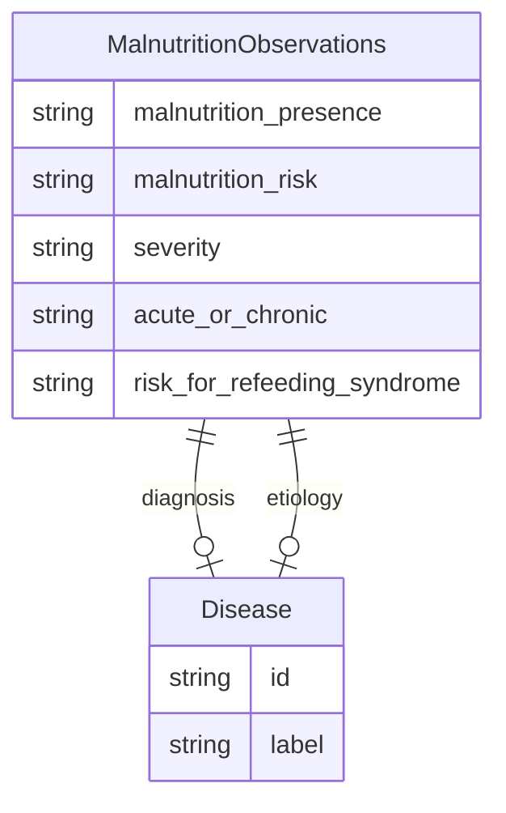

# Class: MalnutritionObservations


URI: [dietitian_notes:MalnutritionObservations](dietitian_notes:MalnutritionObservations)





<!-- no inheritance hierarchy -->


## Slots

| Name | Cardinality and Range | Description | Inheritance |
| ---  | --- | --- | --- |
| [malnutrition_presence](malnutrition_presence.md) | 0..1 <br/> [String](String.md) | True if the patient is malnourished, False otherwise | direct |
| [malnutrition_risk](malnutrition_risk.md) | 0..1 <br/> [String](String.md) | True if the patient has a demonstrable risk for malnutrition, False otherwise | direct |
| [severity](severity.md) | 0..1 <br/> [String](String.md) | The severity of the patient's malnutrition, if present | direct |
| [acute_or_chronic](acute_or_chronic.md) | 0..1 <br/> [String](String.md) | The duration of the patient's malnutrition, if present | direct |
| [diagnosis](diagnosis.md) | 0..1 <br/> [Disease](Disease.md) | The patient's malnutrition diagnosis, if present | direct |
| [etiology](etiology.md) | 0..1 <br/> [Disease](Disease.md) | The cause of the patient's malnutrition, if known | direct |
| [risk_for_refeeding_syndrome](risk_for_refeeding_syndrome.md) | 0..1 <br/> [String](String.md) | True if the patient is at risk for refeeding syndrome, False otherwise | direct |


## Usages

| used by | used in | type | used |
| ---  | --- | --- | --- |
| [ClinicalObservations](ClinicalObservations.md) | [malnutrition_status](malnutrition_status.md) | range | [MalnutritionObservations](MalnutritionObservations.md) |


## Identifier and Mapping Information


### Schema Source


* from schema: http://w3id.org/ontogpt/dietician_notes


## Mappings

| Mapping Type | Mapped Value |
| ---  | ---  |
| self | dietitian_notes:MalnutritionObservations |
| native | dietitian_notes:MalnutritionObservations |


## LinkML Source

<!-- TODO: investigate https://stackoverflow.com/questions/37606292/how-to-create-tabbed-code-blocks-in-mkdocs-or-sphinx -->

### Direct

<details>
```yaml
name: MalnutritionObservations
from_schema: http://w3id.org/ontogpt/dietician_notes
attributes:
  malnutrition_presence:
    name: malnutrition_presence
    description: True if the patient is malnourished, False otherwise. N/A if not
      provided.
    from_schema: http://w3id.org/ontogpt/dietician_notes
    rank: 1000
    domain_of:
    - MalnutritionObservations
    range: string
  malnutrition_risk:
    name: malnutrition_risk
    description: True if the patient has a demonstrable risk for malnutrition, False
      otherwise. N/A if not provided.
    from_schema: http://w3id.org/ontogpt/dietician_notes
    rank: 1000
    domain_of:
    - MalnutritionObservations
    range: string
  severity:
    name: severity
    description: The severity of the patient's malnutrition, if present. This may
      be Mild, Moderate, or Severe. In general, a patient receiving less than 50%
      of their estimated energy requirement for greater than 5 days is considered
      to have severe malnutrition. N/A if not provided.
    from_schema: http://w3id.org/ontogpt/dietician_notes
    rank: 1000
    domain_of:
    - MalnutritionObservations
    range: string
  acute_or_chronic:
    name: acute_or_chronic
    description: The duration of the patient's malnutrition, if present. For pediatric
      patients, acute malnutrition is less than 3 months, and chronic malnutrition
      is greater than 3 months. This may be Acute or Chronic. N/A if not provided.
    from_schema: http://w3id.org/ontogpt/dietician_notes
    rank: 1000
    domain_of:
    - MalnutritionObservations
    range: string
  diagnosis:
    name: diagnosis
    description: The patient's malnutrition diagnosis, if present. This should not
      include modifiers like 'severe'. N/A if not provided.
    from_schema: http://w3id.org/ontogpt/dietician_notes
    rank: 1000
    domain_of:
    - MalnutritionObservations
    range: Disease
  etiology:
    name: etiology
    description: The cause of the patient's malnutrition, if known. This may be due
      to acute or chronic disease or social/behavioral factors. N/A if not provided.
    from_schema: http://w3id.org/ontogpt/dietician_notes
    rank: 1000
    domain_of:
    - MalnutritionObservations
    range: Disease
  risk_for_refeeding_syndrome:
    name: risk_for_refeeding_syndrome
    description: True if the patient is at risk for refeeding syndrome, False otherwise.
      N/A if not provided.
    from_schema: http://w3id.org/ontogpt/dietician_notes
    rank: 1000
    domain_of:
    - MalnutritionObservations
    range: string

```
</details>

### Induced

<details>
```yaml
name: MalnutritionObservations
from_schema: http://w3id.org/ontogpt/dietician_notes
attributes:
  malnutrition_presence:
    name: malnutrition_presence
    description: True if the patient is malnourished, False otherwise. N/A if not
      provided.
    from_schema: http://w3id.org/ontogpt/dietician_notes
    rank: 1000
    alias: malnutrition_presence
    owner: MalnutritionObservations
    domain_of:
    - MalnutritionObservations
    range: string
  malnutrition_risk:
    name: malnutrition_risk
    description: True if the patient has a demonstrable risk for malnutrition, False
      otherwise. N/A if not provided.
    from_schema: http://w3id.org/ontogpt/dietician_notes
    rank: 1000
    alias: malnutrition_risk
    owner: MalnutritionObservations
    domain_of:
    - MalnutritionObservations
    range: string
  severity:
    name: severity
    description: The severity of the patient's malnutrition, if present. This may
      be Mild, Moderate, or Severe. In general, a patient receiving less than 50%
      of their estimated energy requirement for greater than 5 days is considered
      to have severe malnutrition. N/A if not provided.
    from_schema: http://w3id.org/ontogpt/dietician_notes
    rank: 1000
    alias: severity
    owner: MalnutritionObservations
    domain_of:
    - MalnutritionObservations
    range: string
  acute_or_chronic:
    name: acute_or_chronic
    description: The duration of the patient's malnutrition, if present. For pediatric
      patients, acute malnutrition is less than 3 months, and chronic malnutrition
      is greater than 3 months. This may be Acute or Chronic. N/A if not provided.
    from_schema: http://w3id.org/ontogpt/dietician_notes
    rank: 1000
    alias: acute_or_chronic
    owner: MalnutritionObservations
    domain_of:
    - MalnutritionObservations
    range: string
  diagnosis:
    name: diagnosis
    description: The patient's malnutrition diagnosis, if present. This should not
      include modifiers like 'severe'. N/A if not provided.
    from_schema: http://w3id.org/ontogpt/dietician_notes
    rank: 1000
    alias: diagnosis
    owner: MalnutritionObservations
    domain_of:
    - MalnutritionObservations
    range: Disease
  etiology:
    name: etiology
    description: The cause of the patient's malnutrition, if known. This may be due
      to acute or chronic disease or social/behavioral factors. N/A if not provided.
    from_schema: http://w3id.org/ontogpt/dietician_notes
    rank: 1000
    alias: etiology
    owner: MalnutritionObservations
    domain_of:
    - MalnutritionObservations
    range: Disease
  risk_for_refeeding_syndrome:
    name: risk_for_refeeding_syndrome
    description: True if the patient is at risk for refeeding syndrome, False otherwise.
      N/A if not provided.
    from_schema: http://w3id.org/ontogpt/dietician_notes
    rank: 1000
    alias: risk_for_refeeding_syndrome
    owner: MalnutritionObservations
    domain_of:
    - MalnutritionObservations
    range: string

```
</details>