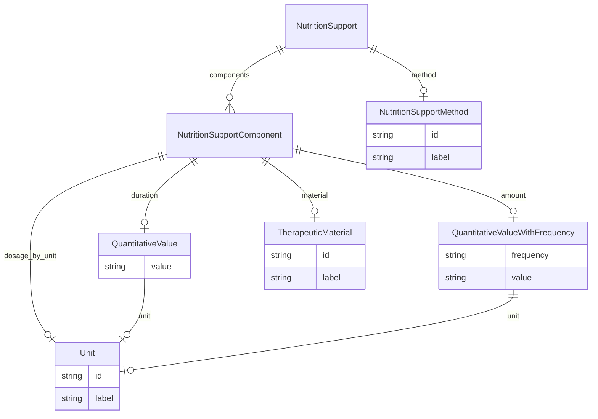

# Class: NutritionSupport


URI: [dietitian_notes:NutritionSupport](dietitian_notes:NutritionSupport)





## Inheritance
* [CompoundExpression](CompoundExpression.md)
    * **NutritionSupport**


## Slots

| Name | Cardinality and Range | Description | Inheritance |
| ---  | --- | --- | --- |
| [method](method.md) | 0..1 <br/> [NutritionSupportMethod](NutritionSupportMethod.md) | The name of a method used to provide nutritional support | direct |
| [components](components.md) | * <br/> [NutritionSupportComponent](NutritionSupportComponent.md) | The names of specific components included in a patient's diet | direct |


## Usages

| used by | used in | type | used |
| ---  | --- | --- | --- |
| [ClinicalObservations](ClinicalObservations.md) | [nutrition_support](nutrition_support.md) | range | [NutritionSupport](NutritionSupport.md) |


## Identifier and Mapping Information


### Annotations

| property | value |
| --- | --- |
| owl | IntersectionOf |


### Schema Source


* from schema: http://w3id.org/ontogpt/dietician_notes


## Mappings

| Mapping Type | Mapped Value |
| ---  | ---  |
| self | dietitian_notes:NutritionSupport |
| native | dietitian_notes:NutritionSupport |


## LinkML Source

<!-- TODO: investigate https://stackoverflow.com/questions/37606292/how-to-create-tabbed-code-blocks-in-mkdocs-or-sphinx -->

### Direct

<details>
```yaml
name: NutritionSupport
annotations:
  owl:
    tag: owl
    value: IntersectionOf
from_schema: http://w3id.org/ontogpt/dietician_notes
is_a: CompoundExpression
attributes:
  method:
    name: method
    description: The name of a method used to provide nutritional support.
    from_schema: http://w3id.org/ontogpt/dietician_notes
    rank: 1000
    domain_of:
    - NutritionSupport
    range: NutritionSupportMethod
  components:
    name: components
    description: The names of specific components included in a patient's diet.
    from_schema: http://w3id.org/ontogpt/dietician_notes
    rank: 1000
    domain_of:
    - NutritionSupport
    range: NutritionSupportComponent
    multivalued: true

```
</details>

### Induced

<details>
```yaml
name: NutritionSupport
annotations:
  owl:
    tag: owl
    value: IntersectionOf
from_schema: http://w3id.org/ontogpt/dietician_notes
is_a: CompoundExpression
attributes:
  method:
    name: method
    description: The name of a method used to provide nutritional support.
    from_schema: http://w3id.org/ontogpt/dietician_notes
    rank: 1000
    alias: method
    owner: NutritionSupport
    domain_of:
    - NutritionSupport
    range: NutritionSupportMethod
  components:
    name: components
    description: The names of specific components included in a patient's diet.
    from_schema: http://w3id.org/ontogpt/dietician_notes
    rank: 1000
    alias: components
    owner: NutritionSupport
    domain_of:
    - NutritionSupport
    range: NutritionSupportComponent
    multivalued: true

```
</details>