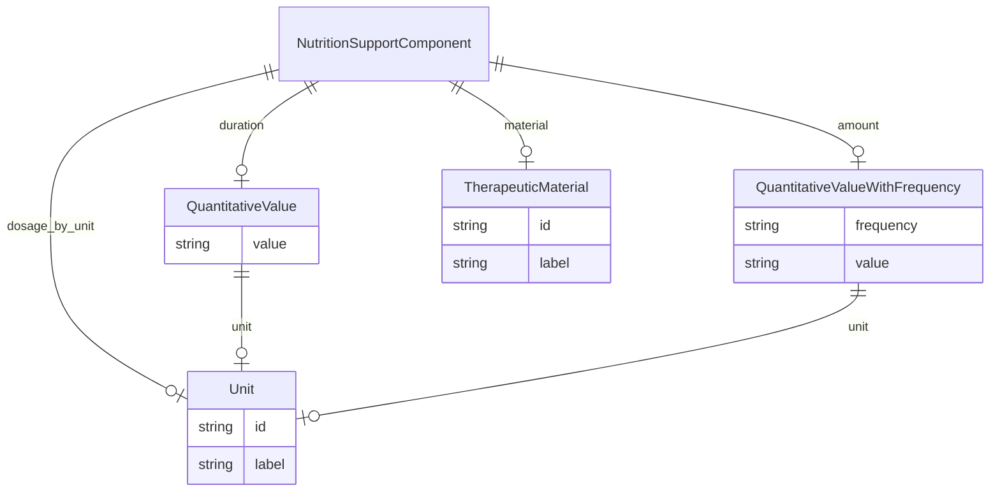

# Class: NutritionSupportComponent


URI: [dietitian_notes:NutritionSupportComponent](dietitian_notes:NutritionSupportComponent)





## Inheritance
* [CompoundExpression](CompoundExpression.md)
    * **NutritionSupportComponent**


## Slots

| Name | Cardinality and Range | Description | Inheritance |
| ---  | --- | --- | --- |
| [material](material.md) | 0..1 <br/> [TherapeuticMaterial](TherapeuticMaterial.md) | The name of a specific material included in a patient's diet | direct |
| [amount](amount.md) | 0..1 <br/> [QuantitativeValueWithFrequency](QuantitativeValueWithFrequency.md) | The quantity or dosage of the therapy, if provided | direct |
| [dosage_by_unit](dosage_by_unit.md) | 0..1 <br/> [Unit](Unit.md) | The unit of a patient's properties used to determine diet amounts | direct |
| [duration](duration.md) | 0..1 <br/> [QuantitativeValue](QuantitativeValue.md) | The duration of the therapy, if provided | direct |


## Usages

| used by | used in | type | used |
| ---  | --- | --- | --- |
| [NutritionSupport](NutritionSupport.md) | [components](components.md) | range | [NutritionSupportComponent](NutritionSupportComponent.md) |


## Identifier and Mapping Information


### Annotations

| property | value |
| --- | --- |
| owl | IntersectionOf |


### Schema Source


* from schema: http://w3id.org/ontogpt/dietician_notes


## Mappings

| Mapping Type | Mapped Value |
| ---  | ---  |
| self | dietitian_notes:NutritionSupportComponent |
| native | dietitian_notes:NutritionSupportComponent |


## LinkML Source

<!-- TODO: investigate https://stackoverflow.com/questions/37606292/how-to-create-tabbed-code-blocks-in-mkdocs-or-sphinx -->

### Direct

<details>
```yaml
name: NutritionSupportComponent
annotations:
  owl:
    tag: owl
    value: IntersectionOf
from_schema: http://w3id.org/ontogpt/dietician_notes
is_a: CompoundExpression
attributes:
  material:
    name: material
    description: The name of a specific material included in a patient's diet.
    from_schema: http://w3id.org/ontogpt/dietician_notes
    rank: 1000
    domain_of:
    - NutritionSupportComponent
    range: TherapeuticMaterial
  amount:
    name: amount
    description: The quantity or dosage of the therapy, if provided. May include a
      frequency. N/A if not provided.
    from_schema: http://w3id.org/ontogpt/dietician_notes
    domain_of:
    - DietSupplementation
    - NutritionSupportComponent
    - DrugTherapy
    range: QuantitativeValueWithFrequency
  dosage_by_unit:
    name: dosage_by_unit
    description: The unit of a patient's properties used to determine diet amounts.
      Often "kilogram". N/A if not provided.
    from_schema: http://w3id.org/ontogpt/dietician_notes
    domain_of:
    - DietSupplementation
    - NutritionSupportComponent
    - DrugTherapy
    range: Unit
  duration:
    name: duration
    description: The duration of the therapy, if provided. N/A if not provided.
    from_schema: http://w3id.org/ontogpt/dietician_notes
    domain_of:
    - DietSupplementation
    - NutritionSupportComponent
    - DrugTherapy
    range: QuantitativeValue

```
</details>

### Induced

<details>
```yaml
name: NutritionSupportComponent
annotations:
  owl:
    tag: owl
    value: IntersectionOf
from_schema: http://w3id.org/ontogpt/dietician_notes
is_a: CompoundExpression
attributes:
  material:
    name: material
    description: The name of a specific material included in a patient's diet.
    from_schema: http://w3id.org/ontogpt/dietician_notes
    rank: 1000
    alias: material
    owner: NutritionSupportComponent
    domain_of:
    - NutritionSupportComponent
    range: TherapeuticMaterial
  amount:
    name: amount
    description: The quantity or dosage of the therapy, if provided. May include a
      frequency. N/A if not provided.
    from_schema: http://w3id.org/ontogpt/dietician_notes
    alias: amount
    owner: NutritionSupportComponent
    domain_of:
    - DietSupplementation
    - NutritionSupportComponent
    - DrugTherapy
    range: QuantitativeValueWithFrequency
  dosage_by_unit:
    name: dosage_by_unit
    description: The unit of a patient's properties used to determine diet amounts.
      Often "kilogram". N/A if not provided.
    from_schema: http://w3id.org/ontogpt/dietician_notes
    alias: dosage_by_unit
    owner: NutritionSupportComponent
    domain_of:
    - DietSupplementation
    - NutritionSupportComponent
    - DrugTherapy
    range: Unit
  duration:
    name: duration
    description: The duration of the therapy, if provided. N/A if not provided.
    from_schema: http://w3id.org/ontogpt/dietician_notes
    alias: duration
    owner: NutritionSupportComponent
    domain_of:
    - DietSupplementation
    - NutritionSupportComponent
    - DrugTherapy
    range: QuantitativeValue

```
</details>